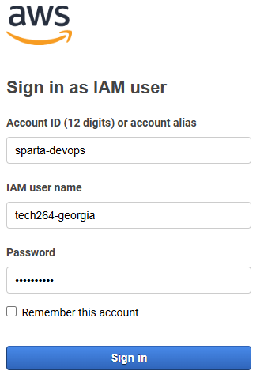
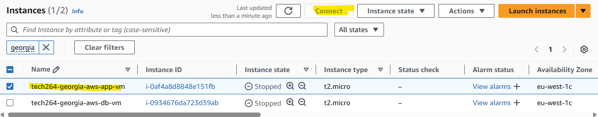

# Amazon Web Services (AWS)
 * It is a comprehensive and widely adopted cloud computing platform provided by Amazon. 
 * AWS offers featured services from data centers globally, including computing power, storage options, and networking capabilities.

# Table of Contents

- [Amazon Web Services (AWS)](#amazon-web-services-aws)
- [Table of Contents](#table-of-contents)
- [Logging into AWS](#logging-into-aws)
  - [Cloud Reminders](#cloud-reminders)
- [Task: Re-deploy app in 2-tier architecture on AWS](#task-re-deploy-app-in-2-tier-architecture-on-aws)
  - [Ramon's Diagram](#ramons-diagram)
- [Deploying App in 2-tier architecture on AWS](#deploying-app-in-2-tier-architecture-on-aws)
  - [Go to Credentials Folder](#go-to-credentials-folder)
  - 
  - [Create Key-Pair](#create-key-pair)
  - [EC2: Create Database VM](#ec2-create-database-vm)
  - [Create a Security Group](#create-a-security-group)
  - [Add Image](#add-image)
  - [Network Settings](#network-settings)
    - [Optional: Create a Subnet.](#optional-create-a-subnet)
    - [Optional: Add Inbound Port Rules](#optional-add-inbound-port-rules)
  - [Add Database Bash Script to App VM User Data.](#add-database-bash-script-to-app-vm-user-data)
  - [Making the App vm](#making-the-app-vm)
    - [Create New Security Group for App.](#create-new-security-group-for-app)
  - [Linking db vm to App VM - User data](#linking-db-vm-to-app-vm---user-data)
  - [Running the App VM](#running-the-app-vm)
  - [Connect via SSH on Git Bash](#connect-via-ssh-on-git-bash)
  - [SSH in](#ssh-in)
    - [Connect via SSH](#connect-via-ssh)
- [Posts page is working!!](#posts-page-is-working)
  - [Delete keys you aren't using](#delete-keys-you-arent-using)

# Logging into AWS
* After you log in, make sure you're in the correct region (Ireland, eu-west-1).
  
## Cloud Reminders
On Azure...
* Only make what you are authorised to make
* Tag everything with the key Owner and value << your first name >>. 
* Any .pem file must go in your .ssh folder (a private key when generated yourself doesn't have any extension)
* .ssh folder must NEVER be part of any Git repo. Why?
* Use UK South region only
* Working hours for Azure: 9:00 to 17:00. If you need to use after this time, ask your trainer well ahead of time.
* Switch off (“Stop”) VMs when you are not using them or by the end of working hours.
* Your responsibility: Remove anything you know you don’t need anymore.

On AWS...
* Similar rules apply except...
* You don't need to tag everything you make
* You need to use the Ireland region only

 

# Task: Re-deploy app in 2-tier architecture on AWS
Reason for this task: Consolidation of what you've done, show how fast you can deploy the app using your scripts
* Use your scripts to deploy the database + app (with the reverse proxy working)
  * Use VM size: t2.micro for both your VMs
  * Use the default VPC
* Post link to /posts page as soon as you get it working
* Document anything new you learnt to get the /posts page as quickly as possible, especially any blockers you had and how you overcame them
* Post link to documentation at xx:xx??

 

## Ramon's Diagram
* Two tier app deployment on AWS.

Default VPC 
* A subnet is linked to a particular availability zone. 
* 3 subnets: one for each availability zone.

> AWS already has default VPCs in each region set up, ready for you to go. 
> You will have to create a VPC up from scratch if you need customs. e.g., security.

App vm : default subnet 1
Db vm: default subnet 2

> On AWS, you have a Security Group (rather than the Azure Network Security Group). 

* only worry about the inbound rules. 
* For your vm's:
  * App vm: within Security Group, Allow SSH, HTTP.
  * Db vm: within Security group: allow SSH, allow mongodb (27017).

 

# Deploying App in 2-tier architecture on AWS
* Create the DATABASE vm first.
  * This is so the app can connect to it and we can successfully connect to the app.
* Create the APP vm next. 
  * This will include the script that will have the private IP of the database so they can connect. 

 

## Go to Credentials Folder 
* Via local folder > .ssh > credentials (this will give you the link if you haven't got it saved).

 

 

##
* In the search bar EC2 > Lanunch instance (orange button).
* Name: tech264-georgia-app-vm

 

## Create Key-Pair
* Search bar "EC2", On the left side go to Network Security > Key Pairs.

 

* Create a new key pair (top right corner). 

 

* Input the correct name.
* Select create and you will download your `.pem` key. This is the equivalent of a **private key** on **Azure**.

 

## EC2: Create Database VM
* Go to search bar in AWS, search "EC2" > Add "Instance".
* Name: `tech264-georgia-aws-db-vm`
* Instance type: `t2.micro` (this will be the same for the app vm). 
* Use default VPC

 

 

## Create a Security Group
* Name: tech264-georgia-db-sg-allow-ssh-2
* Because it's a database, you only need to allow SSH.
  * allow SSH traffic: anywhere (0.0.0.0/0).

 

 

## Add Image
* Application/Images: AWS Market place: search: `Ubuntu Pro 22.04`
  * Subscribe on instance launch.

 

## Network Settings
* Select create security group. Remember, you need a unique security group for each VM (app and database). 
> Allow SSH traffic for the Database EC2.
> 
> Allow SSH & HTTP for App EC2.

 

### Optional: Create a Subnet.
* Create a new subnet. 
  * For the **Database**, make it **private**, `172.31.3.0`. 
  * For the **App**, make it **public**, `172.31.2.0`.
* Edit IP for each one. Where in azure it was `10.0.1.0/24`, in AWS it is `172.31.1.0/24`. 
  * So you might want to use `172.31.2.0` for your **app**
  * `172.31.3.0` for your **database**.

 

### Optional: Add Inbound Port Rules 
1. Navigate to **Security Groups** under **Network and Security**.
2. Search for the NSG you wish to modify.
3. Select it.
4. Select **Edit inbound rules**.
5. For the DB EC2's inbound rules, you need to have a **Custom TCP** type rule with MongoDB's port range `27017`. You can select an NSG to only allow connections from THAT source. Better security.

 

## Add Database Bash Script to App VM User Data.

 

## Making the App vm
* Same image: `ubuntu Pro 22.04`. 
* Allow SSH and HTTP.

 allow HTTPS

 

### Create New Security Group for App. 
* To create a new security group, there should be an "Edit" button in the top right of the box. 
* Name: tech264-georgia-app-sg-allow-http-ssh
* Allow SSH and HTTP.
  * 0.0.0.0/0 for both.
  * In the second option, add mongodb PID (27017).

 

## Linking db vm to App VM - User data
Check your ip address in your user data for your app matches your db private ip.
* On your app script, change the mongo ip to your private ip on the Database VM.

 

## Running the App VM
* Try running the app-vm.
* Copy the link into a terminal. 

 

## Connect via SSH on Git Bash
* cd into your .ssh folder. 
ssh -i /c/users/georg/.ssh/tech264-georgia-aws-key.pem
 ec2-user@3.253.103.76

 

 ## SSH in
 * Give yourself permission for the key: `chmod 400 tech264-georgia-aws-key.pem`

### Connect via SSH
* Go to AWS > EC2 > Instances.
* Make sure your VM is running.
* Click on the VM you want to connect to. 
* There is a "Connect" button up the top, next to the refresh button.

 

* cd into .ssh folder (where your key should be). 
* Give yourself the permissions:
  * `chmod 400 "tech264-georgia-aws-key.pem"`
* ec2-54-171-107-117.eu-west-1.compute.amazonaws.com
* SSH in with this command:
  * `ssh -i "tech264-georgia-aws-key.pem" ubuntu@ec2-54-171-107-117.eu-west-1.compute.amazonaws.com`

# Posts page is working!!
* This did take a while: "too long to respond" > Bad Gateway > Nginx > Sparta App.

 

## Delete keys you aren't using
* To delete keys: `rm -f <private key> <public key>`

 

