# Blob Storage
* All commands start with 'az' in Azure CLI. 

<br>

- [Blob Storage](#blob-storage)
  - [On Azure: How is it structured?](#on-azure-how-is-it-structured)
    - [Create a Storage Account](#create-a-storage-account)
    - [Create a Container](#create-a-container)
    - [Store Blobs](#store-blobs)
    - [Redundancy](#redundancy)
- [Azure Command-Line Interface](#azure-command-line-interface)
    - [Key points:](#key-points)
- [Create blob vm from app image.](#create-blob-vm-from-app-image)
  - [Step 1: Install Azure CLI](#step-1-install-azure-cli)
  - [Step 2: Log in](#step-2-log-in)
  - [Step 3: Create Storage Account](#step-3-create-storage-account)
    - [Step 4: Check the Account Exists](#step-4-check-the-account-exists)
  - [Step 5: Create Storage Container](#step-5-create-storage-container)
    - [How to delete a container:](#how-to-delete-a-container)
    - [Check the container is there:](#check-the-container-is-there)
    - [Create a New Folder](#create-a-new-folder)
    - [Blob Upload](#blob-upload)
    - [How to list your blobs](#how-to-list-your-blobs)
    - [Check the Blob on the Azure Portal](#check-the-blob-on-the-azure-portal)
    - [To make it public](#to-make-it-public)
- [Task: Adding an blob image to the Spart test app](#task-adding-an-blob-image-to-the-spart-test-app)
      - [SSH into App](#ssh-into-app)
    - [Get Cat Image Link](#get-cat-image-link)
    - [Create a container called "images"](#create-a-container-called-images)
    - [Check the container is there:](#check-the-container-is-there-1)
    - [Wget command](#wget-command)
    - [Blob Upload: jpg Image](#blob-upload-jpg-image)
    - [Nano into Index.ejs](#nano-into-indexejs)
    - [Add in the https of the cat image.](#add-in-the-https-of-the-cat-image)
    - [Re-run the app.](#re-run-the-app)


<br>

## On Azure: How is it structured?
### Create a Storage Account
* This is the top-level container that *holds* all your Azure *Storage data objects*: blobs, files, queues, and tables1.
* Each storage account provides a *unique namespace for your data*, accessible from anywhere in the world over HTTP or HTTPS.

### Create a Container
* Within the storage account, you create containers. 
* Containers *organise a set of blobs*, similar to directories in a file system.

### Store Blobs
* *Inside each container*, you can store individual blobs (binary large objects), which can be *any type of file or data*.

### Redundancy
* Azure Storage automatically *provides redundancy* to ensure high availability and durability of your data. 
* The default option is **Locally Redundant Storage** (LRS), which *replicates your data three times* within a single data center.

<br>

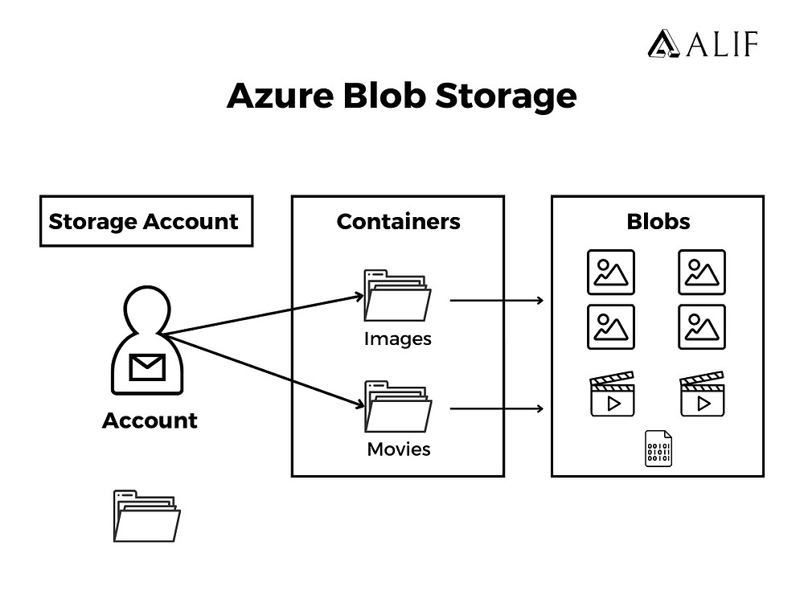

<br>

# Azure Command-Line Interface
* The Azure Command-Line Interface (CLI) is a powerful tool *designed to help you manage* Azure resources directly *from your command line*. 

### Key points:
* **Cross-Platform**: Azure CLI works on Windows, macOS, and Linux.
* **Command Execution**: You can execute commands interactively in a terminal or automate tasks by scripting.
* **Resource Management**: It allows you to create, update, and delete Azure resources like virtual machines, storage accounts, and more.
* **Automation**: It’s particularly useful for automating repetitive tasks, making it a great tool for developers and system administrators.

<br>

# Create blob vm from app image.

## Step 1: Install Azure CLI
Source: https://learn.microsoft.com/en-us/cli/azure/install-azure-cli
  * SSH into tech264-georgia-blob-storage VM.
  * Command to install Azure CLI: `curl -sL https://aka.ms/InstallAzureCLIDeb | sudo bash`

<br>

## Step 2: Log in
* Open Git Bash terminal. 
* `az --help`
* `az login`
* It'll ask you go to your web browser
  * Output: gives you website and a password. 
  * Follow the instructions. 
  * In Git bash: You have one subscription available to you.

<br>

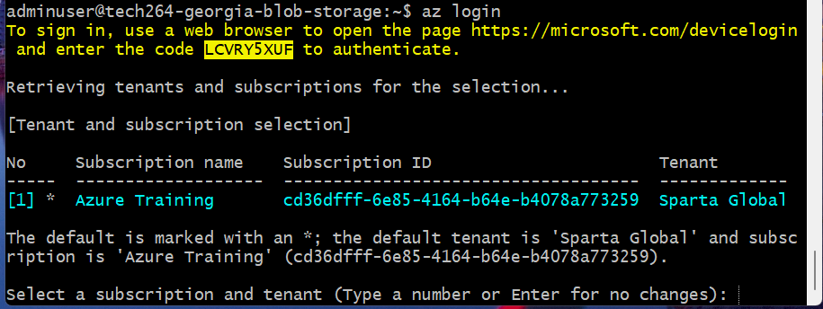 

<br>

* type: `1`, to select subscription. 
* `az group list`

<br>

## Step 3: Create Storage Account

```bash
az storage account create --name tech264georgia-storage --resource-group tech264 --location uksouth --sku Standard_LRS
```
* ^ ⚠️this outputted a red error: not valid storage account name. 
* need to **remove** the heiphen. 

```bash
az storage account create --name tech264georgiastorage --resource-group tech264 --location uksouth --sku Standard_LRS
```
* It can take a while but you'll see "Running..." on the screen. 

<br>

### Step 4: Check the Account Exists
* Check the accounts that exist within the 264 resource group: `az storage account list --resource-group tech264`

More useful for the screen (turns it into a table format): 
```bash
az storage account list --resource-group tech264 --query "[].{Name:name, Location:location, Kind:kind}" --output table
```

<br>

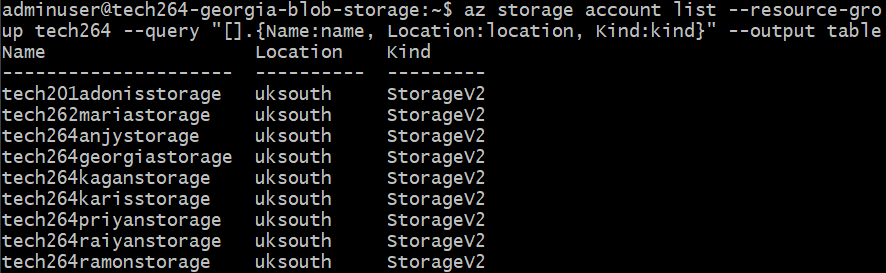

<br>


## Step 5: Create Storage Container
* You need to modify it with your own account name. 

```bash
az storage container create \
    --account-name tech264georgiastorage \
    --name container
```

* if we get ⭐yellow⭐: it doesn't usually stop the command - it's a warning. 
* If you want to get rid of the yellow, it recommends what it wants.
  * If you add '--auth-mode login', it should get rid of the yellow.
    * In this case, it didn't like that there was no "--auth-mode login". 

Below is the expected code: 

```bash
az storage container create \
    --account-name tech264georgiastorage \
    --name container \
    --auth-mode login
```

<br>

### How to delete a container: 
```bash
az storage container delete \
    --account-name tech264georgiastorage \
    --name container \
    --auth-mode login
```

<br>

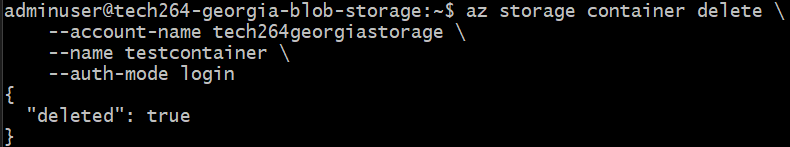 

<br>

* Now add the account name including the '`--auth-mode login`'
```bash
az storage container create \
    --account-name tech264georgiastorage \
    --name container \
    --auth-mode login
```

<br>

### Check the container is there:
```bash
az storage container list \
    --account-name tech264georgiastorage \
    --output table \
    --auth-mode login
```

<br>

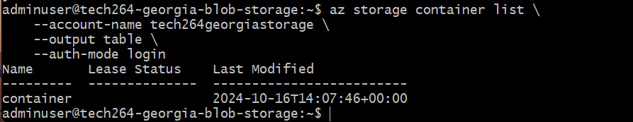 

<br>

### Create a New Folder
* `nano test.txt`
  * Ctrl+s, Ctrl+x
* `cat test.txt`
  * Output: whatever you wrote in the file.


<br>

### Blob Upload 
```bash
az storage blob upload \
    --account-name tech264georgiastorage \
    --container-name container \
    --name newname.txt \
    --file test.txt \
    --auth-mode login
```
* name: the name of the blob you want in the cloud (newname.txt).
* file name: test.txt

<br>

### How to list your blobs
```bash
az storage blob list \
    --account-name tech264georgiastorage \
    --container-name container \
    --output table \
    --auth-mode login
```

<br>

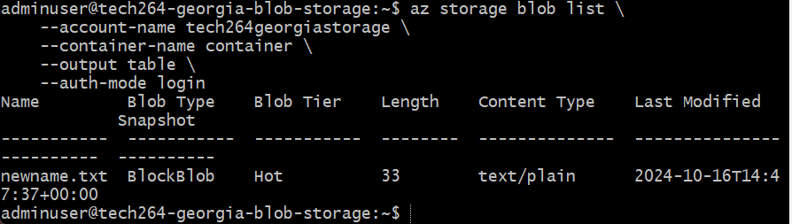 

<br>

### Check the Blob on the Azure Portal
Go through yout storage account:
* Azure Portal > Storage Account > pick yours. 

### To make it public
* Change the access level
  * Go to storage account
  * (on the left) Settings > Configuration > 
  * Allow Blob anonymous access (enabble) > click save
* Change access level > 
  * (left hand side) Data Storage > Containers > 
  * click on the container > change access to 'blob' > click "save".
* refresh and now copy the link into your browser. 


<br>


# Task: Adding an blob image to the Spart test app
az You are going to get a cat picture (jpg) of your choice to display on the Sparta test app front page - the image used will be stored on Azure blob storage.

* SSH into your Azure VM (make sure VM has the app dependencies installed)
* Using the CLI on your VM...
* Install Azure CLI on your Azure VM - this will give you access to the az command. Use this URL to help: https://learn.microsoft.com/en-us/cli/azure/install-azure-cli
* Login to Azure
* Download a cat picture (jpg) of your choice to your VM - name is downloadedcat.jpg
* Upload the cat picture to Azure blob storage into a container called images (Hint: You will first need a storage account + container) - in blob storage the same file should be called uploadedcat.jpg
* Using Azure portal in the web browser of your local machine...
* Set anonymous Blob access on the storage account
* Set access permissions on the container so the uploaded blob can be viewed by the public
* Back on your VM's CLI...
* Modify the file index.ejs (found in views folder inside the app folder) - add an  tag to the HTML so display the uploadedcat.jpg image on the
* Sparta front page.
* Run the app (no database) to check your blob image displays on the Sparta test app's front page.
* Screenshot it and document.


<br>

#### SSH into App
1. Connect the `VM with SSH key`
2. To see the `repo/app`- need to be in root directory  -> `cd /repo/app`
3. `sudo pm2 stop all`
4. `sudo -E pm2 start app.js`

<br>

### Get Cat Image Link
CAT LINK: https://www.shutterstock.com/image-photo/funny-older-cat-sticking-out-260nw-2465530005.jpg

* SSH into vm
* `curl https://www.shutterstock.com/image-photo/funny-older-cat-sticking-out-260nw-2465530005.jpg`

### Create a container called "images"
az storage container create \
    --account-name tech264georgiastorage \
    --name images \
    --auth-mode login


### Check the container is there:
```bash
az storage container list \
    --account-name tech264georgiastorage \
    --output table \
    --auth-mode login
```
<br>

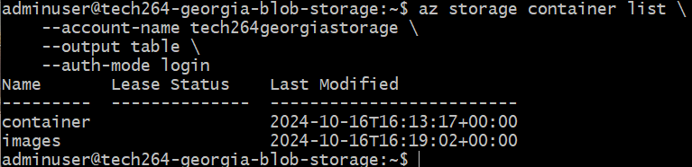

<br> 

### Wget command
`wget https://www.shutterstock.com/image-photo/funny-older-cat-sticking-out-260nw-2465530005.jpg`
* `wget` command: is used to download a file from the specified URL to your current directory. 
* Once you run this command, the image will be saved in the *directory where you executed* the command.

<br> 

### Blob Upload: jpg Image
```bash
az storage blob upload \
    --account-name tech264georgiastorage \
    --container-name images \
    --name funny-older-cat-sticking-out-260nw-2465530005.jpg \
    --file funny-older-cat-sticking-out-260nw-2465530005.jpg \
    --auth-mode login
```
* Name: the name of the blob you want in the cloud (newname.txt).
* File name: test.txt

<br>

### Nano into Index.ejs
* /repo/app/views

<br>

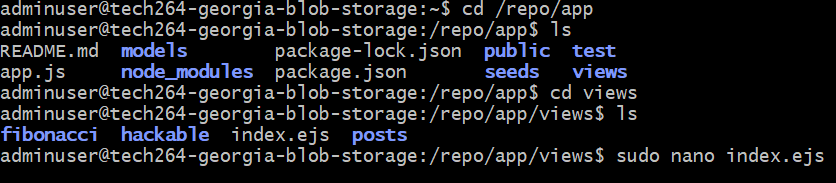

<br>

### Add in the https of the cat image.
* When you go into the Azure portal, search for "Storage Accounts".
* Data Storage > Containers > Images > funny-cat link > copy URL.

<br>

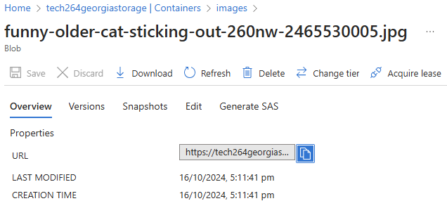

<br>

* SSH into tech264-georgia-blob-storage vm.
* cd into `index.ejs` file: cd repo/app/views.
* nano into the file: nano index.ejs
* 
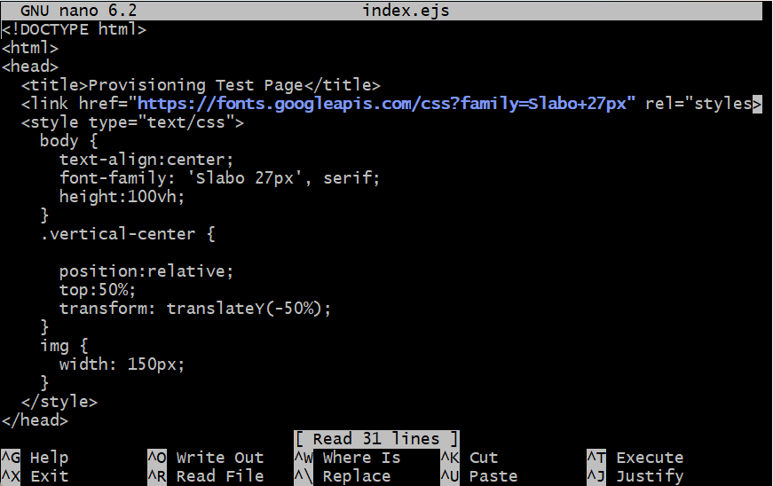


* Scroll to the bottom. 
* Where it says "img src", this is where we will be putting the cat https from the data storage container from the Azure portal.
* Save your changes: `Ctrl+s`, `Ctrl+x`.

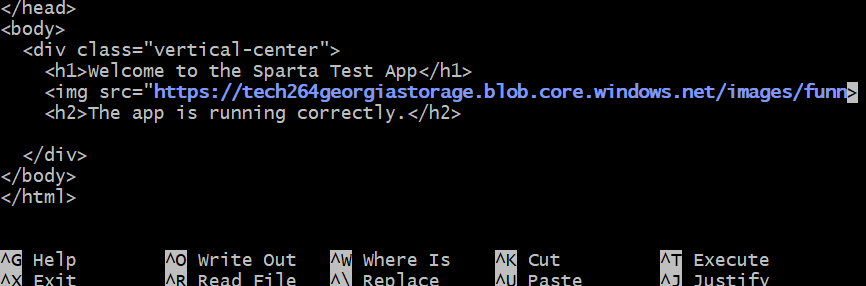

<br>

### Re-run the app.
* cd into repo/app
* Restart the app: `sudo -E pm2 start app.js`

<br>

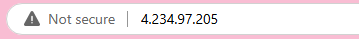
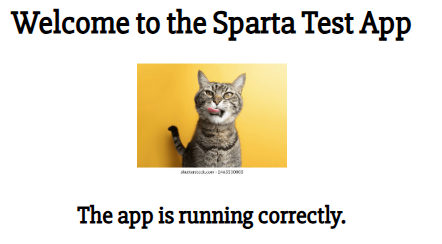

<br>