# Week 5: CI/CD Pipelines with Jenkins

# Task: Research CI/CD and Jenkins
## What is CI? Benefits?
CI stands for **Continuous Integration**. 
* It’s a practice in software development where developers frequently *merge their code changes* into a *shared repository*. 
* Each integration is *automatically tested to detect issues* early.

### Benefits
* 🪲`Early bug detection`🪲: Since code is tested every time it’s integrated, issues are caught earlier.
* 🤼`Improved collaboration`🤼: Frequent code merges help developers work better together.
* ⏩`Faster development`📈: Smaller, more frequent updates make development smoother.
* 👍🏻`Better code quality`👍🏻: Automated testing ensures that issues are fixed as soon as they arise.

 

## What is CD? Benefits?
CD stands for Continuous Delivery or Continuous Deployment (CDE?).

  * 🚚**Continuous Delivery**🚚: After code is integrated and tested, it’s *prepared for release* into production, but a human approval is needed before it’s deployed.
  * 📦**Continuous Deployment**☑️: It’s the automated process where code goes from testing to production *without manual intervention*.

### Benefits
* ⏩**Faster releases**⏩: Changes can be *deployed to production* more frequently.
* 📉**Reduced risks**📉: Frequent deployments with smaller changes *reduce* the chance of big *failures*.
* 🔁**Increased automation**🔁: *Saves time* by automating manual steps.
* 📝**Better user feedback**📝: New features or fixes *reach users faster*, leading to *quicker feedback*.

 

## Difference between CD and CDE
* **CD** (Continuous Delivery): Refers to the practice of ensuring your codebase is `always ready to deploy`. A `manual approval` step might be required before deploying to production.
  * More manual intervention and testing at different stages. 
  * Culture is built in to avoid end users experiencing bugs. 
  * They care about what their end users experience. 
  * Typically seen inbigger organisations.
  
* **CDE** (Continuous Deployment): Takes CD a step further by `automatically deploying` every change that passes the testing phase to production, `without any manual intervention`.
  * Using this depends on the culture of the organisation and the users should know about this. 
    * Faster delivery.
    * Fast feedback loop.
    * More susceptible to bugs. 
    * Typically seen in start-ups. 

 

| **Aspect** | **CD (Continuous Delivery)** | **CDE (Continuous Deployment)** |
|------------|------------------------------|---------------------------------|
| **Deployment Readiness** | Always ready to deploy | Always ready to deploy |
| **Approval** | Manual approval required | No manual approval needed |
| **Automation** | Partially automated | Fully automated |

 

## What is Jenkins?
Jenkins is an **open-source automation server** used for *automating the building, testing, and deployment* of applications. 
* It’s widely used for CI/CD (Continuous Integration/Continuous Delivery) pipelines. 
* Jenkins lets you *set up workflows* that *automatically test and deploy* code after it’s integrated.

 

## Why use Jenkins? Benefits of using Jenkins? Disadvantages?
Jenkins *automates repetitive tasks*, like building and testing code, to make the *development process* **faster** and more **reliable**.

### Benefits of using Jenkins:
* **Automation**: Jenkins *automates* build, test, and deployment *steps*.
* **Flexibility**: It can be *customised* to fit various project needs, thanks to its plugins.
* **Open-source**: Jenkins is *free* and has a large, *supportive community*.
* **Integrations**: *Works well with other tools* like Git, Docker, etc.

### Disadvantages:
* **Complexity**: Jenkins can be *complex to set up and manage*, especially for beginners.
* **Maintenance**: Since Jenkins is self-hosted, you’ll need to *handle updates and manage infrastructure*.
* **Performance issues**: Large projects may require *tuning to avoid performance bottlenecks*.

> “bottlenecks” refer to points in the project where the **performance is significantly slowed down or hindered**. These are areas that **limit** the overall **efficiency** and **speed** of the project, **causing delays** or **reduced performance**. 
> 
> "tuning" involves optimising these areas to ensure the project runs smoothly and efficiently.

 

## Stages of Jenkins
A Jenkins pipeline (B.T.D.PDA) has the following stages:

* `Build`: *Compiles* the code.
* `Test`: *Runs automated tests* to check the code quality.
* `Deploy`: Sends the code to the *next environment* (like a testing server or production).
* `Post-deploy actions`: Extra *checks or notifications after deployment* (e.g., sending an email to the team).

 

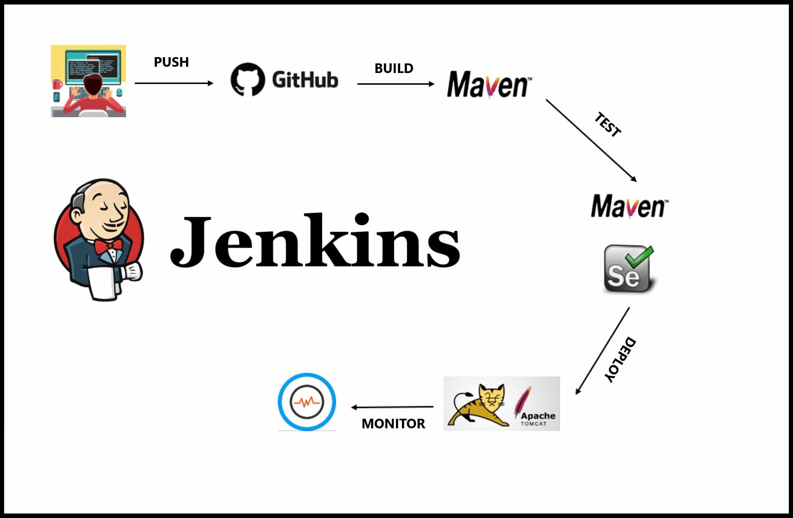

 

## What alternatives are there for Jenkins
Other tools that do similar things to Jenkins include:
* GitLab CI/CD
* CircleCI
* Travis CI
* GitHub Actions
* Bamboo (by Atlassian)

  

## Why build a pipeline? Business value?
A CI/CD pipeline **automates parts of the software development process**, like testing and deployment.

### Business value:
* **Faster time to market**: Automating tasks means you can *release new features* and *bug fixes faster*.
* **Higher quality**: *Consistent testing and deployment* *reduce the risk of bugs* in production.
* **Cost savings**: Automation *reduces the need for manual work*, which *saves time and money*.

 

source: https://www.xenonstack.com/blog/continuous-delivery-jenkins-pipeline

 

## Create a general diagram of CICD
** needs uploading ** Below is an example from the internet. 

Developer -> Code commit -> CI: Build & Test -> CD: Deploy -> Production

 

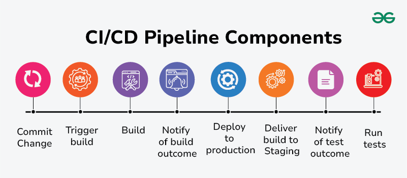

source: https://www.geeksforgeeks.org/cicd-pipeline-system-design/

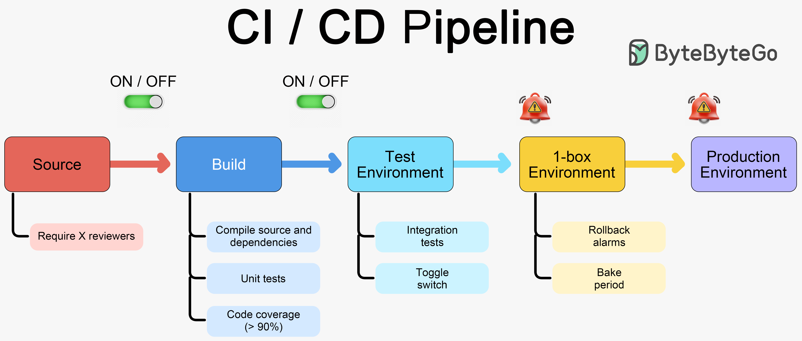

source: https://blog.bytebytego.com/p/a-crash-course-in-cicd

 

## Understand SDLC workflow: plan, design, develop, deploy
SDLC (Software Development Life Cycle) is a process followed to create high-quality software:

* `Plan`: Define what the software will do and set goals.
* `Design`: Create blueprints for how the software will look and work.
* `Develop`: Write the actual code to build the software.
* `Deploy`: Release the software to users or production.

 

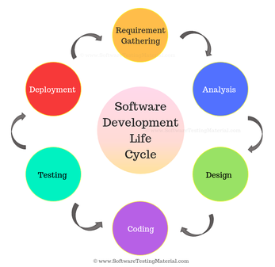 

 

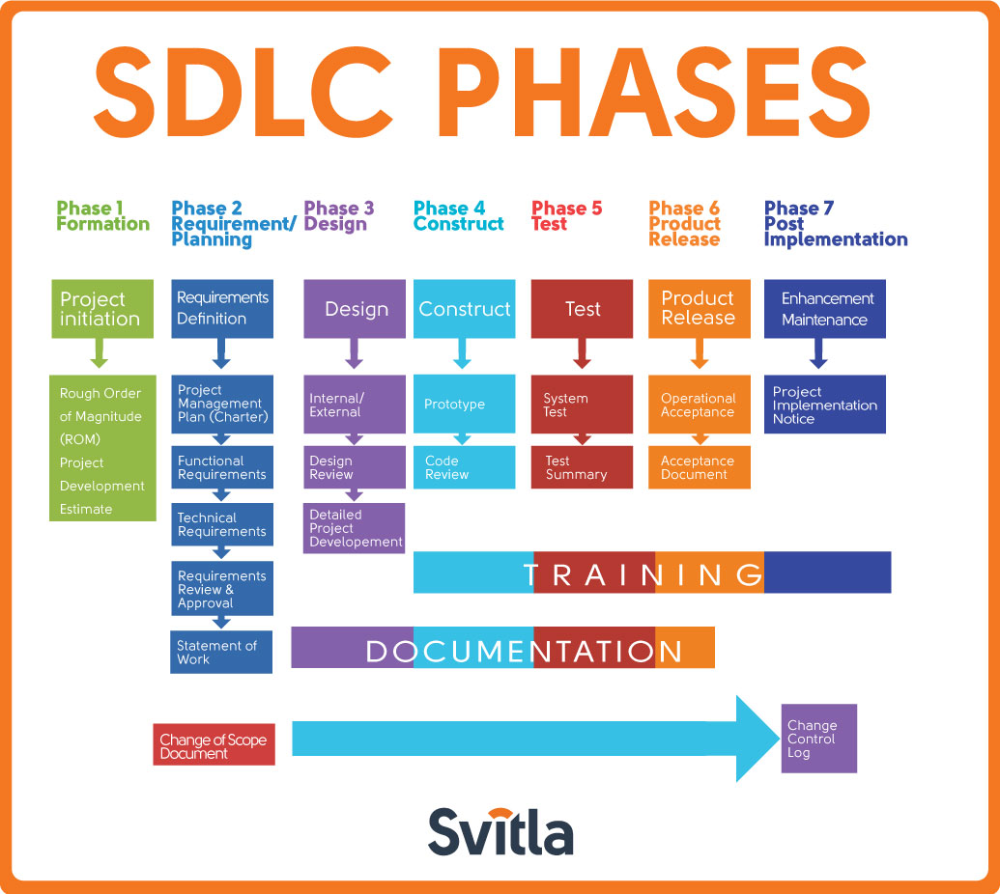 

 

---

 

# Friday 18/10 Notes

# CI/CD Pipeline: Ramon's Diagram

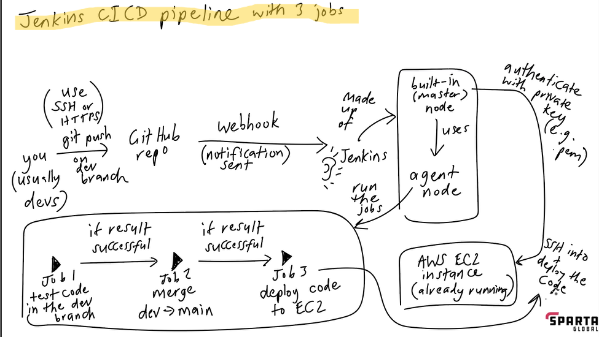

## Why build a CI/CD pipeline?
* Run one command to do it all.
* Fast: done in minutes.

## Why Jenkins?
* It's industry standard: been around for a while and commonly used. 
* It's free.
* Powerful and many pluggins.
* Helps us understand the CICD concept. 

### More Detailed Benefits of Jenkins
Jenkins is a popular open-source automation server that is widely used for continuous integration and continuous delivery (CI/CD). Here are some key reasons why you might choose to use Jenkins:

  * 🔁**Automation**🔁: Jenkins automates the process of building, testing, and deploying applications, which helps to reduce manual errors and save time.
  * **Extensibility**: With over 1,800 plugins available, Jenkins can be extended to integrate with a wide variety of tools and technologies, making it highly customisable to fit different workflows.
  * 🧑‍🤝‍🧑**Community Support**🧑‍🤝‍🧑: Being open-source, Jenkins has a large and active community that contributes to its development and provides support through forums, documentation, and tutorials.
  * 📈**Scalability**📈: Jenkins can be scaled to manage large numbers of builds and tests, making it suitable for projects of all sizes.
  * 🧘🏻‍♀️**Flexibility**🧘🏻‍♀️: It supports various version control systems (like Git, SVN, and Mercurial) and can be used on different operating systems (Windows, macOS, Linux).
  * **Pipeline as Code**: Jenkins allows you to define your build, test, and deployment pipelines as code using the Jenkinsfile, which can be versioned alongside your source code.
  * **Integration**: Jenkins integrates well with other tools in the DevOps ecosystem, such as Docker, Kubernetes, and various cloud providers, enabling seamless CI/CD workflows.

### What's it's business value?
* Save time = save money.

## What's going to happen in our pipeline?
Action to trigger the pipeline.
  * `git push`
  * In order for this to work, we need to set up a `web hook`. 
> **Webhook**: a way for Jenkins to listen to the change for when that git push occurs on the development branch. 

## There are 2 parts to our pipeline:
### 1. Continuous Integration (CI) part:
1. Testing the code you've put.
2. Merge.

### 2. Continuous Deployment (CD) part:
3. Deployment. 
   * The code changes are going to get deployed to AWS. 

 

# Code-Along
* Go to the Jenkins dashboard using your private link and log in.

## Test: Making our pipeline
* Click on "new item" (on the left).
* Enter item name: tech264-georgia
* Click "freestyle project" and "OK".

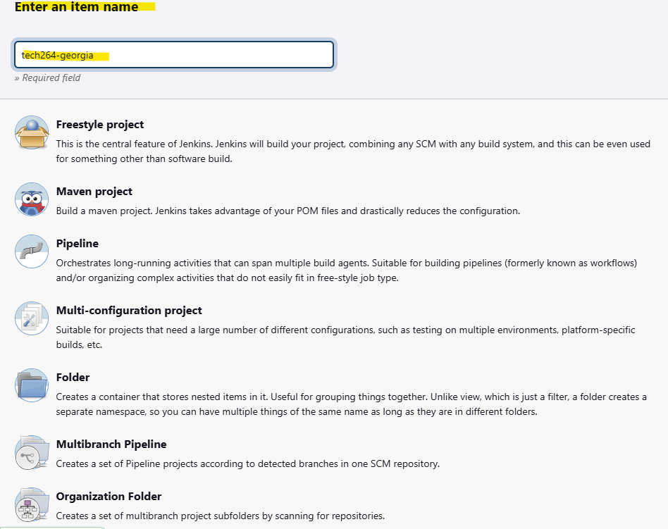

* Description: Testing Jenkins.
* Discard old builds:
  * everytime it runs, it will log it with a timestampp, date. This is called a build. 
* Give it a maximun of 5 builds. 

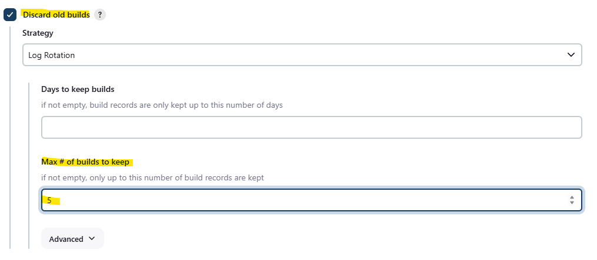

* Scroll down to "Build Step".
* Click "Execute Shell"

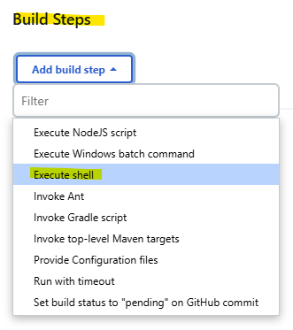

* Add a command to "Execute Shell": `uname -a`
* Click "save".

>If you want to go back and re-configure, click "Configure" on the left side of your project dashboard. 

## Run the pipeline
* On the left, click "Build Now". 
* If you go back to your "Dashboard", you will see it under "Build Executor Status".
  * It's built a node to run the jobs. 
  * Ours can only run 5 jobs at a time because that is what we've set it as. 

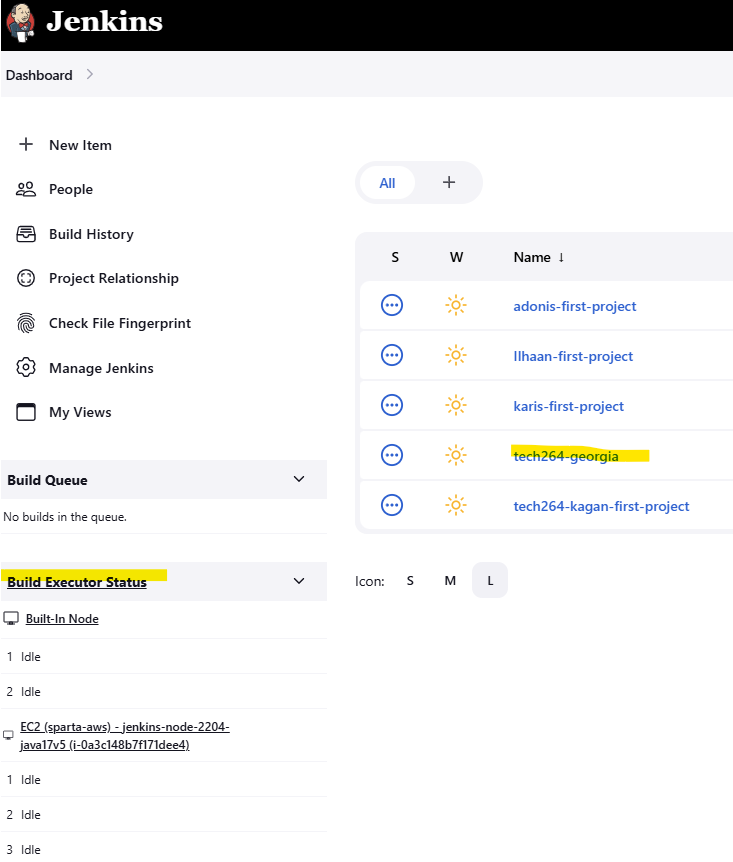

> If you want to see your job, click on your project name. 

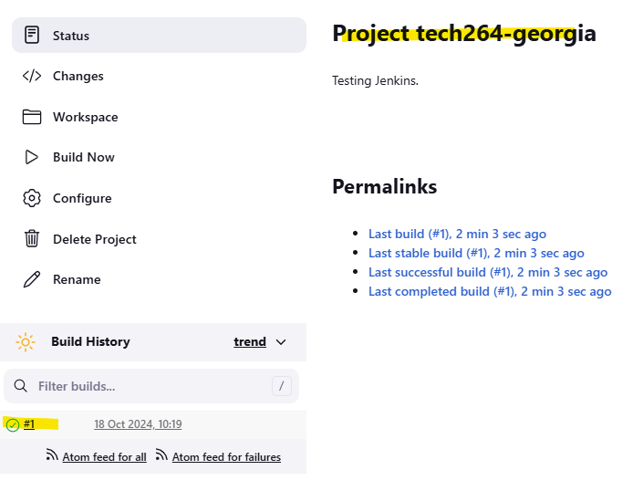

* Click on your number next to the green tick on the bottom left. 
* Click on "Console Output" on the left side to see more details about what you've run. 

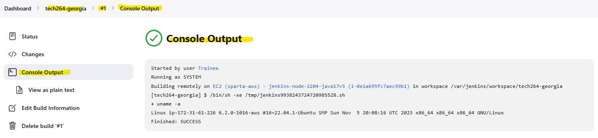

>In Jenkins, nodes (or agents) are computers that run your jobs. Sometimes, these nodes can be set to turn off if they aren’t used for a while, like 10 minutes. If this happens, you might need to start your job again because the node turned off before it could run.

 

## Test: Create another job/ another pipeline
> Aim: to get the date and time. 
* Call it: tech264-georgia-date-time
* "Execute Shell": `date`
* Click "Build Now"
* Click on the link next to green tick on bottom left.

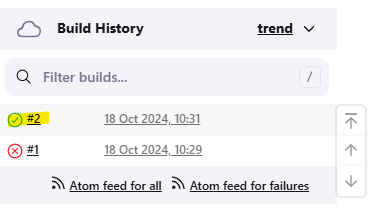

* Click "Console Output" on the left hand side. 
* You can see within the code the command "date" and the output underneath. 

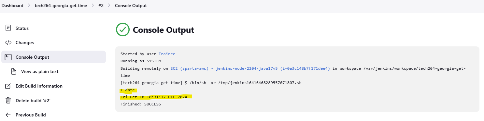

 

## Test: Make a multi-stage Pipeline: Connecting our existing pipes
> Aim: Link our two pipes together. 
>
> We need to make sure the pipe/projects go in order: uname -a > date. 
* Go to "Dashboard".
* Go to the **first project**: tech264-georgia
* Go to "Configure".
* Go to "Post-build Actions": "build other projects" > `tech264-georgia-get-time`
* Click "trigger only if build is stable". 
* Click "OK" (or save).
  
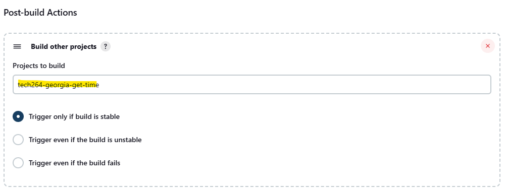

* Click "Build Now".

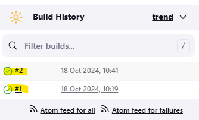

* Go to Dashboard and click on your **first** project.
* Click on "#2" (or most recent) build.
* Click "Console Output". 

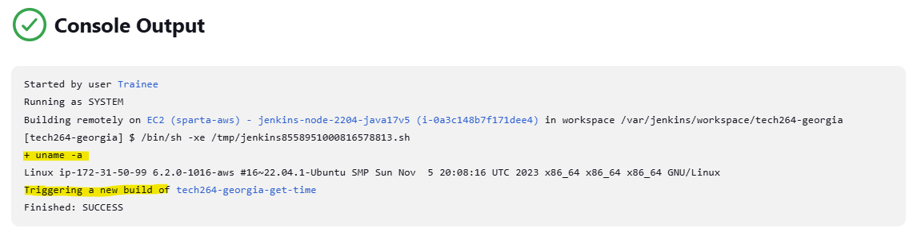

> You need to click on the number of the build to get the console output for that node. 

 

# Three Job Jenkins Pipeline

# Ramon's Diagram: How it's going to work

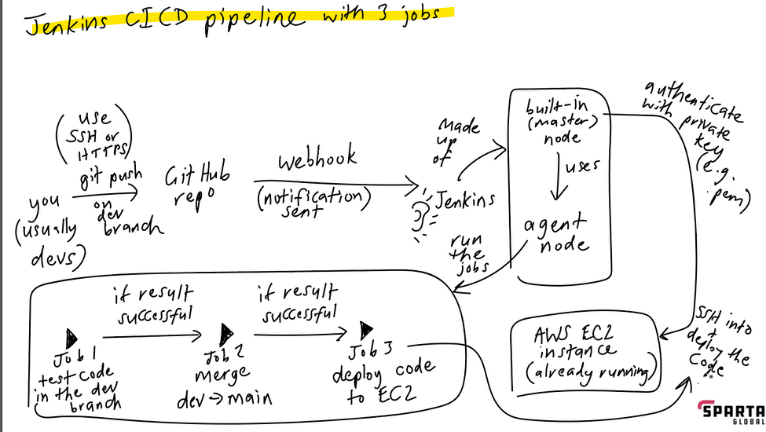

## Jenkins CICD Pipeline with Three Jobs
Starting with Jenkins.
* Jenkins is made up of two things:
  * A built in (master) node. 
  * The (master) node uses **agent** nodes to run the jobs. 
* We'll be using the built in node to build and manage jobs. 

> Our pipeline does not have agent nodes currently because we haven't created them.

 

## The Trigger to all of this. 
* You (the developer) will be working on the code. 
  * The individuals writing the code.
  * Not necessarily a DevOps engineer doing this work.

* You do your `git push` on the "dev" branch via Git Bash terminal. 
  * Ways to do that:
    * SSH
    * HTTPS

* This `git push` will be sent to our GitHub repo. 
  * We will set up on GitHub so that when we make changes on the branch, Jenkins will be notified of this. This is the **webhook**.
  * It'll basically say that there have been changes on the "dev" branch. 
  * For Jenkins to do it's job, it needs to be listening. 
  * When it gets the notification, Jenkins will trigger the pipeline. 

 

> **webhook**:'s are commonly used in modern day. 
> - More efficient. 
> - Jenkins tells you when it's ready. 
>
> Historically they used "**polling**". 
> - Regular intervals of asking "has this happened yet" unti finally it's a yes. 
>- This is a wind up.

 

* We currently have our agent node running our jobs.

## The 3 Jobs:
These are going to run in order if the previous result is succesful.
### **Job 1**: Testing the code on the "dev" branch. 

### **Job 2**: Merge from the "dev" branch to the "main" branch (the source of the code). 
   * Use an SSH Key-pair to do the merge. This will be used to authenticate the connection.
   * Jenkins will need the private key to do the merge. 

### **Job 3**: Deploy the updated code to an EC2 instance to run the uppdated code. 

> How is the code going to get deployed to the EC2 instance?

#### Deployment Method:

* We will use SSH for deployment.
* Jenkins will SSH into our EC2 instance using scp.

#### Requirements:
* Jenkins needs a copy of our private key to access the EC2 instance.
  * Ensure Jenkins can authenticate using the private key.
  * Provide the private key on the Jenkins server.

#### Code/Script Validation:
* Use a tested and successfully passed script in your pipeline.
* Use src or rsync for deployment, not git clone.

 

### AWS EC2 Instance
> The AWS EC2 instance will already be running before the pipeline runs. 

* Jenkins needs to be able to SSH into this EC2 instance to deploy the updated code. 
  * To do this it needs to authenticate with the private EC2 key `.pem` file. 

> This is what Job 3 will have to do. 
>   * Copy the updated code. 
>   * Restart the app. 
>   * It will have to `npm install` to be sure it can re-install that new code. 

### EC2 Instance will need:
> All of the pre-configs that we've done (all of the dependencies for the app to run).

## Generate a New-key Pair
* Open Bash windown.
* cd into .ssh folder.
* Command: `ssh-keygen -t rsa -b 4096 -C "georgiastanley98@gmail.com"`
* Enter file: georgia-jenkins-2-github-sparta-app
* Passphrase: press "Enter" twice. 
* `ls`: to check if the keys have been generated. 

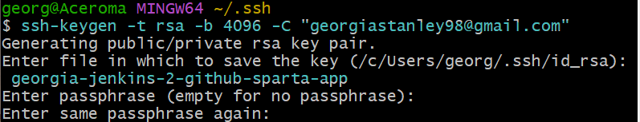
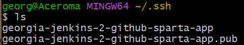

 

### Give this Key to a Specific Repo
* Go to GitHub and create a new repo called: sparta-test-app
* Go to GitHub Repo folder on Git bash.
* ` git clone <repo link>`
* `ls`: to check it's there. 
* cd into the folder: "sparta-test-app".

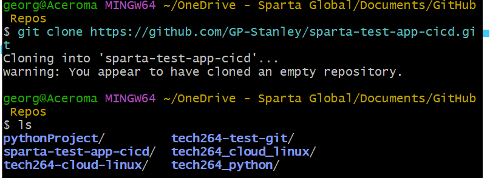

> move the app folder into here. 

### Get App Folder Into Repo
* Copied from the file explorer into this repo (this can take a minute). 

> 💥This copied an empty file.💥
>
> What I've done now is git clone from an old repo with a working app folder within and rename it. 

## Git Clone - Existing App Repo
* `cd` into GitHub Repo folder (where you want to place your repo).
* Clone using the https github link from your chosen repo you want to clone. 
  * In the same line, name the repo. 
  * `git clone "https link" "tech264-sparta-test-app-cicd"`
* Check the repo via `ls`. 
* `cd` into your cloned repo: `cd tech264-sparta-test-app-cicd`.
* Check inside the folder to make sure the 'app' folder is there: `ls`.
* Set the remote URL for the repository: `git remote set-rul origin "https link"`.
* Check the remote URL configuration: `git remote -v`
* Push any changes to the remote repository: `git push`

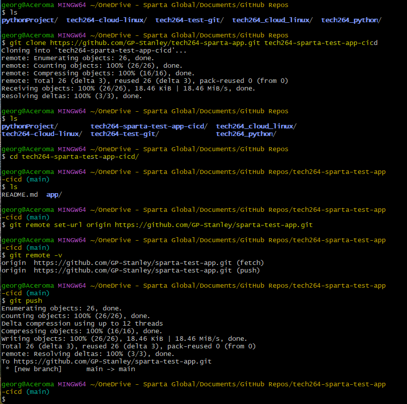

 

## Getting our Key on Jenkins
* We need to use the public key on the repo. 
* The private key will be used on Jenkins so it can have access to the repo and merge our changes. 

## We're setting up a padlock on a SPECIFIC repo: "sparta-test-app".
This can only be done ONCE per public key. 
* Go to selected repo on GitHub. 
* Go to repo settings > Security > Deploy keys
* "Add deploy key"
* Title (this can be the same as name of your public key): georgia-jenkins-2-github-sparta-app
* Print it out in Git Bash window: `cat georgia-jenkins-2-github-sparta-app.pub`
  * Copy and paste this into the Key description. 
* Allow write access. 

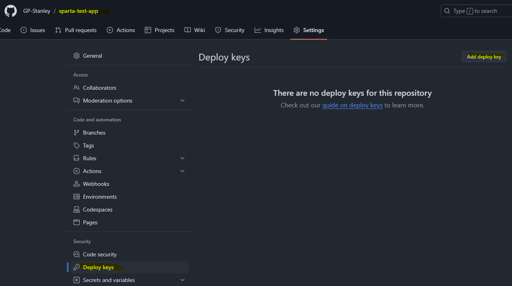

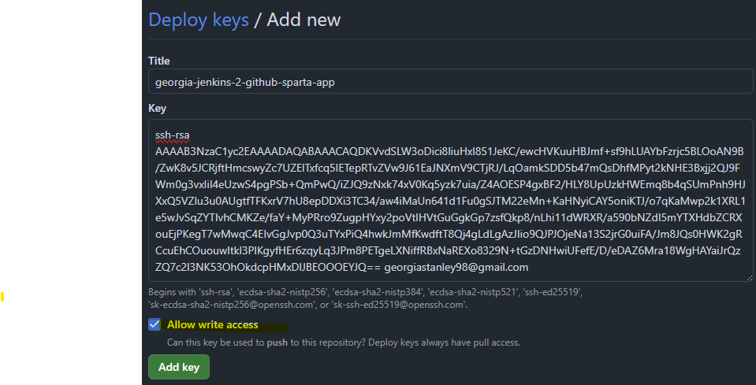

 

## Job 1: pipeline
Log in to Jenkins.
* Click "New Item".
* Name: "georgia-job1-ci-test"
* Click "Freestyle Project"
* Click "OK".
* Description: "Test app code for job 1"
* Discard old builds > 5
* Click "GitHub project"
* "Project url": 
  * Go to repo on GitHub.
  * Copy HTTPS code: https://github.com/GP-Stanley/sparta-test-app/
> MAKE SURE THERE'S NO ".git" on the end!
>
> ^ This will make the build fail. 
* "Source code management" > "Git" > 

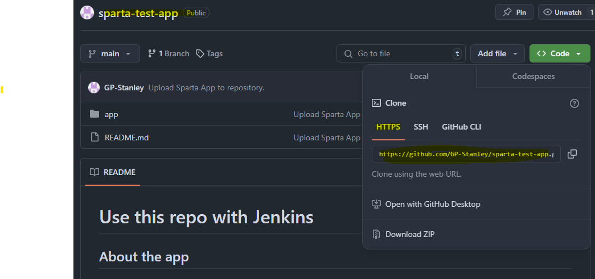

  * Grab SSH code from GitHub repo: git@github.com:GP-Stanley/sparta-test-app.git

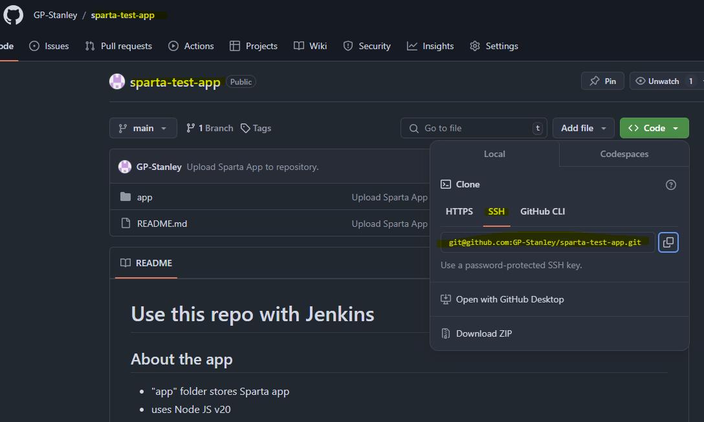

 

* Go back to Jenkins. 
* Add credentials to private key > "Jenkins" >
* "Kind" > SSH Username with Private Key > 
* "ID":  georgia-jenkins-2-github-sparta-app 
  * If you see "unacceptable characters", check there's not a space at the end. 
* Click "Enter directly" > paste in private key
* Git Bash window: cat "private key name"
  * Copy ALL of this code (including the heiphens) and paste it into the Jenkins "Key Description". 
* Click "Add".

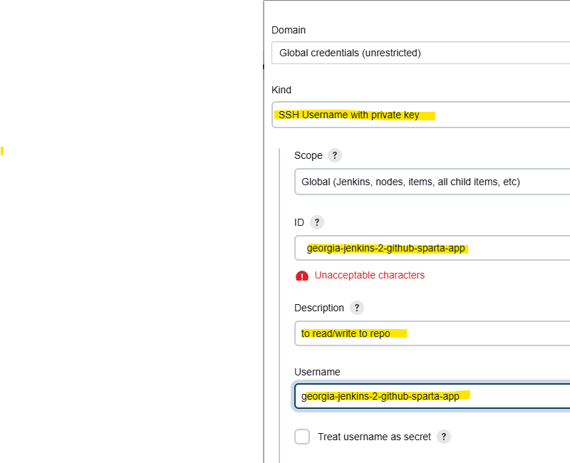
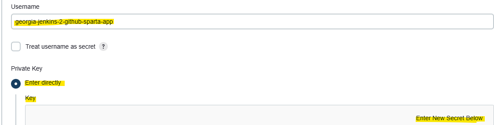

  

* "Branches to build"
* Change to `*/main`

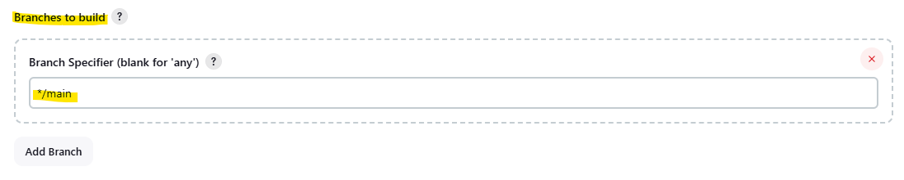
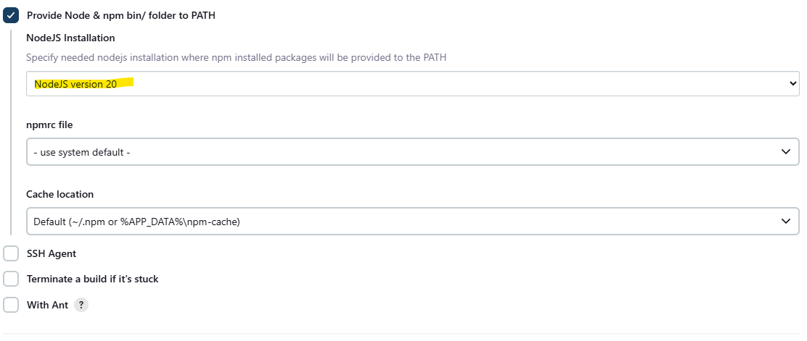

* "Build Environment" > 
* "Click": "Provide Node & npm bin/ folder to PATH"
  * Use `version 20`.

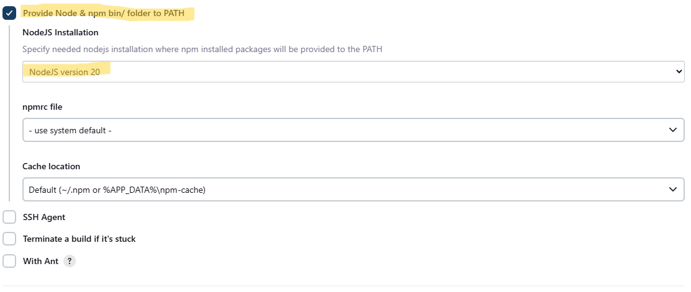

* "Build Step"
* "execute shell"
* Add in code:
  * cd app
  * npm install
  * npm test
* Click "Save". 

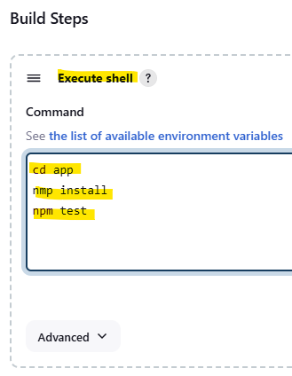

* Click "Build Now".
* Go to Dashboard to see what's happening. 
* Should have a green tick if it's done! (this may take a time).

 

## Set up our Webhook so we get the trigger. 
* Job 1: edit and listen for the webbhook.
* Go to configuration > change branch to "*/dev" > 
* Build triggers > Check "GitHub hook trigger for GITScm polling".
  * This will make Jenkins listen out for the web hook.

 

### Go to Git Bash Window
1. Open Git Bash and Navigate to the Repository:
   * Use `ls` to list the contents of the repository directory and ensure the “app” folder is present.
2. Create a New Branch:
   * Use `git branch dev` to create a new branch named dev.
3. Switch to the New Branch:
   * Use `git switch dev` to switch to the dev branch.
4. Edit the README.md File:
   * Open the README.md file using the `nano` text editor.
   * Add a new line with the text “a new line to test webhook”.
   * Save the changes with `Ctrl+s` and exit the editor with `Ctrl+x`.
5.  Stage the Changes:
    * Use `git add .` to stage all changes in the repository.
6.  Commit the Changes:
    * Use `git commit -m "Added line to readme."` to commit the changes with a message.
7.  Push the Changes to the Remote Repository:
    * Use `git push --set-upstream origin dev` to push the changes to the dev branch on the remote repository and set the upstream branch.
8. If you go onto GitHub, you should see your pushes from the "dev" branch. 

These steps help you create a new branch, make changes to a file, and push those changes to the remote repository, ensuring your work is tracked and shared with others.

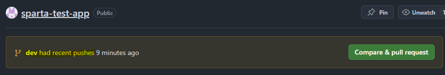

 

## Set up GitHub so it sends a webhook to Jenkins
* GitHub Repo > Settings > Webhooks > Add webhook
* "Payload URL": Jenkins URL. `http://34.254.6.118:8080/`
  * One the end, put: `github-webhook/`
* "Which events would you like to trigger this webhook?": keep it on "just the push event". 
* Click "Add Webhook". 

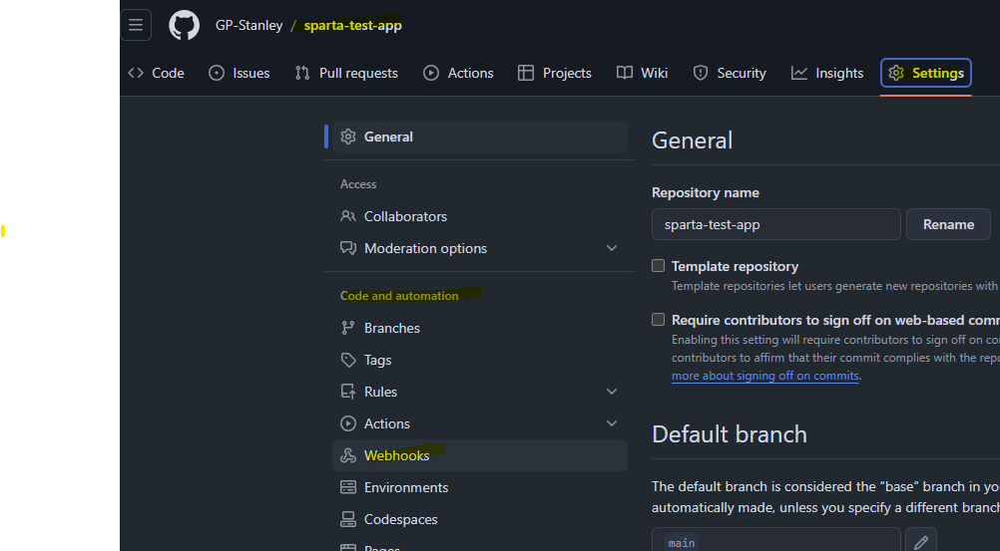
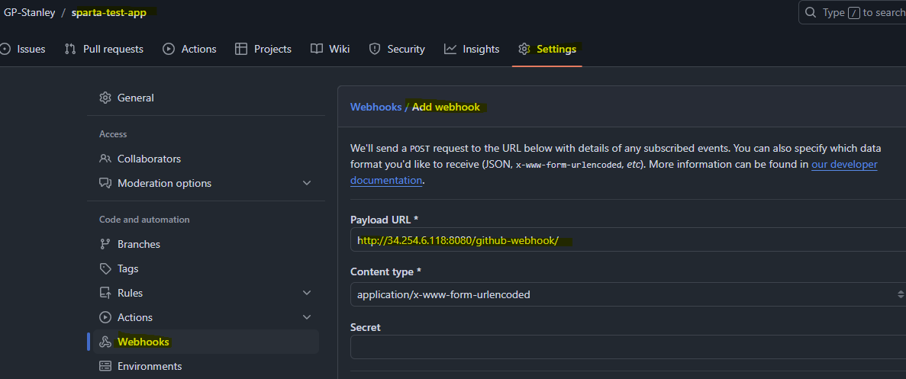

 

# Task: 3-job Jenkins pipeline to deploy Sparta test app
Pre-requisites: You already have: ✅
  * Job 1 <yourname>-job1-ci-test working

Get Job 2 working:✅
* Name Job 2: similar to <yourname>-job2-ci-merge
* Create a dev branch on your local git repo sparta-test-app-cicd
* Make a change to dev branch and push the code to GitHub - the webhook needs to trigger the pipeline
* If the tests pass on Job 1, Job 2 should run (and the code should merge from dev to main branch)

Get Job 3 working:
* Name Job 3: similar to <yourname>-job3-cd-deploy
* Copy the updated & tested code from Jenkins to the AWS EC2 instance
* Jenkins will need to SSH into the EC2 instance to update the code & re-run the app
* Only 1 person needs to add the key/SSH credentials/pem file on Jenkins for Job 3
* To copy the code from Jenkins to to EC2, use the scp or rsync commands from Jenkins
  * DO NOT: git clone from main branch and push to production
* You will need an EC2 instance already running
  * Should use normal Ubuntu 18.04 LTS image
  * Use normal SG rules, but allow Jenkin's IP to SSH in
  * Must have all dependencies installed to run Sparta test app

 

## Get job 2 working
* Name: "georgia-job2-ci-merge"
* Freestyle project
* Click "OK". 
* Description: 

Git project > project url : "https://github.com/GP-Stanley/sparta-test-app/"

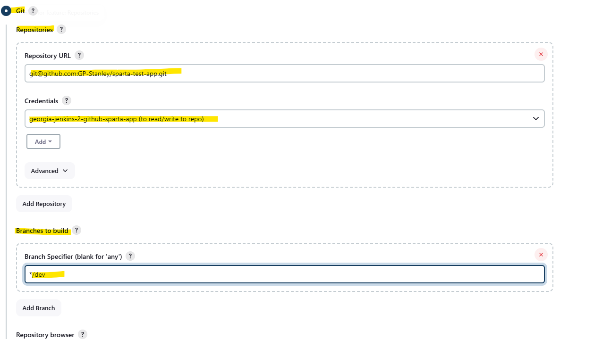

Build triggers > build after other projects are built > enter job1 > trigger only if built is stable > GitHub hook trigger for GITsm polling. 

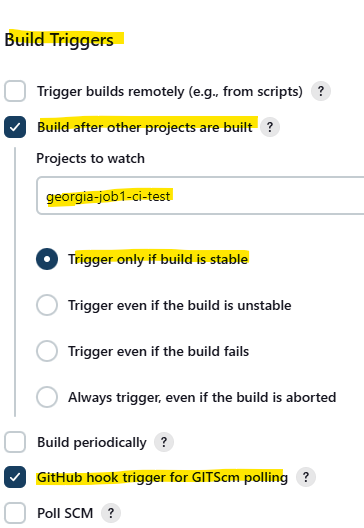

Build steps > execute shell > Command > "georgia-job1-ci-test"
  * git switch main
  * git merge origin/dev
  * git push origin main 

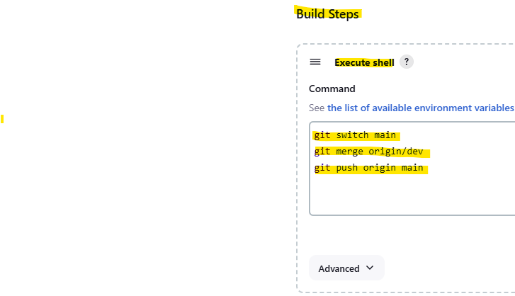 

* Build Environment > SSH agent > Add Key. 

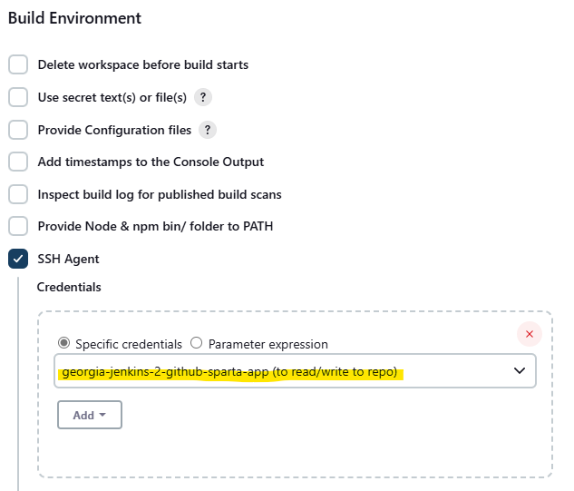

* Console Output. 

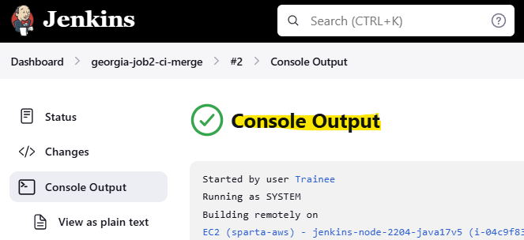

> Make changes to README.md and push them, if you go onto jenkins, you will see your two jobs working.

* Make sure you're on the "dev" branch.
* Make an edit: `nano README.md`
* `git add .`
* `git commit -m "Testing job 2."`
* `git push`

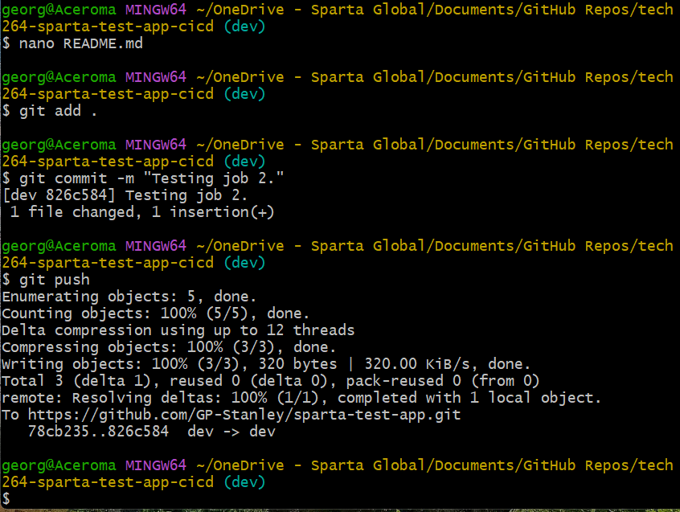

* Go to the GitHub repo and refresh. 

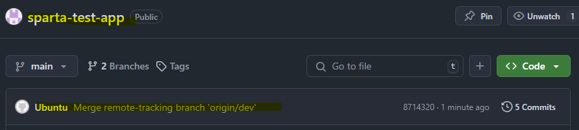

> `git switch main` to get onto the main branch again. 