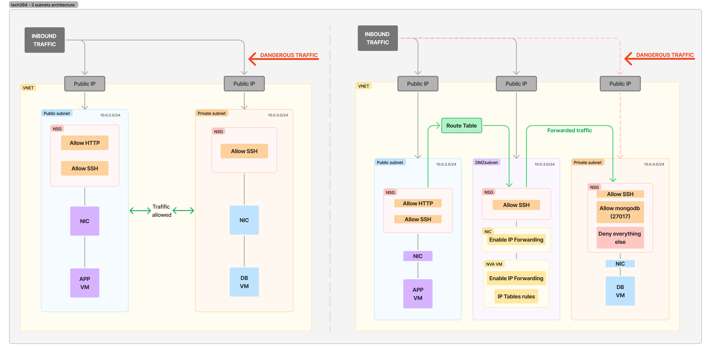
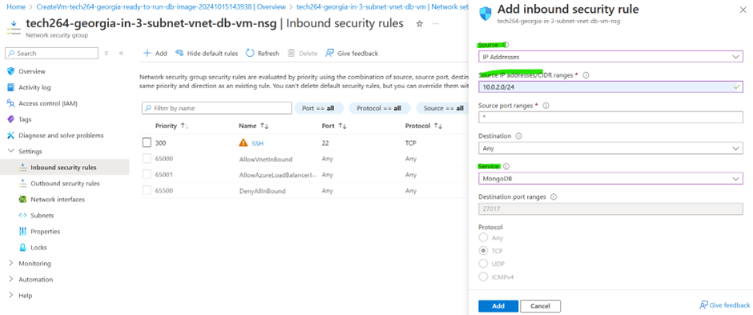

# Week 4

- [Week 4](#week-4)
- [Differences between Azure and AWS](#differences-between-azure-and-aws)
  - [When creating a VM.](#when-creating-a-vm)
  - [Get the 'app' folder onto the Azure VM using "git"](#get-the-app-folder-onto-the-azure-vm-using-git)
      - [Task](#task)
    - [Part 1: Upload the app folder to your GitHub repository](#part-1-upload-the-app-folder-to-your-github-repository)
  - [Part 2: Clone the GitHub Repository to Your Azure Linux VM](#part-2-clone-the-github-repository-to-your-azure-linux-vm)
  - [Test your app runs manually](#test-your-app-runs-manually)
  - [Task: Finish Bash script to provision and app in the background with \&](#task-finish-bash-script-to-provision-and-app-in-the-background-with-)
    - [Edited bash script:](#edited-bash-script)
  - [Task:](#task-1)
  - [](#)
    - [scp](#scp)
      - [Structure of the command](#structure-of-the-command)
      - [Common Options](#common-options)
- [A Reverse Proxy](#a-reverse-proxy)
- [Reverse Proxy \& BindIp](#reverse-proxy--bindip)
- [Task: Get a reverse proxy working:](#task-get-a-reverse-proxy-working)
- [Setting Up an Nginx Reverse Proxy](#setting-up-an-nginx-reverse-proxy)
  - [Task 2: at least get the reverse proxy working manually.](#task-2-at-least-get-the-reverse-proxy-working-manually)
  - [Task: Automate database Stage 2 - Provision Mongo database VM with a Bash script](#task-automate-database-stage-2---provision-mongo-database-vm-with-a-bash-script)
  - [Pre-assessment notes](#pre-assessment-notes)
    - [The Monolith](#the-monolith)
      - [Characteristics:](#characteristics)
      - [Components of a Monolithic Application](#components-of-a-monolithic-application)
      - [Advantages and Disadvantages](#advantages-and-disadvantages)
    - [2-Tier Architecture](#2-tier-architecture)
      - [Characteristics:](#characteristics-1)
      - [1. Application Tier (Client Tier)](#1-application-tier-client-tier)
      - [2. Database Tier (Data Tier)](#2-database-tier-data-tier)
      - [How It Works](#how-it-works)
      - [Advantages](#advantages)
      - [Disadvantages](#disadvantages)
  - [Task: How many services can use a port?](#task-how-many-services-can-use-a-port)
    - [Running two different Git Bash terminals on the same VM simultaneously](#running-two-different-git-bash-terminals-on-the-same-vm-simultaneously)
      - [ERROR](#error)
      - [How to fix it:](#how-to-fix-it)
      - [Kill the process](#kill-the-process)
      - [Re-run the app](#re-run-the-app)
- [PM2](#pm2)
- [Task: run Spaprta app in the background](#task-run-spaprta-app-in-the-background)
- [Using \& to Run the App in the Background](#using--to-run-the-app-in-the-background)
  - [Issue with this Method:](#issue-with-this-method)
- [Using pm2 to Manage the App](#using-pm2-to-manage-the-app)
      - [Installation and Setup:](#installation-and-setup)
    - [Benefits of Using pm2:](#benefits-of-using-pm2)
- [Alternative: Using forever](#alternative-using-forever)
    - [Using forever to Start, Stop, and Restart the App:](#using-forever-to-start-stop-and-restart-the-app)
    - [Benefits of forever:](#benefits-of-forever)
- [Documenting the Methods](#documenting-the-methods)
  - [Using \&:](#using-)
  - [Using pm2:](#using-pm2)
  - [Using forever:](#using-forever)
- [Task: Automate configuration of nginx reverse proxy](#task-automate-configuration-of-nginx-reverse-proxy)
    - [Research how to setup the reverse proxy (single command)](#research-how-to-setup-the-reverse-proxy-single-command)
    - [Purpose](#purpose)
    - [Why Use This Command?](#why-use-this-command)
- [Task: Automate app with /posts page Stage 2 - Modify app VM script to use database VM](#task-automate-app-with-posts-page-stage-2---modify-app-vm-script-to-use-database-vm)
- [Task: Task: Automate app Stage 3 - Automate app deployment with user data](#task-task-automate-app-stage-3---automate-app-deployment-with-user-data)
- [User Data](#user-data)
- [What is User Data?](#what-is-user-data)
  - [Why Use User Data?](#why-use-user-data)
  - [Key Things to Know About User Data:](#key-things-to-know-about-user-data)
    - [Example script:](#example-script)
- [Levels of Automation: Deploying our app on the cloud.](#levels-of-automation-deploying-our-app-on-the-cloud)
    - [1. Manual Deployment (No Automation)](#1-manual-deployment-no-automation)
    - [2. Scripted Deployment (Basic Automation)](#2-scripted-deployment-basic-automation)
    - [3. Infrastructure as Code (Full Automation)](#3-infrastructure-as-code-full-automation)
    - [4. Continuous Deployment (Full Automation + Continuous Integration)](#4-continuous-deployment-full-automation--continuous-integration)
- [Images: Ramon's diagram 10/10/2024](#images-ramons-diagram-10102024)
- [Images on Azure](#images-on-azure)
  - [Types of Images:](#types-of-images)
  - [How You Use Images:](#how-you-use-images)
  - [Benefits:](#benefits)
- [Azure custom images and market images](#azure-custom-images-and-market-images)
  - [1. Azure Marketplace Images](#1-azure-marketplace-images)
  - [2. Custom Images](#2-custom-images)
  - [Key Differences:](#key-differences)
- [Plan for creating an app and database image:](#plan-for-creating-an-app-and-database-image)
    - [Script for app VM from image:](#script-for-app-vm-from-image)
    - [How to create an image:](#how-to-create-an-image)
    - [How to create a VM from an image:](#how-to-create-a-vm-from-an-image)
  - [Before creating the Image](#before-creating-the-image)
- [Ramon's diagram](#ramons-diagram)
- [Auto scaling](#auto-scaling)
- [Types of Scaling](#types-of-scaling)
  - [Vertical Scaling](#vertical-scaling)
    - [1. Scalling-up](#1-scalling-up)
    - [2. Scaling-down](#2-scaling-down)
  - [Horizontal Scaling](#horizontal-scaling)
    - [1. Scaling-out](#1-scaling-out)
    - [2. Scaling-in](#2-scaling-in)
  - [Real-World Example](#real-world-example)
      - [To summerise:](#to-summerise)
- [Task: created: tech264-georgia-test-monitoring-with-app](#task-created-tech264-georgia-test-monitoring-with-app)
- [Setting Up a Dashboard](#setting-up-a-dashboard)
- [Create a dashboard](#create-a-dashboard)
  - [How to view the dashboard:](#how-to-view-the-dashboard)
  - [How to arrange your dashboard](#how-to-arrange-your-dashboard)
- [Combining Load Testing and the Dashboard](#combining-load-testing-and-the-dashboard)
- [Load Testing Simulation](#load-testing-simulation)
  - [How It Works](#how-it-works-1)
  - [Why It’s Important](#why-its-important)
  - [How to manually start tech264-georgia-test-monitoring-with-app](#how-to-manually-start-tech264-georgia-test-monitoring-with-app)
- [How to connect the VM app after you stop it and start again - using  SSH key](#how-to-connect-the-vm-app-after-you-stop-it-and-start-again---using--ssh-key)
- [Tool to spike the CPU](#tool-to-spike-the-cpu)
  - [Apatchy Bench (AB): install it first.](#apatchy-bench-ab-install-it-first)
- [Load testing](#load-testing)
    - [Increase the values](#increase-the-values)
- [What is an Azure VM Scale Set?](#what-is-an-azure-vm-scale-set)
- [Auto-Scaling](#auto-scaling-1)
  - [Architecture for an Axzure VM Scale Set (HA \& SC)](#architecture-for-an-axzure-vm-scale-set-ha--sc)
    - [Custom Autoscale](#custom-autoscale)
    - [Our VM's Requirements](#our-vms-requirements)
    - [How does it achieve high availability?](#how-does-it-achieve-high-availability)
- [Starting up a scale set](#starting-up-a-scale-set)
  - [Creating a scale set](#creating-a-scale-set)
  - [Deleted scale set](#deleted-scale-set)
- [Why Use a Load Balancer?](#why-use-a-load-balancer)
- [Getting an Alert](#getting-an-alert)
- [Task: Azure Monitor monitoring, alert management task](#task-azure-monitor-monitoring-alert-management-task)
- [Monitoring and Responding to Load/Traffic: Worst to Best](#monitoring-and-responding-to-loadtraffic-worst-to-best)
- [Create a CPU Usage Alert for an Azure VM Scale Set Instance](#create-a-cpu-usage-alert-for-an-azure-vm-scale-set-instance)
- [SSH in and overload it to cause an alert alarm using apache bench](#ssh-in-and-overload-it-to-cause-an-alert-alarm-using-apache-bench)
    - [SSH into the Azure Instance](#ssh-into-the-azure-instance)
    - [Overload the Instance with Apache Bench](#overload-the-instance-with-apache-bench)
    - [Monitor and Trigger Alerts](#monitor-and-trigger-alerts)
  - [Remove dashboards and alert and action group](#remove-dashboards-and-alert-and-action-group)
    - [Removing a Dashboard](#removing-a-dashboard)
    - [Removing an Alert Rule](#removing-an-alert-rule)
    - [Removing an Action Group](#removing-an-action-group)
- [Two-tier Deployment](#two-tier-deployment)
- [Ramon's Diagram](#ramons-diagram-1)
  - [To make it more secure](#to-make-it-more-secure)
  - [How are we going to set up this NVA?](#how-are-we-going-to-set-up-this-nva)
  - [How do we check the traffic is coming from the right place?](#how-do-we-check-the-traffic-is-coming-from-the-right-place)
    - [What are the steps?](#what-are-the-steps)
- [Code-along](#code-along)
  - [Set up the house and the rooms for our architecture.](#set-up-the-house-and-the-rooms-for-our-architecture)
    - [Set up our Virtual Network.](#set-up-our-virtual-network)
    - [Private subnet](#private-subnet)
    - [Step 2: Set up the db.](#step-2-set-up-the-db)
    - [Step 3: Creating the App](#step-3-creating-the-app)
    - [Step 4: Creating the NVA virutal machine](#step-4-creating-the-nva-virutal-machine)
- [How to connect the VM app after you stop it and start again - using SSH key](#how-to-connect-the-vm-app-after-you-stop-it-and-start-again---using-ssh-key)
      - [Set up a ping](#set-up-a-ping)
    - [Step 5: Setting up the route table](#step-5-setting-up-the-route-table)
      - [Why Do We Need Route Tables?](#why-do-we-need-route-tables)
    - [Step 5.1: Getting the posts page working after logging off.](#step-51-getting-the-posts-page-working-after-logging-off)
      - [1. Start up VMs: app, db, nva.](#1-start-up-vms-app-db-nva)
      - [2. Disacosiating the route table to associate it again](#2-disacosiating-the-route-table-to-associate-it-again)
      - [3. SSH into App](#3-ssh-into-app)
      - [4. /posts page is now working: http://172.187.129.73/posts](#4-posts-page-is-now-working-http17218712973posts)
      - [5. Set up ping](#5-set-up-ping)
      - [6. Associate route table](#6-associate-route-table)
    - [Step 6: Enable IP forwarding in Azure.](#step-6-enable-ip-forwarding-in-azure)
    - [Step 7: Enable IP forwarding in your OS Linux.](#step-7-enable-ip-forwarding-in-your-os-linux)
    - [Step 8: IP Tables Rules](#step-8-ip-tables-rules)
    - [Step 8.1: What the 'config-ip-tables.sh' does:](#step-81-what-the-config-ip-tablessh-does)
    - [Step 10: Network Security Group.](#step-10-network-security-group)
    - [Step 11: Deny everything else rule.](#step-11-deny-everything-else-rule)
    - [Step 12: Clean-up.](#step-12-clean-up)
- [Task: what has been done to make the database more private](#task-what-has-been-done-to-make-the-database-more-private)
    - [1. Removed the Public IP Address:](#1-removed-the-public-ip-address)
    - [2. Isolated the DB in a Private Subnet:](#2-isolated-the-db-in-a-private-subnet)
    - [3. Access DB via App VM (Jump Box):](#3-access-db-via-app-vm-jump-box)
    - [4. Planned Deployment of NVA (Network Virtual Appliance):](#4-planned-deployment-of-nva-network-virtual-appliance)
- [Task: Research VM availability options on Azure](#task-research-vm-availability-options-on-azure)
  - [What is an Availability Set?](#what-is-an-availability-set)
    - [How does it work?](#how-does-it-work)
    - [Advantages:](#advantages-1)
    - [Disadvantages:](#disadvantages-1)
  - [What is an Availability Zone? Why superior to an Availability Set? Disadvantages?](#what-is-an-availability-zone-why-superior-to-an-availability-set-disadvantages)
    - [What is an Availability Zone?](#what-is-an-availability-zone)
    - [Why is it superior to an Availability Set?](#why-is-it-superior-to-an-availability-set)
    - [Disadvantages:](#disadvantages-2)
  - [What is a Virtual Machine Scale Set? What type of scaling does it do? How does it work? Limitations?](#what-is-a-virtual-machine-scale-set-what-type-of-scaling-does-it-do-how-does-it-work-limitations)
    - [What is a Virtual Machine Scale Set?](#what-is-a-virtual-machine-scale-set)
    - [What type of scaling does it do?](#what-type-of-scaling-does-it-do)
    - [How does it work?](#how-does-it-work-1)
    - [Limitations:](#limitations)
- [Making an Alert for app vm](#making-an-alert-for-app-vm)
    - [Steps to Create an Alert for a VM on Azure](#steps-to-create-an-alert-for-a-vm-on-azure)
      - [1. **Navigate to Azure Monitor**](#1-navigate-to-azure-monitor)
      - [2. **Create a New Alert Rule**](#2-create-a-new-alert-rule)
      - [3. **Select the Target Resource (VM)**](#3-select-the-target-resource-vm)
      - [4. **Define the Alert Condition**](#4-define-the-alert-condition)
      - [5. **Configure Action Group (Who to Notify)**](#5-configure-action-group-who-to-notify)
      - [6. **Set the Alert Rule Name and Severity**](#6-set-the-alert-rule-name-and-severity)
      - [7. **Create the Alert**](#7-create-the-alert)
    - [Below is the review \& Create Page:](#below-is-the-review--create-page)
- [Getting an Alert](#getting-an-alert-1)
  - [Generate CPU load using stress](#generate-cpu-load-using-stress)
  - [Alerts to my Email](#alerts-to-my-email)

# Differences between Azure and AWS

## When creating a VM.
* By default, in Azure, you get a static (fixed) public IP assigned to your VM.
* On AWS, by default, you will get a dynamic (changing) public IP assigned to the VM. 
  * When you stop and start the VM on AWS, the public IP address will change. 

## Get the 'app' folder onto the Azure VM using "git"
#### Task
* Get the app folder onto a GitHub repo called tech264-sparta-app, then
* use a git command to get the repo onto your Azure Linux VM
* Test your app runs manually
* Document
* Post in the chat in the chat to your app running on port 3000

### Part 1: Upload the app folder to your GitHub repository
Step 1: Initialise a Git Repository in Your App Folder
* Open your terminal or command line.
* Navigate to the directory where your app folder is located.
* Initialise the Git repository: `git init`

Step 2: Add the Remote GitHub Repository
* Now, connect your local repository to the GitHub repository tech264-sparta-app. `git remote add origin <>`

Step 3: Add Files to Staging
* Add all the files from the app folder to Git's staging area: `git add .`
  
Step 4: Commit the Changes
* Create a commit with a message that describes the changes: `git commit -m ""`
  
Step 5: Push the Changes to GitHub
* Push your local repository to the tech264-sparta-app GitHub repository: `git push -u origin master`
  

## Part 2: Clone the GitHub Repository to Your Azure Linux VM
Step 1: Connect to Your Azure Linux VM
* Use SSH to connect to your Azure VM: `ssh -i ~/.ssh/tech264-georgia-az-key adminuser@172.167.155.248`

Step 2: Install Git (If Not Already Installed)
* Once logged in, ensure Git is installed on the Azure VM. If not, you can install it by running: `sudo apt uppdate -y`, `sudo apt install git`.

Step 3: Clone the GitHub Repository to the VM
* In your VM, navigate to the directory where you want to clone the repository (e.g., /home/your-user/).
* Clone the tech264-sparta-app repository from GitHub: `git clone <git repo website>`

Step 4: Verify the Repository on Your VM
* After cloning, move into the repository folder to check the contents: `cd`, `ls`.


## Test your app runs manually
Step 1: Install Required Dependencies
* Make sure your VM has the required software to run your app. For example, if your app is a Node.js app, you will need to install Node.js and any other dependencies.

1. SSH into your Azure VM (if you’re not already connected): `ssh -i ~/.ssh/tech264-georgia-az-key adminuser@172.167.155.248`
2. Navigate to your app directory: `cd`
3. Install dependencies: 
   1. For a Node.js app with a package.json file: `npm install`
   2. For a Python app with a requirements.txt file: `pip install -r requirements.txt`
4. Start Your App
Once your dependencies are installed, you can manually start your app.
* Go into 'app' folder.
* Node.js Example: If your app uses something like Express.js, you can start the server with: `node app.js`
* Test the app: http://172.167.155.248:3000/


## Task: Finish Bash script to provision and app in the background with &
Develop your script to:
* update & upgrade
* install nginx
* install nodejs v20
* copy your github repo with the app folder
* cd into the app folder
* install & run the app with the "&" at the end (to try and run the app in the background)


### Edited bash script:
```bash
#!/bin/bash
 
GITHUB_REPO="https://github.com/GP-Stanley/tech264-sparta-app"  
REPO_FOLDER="repo"
 
echo update sources list...
sudo apt update -y
echo Done.
 
echo upgrade any upgradable packages available...
sudo DEBIAN_FRONTEND=noninteractive apt-get upgrade -y
echo Done.
 
echo install nginx...
sudo DEBIAN_FRONTEND=noninteractive apt-get install nginx -y
echo Done.
 
echo install nodejs v20...
curl -fsSL https://deb.nodesource.com/setup_20.x | sudo -E bash - &&\
sudo DEBIAN_FRONTEND=noninteractive apt-get install -y nodejs
echo Done!
 
echo check nodejs version...
node -v
echo Done!
 
echo Cloning GitHub repository...
git clone $GITHUB_REPO repo
echo Done!
 
echo cd into the app file
cd repo/app
echo now into the app file
 
echo npm install
npm install
echo npm install done
 
echo run the app in the background
node app.js & 
echo all done!
```
- change permissions to allow execution ```chmod +x prov-app.sh```
- execute the script ```./prov-app.sh```

Don't worry about DB right now
Next steps:
* Test your script to make sure it works in your current VM, then on a fresh VM (post a link in the main chat directly to port 3000 - with a message saying its by using your Bash script + a fresh VM).
* Document


Steps:
* Edited bash script.
* Running the script: 
  * make it executable: `chmod +x provision.sh`
  * run the script: `./provision.sh`
  * MAKE SURE :3000 ISN'T RUNNING/BEING USED on a web browser. 
Output:
```bash
2024-10-07 12:11:20 - Repository configured successfully.
2024-10-07 12:11:20 - To install Node.js, run: apt-get install nodejs -y
2024-10-07 12:11:20 - You can use N|solid Runtime as a node.js alternative
2024-10-07 12:11:20 - To install N|solid Runtime, run: apt-get install nsolid -y
```
  * ⚠️ERROR: Node.js is trying to start your app on port 3000, but that port is already occupied, hence the EADDRINUSE (Address in Use) error.
  * `ps aux | grep node` : to see where the :3000 is being used. 
  * `kill -9 <PID>`
  * run the script `./prov-app.sh`
  * Your app is ready and listening on port 3000: `http://172.167.155.248:3000`


## Task:
* Test your script to make sure it works in your current VM, then on a fresh VM (post a link in the main chat directly to port 3000 - with a message saying its by using your Bash script + a fresh VM).
* Document
* Create a new VM.
* Create a new nano provision.sh file
* Make it executable: `chmod +x provision.sh`
* Run the Script: `./prov-app.sh`


Test your script to make sure it works in your current VM, then on a fresh VM 
(post a link in the main chat directly to port 3000 - 
with a message saying its by using your Bash script + a fresh VM).
* http://172.166.147.48:3000/
## 


* we have to check that it's done everything we've asked it to do.
* We'll have to go in manually.
* e.g., check if it's enabled successfully. 
* check scp command: check bindIp, everything. 

### scp
`scp` (Secure Copy): a command to copy files and directories securely between two computers over a network. 
* It uses SSH (Secure Shell) to ensure that the data is encrypted during transfer, making it safe from eavesdropping.

#### Structure of the command
scp **[options]** **[user@]source_host:source_path** **[user@]destination_host:destination_path**

* [options]: These are optional flags that *modify how scp works*.
* [user@]source_host:source_path: This specifies the *file you want to copy*. If the file is on a remote computer, you include the username and the computer’s address.
* [user@]destination_host:destination_path: This specifies *where you want to copy the file to*. Again, include the username and address if it’s a remote computer.


#### Common Options
* `-P`: Specifies the port number to connect to on the remote host.
* `-r`: Recursively copies entire directories.
* `-C`: Compresses the data during transfer.
* `-p`: Preserves the modification times, access times, and modes from the original file.


> `Item potent`: it means you've designed it so that no matter how many times you run it, it will still achieve the desired state. It should work every single time. 


# A Reverse Proxy
A reverse proxy is like a middleman between your computer (or any device) and the servers where websites or applications are hosted. Here’s why you might use one:

* **Hiding Your Servers**: Imagine you have a bunch of servers running your website. You don’t want everyone to know their exact addresses for security reasons. The reverse proxy stands in front and takes all the requests, then passes them to the right server. This way, the real addresses of your servers stay hidden.
  
* **Sharing the Work**: If lots of people visit your website at the same time, one server might get too busy. The reverse proxy can spread the work across several servers, so no single server gets overwhelmed. This makes your website faster and more reliable.
  
* **Handling Secure Connections**: When you visit a website with “https,” your data is encrypted. The reverse proxy can handle this encryption and decryption, so your servers don’t have to do this extra work. This can make things run more smoothly.
  
* **Speeding Things Up**: The reverse proxy can save copies of your website’s pages. When someone visits, it can quickly send the saved copy instead of asking the server to generate it again. This makes the website load faster.
  
* **Keeping an Eye on Traffic**: It can also keep track of all the requests coming in and out. This helps you understand how people are using your website and spot any problems.
  
* **Optimising Content**: The reverse proxy can also tweak things like compressing files or resising images before sending them to users. This helps your website load faster and use less data.

So, using a reverse proxy helps make your website more secure, faster, and easier to manage.


# Reverse Proxy & BindIp
Using a reverse proxy for the bindIp in your script can be very useful.

1. **Security**: By binding the IP address to the reverse proxy, you can *hide the actual IP addresses of your backend servers*. This adds a layer of security, making it *harder for attackers* to target your servers directly.
   
2. **Load Balancing**: The reverse proxy can *distribute incoming traffic* across multiple backend servers. This helps in balancing the load, ensuring *no single server is overwhelme*d, and *improving *overall *performance* and *reliability*.
   
3. **SSL Termination**: It can handle SSL encryption and decryption, offloading this resource-intensive task from your backend servers. This can *simplify* your *server configuration* and *improve performance*.
   
4. **Caching**: By caching responses, a reverse proxy can *reduce the load* on your backend servers and *speed up response times* for users.
   
5. **Centralised Logging and Monitoring**: It allows you to *centralise logging and monitoring of traffic*, making it *easier to analyse and manage*.
   
6. **Content Optimisation**: A reverse proxy can *optimise content delivery*, such as compressing files or resizing images, to *improve load times* and *reduce bandwidth usage*.
   
Using a reverse proxy for binding an IP address specifically helps in *managing and routing traffic efficiently*, ensuring that your backend infrastructure *remains secure* and *performs optimally*.


# Task: Get a reverse proxy working: 
* Manually change Nginx config file (it is possible to change one line ideally) + restart Nginx + test in web browser without port 3000 on the end.
  * **Hint**: Backup the nginx config file before you start making changes: that way you can easily revert back to the original file to re-test (such as with the sed command later)
  * Automate with your script. Use sed command to replace the string you need to inside the Nginx config file

Deliver: Post link to public IP (without port 3000) in the main chat with a message like "reverse proxy configured"

If you are really stuck...

* Research how to setup nginx so that by default, the default website will be http://localhost:3000/ (from the perspective of nginx) so you will just need to go to the app VM’s public IP address (no port 3000 in the URL) and the Sparta test app will come.
* Use this website to help: https://www.theserverside.com/blog/Coffee-Talk-Java-News-Stories-and-Opinions/How-to-setup-Nginx-reverse-proxy-servers-by-example
Instead of making a new location (example: location /examples), change the default location (i.e. location /)
  
  **Hints**:
  * Don't worry about setting nginx proxy header values
  * Only one line needs to be replaced, the line starting with try_files


> CHECK YOUR APP IS STILL RUNNING IN THE BACKGROUND. You can use a different git bash window for this: cd into tech > app > `node app.js &`

# Setting Up an Nginx Reverse Proxy
1. Edit the Default Configuration File:
   * Open the default configuration file in Nginx: `sudo nano /etc/nginx/sites-available/default`
   * The most important configuration step in an Nginx reverse proxy setup is adding a proxy_pass setting. This setting maps an incoming URL to a backend server.
   * The proxy_pass directive is configured within the location section of any virtual host configuration file.
   * To set up an Nginx proxy_pass globally, edit the default file in Nginx’s sites-available folder.
2. Locate the Server Block:
   * Find the server block in the configuration file. It typically starts with: `server {`
3. Update the Location Block:
   * Add or update the location block to forward requests to your application running on port 3000. Replace the try_files directive with a proxy_pass directive:
    ```bash
    location / {
        proxy_pass http://localhost:3000;
    }
    ```

4. Create a Symbolic Link:
   * Create a symbolic link to enable the configuration: `sudo ln -s /etc/nginx/sites-available/default /etc/nginx/sites-enabled/`

5. Restart Nginx:
   * Restart Nginx to apply the changes: `sudo systemctl restart nginx`

6. Test the Configuration:
* Open your browser and test the setup by navigating to your domain without adding `:3000`. 
* The reverse proxy should forward the requests to your app running on port 3000.


```bash
server {
    listen 80;


    server_name;  # This handles requests for any domain or >. You shouldn't need your IP here, it should just know.

    location / {
        # Forward requests to the app running on port 3000
        proxy_pass http://localhost:3000;   # 'local host' is the machine itself. 
    }
}
```

```bash
# what i've taken out after the catch-up session with Ramon.
        proxy_set_header Host $host;
        proxy_set_header X-Real-IP $remote_addr;
        proxy_set_header X-Forwarded-For $proxy_add_x_forwarded_for;
        proxy_set_header X-Forwarded-Proto $scheme;
```


## Task 2: at least get the reverse proxy working manually. 
* kill command (should be a last resort).
* process managers:`pm2` to start the app, stop the app, and to re-run the app. (so you don't have to use the kill command). 
* get the reverse proxy working: we need something to redirect traffic to port 3000 when we go to the public IP address. to help us achieve this we're using nginx. We want to tell nginx to go to port 3000 instead of the homepage. That is called setting up a reverse proxy. if this is working, you wont have to put :3000 on the end. 
* may need to use systemctl restart once nginx has been edited. 
* `scd`: to do replacement of setting in the configuration file: put this in the bash script after you've installed nginx. 
* Make sure in your script it restarts nginx. 


## Task: Automate database Stage 2 - Provision Mongo database VM with a Bash script
* This script should completely configure the Mongo DB VM so that it is ready for the app VM to connect to the database when the DB VM is started.
* It should:
  * apt update & upgrade
  * install the correct version of Mongo DB
  * configure the bindIp to 0.0.0.0 (Hint: use sed command)
  * start and enable Mongo DB

Make sure you test your db-prov script on your current DB VM, before backing up your script, deleting your DB VM and testing your script on a fresh VM (post link to /posts page in the main chat once your script is working on a fresh DB VM).

When testing, make sure your app can connect to the database.


* create bash script: `nano prov-db.sh`
* insert bash scribt for database. 
*  change permissions to allow execution ```chmod +x prov-db.sh```
*  execute the script ```./prov-db.sh```
*  check MongoDB status: `sudo systemctl status mongod` (it's running).
*  test MongoDB connectivity
   *  From the same VM (local connection): Run the MongoDB shell to ensure MongoDB is accessible: `mongo`.
   *  From another machine (Remote Connection): Try connecting to the MongoDB instance from your app VM or any other machine using the VM's IP address and port 27017: `mongo --host <db-vm-ip-address> --port 27017`
* Verify Configuration Changes: To confirm that the bindIp change to 0.0.0.0 worked:
  * Open the MongoDB configuration file: `cat /etc/mongod.conf`
  * earch for the bindIp line to ensure it now reads: bindIp: 0.0.0.0
* Verify App Connectivity:
  * make sure the database connection works by pointing to the IP address of the MongoDB VM (on port 27017): `mongodb://<db-vm-ip-address>:27017/posts`
  * Check Open Ports
  * To confirm MongoDB is listening on port 27017, run: `sudo lsof -i :27017`


## Pre-assessment notes
A two-tier architecture.
* compare two things: the monolith and 2-tier architecture.
  
### The Monolith
* refers to a software design where all components of an application are integrated into a single, unified system.
* the entire thing is included in the monolith.

#### Characteristics:
 
- **Single Codebase**: Built and deployed as one unit.
- **Tightly Coupled**: Components depend on one another.
- **Simple Development**: Easier to develop and deploy initially.
- **Single Deployment**: Updates require redeploying the entire application.

#### Components of a Monolithic Application
`User Interface (UI)`:
* This is the part of the application that users interact with. It includes all the visual elements like buttons, forms, and menus. In a monolithic architecture, the UI is integrated directly with the rest of the application.
* 
`Business Logic`:
* This is the core functionality of the application. It includes all the rules and operations that define how data is processed and managed. For example, in an e-commerce application, the business logic would handle tasks like processing orders, calculating prices, and managing inventory.

`Data Access Layer`:
* This layer is responsible for reading and writing data to the database. It acts as an intermediary between the business logic and the database, ensuring that data is stored and retrieved correctly.

`Database`:
* The database stores all the application’s data. In a monolithic architecture, there is typically a single, centralised database that all parts of the application interact with.

#### Advantages and Disadvantages
Advantages:
* `Simplicity`: Easier to develop and deploy since everything is in one place.
* `Performance`: Can be optimised for performance as all components are tightly integrated.

Disadvantages:
* `Scalability`: Harder to scale because you have to scale the entire application, not just parts of it.
* `Flexibility`: Difficult to update or change parts of the application without affecting the whole system.
* `Maintenance`: As the application grows, it can become more complex and harder to maintain.
* `Slow to start up`.
* `updating`, `re-deploying`: Working on the same thing at the same time as your team is difficult. 


### 2-Tier Architecture
* A two-tier architecture is a type of software architecture that divides an application into two main layers: the application tier and the database tier. 
  
#### Characteristics:

* **Client-Server Model**: Frontend and backend are separate.
* **Direct Database Access**: Client communicates directly with the database.
* **Decoupling**: UI and backend run independently.

#### 1. Application Tier (Client Tier)
* `User Interface`: This is the part of the application that users interact with. It includes all the visual elements like buttons, forms, and menus.
* `Business Logic`: This layer also contains the business logic, which is the code that processes user inputs and performs the necessary operations. For example, in a banking application, this would include the logic for processing transactions, calculating interest, etc.

#### 2. Database Tier (Data Tier)
* `Data Access Layer`: This layer is responsible for reading and writing data to the database. It acts as an intermediary between the application tier and the database.
* `Database`: This is where all the data is stored. It could be a relational database like MySQL, PostgreSQL, or any other type of database.
  
#### How It Works
In a two-tier architecture, the client (application tier) communicates directly with the database server (database tier). 
Here’s a simple flow:

* User Interaction: The user interacts with the application through the user interface.
* Processing: The application processes the user’s request using the business logic.
* Data Access: If the request involves data, the application sends a query to the database.
* Database Response: The database processes the query and sends the data back to the application.
* Display: The application displays the data to the user.

#### Advantages
* `Simplicity`: Easier to develop and maintain because of its straightforward structure.
* `Performance`: Direct communication between the client and the database can result in faster data retrieval and processing for smaller applications.

#### Disadvantages
* `Scalability`: Not as scalable as multi-tier architectures. As the number of users grows, the database server can become a bottleneck.
* `Maintenance`: Changes in the business logic or database schema can require updates to the entire application.
* `Security`: Direct communication between the client and the database can pose security risks if not properly managed.


## Task: How many services can use a port?
* Try to run the Sparta app from two different Git Bash terminals on the one VM simultaneously
* What error do you get when you try to run another instance of the Sparta app? Take a screenshot of it + add to your documentation.
* You get the error because you are trying to get a second app instance to use port 3000 but it's already in use by the first app instance
* How to fix it - document how to fix it (i.e. re-run the app)
* Find out the Linux command which allows you to find out the process using port 3000
* Document everything you've learnt
  

### Running two different Git Bash terminals on the same VM simultaneously
* you encounter an error because both instances are trying to use the same port (3000). 
* This is a common issue when multiple instances of an app attempt to bind to the same network port.

#### ERROR
* ⚠️ERROR: `Error: listen EADDRINUSE: address already in use :::3000` OR: `Connection timed out` (because you didn't have your database running).
* This error occurs because the first instance of the app is already using port 3000. When the second instance tries to use the same port, the operating system prevents it because a port can only be bound to one process at a time.
* If you try it on the web, you will get "Bad Gateway". This is because something is already using port 3000.

#### How to fix it:
* To fix this issue, you need to terminate the process using port 3000 or run the second instance of the Sparta app on a different port.
* `lsof -i :3000`
* A command list will appear of all the processes listening on port 3000. 
* 
#### Kill the process 
* Once you know the PID (Process ID), you can terminate it using the kill command.
* `kill -9 <PID>`

#### Re-run the app
* After the first process has been terminated, you can run your app again on port 3000.


# PM2 
* is a process manager for Node.js applications that makes it easy to manage and keep your applications running.
* `pm2` is responsible for keeping the `node app process` running. If you try to kill this process, the `pm2` will just create another one. 
* 'graceful kill -15': it will try to shut down any child processes running first and then kill the parent process. 
* `kill -9` on the partent process: will create a zombie process. WE DON'T WANT THIS. 


# Task: run Spaprta app in the background
Work out ways to both run, stop and re-start the app in the background (besides using the "&" at the end of the command):
* One way should use `pm2`
* If time: One other way (can you find another package manager do it like `pm2`?)
* You should have already used "&" at the end the command to run the app in the background - document the issue with using this method when it comes to stopping/re-starting the app
* Document the methods you got working
* Use pm2 to start the app in your app script instead of npm install or node app.js
* Re-run your script, expect an error when gets to pm2 until you add a command to stop the existing app process (or just all stop all processes run pm2)
Check the app is working in your browser at the IP address of the VM with :3000 appended to the end (or without port 3000 in the URL if your reverse proxy is running).


commands to: run the app, stop the app, and start again.


* run pm2 command to stop any processes it's currently running. 
* keep it simple: use the pm2 command to stop any and all processes its running before it runs the script. 


# Using & to Run the App in the Background
* Running the app with & at the end of the command simply starts the app in the background: `node app.js &`
* If you use the '&', you will have to constantly kill the process so it's best to use pm2.

## Issue with this Method:
* While the app runs in the background, managing (stopping or restarting) the app is more difficult because:
* The process may not persist after a terminal session is closed.
* Tracking the process ID (PID) is necessary to stop it, using: `ps aux | grep mode` // `kill <PID>`
* Restarting the app manually each time requires re-running the command.
**Summary**: This method is quick and easy but not suitable for long-term management or production environments due to the difficulty in managing background processes.


# Using pm2 to Manage the App
* pm2 is a popular process manager for Node.js apps that allows you to run, monitor, stop, and restart applications easily. It's a more robust way to manage Node.js processes compared to using &.

#### Installation and Setup:
1. Install pm2:
* Add this step to your script to install pm2: `sudo npm install -g pm2`

2. Use pm2 to Start the App: Replace the node app.js & line with the following command to start the app using pm2: `pm2 start app.js --name sparta-app`
3. Stopping and Restarting the App:

To stop the app: `pm2 stop sparta-app`
To restart the app: `pm2 restart sparta-app`
To check the app's status: `pm2 list`

4. Save the pm2 Process for Auto-Restart: You can save the current state of pm2 processes so they restart on system reboot:
```bash
pm2 save
pm2 startup
```

5. Stopping All pm2 Processes: If you need to stop all running pm2 processes, use: `pm2 stop all`

### Benefits of Using pm2:
* `Auto-restart`: The app automatically restarts if it crashes.
* `Log Management`: pm2 provides a simple way to manage logs.
* `Monitoring`: Easily monitor CPU and memory usage for your apps.
* `Multiple Apps`: Manage multiple apps simultaneously.


# Alternative: Using forever
* Another package similar to pm2 is forever, which also helps to manage Node.js processes.

Installing forever: `sudo npm install -g forever`

### Using forever to Start, Stop, and Restart the App:
* Start the app: `forever start app.js`
* Stop the app: `forever stop app.js`
* Restart the app: `forever restart app.js`
* Check the list of running processes: `forever list`

### Benefits of forever:
* Simple and easy to use for basic process management.
* Keeps the app running indefinitely, restarting it if it crashes.


# Documenting the Methods
Methods Documented:
## Using &:
* The app runs in the background but is hard to manage (stop/restart).
* You must manually track the process ID and kill it to stop it.

## Using pm2:
* A much more powerful process manager, providing automatic restarts, monitoring, and easier management of apps.
* Commands: `pm2 start`, `pm2 stop`, `pm2 restart`, and `pm2 list`.

## Using forever:
* An alternative to pm2, offering similar functionality.
* Commands: `forever start`, `forever stop`, `forever restart`, and `forever list`.


# Task: Automate configuration of nginx reverse proxy
* Research how setup the reverse proxy with a single Bash command (or as few commands as possible) so that it can be used for automating the process later in a Bash script. 
  * Hint: Research Linux commands that can be used to replace line(s) or strings within a text file.
* Test your command manually (i.e. SSH into your app VM)
* Add the reverse proxy commands to your app provision script.
* Test your provision script works to setup the reverse proxy by running the script manually (i.e. SSH into your app VM to run the script)


> CHECK YOUR APP IS STILL RUNNING IN THE BACKGROUND. You can use a different git bash window for this: cd into tech > app > `node app.js &`
1. Add an Nginx proxy_pass setting: `sudo nano /etc/nginx/sites-available/default`
The most important configuration step in an Nginx reverse proxy configuration is the addition of a proxy_pass setting that maps an incoming URL to a backend server.
The proxy_pass is configured in the location section of any virtual host configuration file. To set up an Nginx proxy_pass globally, edit the default file in Nginx’s sites-available folder.
1. Find the server block (it typically starts with `server {`).
2. Add or update the location block to forward requests to your app running on port 3000.
3. replace the try_files directive with a proxy_pass directive that forwards traffic to your app
4. `sudo ln -s /etc/nginx/sites-available/proxy.conf /etc/nginx/sites-enabled/`
5. `sudo systemctl restart nginx`
6. Test it in browser without adding :3000.


```bash
server {
    listen 80;


    server_name;  # This handles requests for any domain or >. You shouldn't need your IP here, it should just know.

    location / {
        # Forward requests to the app running on port 3000
        proxy_pass http://localhost:3000;   # 'local host' is the machine itself. 
    }
}
```

### Research how to setup the reverse proxy (single command)
* You can set up a reverse proxy using Nginx with a single Bash command by creating a configuration file and then starting Nginx. 
* 
*  Use sed to update the proxy settings in the configuration file
`sudo sed -i 's|try_files $uri $uri/ =404;|proxy_pass http://localhost:3000;|' /etc/nginx/sites-available/default`
   * What the Command Does:
     * The command searches for the line `try_files $uri $uri/ =404;` in the Nginx configuration file located at `/etc/nginx/sites-available/default` and replaces it with `proxy_pass http://localhost:3000;`.
     
  * `sudo`: Runs the command with superuser privileges.
  * `sed`: The stream editor command.
  * `-i`: In-place editing, which means the file is modified directly.


### Purpose
* `Original Line`: `try_files $uri $uri/ =404;`
  * This line tells Nginx to try to serve the requested file. If the file is not found, it returns a 404 error.
* `Replacement Line`: `proxy_pass http://localhost:3000;`
  * This line configures Nginx to forward (proxy) requests to `http://localhost:3000`. This is useful for setting up a reverse proxy, where Nginx forwards incoming requests to another server (in this case, your application running on port 3000).


### Why Use This Command?
* `Automate Configuration Changes`: Using sed in a script allows you to automate the process of updating configuration files, making it easier to deploy changes across multiple servers.
* `Efficiency`: It’s a quick and efficient way to make precise changes to configuration files without manually editing them.


# Task: Automate app with /posts page Stage 2 - Modify app VM script to use database VM
We have already gone through this earlier this afternoon - this is just a reminder to do what's in bold below.

Pre-requisite: You have completed "Task: Automate database Stage 2 - Provision Mongo database VM with a Bash script"

* The final app VM script will need to run after the database VM script is has finished running on the database VM.
* Modify the app VM script already created so that:
  * the environment variable DB_HOST is created just before the app is installed
* DOD:
  * The DB VM script runs successfully on a fresh Linux VM (running Ubuntu 22.04 LTS)
  * After the DB VM script finishes running, the app VM script runs successfully on a fresh Linux VM (running Ubuntu 22.04 LTS)
  * The Sparta app (including the /posts page) comes up in the web browser when you go to the app VM's public IP (because the reverse proxy is also configured by the app provision script).


# Task: Task: Automate app Stage 3 - Automate app deployment with user data
Pre-requisite:

* You have completed "Task: Automate database Stage 2 - Provision Mongo database VM with a Bash script"
* Make sure your app script works on a fresh VM + multiple times first
* Make sure your app script does not clone the app directly to the adminuser's home directory, but to the root directory instead

DOD:
* The DB VM script runs successfully in User Data on a fresh Linux VM (running Ubuntu 22.04 LTS)
* After the DB VM finishes provisioning, the app VM script runs successfully in the User Data on a fresh Linux VM (running Ubuntu 22.04 LTS)
* The Sparta app (including the posts page) comes up in the web browser when you go to the app VM's public IP

Points to note about user data:
* When making VM, go to "Advanced" setting, tick "user data", paste your script in the box
* Avoid modifying your script after pasting into user data. Why?
  * As with any Bash script, it must start with the she-bang line
  * It runs as root user
  * It only runs once (immediately after VM creation)


1. Make sure your app script does not clone the app directly to the adminuser's home directory, but to the root directory instead.
  
* This line in the app script: 
```bash
echo Cloning GitHub repository...
git clone $GITHUB_REPO repo
echo Done!

echo cd into the app file
cd repo/app
echo now into the app file
```


# User Data
* To achieve the next level of automation.
* immediatley after VM is created, user data will be run.
* make sure your NSG allows HTTP.
* automate reverse proxy should be in your app script ?????
* User data only runs once. 
* runs as root user. It's not starting in your home directory. It's starting from the root folder (the very top of the directory folder - root directory). This is where you want to clone http??? 
  * For example, `git clone http` to the repo folder > cd into repo folder (`cd repo/app`). 

# What is User Data?
* User Data is a **script that automatically runs** when you create a new virtual machine (VM).
* It helps **automate tasks** like installing software, setting up your environment, or downloading code.
* You can think of it as a set of instructions that your VM follows to set everything up right after it starts, so you don’t have to do it manually.
* Using User Data helps automate the setup of your VM so your web app can be up and running as soon as the VM is created. 

## Why Use User Data?
* `Automation`: Instead of manually configuring your VM every time it starts, you can provide a script that will automatically run and set up everything for you. This is helpful if you want your app to be ready immediately.
* `Run Once`: The script runs once, right after the VM is created. It won’t run again unless you create a new VM or manually trigger it later.

## Key Things to Know About User Data:
1. The Script Runs as Root:
   * The script runs with **root** (admin) privileges, so you don’t need to use `sudo` for commands in your script.
   * It starts from the **root directory** (`/`), which is the top of the file system. So, when you clone a repository (like from GitHub), make sure to specify where you want it to go.

2. Make Sure Your VM Can Be Accessed:
   * Your virtual machine’s Network Security Group (NSG) controls what traffic can come in or go out of the VM. If you want people to access your app on the web, you need to make sure your NSG allows HTTP (port 80) and/or HTTPS (port 443) traffic.
   * If this isn't set, people won’t be able to reach your app in their web browser.
  
**How to allow HTTP:**
  * Go to the NSG settings for your VM and make sure port 80 (for HTTP) is open for inbound traffic.

3. Setting Up a Reverse Proxy (Nginx):
   * When you're hosting a web app (like a Node.js app), you often use a **reverse proxy**. 
     * This is a program (like Nginx) that takes web traffic coming into your VM and forwards it to the right place (like your app running on port 3000).
   * You can **automate setting up a reverse proxy** in your User Data script, so you don’t have to manually configure it every time.

4. Cloning Your Code:
   * If your app’s code is on GitHub or another repository, you’ll want to **download (clone) it onto your VM**. You can do this as part of your User Data script.

5. One-Time Setup:
   * Since User Data only runs once (right after the VM is created), make sure your script is complete and works correctly. 
     * If there are errors, you’ll need to manually fix them later, so it’s good to test the script in small parts to ensure everything works.

### Example script:
```bash 
#!/bin/bash

# Set up MongoDB connection (replace with the actual IP of your MongoDB VM)
MONGODB_HOST="mongodb://10.0.0.4:27017/posts"
export DB_HOST=$MONGODB_HOST

# Update the package list and upgrade installed packages
apt-get update -y
apt-get upgrade -y

# Install Nginx (web server)
apt-get install -y nginx

# Install Node.js (required for running JavaScript apps)
curl -fsSL https://deb.nodesource.com/setup_lts.x | bash -
apt-get install -y nodejs

# Install PM2 (a tool to keep your app running)
npm install -g pm2

# Clone your app from GitHub
git clone https://github.com/yourusername/yourapp.git /home/ubuntu/app
cd /home/ubuntu/app

# Install app dependencies (things your app needs to run)
npm install

# Start the app using PM2 (which will keep it running even if the VM restarts)
pm2 start app.js --name myapp

# Set up Nginx as a reverse proxy (so people can access your app from the web)
sudo sed -i 's|try_files \$uri \$uri/ =404;|proxy_pass http://localhost:3000;|' /etc/nginx/sites-available/default
sudo systemctl restart nginx

```
> What This Script Does:
* **Sets up a MongoDB connection**: It assigns the IP of the MongoDB server to an environment variable (DB_HOST).
* **Updates and upgrades** the system to make sure it has the latest security patches.
* **Installs Nginx**, which will serve as a reverse proxy for the app.
* **Installs Node.js**, which is needed to run the app.
* **Installs PM2**, a process manager that will keep the app running.
* **Clones** the app from GitHub into the /home/ubuntu/app folder.
* **Installs dependencies** (like libraries the app needs).
* **Starts the app** using PM2 so it stays running.
* **Configures Nginx** to forward requests to the app (which is running on port 3000).
  


# Levels of Automation: Deploying our app on the cloud.
1. `Manual Deployment`: Everything is done manually, time-consuming and prone to errors.
2. `Scripted Deployment`: Use scripts to automate setup tasks, faster but still involves some manual steps.
3. `Infrastructure as Code` (IaC): Automate the creation of infrastructure and deployment of apps, highly scalable and replicable.
4. `Continuous Deployment` (CI/CD): Fully automated deployment and updates whenever changes are pushed to the codebase, enabling seamless updates and scaling.

Each level brings more efficiency, scalability, and consistency to your deployment process, with the final goal of having a fully automated pipeline that handles everything from infrastructure to app updates with minimal manual intervention.

### 1. Manual Deployment (No Automation)
At this level, the deployment process is done entirely by hand. This involves manually creating a virtual machine (VM), installing required software, and configuring the environment step-by-step.

    Steps:
    * Create a VM in a cloud provider (like Azure, AWS, or Google Cloud) manually.
    * SSH into the VM to install software (e.g., Nginx, Node.js, MongoDB).
    * Manually download your application code (e.g., clone from GitHub).
    * Set up the environment variables, configure the reverse proxy (Nginx), and start your application.

Pros:
* Simple and easy to understand for beginners.

Cons:
* Time-consuming and error-prone.
* Inconsistent deployments because steps might be missed or done incorrectly.
* Not scalable—each new VM needs to be set up from scratch.    


### 2. Scripted Deployment (Basic Automation)
   * At this level, you automate repetitive tasks by writing scripts (e.g., Bash scripts) that can install the necessary software, clone your app, and set it up. 
   * Instead of doing everything manually, you simply run a script that executes all these commands for you.

   Steps:
   * Write a script that performs all the necessary installation and configuration steps (installing software, setting up environment variables, etc.).
   * Run this script manually after creating a VM.

Pros:
* Faster than manual deployment.
* Reduces the chances of human error.

Cons:
* The script must be run manually (or provided during VM creation with a feature like User Data).
* Still needs some manual intervention to manage different VMs.


### 3. Infrastructure as Code (Full Automation)
* At this level, you automate the entire process of creating the infrastructure (VMs, networks, security groups) and deploying the app. 
* Infrastructure as Code (IaC) tools like Terraform or Azure Resource Manager (ARM) templates are used to define and provision the infrastructure using configuration files. 
* This way, everything is automated—from creating the VM to deploying the application.

Steps:
* Use an IaC tool (like Terraform, AWS CloudFormation, or ARM templates) to define the cloud resources required for your app (VMs, load balancers, databases, etc.).
* Write deployment scripts to automate the configuration and deployment of the app on the provisioned VMs.
* Deploy the entire infrastructure and application automatically with one command.

Pros:
* Full automation, including infrastructure provisioning.
* Can easily replicate the entire setup in multiple environments (dev, test, prod) with consistent results.
* Scalable—automatically creates and deploys VMs as needed.

Cons:
* Requires learning IaC tools.
* More complex to set up initially, but pays off in the long run.


### 4. Continuous Deployment (Full Automation + Continuous Integration)
* At this level, you not only automate infrastructure and deployment but also integrate it with a CI/CD pipeline. 
* This allows your application to be automatically deployed and updated whenever you push changes to your code repository (e.g., GitHub, GitLab).

Steps:
* Set up a CI/CD pipeline (e.g., with Jenkins, GitHub Actions, or Azure DevOps) to automatically build, test, and deploy your application whenever changes are pushed to the repository.
* Use IaC tools to automatically provision infrastructure and deploy the app on it.
* Ensure that new code changes trigger redeployment, making the process seamless.

Pros:
* The most advanced and efficient deployment process.
* Full automation from code push to deployment.
* Enables continuous updates and scaling without manual intervention.

Cons:
* The most complex to set up initially.
* Requires knowledge of CI/CD tools and processes.


# Images: Ramon's diagram 10/10/2024
* We've been using Ubuntu Pro 22 (a market place image). 
* We've been using a market place image to create our Vms.
  * The image determines everything thats going to go on the disk.
  * Then we prepared the VM to run the app. 
  * Create a custom image, used to create an app VM with everything already installed. 
  
"requires Plan information": you can't do this unless your provide information about the origihnal market place image you used. This is because you need to give credit: sometimes they may need to charge you. You need to provide that information when you create your VM.
  * they want to have info on the original market place image that you included. 
  * To solve this: don't use the one from ubuntu, we'll be using a custom marketplace image that Ramon has set up. `ramon-official-ubuntu2204-clean-image`

Resource group > tech264 > ramon clean image > 
In order to create a custom image:
* needs to be based on something: it needs a source file that contains what that image is going to use. 
* To get those files, if you go to ubuntu.com, you can download a virtual harddisk file (matching the ubuntu version youre using), then you have to upload from you local machine it to blob storgae in Azure. From blob storage, you can then use that file to creat a custom image. 
* The custmo image will have all the files that are included in that virtual harddisk file that you downloaded. 

Check script has worked:
* `sudo systemctl status mongod` > until it starts running (this m ay take a while).
* `cat /etc/mongod.conf | grep bindIp` > should be 0.0.0.0
* `sudo systemctl is-enabled mongod` > check if its enabled > should sau 'enabled'. 


# Images on Azure
*  an "image" is like a **blueprint or template** that helps you **create a virtual machine (VM) quickly**. 
*  Think of it as a **pre-built package** that **includes everything you need** to get your virtual computer (VM) up and running, such as an operating system (like Windows or Linux) and sometimes additional software.

## Types of Images:
* `Predefined Images`: Azure provides many standard images for **common operating systems** (like Ubuntu, Windows Server) or configurations. 
  * For example, you can choose an image with Ubuntu Linux already installed, so when the VM is created, it’s ready to go.

* `Custom Images`: You can also **create your own image** that includes the OS and any special software or configurations you need. 
  * This is helpful if you want to replicate the same setup across multiple VMs quickly.


## How You Use Images:
* When you want to create a VM, you **select an image** from Azure's image gallery (like choosing "Ubuntu 22.04" or "Windows Server 2022").
* Azure **uses that image to build your VM**, meaning the **VM will have** all the **software and configurations from the image**, so you **don’t need to set it up manually**.

## Benefits:
* `Faster Deployment`: Since the OS and software are already installed, your VM is ready to use much faster.
* `Consistency`: If you use the same image to create multiple VMs, they’ll all have the same setup, which makes it easier to manage them.

In short, Azure images help you quickly create virtual machines that are ready to use, without having to manually install an operating system or software.


# Azure custom images and market images
* virtual machines (VMs) can be created using either custom images or marketplace images.

## 1. Azure Marketplace Images
* These are **pre-built images available** in the Azure Marketplace, which is like a store for cloud resources. They are created and maintained by either Microsoft or third-party vendors. When you create a virtual machine (VM), you can choose one of these **pre-configured images**.
  * `What's included`: Operating systems (like Windows Server, Ubuntu, etc.) and sometimes additional software (like web servers, databases, or complete solutions like a WordPress environment).
  * `Ease of use`: Very convenient because they are ready to go, often requiring just a few settings from you (like VM size, region, etc.).
  * `Who uses them`: Ideal for beginners or people who want a quick, standardised setup without customisation.
  * `Updates`: Managed by the image publisher, ensuring that the software is kept up to date.

## 2. Custom Images
* A custom image is something you **create yourself**, **based on a VM that you have already configured**. Essentially, you take a *snapshot of a VM* (its operating system, installed software, settings, etc.) and *turn it into an image* that can be *used to create new VMs*.
  * `What's included`: Everything you’ve customized on the original VM (the operating system, software, specific configurations).
  * `Flexibility`: You have total control over the VM’s configuration, meaning it’s tailor-made to fit your exact needs.
  * `Who uses them`: Useful for experienced users or companies that need a specific configuration repeated across multiple VMs.
  * `Use case`: If you have set up a specific environment or application that you want to replicate, custom images are the way to go.

## Key Differences:

| Feature                | Azure Marketplace Images                        | Azure Custom Images                      |
|------------------------|-------------------------------------------------|------------------------------------------|
| **Definition**          | Pre-built images from Azure Marketplace         | Images you create from your customised VMs |
| **What's included**     | Pre-configured OS and sometimes additional software | All software, settings, and OS from your original VM |
| **Ease of use**         | Very convenient and ready to deploy             | Requires creating and managing your own image |
| **Flexibility**         | Limited customisation                           | Full control and customisation           |
| **Managed by**          | Publisher (Microsoft or third-party)            | You or your team                         |
| **Ideal for**           | Beginners or quick setups                       | Experienced users or tailored setups     |
| **Updates**             | Handled by the image publisher                  | You are responsible for updates          |


# Plan for creating an app and database image:
1. Created database VM: using custom image (Ramon's) and user data to run entire database script. ✅
2. SSH'd in: Tested that user data did it's job. ✅
3. Create app VM using custom image and user data to run the entire app script. 
   * Make sure the DB_HOST variable has the correct IP. ✅
4. test by:
   * check the public IP can bring up the home page. ✅
   * check /posts page. 
5. Create database VM image from the database VM.
   * delete the old db VM. 
6. Create database VM from the database image. ✅
7. Create app VM image from the app VM. 
   * delete the old app VM. 
8. Create app VM from the app image we just created. 
9. /posts page to work connecting to the database VM made from image. 
    * we want to use image and a littble bit of user data. You're going to have to have a special script - "`run-app-only.sh`"

### Script for app VM from image: 
The bottom part of your full app script.
 * start with she-bang.
 * export db host variable. 
 * cd into the app folder. 
 * npm install (might not need). 
 * pm2 stop all (either or).
 * pm2 start app.js

```bash
#!/bin/bash

GITHUB_REPO="https://github.com/GP-Stanley/tech264-sparta-app"

MONGODB_HOST="mongodb://10.0.3.4:27017/posts"

echo "Connect via our VMs via IP."
export DB_HOST=$MONGODB_HOST
echo "Connection complete."
printenv DB_HOST
echo "env variable set."

echo cd into the app file
cd repo/app
echo now into the app file

# Stop any existing pm2 processes
echo stopping any running pm2 processes...
pm2 stop all

# Run the app
echo Run app...
pm2 start app.js
echo Done!
```


### How to create an image:
`db vm` > `capture` > `image` > No, capture only managed image > Name: `tech264-georgia-ready-to-run-db-image` > 

**This is the same for app vm.**

### How to create a VM from an image:
`image` > `create VM` > add `run-app-only` bash script to user data > 


> Make sure when you need to run the app, run the database first. 

## Before creating the Image
* Before creating an image, use "`sudo waagent -deprovision+user`" to prepare the Linux guest OS on the virtual machine. 
* If you create an image from a virtual machine that hasn't been generalised, any virtual machines created from that image won't start.

^^^ **MAKE THIS COMMAND AFTER YOU SSH'd into YOUR VM. **It gets rid of specific information that we don't want. 
* exit out. 


# Ramon's diagram

**WORSE:**
* You have your app VM.
* the CPU load is too high (because of too much traffic).
* This will cause the VM to stop working or respomnding. 

**NOT SO WORSE:**
* You have your app VM.
* We use an Azure Monitor (CPU load) so we can see what's happening. 
* We can use a dashboard to help prevent a situation from falling over.
* However, having someone constantly watching it is not ideal.

**A BIT BETTER:**
* You have your app VM.
* We use an Azure Monitor (CPU load) so we can see what's happening. 
* Set up an alert/alarm so that when things reach a certain point - you get an alert. E.g., CPU load gets to 70%. 
* (notification) Decide how you want to be notified: email, phone, etc. Telling you about the problem.

**BETTER:** 
* You have your app VM.
* We use an Azure Monitor (CPU load) so we can see what's happening. 
* Auto-Scaling is the solution!
* Fixes will get automatically created to handle the new load. 
* Things will automatically scale back. 


---

# Auto scaling
1. `Adjusting Resources Automatically`: Auto scaling automatically adds more “staff” (computers or servers) when there’s a lot of traffic to your website or application. When the traffic goes down, it reduces the number of servers, so you’re not paying for resources you don’t need.
  
2. `Efficiency`: This helps ensure your website runs smoothly without wasting money. You have just the right amount of resources at any given time.
  
3. `Types of Scaling`:
   * *Scaling Out/In* (Horizontal Scaling): This means adding more servers when needed and removing them when they’re not. It’s like hiring extra staff for busy days and letting them go when things are quiet.
   * *Scaling Up/Down* (Vertical Scaling): This means making your existing servers more powerful or less powerful. It’s like giving your staff extra tools to work faster or taking them away when they’re not needed.

4. `Why It’s Useful`: Auto scaling is great for websites or apps that have unpredictable traffic. For example, an online store might get a lot of visitors during a sale, or a news site might get a spike in traffic when big news breaks.
   
5. `How It Works`: Cloud providers like AWS, Azure, and Google Cloud offer auto scaling services. They monitor your application and adjust the resources based on how busy it is, following rules you set up.
   
> Auto scaling helps your website or app handle more visitors when needed and saves money when things are quiet, all without you having to manually adjust anything.

---


# Types of Scaling

## Vertical Scaling

### 1. Scalling-up
   * Scaling up in VMs means **increasing the power** of your existing VM. You might add more CPU, RAM, or storage to handle more tasks.
   * Scaling-up: increasing the size of the VM.
   * It copies whatever work load is on this VM and is copied to a bigger VM. 
   * Once its copied the workload, it deletes the smaller VM. 

### 2. Scaling-down
  * Scaling down means **reducing the power of your VM**. 
  * You might decrease the CPU, RAM, or storage when you don’t need as much capacity.


## Horizontal Scaling

### 1. Scaling-out
  * In the world of VMs, scaling out means **adding more VMs to handle increased load**. If your website gets a lot of visitors, you add more VMs to share the work.
  * You may get more of those VM's duplicated. 

### 2. Scaling-in
  * Scaling in means removing some VMs when the load decreases.
  * This helps save resources and money.


## Real-World Example
* Imagine you run an online store. During a big sale, lots of people visit your site:

* `Horizontal Scaling`: You **add more VMs** to handle all the visitors. After the sale, you remove the extra VMs.
* `Vertical Scaling`: If you expect a steady increase in traffic, you might **upgrade** your main VM to handle more visitors **without adding new ones**.


#### To summerise:
* **horizontal** scaling *adds or removes* VMs to match the load.
* **vertical** scaling *changes the power* of your existing VM. 
* Both methods help ensure your application *runs smoothl*y and *efficiently*.

--- 


# Task: created: tech264-georgia-test-monitoring-with-app
* we created a vm from the app image.
* The only difference is weve added only this into the user data as we are not connecting to the database: 
```bash
#!/bin/bash
echo cd into the app file
cd repo/app
echo now into the app file

# Stop any existing pm2 processes
echo stopping any running pm2 processes...
pm2 stop all

# Run the app
echo Run app...
pm2 start app.js
echo Done!
```

# Setting Up a Dashboard
1. **Navigate to Azure Monitor**: In the Azure portal, go to Azure Monitor.
2. **Create a Workbook**: Under the “Insights” section, select “Workbooks” and create a new workbook.
3. **Add Metrics and Logs**: Add visualisations for the metrics and logs you want to monitor. You can use charts, graphs, and tables.
4. **Customise the Layout**: Arrange the visualisations in a way that makes sense for your monitoring needs.
5. **Save and Share**: Save the workbook and share it with your team. You can also pin it to your Azure dashboard for quick access.


# Create a dashboard
* Be on the Overview page.
* Scroll down to monitoring tab.
* Charts under Performance and Utilisation. 
* "See all metrics"/"Show more metrics": to see all metrics.
* We want to add 
* Pin (CPU average option) > create new > shared > nasme: `tech264-georgia-shared-app-dashboard` > create and pin.
* pin disk/operations/sec (average): eisting > shared > dashboard name. 
* Same again with: network (total). 

## How to view the dashboard:
* Search 'dashboard hub' on Azure.
* Go to 'shared dashboards' 
* Click on the link under 'go to dashboard' heading.

## How to arrange your dashboard
* click 'Edit'.
* click and drag the charts to fit on one line. 
* Click 'save'. 
* if you want to see the metrics of that time (whichever you've chosen), click on the chart, in the top right corner you can choose your timeline. 
* Click 'apply' to save it. 
* Save to dashboard if you want to keep it that way. Otherwise it won't save.


# Combining Load Testing and the Dashboard
* **Conduct Load Testing**: Use Azure Load Testing to simulate traffic and stress test your application.
* **Monitor in Real-Time**: Use the dashboard to monitor the metrics and logs in real-time during the load test.
* **Analyse Results**: After the load test, analyse the data collected in the dashboard to identify bottlenecks and performance issues.
* **Adjust and Optimise**: Based on the insights, make necessary adjustments to your application and infrastructure.
* **Repeat**: Conduct further load tests to ensure the changes have improved performance and stability.

Source: https://azure.microsoft.com/en-us/products/load-testing

# Load Testing Simulation
> Load testing simulation is a way to test how a system (like a website or application) performs under a specific amount of traffic or load.

* Aim: we want to trigger the CPU to cause an alert. 
* Work out what the threshold is for it to work. 

## How It Works
* **Simulate Users**: You use a tool to *simulate many users visiting your website at once*. For example, you might simulate 1,000 users all trying to access your site at the same time.
* **Measure Performance**: While the simulated users are accessing your site, you measure how well your site performs. You look at things like:
  * **Response Time**: How long does it take for your *site to respond* to a user’s request?
  * **Throughput**: How many *requests can your site handle* per second?
  * **Error Rate**: Are there *any errors* when users try to access your site?
* **Analyse Results**: After the test, you analyse the results to see if your site can handle the load. If there are problems, you can identify what needs to be fixed.

## Why It’s Important
* **Prevent Crashes**: By knowing how your site performs under heavy load, you can *prevent it from crashing during peak times* (like a big sale or event).
* **Improve User Experience**: Ensuring your *site is fast and reliable* even under heavy traffic keeps *users happy*.
* **Plan for Growth**: As your site grows, load testing helps you *plan for future traffic increases*.


## How to manually start tech264-georgia-test-monitoring-with-app
* SSH in.
* `pm2 start /repo/app/app.js`.
* pm2 start app.js

* ⚠️PROBLEMS⚠️: got to root directory > go to app folder > `pm2 stop all` > `sudo pm2 start app.js`. 


# How to connect the VM app after you stop it and start again - using  SSH key
 
1. Connect the `VM with SSH key`
2. To see the `repo/app`- need to be in root directory  -> `cd /repo/app`
3. Stop all processes -> `pm2 stop all`
4. To start the app -> `sudo pm2 start app.js`


# Tool to spike the CPU
* Simulate the situation: it gives the CPU instructions on your behalf.
* Give requests using a tool.


## Apatchy Bench (AB): install it first. 
* `sudo apt-get install apache2-utils -y`


# Load testing
`ab -n 1000 -c 100 http://yourwebsite.com/`
* we're going to modify this command so it works for us. 
* This is going to send a thousand requests (-n 1000) in blocks of 100 (-c 100). 
* Add your public IP address: http://172.167.64.221/
* `ab -n 1000 -c 100 http://172.167.64.221/`

### Increase the values
* `ab -n 10000 -c 200 http://172.167.64.221/`
* Outcome: it failed after 1000 requests. 

---

# What is an Azure VM Scale Set?
* Azure VM Scale Sets let you *create and manage* a group of identical, *load-balanced VMs*. 
* They enable you to *autoscale the number of VMs based on demand*. 
* A load balancer *distributes network traffic* among the instances to *ensure availability and performance*.


# Auto-Scaling

## Architecture for an Axzure VM Scale Set (HA & SC)
* We are using a custom image which we got from ubuntu.com (virtual hard disk file from blob storage).
* We used this custom image to create our VM.
* Then we created our marketplace image that we had to provide...
* Prepare VM to run the app. 
* Then we created another custom image for the app.

This is where the VM-SS comes in.
* This is going to use the custom image that we've created. **If youre trying to use the marketplace image, then you are going to need to require plan information before you are allowed tio use that custom image. 
* The Scale Set is responsible for creating and managing the VMs. 

### Custom Autoscale
* Custom autoscale: it needs to know the metric and the threshold you want it to use (75% CPU load which is the average for all the VMs we're using). 
* Start off with a minimun of 2, but the default is going to be 2. The maximum is going to be 3. 


### Our VM's Requirements
* minimum of 2 VMs.
* The 3rd may get created if it needs to create it (exceeded its 75% threshold).
* Each of the VM's are in it's own availability zone: zone 1, zone 2, and if a third is created, it will be in zone 3.
* Make sure that all 3 zones are going to be used by our VMs.
* All of these VMs are going to be in the public subnet, Region: UK South. 
* Users come through the internet > Public IP > Load Balancer: will send user to either VM depending on traffic. 


* This scale set it set up for tetsing purpuses.
* There are two things we want to accomplishL:
  * To achieve **high availability** and **scalibility**. 

### How does it achieve high availability?
* There are 3 zones. 
* Even if we have a disaster at zone 2, we still have a VM running in zone 1. 


# Starting up a scale set
1. Search on Azure: virtual machine scale sets.
2. When you start the SS, it will start the VMs.
3. It uses user data to run the app. 
4. They will stay in an unhealthy state. 

* To get user data to run again: `reimage`. It's copying the image again and run the user data again. 
* Go to 'load balancing' button on the left : it will give you your frontend IP address.
* Go to 'instances' to see what's being controlled. 


## Creating a scale set
1. **Search**: VM scale set.
2. Go to '**create**'
3. **name**: `tech264-georgia-sparta-app-scale-test`
4. **Availability zones**: 3
5. **Orchestration mode**: Uniform
6. **Security type**: Standard
7. **Scaling**: autoscaling
8. Click on '**configure**' > click on the pencil > change default condition > max: 3 > CPU threshold 75% > click 'save'.
9. **Image** : see all images > my images > `georgia-ready-to-run-app-image` > 
10. **Disks** > OS disk type > standard
11. **Network** > `georgia-2-subnet-vnet`
12. **Network interface**: click pen > keep public subnet > allow public inboud ports > HTTP, SSH.
13. **Public IP address** : because we have a load balancer, we can SSH in through that, therefore we can keep the Public IP address 'disabled' > click 'ok'.
14. **Load balancing** (underneath above): Azure load balancer > create a load banacer (beacause we dont have one) > Load balancer name: `tech264-georgia-sparta-app-lb` > click 'create'.
    
**IMBOUND NAT RULE: An inbound NAT rule forwards incoming traffic sent to a selected IP address and port combination to a specific virtual machine.
Frontend port range start: if you have more than one VM, you will have to increment this. Starts at 50,000.
Backend port: will have to go through the SHH Port of the first VM. You will need this backend port number (example is 22) for something. WATCH CLASS BACK: 11/10/2024 - 15:30 ? Adonis. 

^^^ CHECK THESE NOTES. 

15. **Health tab**: Enable application health monitoring: tick. >
16. **Recovery**: Enable Automatic repairs: tick. 

**Grace time period**: 
The amount of time for which automatic repairs are suspended due to a state change on the VM. The grace time starts after the state change has completed. This helps avoid premature or accidental repairs.

17. **Advanced tab**: user data > paste in script
```bash
#!/bin/bash

echo cd into the app file
cd repo/app
echo now into the app file

# Stop any existing pm2 processes
echo stopping any running pm2 processes...
pm2 stop all

# Run the app
echo Run app...
pm2 start app.js
echo Done!
```

18. **Tags** > owner Georgia
19. **Review and create** > create.
20. Let it deploy and set: then copy the IP into the browser. 
21. IT WORKED!!🎊🎉🥳💃

> ☠️IF YOU DARE TO TEST IT☠️: Go to Instances and delete one. Then refresh it. 

If you need to SSH into your first VM on the list:
* You'll need to clik on the first instance in the list.
* connect > SSH > put in key pair > `~/.ssh/tech264-georgia-az-key` > copy public IP that's provided, e.g. 10.0.2.6 > you need to get into the public ip of the load balancer
* Search **load balancer**: click the right VM > get the settings > frontend IP config > copy IP address. 
* Cange the IP address to the public ip address of the IP balancer. 
* Go to a specific port (write this after your key): -p 50000
* Copy into Git Bash window. 
* now you are in your first VM (name will appear after adminuser@tech254-r000000...). 

Example:


1st Instance: tech264-georgia-sparta-app-scale_0
* 20.0.162.96
* ssh -i ~/.ssh/tech264-georgia-az-key -p 50000 adminuser@20.0.162.96
* adminuser@tech264-g000000:~$

2nd Instance: tech264-georgia-sparta-app-scale_1
* 20.0.162.96
*  ssh -i ~/.ssh/tech264-georgia-az-key -p 50001 adminuser@20.0.162.96
*  adminuser@tech264-g000001:~$


## Deleted scale set 
tech264-georgia-sparta-app-
Go to the resource group to find everything. 
* delete load balancer, public IP adress, scale set.
* network security groups for your VMs. 
* 4 things total. 


# Why Use a Load Balancer?
A load balancer is used to **distribute incoming traffic** evenly across multiple VMs in a scale set. This ensures no single VM gets overwhelmed with requests and that traffic is efficiently handled.

* `Needed for high availability`: Distributes workloads and prevents failure from affecting service.
* `Required for SSH access`: In this setup, you will access your VMs through the public IP address of the load balancer.

---

# Getting an Alert
* I tried this on the first instance at 17:01.
* install : `sudo apt-get install apache2-utils -y`
* to try and get an alert: `ab -n 10000 -c 200 http://20.0.162.96`

> When i tried this, it couldn't connect to ubuntu.com.


# Task: Azure Monitor monitoring, alert management task
* Document what was done in the code-along, including...
  * What is worst to best in terms of monitoring and responding to load/traffic.
  * How you setup a dashboard
  * How a combination of load testing and the dashboard helped us
* Include a screenshot of your dashboard when you manage to get it to stop responding through extreme load testing
* Create a CPU usage alert for your app instance → you should get a notification sent your email
* Get the alert to check the average for each minute

Document...
* How to setup CPU usage alert
* Include a screenshot of the email you received as a notification
* Post a link to your documentation in the chat by Mon 9:30
* In Azure, remove your dashboards and alert and action group

Document...
* How to clean up for this task
* Link to help with Step 2 above: https://www.stephenhackers.co.uk/azure-monitoring-alert-on-virtual-machine-cpu-usage/

Hints:
* You need to set the threshold low enough that the CPU utilization will trigger an alert when you do heavy load testing and you get an email notification
* During cleanup: After deleting your alert, you will still need to delete your action group

---

# Monitoring and Responding to Load/Traffic: Worst to Best
* `No Monitoring`: This is the worst scenario where no monitoring is set up. You won’t be aware of any issues until they cause significant problems.
* `Basic Monitoring`: Using basic metrics like CPU usage and memory consumption. This provides some visibility but might not be enough to catch all issues.
* `Threshold-based Alerts`: Setting up alerts based on specific thresholds (e.g., CPU usage > 80%). This helps in catching issues early but can lead to alert fatigue if not tuned properly.
* `Dynamic Thresholds`: Using dynamic thresholds that adjust based on historical data. This reduces false positives and provides more accurate alerts.
* `Comprehensive Monitoring`: Combining metrics, logs, and traces to get a full picture of your system’s health. This is more complex but provides the best insights.
* `Automated Responses`: Setting up automated actions in response to alerts (e.g., scaling up resources). This ensures quick mitigation of issues without manual intervention.
* `Predictive Monitoring`: Using machine learning to predict potential issues before they occur. This is the most advanced and proactive approach.


# Create a CPU Usage Alert for an Azure VM Scale Set Instance
1. Go to the Azure Portal
   * Open the Azure Portal and navigate to your VM Scale Set.

2. Select Your Scale Set
   * Go to Virtual Machine Scale Sets.
   * Choose the VM Scale Set where your app is running (e.g., tech264-georgia-sparta-app-scale-test).

3. Navigate to "Metrics"
   * In the left-side menu of the Scale Set overview page, find and click Metrics under Monitoring.

4. Create a Custom Metric for CPU Usage
   * In the Metrics page, you'll configure a custom metric to track the CPU usage.
   * Click on Select a metric and choose Percentage CPU from the dropdown.
   * This metric will show you the CPU usage for each instance of the scale set.

5. Add an Alert for CPU Usage
   * After viewing the metric, click on New alert rule (found at the top of the page).
   * This will open the Create alert rule page.

6. Set Up the Alert Condition
   * Scope: The scope should already be set to your VM Scale Set.
   * Condition: Click Add Condition.
   * In the Signal Name dropdown, search for and select Percentage CPU.
   * Set the threshold for CPU usage. For example:
   * Condition: Greater than or equal to
   * Threshold value: Set this to the percentage (e.g., 75%).
   * Aggregation type: Average (this takes the average CPU usage across all instances).

7. Configure the Action (Notification)
   * Under Actions, click Add Action Group.
   * Choose an Action Group or create a new one by clicking Create action group.
   * Name the action group.
   * Under Notifications, click Email/SMS message/Push/Voice.
   * Enter your email address in the Email field.
   * Optionally, you can also set up SMS or push notifications by providing a phone number.
   * Click OK to save the action group.

8. Define the Alert Details
   * Alert Rule Name: Provide a name for the alert (e.g., High CPU Usage Alert).
   * Description: Add a description for the alert.
   * Severity: Choose the appropriate severity level for the alert (e.g., Sev 3 - Informational or Sev 2 - Warning depending on your need).

9. Review and Create the Alert
   * Once everything is set, click Create alert rule.
   * This will create the alert and the associated notification action.

10. Test the Alert
    * To test the alert, you can artificially increase the CPU load on your app or VM instance by running a CPU-heavy task. 
    * You could SSH into the instance and run a script that increases CPU usage, or you can use stress-testing tools like stress or sysbench.
    * When the CPU usage exceeds the defined threshold (e.g., 75%), Azure will trigger the alert and send a notification to your email.

Source: https://www.stephenhackers.co.uk/azure-monitoring-alert-on-virtual-machine-cpu-usage/

---

# SSH in and overload it to cause an alert alarm using apache bench
### SSH into the Azure Instance
1. Get the Public IP Address:
   * Go to the Azure portal.
   * Navigate to your Virtual Machine (VM).
   * In the “Overview” section, note the public IP address of your VM.
  
2. Open a Terminal:
* On  your local machine, open a terminal (Command Prompt, PowerShell, or a terminal emulator on Linux/Mac).

3. Connect via SSH:
   * Use the following command to connect to your VM: `ssh azureuser@<your-vm-ip>`
   * Replace <your-vm-ip> with the public IP address of your VM.
   * If you are using an SSH key, ensure you specify the path to your private key: `ssh -i /path/to/your/private/key azureuser@<your-vm-ip>`


<br>


### Overload the Instance with Apache Bench
1. Install Apache Bench:
   * If Apache Bench (ab) isn't installed on your VM, you can install it using:
```bash
sudo apt-get update
sudo apt-get install apache2-utils
```

2. Run Apache Bench:
   * Use the following command to simulate load: `ab -n 10000 -c 200 http://<your-vm-ip>/`
   * Replace <your-vm-ip> with the public IP address of your VM.
   * This command will send 10,000 requests (-n 10000) with a concurrency level of 200 (-c 200).

### Monitor and Trigger Alerts
1. Set Up Alerts in Azure Monitor:
   * Go to Azure Monitor in the Azure portal.
   * Create a new alert rule.
   * Define the conditions that should trigger the alert (e.g., high CPU usage, memory consumption).
   * Set the action group to notify you when the alert is triggered.

2. Monitor the Load:
   * While running Apache Bench, keep an eye on the metrics in Azure Monitor.
   * The high load should trigger the alert based on the conditions you set.


<br>


## Remove dashboards and alert and action group
### Removing a Dashboard
1. Navigate to Dashboards:
   * In the Azure portal, click on “Dashboard” from the left-hand menu.
2. Select the Dashboard:
   * Find the dashboard you want to delete. Click on the three dots (ellipsis) next to the dashboard name.
3. Delete the Dashboard:
   * Select “Delete” from the dropdown menu.
   * Confirm the deletion when prompted.

### Removing an Alert Rule
1. Navigate to Azure Monitor:
   * In the Azure portal, go to “Monitoring” from the left-hand menu.
2. Select Alerts:
   * Under the “Alerts” section, click on “Alert rules”.
3. Find the Alert Rule:
   * Locate the alert rule you want to delete. You can use the search bar to find it quickly.
4. Delete the Alert Rule:
   * Click on the three dots (ellipsis) next to the alert rule.
   * Select “Delete” and confirm the deletion.

### Removing an Action Group
1. Navigate to Azure Monitor:
   * In the Azure portal, go to “Monitoring”.
2. Select Action Groups:
   * Under the “Alerts” section, click on “Action groups”.
3. Find the Action Group:
   * Locate the action group you want to delete.
4. Delete the Action Group:
   * Click on the three dots (ellipsis) next to the action group.
   * Select “Delete” and confirm the deletion.


---


<br>


# Two-tier Deployment
# Ramon's Diagram

* At the moment we have our App VM.
* We have our db VM.
* They each have a Network Interface Card. 
* They each have a network Security Group with their own rules (e.g., allow HTTP, SSH (app), and the db (just SSH). 
  * Allowed by default: it allows **internal traffic** on a virtual network.
  * We can set a rule that virtual network traffic is not allowed by default, if we do this, we would have to allow MongoDB traffic which is PORT 27017, we then have to have a rule that is **higher priority: deny everything else**. 
  * To make it more secure: set up stricter rules for the db.
    * by default, virual network traaffic is not allowed on AWS.
    * (SSH and MongoDB both use TCP)
    * It's important to know the type of traffic you're allowing. 
* Each VM is in it's own subnet.
  * App VM: Public subnet (10.0.2.0/24).
  * DB: private subnet (10.0.4.0/24). This is '4' because we're going to have an extra subnet in here. 
* All of the subnets is going to be within a virtual network (VN) (10.0.0.0/16).
* All 3 will need a public IP address so we can SSH in if needed.
* From the public IP address, the HTTP traffic (web traffic), or the SSH traffic (you) coming in. 
* From either of these entry points, it can be potentially dangerous. 
* The virtual network encases all three.


## To make it more secure
* Remove the public IP address.
  * delete the db public IP.
  * You can access the db vm via SSH into the app vm via the public IP. 
  * You should put your private key into the app vm after SSH-ing in. 
* Add in another subnet: DMZ (de-militarised zone) (10.0.3.0/24).
  * Create a new VM in here called an NVA VM (network Virtual Applicance). 
  * This will have a NIC and an NSG.
  * This will have a rule to allow SSH (for the moment).
  * the NVA is going to filter any traffic being sent to the db. Its job is to make sure that only legitimate/valid/safe traffic from the right source is going to be allowed into the db. 
  * If we need to SSH into our NVA, this could have dangerous traffic.


## How are we going to set up this NVA?
* In order to force traffic from the public subnet, to go via the NVA, we need to set up a route table: "to-private-subnet-route-table"
* Their job is to route certain traffic to certain places. 
  * This is going to be safe traffic. 
  * It's going to come out of the app VM, out of the public subnet.
  * The table needs to be associated with the subnet that the traffic is coming out of.
  * We tell it that the next place we want it to go, the next `hop`, we want it to go to the DMZ subnet to the NVA VM.
  * Then the NVA is going to do its filtering, its check. 
  * This traffic you've got coming from the public subnet, its going to send it (`forwarded traffic`) to the private subnet and eventually the private db VM.
  * This traffic should be safe as it's been filtered. 


## How do we check the traffic is coming from the right place?
* We have to set up a couple of things.
* On the NIC itself (of the NVA), it needs `IP Forwarding enabled`. That will be done on Azure. 
* On the actual NVA VM itself, we need to enable IP forwarding in Liux.
* We need to set up our rules. 
  * We need IP tables rules to help us out (this is often used on firewall rules).


### What are the steps?
* *Set up a new VN with 3 subnets. "tech264-georgia-3-subnet-vnet"
* Set up stricter rules. 
* Delete piblic IP of db. 
* Set up NVA.
* Set up the route table. 
* Set up IP forwarding (in Azure and Linux).
* IP tables rules. 

  
<br> 




  
<br> 


# Code-along
## Set up the house and the rooms for our architecture. 
### Set up our Virtual Network.
1. Got to Virtual Networks
2. Naming convention: tech264-georgia-3-subnet-vnet
3. IP addresses: Leave the default subnet > edit > name: public-subnet > Starting address: 10.0.2.0 > save 
4. add subnet > name: dmz-subnet > starting address: 10.0.3.0 > save > 
5. add a third > private-subnet > starting address: 10.0.4.0 > Private subnet: not providing default outbound access. > enable private subnet > add/save. 


### Private subnet
  * Private subnets enhance security by not providing default outbound access.
  * To enable outbound connectivity for virtual machines to access the internet, it is necessary to explicitly grant outbound access. A NAT gateway is the recommended way to provide outbound connectivity for virtual machines in the subnet.
  * This means that the pubnet, whatever you've put in it, cannot access the internet. 
  * If we had to SSH into this, we won't be able to install anything because it will need internet access to do this. 
  * We will need the db image we created which has all the information it needs. 


1. Tag: owner gerogia
2. Review & create > create


### Step 2: Set up the db.
1. go to Images > find image > tech264-georgia-ready-to-run-db-image > create VM.
2. Name: tech264-georgia-in-3-subnet-vnet-db-vm
3. > put into availability zone 3 > check you've got the right image > adminuser > existing key > georgia-az-key > 
4. Allow SSH > licensing type : Other
5. Disk: Standard
6. Networking: Networking > Virtual network > tech264-georgia-3-subnet-vnet
Subnet > private-subnet (10.0.4.0/24)
Public IP
None
Accelerated networking
Off
Place this virtual machine behind an existing load balancing solution?
No
Delete NIC when VM is deleted
Disabled


6. Review & Create

  
<br> 


### Step 3: Creating the App 
1. go to Images > find image > tech264-georgia-ready-to-run-app-image > create VM.
2. Create VM > tech264-georgia-in-3-subnet-sparta-app-vm
3. Disk: Standard.
4. put into availability zone 1 > check you've got the right image > adminuser > existing key > georgia-az-key 
5. Allow SSH & HTTP > licensing type : Other
6. public subnet (10.0.2.0/24). 

  
<br> 


  
<br> 


5. Tags: owner georgia
6. Advanced: user data: app only > MAKE SURE YOU CHANGE THE IP TO MATCH `tech264-georgia-in-3-subnet-vnet-db-vm` PRIVATE IP ADDRESS. 
```bash
#!/bin/bash

echo cd into the app file
cd repo/app
echo now into the app file

MONGODB_HOST="mongodb://10.0.4.4:27017/posts"

echo "Connect via our VMs via IP."
export DB_HOST=$MONGODB_HOST
echo "Connection complete."
printenv DB_HOST
echo "env variable set."

# Run the app
echo Run app...
pm2 start app.js
echo Done!
```
7. Review and Create


### Step 4: Creating the NVA virutal machine
1. Create Virtual Machine
2. name: `tech264-georgia-in-3-subnet-nva-vm`
3. Zone 2
4. Standard secutirty
5. find image > see all images > `ramon-official-ubuntu2204-clean-image`
6. username > key > etc
7. Allow only SSH
8. license type: other
9. Disk: standard
10. Networking: dmz-subnet (10.0.3.0/24)

  
<br> 


11. Tags: Owner, georgia
12. review & Create

  
<br> 


# How to connect the VM app after you stop it and start again - using SSH key
1. Connect the `VM with SSH key`
2. To see the `repo/app`- need to be in root directory  -> `cd /repo/app`
3. `export DB_HOST=mongodb://10.0.4.4:27017/posts`
4. `printenv DB_HOST`
5. `sudo pm2 stop all`
6. `sudo -E pm2 start app.js`

    > The `-E` option in the sudo command stands for “preserve environment”. When you use sudo -E, it tells sudo to preserve the user’s environment variables. This is useful when you need to run a command with elevated privileges but still want to retain the environment variables set in your current session.

    Using -E **ensures** that the DB_HOST **environment variable** (and any other environment variables you have set) **is preserved when starting the application** with pm2 under sudo.


#### Set up a ping 
* go to app VM
* SSH in: ssh -i ~/.ssh/tech264-georgia-az-key adminuser@172.187.129.73
* 
* Ramon made scripts to create and delete VMs.
* `ping 10.0.4.4`: (this is linked to the db Private IP address). Sending a "Hello, are you there?". 
  * We've set this up because we are going to see how things interupt this communication. 


### Step 5: Setting up the route table
#### Why Do We Need Route Tables?
* *Imagine you have a house with multiple rooms (subnets) and you want to control how people (data) move between these rooms. 
* A route table helps you set rules for this movement, ensuring that data goes through the right paths and can even pass through security checks if needed.

<br>


  
<br> 


1. Go to resource (tech264-georgia-to-private-subnet-rt) > overview > Settings > Routes > Add > Route name "`tech264-georgia-to-private-subnet-route`".
2. Destination type: IP Addresses
3. Destination IP addresses: 10.0.4.0/24 (the destination is the private subnet for this traffic).
4. Next hop type: Virtual appliance
5. Next hop adddress: 10.0.3.4 (private ip for the nva).
6. Click 'Add'. 

    > ⚠️Ensure you have IP forwarding enabled on your virtual appliance. You can enable this by navigating to the respective network interface's IP address settings.

7. Associate this route table with where the traffic is coming out of, and then the route table will take care of delivering that traffic to the right spot.
8. Subnets > Associate > click 3-subnet > public subnet. 


<br>

 

<br>

> Effect on the ping - it has stopped.
> 
> We are sending traffic to our VNA machine but on the machine we need to now forward the traffic to the DB machine

<br>

 

<br>


### Step 5.1: Getting the posts page working after logging off. 

#### 1. Start up VMs: app, db, nva.

#### 2. Disacosiating the route table to associate it again
1. Search "Route Table" in Azure > find your own
2. Scroll to settings on the left side, click "Subnets".
3. On the 3 dots on the right, click "dissassociate". 

<br>


<br>

#### 3. SSH into App
1. Connect the `VM with SSH key`
2. To see the `repo/app`- need to be in root directory  -> `cd /repo/app`
3. `export DB_HOST=mongodb://10.0.4.4:27017/posts`
4. `printenv DB_HOST`
5. `sudo pm2 stop all`
6. `sudo -E pm2 start app.js`

#### 4. /posts page is now working: http://172.187.129.73/posts

<br>

#### 5. Set up ping
* `ping 10.0.4.4`

<br>

#### 6. Associate route table
1. Search "Route Table" in Azure > find your own.
2. Scroll to settings on the left side, click "Subnets".
3. Click "Associate" > 
4. Virutal network: tech264-georgia-3-subnet-vnet (tech264)
5. Subnet: public-subnet.
6. Click "OK".

<br>


<br>

---

### Step 6: Enable IP forwarding in Azure.
* Go to Network Interface for the NVA.
* Networking > network settings > network interface / IP configuration (on top of the page, normally in green) > click "enable IP forwarding" > click "apply".
* Keep the subnet in the dmz-subnet.

<br>

 

<br>

### Step 7: Enable IP forwarding in your OS Linux.
1. SSH into nva VM.
2. Check if IP forwarding is enabled: 
  * Output: net.ipv4.ip_forward = 0
3. `sudo nano /etc/sysctl.conf`
4. Find the part for IP forwarding: 
   * #Uncomment the next line to enable packet forwarding for IPv4
   * #net.ipv4.ip_forward=1 (get rid of the #).
   * `Ctrl+S`, `Ctrl+x`.

<br>

 

<br>


1. Check: `sysctl net.ipv4.ip_forward` (it hasn't changed).
   * Output: net.ipv4.ip_forward = 0
2. We now need to apply the file because we've changed it. 
3. `sudo sysctl -p`: (reload the configuration)
   * Output: net.ipv4.ip_forward = 1

<br>

 

<br> 

4. The ping has now started to move! 🎉🎊
5. The posts page is working again! 🎊🥳🎉


<br>


### Step 8: IP Tables Rules
* work as a filter for the firewall that is being passed.
  * IP tables rules act as a set of instructions that the firewall uses to decide which network traffic is allowed or blocked.
* only specific traffic that passes the rules can process through to the destingation.
  * This means that only the network packets that meet the criteria defined in the rules are allowed to reach their intended destination. All other traffic is blocked or redirected based on the rules.


<br>


1. Create a script on our nva.
   * contains the rules. 

> This script sets up basic firewall rules using iptables for managing network traffic, ensuring security by restricting or allowing certain connections.

2. Create in home directory is fine.
3. `nano config-ip-tables.sh` (the script is in the script folder).
4. Make sure to comment-out what you need. 
5. `Ctrl+S`, `Ctrl+x`
6. Give permisions: `chmod +x config-ip-tables.sh`
7. `ls`: to make sure the file is there. 

<br>

 

<br>

8. Update: `sudo apt-get update -y`
9.  Upgrade: `sudo DEBIAN_FRONTEND=noninteractive apt-get upgrade -y`
10. Run script: `./config-ip-tables.sh` 
11. /posts page still works! 🎉🥳🎊


<br>

### Step 8.1: What the 'config-ip-tables.sh' does:
 ```bash
 #!/bin/bash
 ```
* "shebang." It tells the system to run the script using the Bash shell.
  
```bash
# configure iptables
```
* indicates that the script will configure iptables, a tool to manage Linux firewall rules.

```bash
echo "Configuring iptables..."
```
* This prints a message to the terminal, letting the user know that the script is about to configure the firewall (iptables).

```bash
sudo iptables -A INPUT -i lo -j ACCEPT
sudo iptables -A OUTPUT -o lo -j ACCEPT
```
* iptables commands (firewall rules).
* `INPUT` and `OUTPUT` refer to incoming and outgoing network traffic.
* The `-i lo` and `-o lo` options refer to the **loopback interface** (lo), which is used for local communication within the machine.
* These two rules *allow all traffic coming from and going to the loopback interface* (which is used for processes to communicate locally).

```bash
sudo iptables -A INPUT -m state --state ESTABLISHED,RELATED -j ACCEPT
```
* This rule *allows incoming traffic* that is part of an already established connection or related to an existing connection.
* `ESTABLISHED` means the connection has already been established
* `RELATED` means the traffic is related to an established connection, like a data response.

```bash
sudo iptables -A OUTPUT -m state --state ESTABLISHED -j ACCEPT
```
* This rule *allows outgoing traffic* for established connections.
* This ensures that once a connection is made, its outgoing traffic is permitted.

```bash
sudo iptables -A INPUT -m state --state INVALID -j DROP
```
* This rule drops any incoming packets that are considered **invalid**.
* Invalid packets could be *corrupted* or malformed, which could be a sign of malicious activity.

```bash
sudo iptables -A INPUT -p tcp --dport 22 -m state --state NEW,ESTABLISHED -j ACCEPT
sudo iptables -A OUTPUT -p tcp --sport 22 -m state --state ESTABLISHED -j ACCEPT
```
* These two rules **allow SSH traffic** (which uses port 22) to connect to the machine.
* The `first` rule allows *new and established* incoming connections via SSH.
* The `second` rule allows *outgoing traffic* for established SSH connections.

```bash
# sudo iptables -A INPUT -p tcp -s 10.0.2.0/24 --dport 22 -m state --state NEW,ESTABLISHED -j ACCEPT
# sudo iptables -A OUTPUT -p tcp --sport 22 -m state --state ESTABLISHED -j ACCEPT
```
* These are commented-out rules (indicated by `#`). If uncommented, they would *allow SSH access* to the machine only from the specific IP range 10.0.2.0/24.

```bash
sudo iptables -A FORWARD -p tcp -s 10.0.2.0/24 -d 10.0.4.0/24 --destination-port 27017 -m tcp -j ACCEPT
```
* This rule allows **forwarding of TCP** traffic from the source network 10.0.2.0/24 to the destination network 10.0.4.0/24 on **port 27017** (used by MongoDB).
* **Forwarding** means *allowing traffic between networks*, which is typical in setups involving routers or network devices.

```bash
sudo iptables -A FORWARD -p icmp -s 10.0.2.0/24 -d 10.0.4.0/24 -m state --state NEW,ESTABLISHED -j ACCEPT
```
* This rule **allows ICMP traffic** (used for things like pinging) to be *forwarded between the two networks* 10.0.2.0/24 and 10.0.4.0/24 for new and established connections.

```bash
sudo iptables -P INPUT DROP
```
* This sets the **default policy** for *incoming traffic* to **DROP**.
* If no other rule matches, any incoming traffic will be dropped (blocked).

```bash
sudo iptables -P FORWARD DROP
```
* This sets the **default policy** for *forwarded traffic* to **DROP**, meaning unless explicitly allowed, all forwarded traffic will be blocked.

```bash
echo "Done!"
echo ""
```
* These commands print a message saying the configuration is done and add a blank line for clarity.

```bash
echo "Make iptables rules persistent..."
sudo DEBIAN_FRONTEND=noninteractive apt install iptables-persistent -y
echo "Done!"
echo ""
```
* Making iptables rules persistent
* This section installs `iptables-persistent`, a package that saves the firewall rules so they remain active after a reboot.
* The `DEBIAN_FRONTEND=noninteractive` part ensures the package is installed without user prompts.


<br>


### Step 10: Network Security Group.
* Go to db VM.
* Networking >? Network Settings > Click on your NSG.

<br>

 

<br>


* Settings > inbound security rules > 
* click "Add" > Source > IP Addresses.

<br>

 

<br>

* Source Ip addresses : 10.0.2.0/24 > 
* Service: MongoDB (this will automatically give us the destination port ranges).
* Add this rule. 

<br>

 

<br>

* /posts page still works! 🎉🥳🎊


Random notes: 
"AllowVNextInbound": Any machine in the VNet, it allows the traffic and allows anything the Load Balancer needs to do. 
On AWS, its called a Virtual Private Cloud (not VNet). 

### Step 11: Deny everything else rule.
* Click "Add" 
* Change destination port ranges it "*"
* Action: Deny
* Priority: 500

<br>

 
 

<br>

 

<br>

* /posts page still works! 🎉🥳🎊
* ping has stopped. 


<br> 


### Step 12: Clean-up.
* Go to Resource Groups > tech 264 > filter 'georgia'. 
We only need: 
* 2 subnet vnet
* DB Image
* App image
* SSH Key


<br>


# Task: what has been done to make the database more private
### 1. Removed the Public IP Address:
   * The public IP of the database (DB VM) was removed, making it inaccessible directly from the internet. 
   * This prevents external users from attempting to connect to the database directly.

### 2. Isolated the DB in a Private Subnet:
   * The database was moved into a private subnet (10.0.4.0/24), which has no internet access. 
   * This means that only VMs within the same virtual network, such as the App VM, can communicate with the DB.

### 3. Access DB via App VM (Jump Box):
   * Instead of connecting to the DB directly, you now access the DB by first SSH-ing into the App VM (which has a public IP) and then connecting to the DB internally from the App VM. 
   * This adds an additional layer of protection.

### 4. Planned Deployment of NVA (Network Virtual Appliance):
   * A Network Virtual Appliance (NVA) was deployed in the DMZ subnet to act as a filtering gateway for any traffic heading towards the database. 
   * The NVA will ensure that only safe and legitimate traffic can reach the database, adding another layer of protection.

These steps enhance the privacy of the database by significantly reducing its exposure to the public internet and adding multiple layers of filtering and security.

  
<br> 


Source: https://techcommunity.microsoft.com/t5/itops-talk-blog/understanding-availability-sets-and-availability-zones/ba-p/1992518 

  
<br> 


# Task: Research VM availability options on Azure

## What is an Availability Set?
* An Availability Set in Azure is a *feature* that helps *ensure* your Virtual Machines (*VMs) stay online during planned or unplanned downtime *(e.g., maintenance or hardware failures). 
* It *spreads your VMs across multiple isolated hardware nodes* (a physical server or a machine within a data center), making sure they *aren’t all affected by the same failure*.

### How does it work?
When you place VMs in an Availability Set, Azure automatically distributes them across:

* **Fault Domains**: *Physical hardware racks* in the datacenter. If one rack fails, VMs in different racks will continue running.
* **Update Domains**: *Logical groups that allow Azure to perform maintenance on your VMs in stages*. If one update domain is undergoing maintenance, the others will remain online.

### Advantages:
* **High Availability**: VMs in an Availability Set are *protected from hardware failures* and *planned Azure maintenance*. This improves uptime.
* **Cost-Effective**: There's *no extra cost* for using Availability Sets; you only pay for the VMs you run.
* **Load Balancing**: It helps in *balancing the load across different servers*, ensuring no single server is overwhelmed.

### Disadvantages:
* **Single Datacenter**: Availability Sets protect against failures within a single Azure region, but they *don’t provide protection if the entire datacenter goes offline*.
* **No Zone Redundancy**: Availability Sets *only work within a single Azure region* and *don’t spread VMs across multiple geographic areas* (like Availability Zones can).


<br>


## What is an Availability Zone? Why superior to an Availability Set? Disadvantages?

### What is an Availability Zone?
* An Availability Zone is a *physically separate location* within an Azure region. 
* Each zone has its own *independent power, cooling, and networking*. 
* Azure *guarantees* (SLA) that if you place VMs in different Availability Zones, they’ll *stay up* even if *one entire zone* (or data center) *fails*.

### Why is it superior to an Availability Set?
* **Service Level Agreement (SLA)**: specifies the *guaranteed uptime* for services (99.99%). 
* **Geographic Redundancy**: VMs placed in different Availability Zones are *located in separate physical datacenters*. This means that even if one entire datacenter goes down, your other VMs will continue running.
* **Greater Fault Isolation**: Since zones are physically isolated, they *provide better protection against datacenter-wide failures*, unlike Availability Sets, which only protect against rack-level or update-level failures.
  
### Disadvantages:
* 💸**More Expensive**: Deploying VMs across multiple Availability Zones can be more costly due to the need for *multiple redundant VMs* and the potential for *data transfer costs between zones*.
* **Delay**: While zones are in the same region, there may be slight *network delay* (latency) between VMs *located in different zones* compared to VMs within an Availability Set (which are on the same physical site).

<br>

## What is a Virtual Machine Scale Set? What type of scaling does it do? How does it work? Limitations?

### What is a Virtual Machine Scale Set?
A Virtual Machine Scale Set (VMSS) allows you to *automatically deploy and manage a group of identical VMs*. 
It enables your application to *automatically scale in or out based on demand*, ensuring you have the right amount of computing resources.

### What type of scaling does it do?
VM Scale Sets can perform:
* **Horizontal Scaling**: Automatically *adds* (scales out) or *removes* (scales in) VMs based on defined rules or demand. 
  * For example, if your website is experiencing high traffic, new VMs can be added to handle the load. Once traffic reduces, unneeded VMs can be removed.

### How does it work?
1. **Automated Scaling**: You *define scaling rules based on metrics* like CPU usage, memory, or custom metrics. Azure monitors these metrics and adds/removes VMs accordingly.
2. **Load Balancing**: Azure *automatically distributes traffic* across all the VMs in your scale set to make sure no single VM is overloaded.
3. **Fault Tolerance**: VMSS (VM Scale Set) can be configured to use Availability Zones or Availability Sets to ensure high availability.

### Limitations:
* **Identical VMs**: All VMs in a scale set are *identical*, which might not suit applications needing different configurations on different VMs.
* **Scaling Delay**: While VMSS can scale automatically, adding new VMs can *take a few minutes*, meaning it *might not react instantly* to traffic spikes.
* **Complex Configuration**: Setting up and managing scaling rules and auto-scaling behavior can be *complex*, especially for beginners. You need to carefully tune these settings to avoid unnecessary costs or performance issues.

<br>


| Feature               | **Advantages**                                                       | **Disadvantages**                                                |
|-----------------------|----------------------------------------------------------------------|------------------------------------------------------------------|
| **Availability Set**   | Cost-effective, protects against rack failures, improves uptime within a datacenter | Doesn’t protect against full datacenter failure, limited to a single region |
| **Availability Zone**  | Protects against datacenter failure, provides greater fault isolation | Higher costs, potential for network latency between zones        |
| **VM Scale Set**       | Auto-scales based on demand, load balancing built-in, supports Availability Sets/Zones | VMs must be identical, scaling can have delays, more complex to configure |

<br>

# Making an Alert for app vm
### Steps to Create an Alert for a VM on Azure

#### 1. **Navigate to Azure Monitor**
   - Log in to the [Azure portal](https://portal.azure.com/).
   - In the search bar at the top, type **"Monitor"** and select **Monitor** from the list of results.

#### 2. **Create a New Alert Rule**
   - In the **Monitor** page, on the left-hand menu, select **Alerts**.
   - Click **New alert rule** at the top of the Alerts page.

#### 3. **Select the Target Resource (VM)**
   - Under the **Scope** section, click **Select resource**.
   - In the **Resource Type** dropdown, select **Virtual Machine**.
   - Choose the VM you want to monitor from the list of available resources and click **Done**.

#### 4. **Define the Alert Condition**
   - In the **Condition** section, click **Add condition**.
   - You will see a list of available metrics (like CPU, memory, disk, network, etc.).
   - Select a metric, such as **Percentage CPU**, to monitor CPU usage.
   - Configure the condition:
     - Set the **threshold** value (e.g., alert if CPU usage is over 80% for 5 minutes).
     - Set the **aggregation** (e.g., average over the last 5 minutes).
   - Click **Done** when you’ve configured the condition.

#### 5. **Configure Action Group (Who to Notify)**
   - In the **Actions** section, click **Add action group**.
   - An action group defines what happens when the alert is triggered, such as sending an email, SMS, or running an automation.
   - Click **+ Create action group** and fill in the details:
     - **Action group name**: Give it a meaningful name (e.g., "CPU-Alert-Group").
     - **Notification type**: Choose the type of notification you want (e.g., email, SMS).
     - Enter the recipient details (e.g., email address or phone number).
   - Click **OK** to create the action group.

#### 6. **Set the Alert Rule Name and Severity**
   - In the **Alert rule details** section, provide:
     - **Alert rule name**: Name your alert (e.g., "High CPU Alert").
     - **Description**: Optionally, add a description of what this alert is monitoring.
     - **Severity**: Select a severity level (e.g., Sev 1 for critical alerts, Sev 4 for informational).
   
<br> 


  
<br> 

#### 7. **Create the Alert**
   - Review your settings, then click **Create alert rule**.
   - Azure will now monitor the specified condition, and when it crosses the threshold you’ve set, the alert will trigger, and the action group will notify you.

### Below is the review & Create Page:


# Getting an Alert
* install : `sudo apt-get install apache2-utils -y`
* to try and get an alert: `ab -n 10000 -c 200 http://172.187.129.73/ 
> If I had held my patience, this would have eventually given me an alert over 70%.


## Generate CPU load using stress
With less patience, i tried this: 
Install stress: `sudo apt-get install stress`
* This runs 4 workers that consume CPU for 100 seconds
`stress --cpu 4 --timeout 100`


## Alerts to my Email


<br>

| Feature             | Route Tables                                      | IPTables                                      | NSG Rules                                      |
|---------------------|---------------------------------------------------|-----------------------------------------------|------------------------------------------------|
| **Primary Function**| Route traffic to the correct network segment.     | Filter traffic based on IP, port, protocol.   | Allow or deny traffic to/from Azure resources. |
| **Where Used**      | Azure VNets, subnets, routers, gateways.          | Linux VMs, Network Virtual Appliances (NVAs). | Azure resources (VMs, NICs, subnets).          |
| **Scope**           | Network-wide routing decisions.                   | Per-machine firewalling and packet control.   | Subnet or VM-level traffic filtering.          |
| **Traffic Control** | Directs traffic based on destination IP.          | Filters traffic based on IP, port, protocol (Layer 3 & 4). | Controls traffic based on IP, port, protocol (Layer 4). |
| **Typical Use Case**| Routes traffic between subnets or to the internet.| Allows or blocks traffic at the VM level (Linux). | Controls inbound/outbound traffic to Azure VMs or NICs. |
| **Example**         | Route traffic to DB subnet via NVA in DMZ.        | Block all SSH traffic except from one IP.     | Allow HTTP traffic from the internet to a VM.  |


<br>


