- [What is Ansible and How Does It Work?](#what-is-ansible-and-how-does-it-work)
  - [How Does Ansible Work?](#how-does-ansible-work)
  - [Key Features of Ansible](#key-features-of-ansible)
    - [Example Use Cases:](#example-use-cases)
  - [Key Features of Ansible Playbooks](#key-features-of-ansible-playbooks)
      - [Declarative Syntax](#declarative-syntax)
      - [Tasks and Plays](#tasks-and-plays)
      - [Modules](#modules)
      - [Idempotency](#idempotency)
  - [How Ansible Playbooks Work](#how-ansible-playbooks-work)
  - [Ansible Controller (Control Node)](#ansible-controller-control-node)
    - [Role of the Controller:](#role-of-the-controller)
    - [Key Functions:](#key-functions)
- [Who is Using IaC and Ansible in the Industry?](#who-is-using-iac-and-ansible-in-the-industry)
- [What is Ansible?](#what-is-ansible)
  - [A Push Tool](#a-push-tool)
  - [Agent-less](#agent-less)
- [Ramon's Diagram: Ansible Architecture](#ramons-diagram-ansible-architecture)
- [Ansible Architecture](#ansible-architecture)
  - [Controller VM Requirements](#controller-vm-requirements)
  - [Important Ansible Files](#important-ansible-files)
    - [Inventory or `hosts` file](#inventory-or-hosts-file)
    - [Playbooks files](#playbooks-files)
  - [Target Nodes](#target-nodes)
- [Idempotency](#idempotency-1)
  - [How can I make commands idempotent?](#how-can-i-make-commands-idempotent)
- [Basic Ansible Commands](#basic-ansible-commands)
- [Task: Create EC2 instances for Ansible controller and target node](#task-create-ec2-instances-for-ansible-controller-and-target-node)
  - [How to establish a secure SSH connection to a remote server](#how-to-establish-a-secure-ssh-connection-to-a-remote-server)
  - [SSH into Controller VM Code-Along](#ssh-into-controller-vm-code-along)
- [Adhoc Documentation](#adhoc-documentation)
  - [What is an adhoc?](#what-is-an-adhoc)
    - [Key Points](#key-points)
    - [Benefits](#benefits)
    - [Adhock Command](#adhock-command)
- [Create a test.txt file](#create-a-testtxt-file)
- [How to Create a Playbook](#how-to-create-a-playbook)
- [Task: Consolidate adhoc commands](#task-consolidate-adhoc-commands)
  - [Task: Work out the command to use to copy test.txt to your target node](#task-work-out-the-command-to-use-to-copy-testtxt-to-your-target-node)
- [Task: Create playbook to provision app VM](#task-create-playbook-to-provision-app-vm)
  - [SSH into Target-node-app VM: Code-Along](#ssh-into-target-node-app-vm-code-along)
  - [Stage 1: Playbook to install nodejs on the target node](#stage-1-playbook-to-install-nodejs-on-the-target-node)
    - [Controller Bash Window](#controller-bash-window)
  - [Stage 2: Add run npm in the background (pm2)](#stage-2-add-run-npm-in-the-background-pm2)
  - [Optional: Identifying the contents of the default file for nginx](#optional-identifying-the-contents-of-the-default-file-for-nginx)
  - [If you need to start the VMs back up after stopping the instance](#if-you-need-to-start-the-vms-back-up-after-stopping-the-instance)
- [Create the database VM (another Ansible node)](#create-the-database-vm-another-ansible-node)
  - [On the database VM bash window](#on-the-database-vm-bash-window)
  - [Set up db VM from ansible controller: create a playbook](#set-up-db-vm-from-ansible-controller-create-a-playbook)
- [Task: Create playbooks to provision the app and database](#task-create-playbooks-to-provision-the-app-and-database)
- [Create prov-db.yml](#create-prov-dbyml)
  - [From the Ansible controller, run adhoc commands to:](#from-the-ansible-controller-run-adhoc-commands-to)
- [Create env var DB\_HOST](#create-env-var-db_host)
  - [Create env var DB\_HOST in your prov-db.yml script](#create-env-var-db_host-in-your-prov-dbyml-script)
- [Create prov-app.yml script](#create-prov-appyml-script)
- [Rebooting VMs on AWS](#rebooting-vms-on-aws)
- [Test on two NEW target nodes: app \& db](#test-on-two-new-target-nodes-app--db)

<br>

# What is Ansible and How Does It Work?
* Ansible is an **open-source tool** used for **IT automation**, including **configuration management**, **application deployment**, and **task automation**. 
* It works by **connecting to your nodes** (servers, devices, etc.) and **pushing out small programs** called “Ansible modules” **to perform tasks**. 
  * These modules are executed over SSH, and the results are returned to the Ansible server.
* An Ansible playbook is a file written in YAML (Yet Another Markup Language) that defines a series of tasks to be executed on your managed nodes (servers, devices, etc.). 
  * Playbooks are used to automate and manage configurations, deployments, and other IT tasks.

<br>

## How Does Ansible Work?
1. **Connecting to Nodes**
   * Ansible connects to your nodes (which can be servers, devices, or any other infrastructure components) using SSH (Secure Shell). 
   * This means you don’t need to install any special software on the nodes themselves.
2. **Pushing Ansible Modules**
   * Ansible uses small programs called “modules” to perform tasks. 
   * These modules are pushed out to the nodes from the Ansible server (also known as the control node).
3. **Executing Modules**
   * The modules are executed on the nodes over SSH. This means Ansible can run commands and scripts on the nodes to perform the required tasks.
4. **Returning Results**
   * After executing the modules, the results are sent back to the Ansible server. 
   * This allows you to see what changes were made and if there were any issues.

<br>

## Key Features of Ansible
* **Agentless**: Unlike some other tools, Ansible doesn’t require any agents to be installed on the nodes. 
  * It uses SSH for communication, which simplifies the setup and reduces overhead.
* **Declarative Language**: Ansible uses a simple, human-readable language called YAML (Yet Another Markup Language) to define automation tasks. 
  * This makes it easy to write and understand the automation scripts.
* **Idempotent**: Ansible ensures that running the same task multiple times will produce the same result. 
  * This means you can safely re-run your automation scripts without worrying about unintended changes.

### Example Use Cases:
* **Provisioning**: Setting up new servers and configuring them with the necessary software and settings.
* **Configuration Management**: Ensuring that all servers have the same configuration and are up-to-date.
* **Application Deployment**: Automating the deployment of applications to different environments (development, testing, production).
* **Orchestration**: Coordinating complex workflows and processes across multiple systems.

<br>

## Key Features of Ansible Playbooks
#### Declarative Syntax
* Playbooks use a simple, human-readable syntax in YAML, making them easy to write and understand.

#### Tasks and Plays
* A playbook consists of one or more “plays.” Each play maps a group of hosts to a set of tasks.
* Tasks are the individual actions that Ansible performs, such as installing a package, starting a service, or copying a file.

#### Modules
* Tasks in a playbook use Ansible modules, which are small programs that perform specific actions. 
  * For example, the yum module can install packages on a Red Hat-based system.

#### Idempotency
* Playbooks are designed to be idempotent, meaning that running the same playbook multiple times will produce the same result without causing unintended changes.

## How Ansible Playbooks Work
1. **Define the Playbook**
   * You write a playbook in YAML, specifying the hosts to target and the tasks to perform.

2. **Execute the Playbook**
   * You run the playbook using the ansible-playbook command. 
   * Ansible connects to the specified hosts over SSH and executes the tasks in the order they are written.

3. **Modules Execution**
   * Each task calls an Ansible module, which performs the specified action on the target hosts. The results are then returned to the Ansible server.

<br>

## Ansible Controller (Control Node)
*  The **controller** (also known as the control node) is the **machine where Ansible is installed** and **from** which you **run your automation tasks**. 

### Role of the Controller:
* The controller is the central point from which you manage your infrastructure.
* It runs the Ansible commands and playbooks, connecting to your managed nodes (servers, devices, etc.) over SSH.

### Key Functions:
* **Executing Playbooks**
  * The controller reads and executes the playbooks you write, sending tasks to the managed nodes.

* **Managing Inventory**
  * The controller maintains an inventory of the nodes it manages. 
  * This inventory can be a simple text file listing the nodes or a more dynamic source like a cloud provider’s API.

* **Connecting to Nodes**
  * The controller uses SSH to connect to the managed nodes. 
  * This means you don’t need to install any special software on the nodes themselves.

* **Running Modules**
  * The controller sends small programs called modules to the nodes to perform specific tasks. 
  * These modules are executed on the nodes, and the results are sent back to the controller.

<br>

# Who is Using IaC and Ansible in the Industry?
* **Tech giants** like Google, Amazon, and Microsoft for managing their vast cloud infrastructures.
* **Financial institutions** for ensuring secure and consistent environments.
* **Healthcare** providers for managing sensitive data and compliance.
* **Startups** for quickly scaling their infrastructure as they grow.

<br> 

# What is Ansible?
* Ansible is a tool that helps you automate tasks on your computer systems. 
* Think of it as a way to write instructions (called "playbooks") that tell your computers what to do, like installing software or configuring settings, without having to do it manually on each machine. 
* It's especially useful for managing many computers at once, making your work faster and more consistent.

<br>

## A Push Tool
* It pushes configurations from a central control machine to the nodes (servers) you want to manage. 
* It doesn't require any agents to be installed on the nodes, making it simpler and more efficient for managing multiple systems

## Agent-less
* it doesn't require any software (agents) to be installed on the machines it manages. 
* Instead, it uses SSH (for Linux/Unix systems) or WinRM (for Windows systems) to communicate with and configure the target machines. 
* This makes it simpler to set up and maintain.

<br>

# Ramon's Diagram: Ansible Architecture
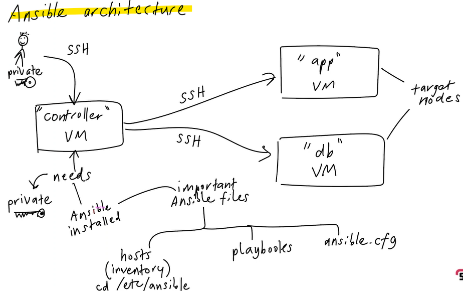

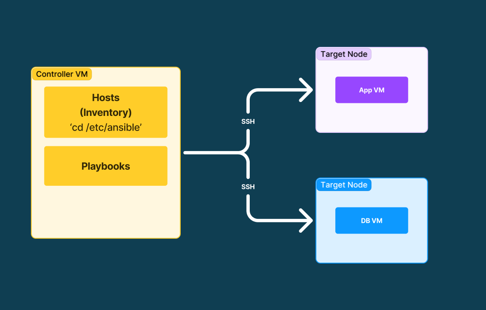

<br>

# Ansible Architecture

* We have the private key in order to SSH into the "controller" VM.
* The "controller" VM will access via SSH to run the commands for whatever it needs to do.
  * In order to SSH in, the "controller" needs the private key to allow access.
* It will SSH into two `target nodes`.
  * One is configured to run the app, the other the database.

## Controller VM Requirements

* Private key
* Ansible installed on it

---

## Important Ansible Files

### Inventory or `hosts` file
  * Located in the `/etc/ansible` directory.
  * Lists the **hosts** and **groups** of hosts that Ansible will manage.
> Defines which machines Ansible will communicate with and apply configurations to.

### Playbooks files
  * Specify multiple **commands** (tasks) to **achieve a desired state**.
  * **Declarative**: you define the state, Ansible handles the rest.
  * YAML files that define the tasks and configurations to be applied to your managed nodes.
  * Can include tasks like installing software, configuring services, and managing files, making it easy to manage complex deployments and configurations.

> Playbooks are the heart of Ansible's automation, allowing you to describe a desired state for your systems and automate the process of achieving that state.

<br>

## Target Nodes

* Target nodes are the **computers or servers** that **Ansible manages**.
* These are the machines where Ansible will **execute** the tasks defined in your playbooks.
* Ansible communicates with these nodes over SSH (for Linux/Unix systems) or WinRM (for Windows systems) to perform the necessary actions.

> In short, Ansible is the conductor, and the target nodes are the orchestra, following the conductor's instructions to perform tasks in harmony.

# Idempotency
Are commands designed for item potency? - No. 

>Idempotency ensures that applying the same configuration multiple times does not change the system state after the first application. 
* This is crucial for maintaining consistency and reliability in automated deployments. 
* Ansible is designed with idempotency in mind, meaning that its modules and playbooks are built to achieve a desired state without causing unintended changes if run repeatedly. 
* This makes Ansible a powerful tool for managing infrastructure as code, ensuring that systems remain in the desired state even after multiple executions of the same playbook.

<br>

## How can I make commands idempotent?
**1. Use Ansible Modules**
* Ansible modules are designed to be idempotent. 
* They check the current state of the system and only make changes if necessary. 
  * For example, the ansible.builtin.apt module will only install a package if it's not already installed.

**2. Check Before Change**
* Before making a change, check the current state. 
  * For example, before creating a directory, check if it already exists:
```yaml
- name: Ensure directory exists
  ansible.builtin.file:
    path: /path/to/directory
    state: directory
```

**3. Use Conditional Statements**
* Use when conditions to ensure tasks are only executed when necessary:

```yaml
- name: Restart service if configuration changed
  ansible.builtin.service:
    name: myservice
    state: restarted
  when: config_changed
```

**4. Use Handlers**
* Handlers are tasks that run only when notified. 
* They help ensure that changes are only applied when necessary:
```yaml
- name: Copy configuration file
  ansible.builtin.copy:
    src: /path/to/source
    dest: /path/to/destination
  notify: Restart myservice

handlers:
  - name: Restart myservice
    ansible.builtin.service:
      name: myservice
      state: restarted
```

**5. Use the creates and removes parameters**
* These parameters ensure that commands are only run if certain conditions are met:
```yaml
- name: Extract archive if not already extracted
  ansible.builtin.command:
    cmd: tar xzf /path/to/archive.tar.gz
    creates: /path/to/extracted
```

<br>

# Basic Ansible Commands
Ansible is a powerful automation tool used to manage and configure systems. Below are some of the basic commands you need to get started with Ansible.

1. Checking Ansible Version

To check the installed version of Ansible:
```yaml
ansible --version
```
2. Ping All Hosts

To verify connectivity to all hosts in your inventory:
```yaml
ansible all -m ping
```
3. Running Ad-Hoc Commands

Ad-hoc commands allow you to run simple tasks without writing a playbook.

Example: Rebooting Hosts
```yaml
ansible all -a "/sbin/reboot"
```
Example: Running a Command
```yaml
ansible all -m command -a "uname -a"
```
4. Managing Users

You can manage users on remote hosts using the user module.

Example: Creating a New User
```yaml
ansible all -m user -a "name=ansible password=<encrypted_password>"
```
Example: Deleting a User
```yamle
ansible all -m user -a "name=ansible state=absent"
```
5. Gathering Facts

To gather information about your hosts:

```yaml
ansible all -m setup
```
6. Running Playbooks

Playbooks are YAML files that define a series of tasks to be executed on your hosts.

Example: Running a Playbook
```yaml
ansible-playbook playbook.yml
```
7. Managing Inventory

Ansible uses an inventory file to manage and organize hosts.

Example: Listing Hosts in Inventory
```yaml
ansible all --list-hosts -i inventory
```
8. Checking Syntax

To check the syntax of a playbook:

```yaml
ansible-playbook playbook.yml --syntax-check
```
9. Dry Run

To perform a dry run (test run) of a playbook:

```yaml
ansible-playbook playbook.yml --check
```
10. Viewing Help

To view help for any Ansible command:

```yaml
ansible <command> --help
```

<br>

# Task: Create EC2 instances for Ansible controller and target node
Create 2 instances on AWS:
* Ansible 'controller' instance:
  * **Name**: tech264-georgia-ubuntu-2204-ansible-controller
  * **Security group**: Allow SSH port
  * **Key pair**: Use the one you usually use for your AWS instances
  * **Image** - Ubuntu Server 22.04 LTS (free tier eligible)
  * Leave it blank - don't run any scripts or user data on it

* Ansible 'target node' instance (will run the app)
  * **Name**: tech264-georgia-ubuntu-2204-ansbile-target-node-app
  * **Security group**: Allow SSH, HTTP, port 3000 (the usual for the app)
  * **Key pair**: Use the one you usually use for your AWS instances (and the same one as you used on the controller)
  * **Image** - Ubuntu Server 22.04 LTS (free tier eligible)
  * Leave it blank - don't run any scripts or user data on it
* Check you can SSH into both machines (preferably do it separate Git Bash).

<br>

## How to establish a secure SSH connection to a remote server

`ssh -i ~/.ssh/tech264-georgia-aws-key.pem ubuntu@ec2-34-253-182-234.eu-west-1.compute.amazonaws.com`

This command is used to establish a secure SSH connection to a remote server. Here's a breakdown of what each part does:
* **ssh**: This is the command to start an SSH (Secure Shell) session.
* **-i ~/.ssh/tech264-georgia-aws-key.pem**: This option specifies the identity file (private key) to use for authentication. 
  * In this case, it's the tech264-georgia-aws-key.pem file located in the ~/.ssh directory.
* **ubuntu@ec2-34-253-182-234.eu-west-1.compute.amazonaws.com**: This specifies the user (ubuntu) and the remote server's address (ec2-34-253-182-234.eu-west-1.compute.amazonaws.com) to connect to.

> This command uses the specified private key to authenticate and connect to the remote server as the ubuntu user.

<br>

## SSH into Controller VM Code-Along

1. Update & upgrade
   * First, update the package lists and upgrade the installed packages to ensure your system is up-to-date.
     * `sudo apt update -y`
     * `sudo DEBIAN_FRONTEND=noninteractive apt upgrade -y`

**Note**: If you encounter a pink screen during the upgrade, press Tab and Enter to continue.

2. Install Ansible
  * Add the Ansible Repository: Use your package manager to add the Ansible repository. 
    * `sudo apt-add-repository ppa:ansible/ansible`
  * Click enter to continue if happy with the output. 
  * Update Package Lists: Update the package lists to include the new Ansible repository.
    * `sudo apt update -y`
  * Install Ansible: Install Ansible using the package manager. 
    * `sudo apt install ansible -y`
  * **Note**: If you encounter a pink screen during the installation, press Tab and Enter to continue.
  * Verify Ansible Installation: Check the installed version of Ansible to ensure it was installed correctly. 
    * `ansible --version`

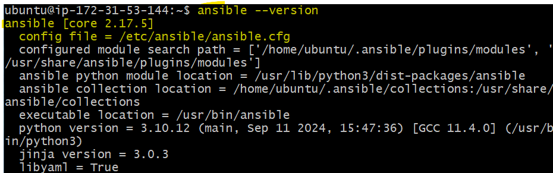

   * Note: The output will also show you the location of the configuration file, which will be useful later.

3. cd into ect folder:
   * Navigate to the Ansible Directory.
   * Change to the Ansible configuration directory to manage your Ansible files.
     * `cd /etc/ansible`

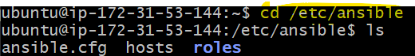

<br>

4. Needs the private aws key
  * This will match the public key that's on AWS.
  * cd to home directory: `cd` on your controller Git Bash window. 
  * cd into '.ssh' folder. This is where we'll put our private key.

5. Transfer the Private Key from Local Machine to Controller
   * Open new Gitbash window on Local Machine.
   * cd in .ssh folder to view your keys. 
   * Find the private key you've been using with AWS, (ends in .pem).
   * Use the command `cat "key-name.pem"` to print the key. 
   * Go back to your "Controller" Git Bash Window and create a nano file:
     * `nano tech264-georgia-aws-key.pem`
     * and paste in the text printed out after you did the 'cat' command in the Git bash window.
     * Ctrl+S, Ctrl+X.
     * `ls` to check if your key is present. 

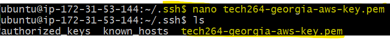

* check the first line if its saved: `head -1 tech264-georgia-aws-key.pem`
* check permissions: `ls -l`

<br>

6. Within your .ssh folder, run the chmod command
   * `chmod 400 "tech264-georgia-aws-key.pem"`

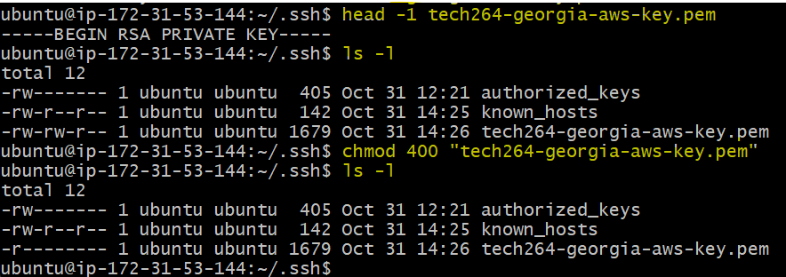

<br> 

7. Using the Ping Module.
   * To check if your ansible controller can commiunicate with a device specifieed in your hosts file, (within the subgroups). 
   * cd into /etc/ansible/
   * `sudo nano hosts`: so we have the correct permissions to nano the file. 

8. Edit nano file:
  * insert '[web]' at the top of the page.
  * Find the public IP of the "target-node" VM: (e.g.) 18.203.156.215
   * `ansible all -m ping`
  * Authenticity: permission denied (publickey), we need to tell it what key to use. 
   * `sudo nano hosts`.

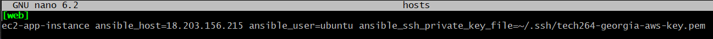

```yaml
[web]
ec2-app-instance ansible_host=18.203.156.215 ansible_user=ubuntu ansible_ssh_private_key_file=~/.ssh/tech264-georgia-aws-key.pem
```
* `ansible all -m ping`

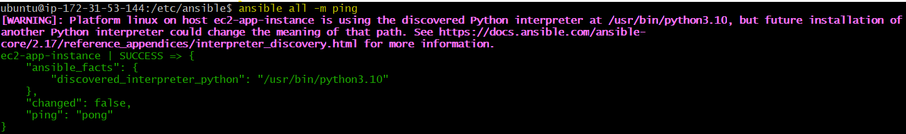

<br>

9. Organise your hosts file. 
   * Why having a group of machines is beneficial. 
   * `ansible web -m ping`: this will communicate with just the devices in your '[web]' group. 

e.g., if you want to have groups, inside of groups.
* sudo nano hosts
* Add a new "group" below [web]: e.g., [db]
* Add a comment: e.g., "# specify the db servers here".
* Specify the name of the parent group: [test:children]
* 'web' and 'db' are the subgroups.

Example:

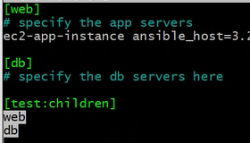

<br>

* `ansible-inventory --graph`

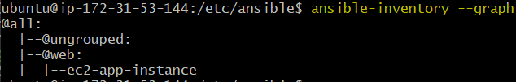

<br>

* A single command is called an ad-hoc command.
* Within the "", you specify what you want: `ansible web -a ""`
* `ansible web -a "uname -a"`

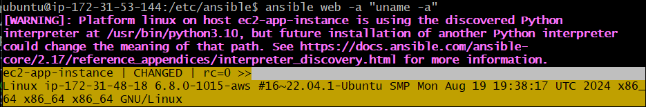

* `ansible web -a "date"`

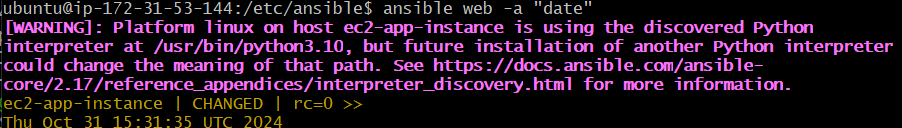

<br>

# Adhoc Documentation
Adhoc Documentation: https://docs.ansible.com/ansible/latest/command_guide/intro_adhoc.html

## What is an adhoc?
* Ansible ad-hoc commands are simple, one-time tasks that you can run directly from the command line without writing a playbook. 
* They are useful for quick, on-the-fly operations, such as checking the status of a service, copying files, or managing packages on remote nodes.

### Key Points
* **Quick Execution**: Ad-hoc commands are designed for immediate execution, making them ideal for tasks that don't require the complexity of a full playbook.
* **Syntax**: The basic syntax for an ad-hoc command is:
```yaml
ansible <host-pattern> -m <module> -a "<arguments>"
```
* **Modules**: You can use any Ansible module in an ad-hoc command. For example, to install a package:
```yaml
ansible all -m apt -a "name=nginx state=present"
```
* **Target Hosts**: You specify the target hosts using a host pattern, which can be a group of hosts defined in your inventory file or a specific host.

### Benefits
* **Efficiency**: Quickly perform tasks without the need to write and save a playbook.
* **Flexibility**: Easily manage and troubleshoot systems with minimal setup.
* **Convenience**: Ideal for one-off tasks or testing commands before incorporating them into a playbook.

<br>

### Adhock Command
* An ad hoc task can harness the power of Ansible and SCP to transfer many files to multiple machines in parallel. To transfer a file directly to all servers in the [web] group.

```yaml
$ ansible web -m ansible.builtin.copy -a "src=/etc/hosts dest=/tmp/hosts"
```

<br>

# Create a test.txt file
* cd into home directoory `cd`.
* `echo "hello. I'm a test file." > test.txt
* cat test.txt : this is to print the file.
* `ls` to chekc the file is there.


<br>

# How to Create a Playbook
We want this playbook to install nginx an make sure it's in a desired state by the time ansible is finished iwth this playbook.

* `cd /etc/ansible/`
* `pwd` to check you're in your ansible directory. Output: /etc/ansible
* `sudo nano install_nginx.ysml`: this will be the file name.
* Be weary of your indents!

```yaml
# starts with --- (three hyphens)
---

# name of the play(book)
- name: install nginx play
  # where (on which devices) do we want to run this playbook
  hosts: web

  # get comprehensive facts on the hosts ('no' to speed things up)
  gather_facts: yes

  # do we need to provide admin access - use sudo
  become: true

  # instructions "tasks" (tasks of the play)
  # task - install nginx on the target node
  tasks:
  - name: install and configure nginx
    # use package 'nginx', 'state=present' means we need it running
    apt: pkg=nginx state=present

# ends with ... (three dots) to say it's the end of the file
```

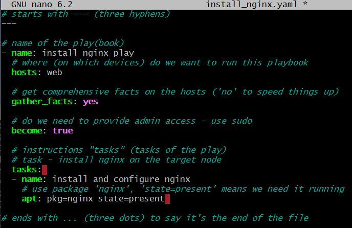

* `ansible-playbook install_nginx.yaml`: get it to start the tasks. 

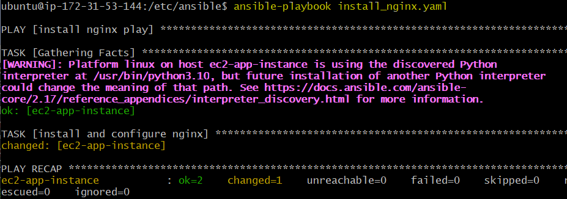

<br>

* Go to other window and check it's status.
  * `sudo systemctl status nginx`

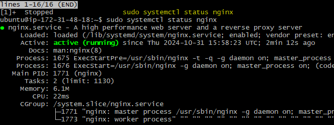

<br>

# Task: Consolidate adhoc commands
1. Use adhoc command to copy the private key (see note below) on AWS from controller to target node node
   * cd into home directory
```yaml
ansible ec2-app-instance -m ansible.builtin.copy -a "src=~/.ssh/tech264-georgia-aws-key.pem dest=/home/ubuntu/.ssh/tech264-georgia-aws-key.pem mode=0400"
```
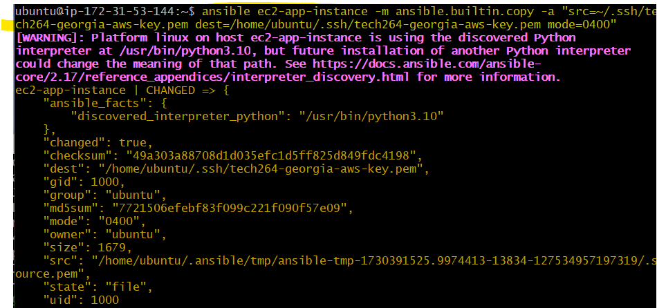

* Go to other terminal window (of the target node).
* cd into .ssh folder.
* `ls` to check if your key has transfered.

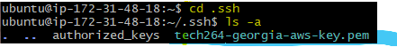

<br>

## Task: Work out the command to use to copy test.txt to your target node
* `cd /etc/ansible/`
* `pwd` to check you're in your ansible directory. Output: /etc/ansible.
* sudo nano testtxt.yaml
```yaml
---
- name: copy test.txt to target node
  hosts: all
  tasks:
    - name: copy test.txt
      ansible.builtin.copy:
        src: ~/test.txt
        dest: ~/test.txt
```

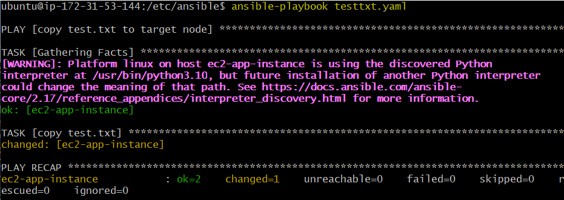

<br>

# Task: Create playbook to provision app VM
Stage 1
* Create a new playbook called prov_app_with_npm_start.yml to install nodejs on the target node

The playbook should:
* install NodeJS
* copy the 'app' folder to the target node
* navigate to the app folder and do npm install and npm start

Once it works, share your IP address in the chat (specify in message you used "npm start").

**Hint**: Try to use modules rather than commands in Playbooks. Modules ensure idempotency, so will only perform the action on the target host if it's needed.

Stage 2
* Make an updated version of prov_app_with_npm_start.yml named prov_app_with_pm2.yml (or similar)
* Go back to controller node and add the command to run npm in the background
  * The goal is to configure and launch the app using the this playbook
  * Allow port 3000

Once it works, share your IP address in the chat (specify in message you used "pm2")
Deliver link to documentation around COB

<br>

## SSH into Target-node-app VM: Code-Along

1.  Update & upgrade:
  * `sudo apt update -y`
  * `sudo DEBIAN_FRONTEND=noninteractive apt upgrade -y`
  * Tab+Enter if you get a pink screen.

<br>

## Stage 1: Playbook to install nodejs on the target node
* Create a new playbook called prov_app_with_npm_start.yml to install nodejs on the target node

The playbook should:
* install NodeJS
* copy the 'app' folder to the target node
* navigate to the app folder and do npm install and npm start
 
<br>

### Controller Bash Window
* `cd /etc/ansible/`
* `pwd` to check you're in your ansible directory. Output: /etc/ansible.
* `sudo nano prov_app_with_npm_start.yml`
* `ansible-playbook prov_app_with_npm_start.yml`

Notes:
* You don't need to install npm seperately as it comes as a part of the nodejs package. 

```yaml
---
- name: prov_app_with_npm_start.yml
  hosts: web
  gather_facts: yes
  become: true

  vars:
    app_source_path: "/home/{{ ansible_user }}/app"
    app_dest_path: "/home/{{ ansible_user }}/app/app"

  tasks:

    # Add the GPG key for the NodeSource repository
    - name: Install curl (required to add NodeSource repository)
      ansible.builtin.apt:
        update_cache: yes
        name: curl
        state: present

    - name: Add NodeSource repository for Node.js 20
      ansible.builtin.shell:
        curl -fsSL https://deb.nodesource.com/setup_20.x | sudo -E bash -

    # Install Node.js on the target node
    - name: Install Node.js on the target node
      ansible.builtin.package:
        name: nodejs
        state: present

    # Clone the app repository to the control node
    - name: Clone the app repository to the control node
      delegate_to: localhost
      ansible.builtin.git:
        repo: 'https://github.com/GP-Stanley/tech264-sparta-app'
        dest: "{{ app_source_path }}"
        version: main
      tags: clone_app

    # Copy app folder to the target node
    - name: Copy app folder to target node
      ansible.builtin.copy:
        src: "{{ app_source_path }}/"
        dest: "{{ app_dest_path }}"
        mode: '0755'
      tags: copy_app

    # Install npm dependencies within the app folder
    - name: Install npm dependencies in the app folder
      community.general.npm:
        path: "{{ app_dest_path }}"
      tags: install_dependencies

    # Start the application using npm start in the app folder
    - name: Start the application with npm start
      ansible.builtin.shell:
        cmd: npm start
        chdir: "{{ app_dest_path }}"
```

* Grab the public IP for the target-node VM and paste it into your web terminal.
* You should get the nginx page.
* add ':3000' on to the end to display the working Sparta app page. 

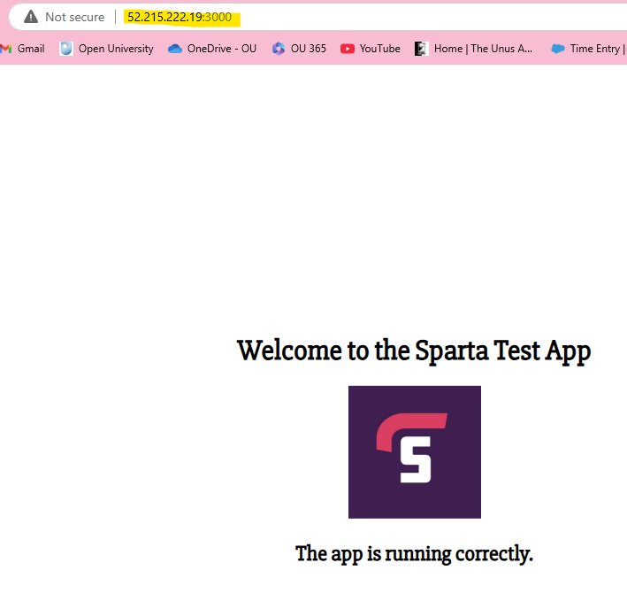

<br>

## Stage 2: Add run npm in the background (pm2)
* Make an updated version of prov_app_with_npm_start.yml named prov_app_with_pm2.yml (or similar)
* Go back to controller node and add the command to run npm in the background
  * The goal is to configure and launch the app using the this playbook
  * Allow port 3000

Remember:
* You may have to `sudo kill -9 <PID>` if you've preoccupied port :3000 from the other task. 
* Remove: npm start command. If you don't, the task will stay with this task and never move onto the pm2 start task. 
* Add "install pm2 globally" code block before you clone your app.
```yaml
# Install pm2 globally
    - name: Install PM2 globally
      ansible.builtin.npm:
        name: pm2
        global: true
        state: present
```

* Add "start the node.js app with PM2" code block at the very end. 
```yaml
    # Start the node.js app with PM2
    - name: Start the node.js app
      ansible.builtin.shell:
        cmd: pm2 start app.js
        chdir: "{{ app_dest_path }}"
```

Final script: 

```yaml
---
- name: prov_app_with_npm_start.yml
  hosts: web
  gather_facts: yes
  become: true

  vars:
    app_source_path: "/home/{{ ansible_user }}/app"
    app_dest_path: "/home/{{ ansible_user }}/app/app"

  tasks:

    # Add the GPG key for the NodeSource repository
    - name: Install curl (required to add NodeSource repository)
      ansible.builtin.apt:
        update_cache: yes
        name: curl
        state: present

    - name: Add NodeSource repository for Node.js 20
      ansible.builtin.shell:
        curl -fsSL https://deb.nodesource.com/setup_20.x | sudo -E bash -

    # Install Node.js on the target node
    - name: Install Node.js on the target node
      ansible.builtin.package:
        name: nodejs
        state: present

    # Install pm2 globally
    - name: Install PM2 globally
      ansible.builtin.npm:
        name: pm2
        global: true
        state: present

    # Clone the app repository to the control node
    - name: Clone the app repository to the control node
      delegate_to: localhost
      ansible.builtin.git:
        repo: 'https://github.com/GP-Stanley/tech264-sparta-app'
        dest: "{{ app_source_path }}"
        version: main
      tags: clone_app

    # Copy app folder to the target node
    - name: Copy app folder to target node
      ansible.builtin.copy:
        src: "{{ app_source_path }}/"
        dest: "{{ app_dest_path }}"
        mode: '0755'
      tags: copy_app

    # Install npm dependencies within the app folder
    - name: Install npm dependencies in the app folder
      community.general.npm:
        path: "{{ app_dest_path }}"
      tags: install_dependencies

    # Stop pm2 processes
    - name: Stop all processes running on pm2
      ansible.builtin.shell:
        cmd: pm2 stop all
        chdir: /home/ubuntu/app/app
      ignore_errors: yes
      tags: pm2_stop

    # Start the node.js app with PM2
    - name: Start the node.js app
      ansible.builtin.shell:
        cmd: pm2 start app.js
        chdir: "{{ app_dest_path }}"
```

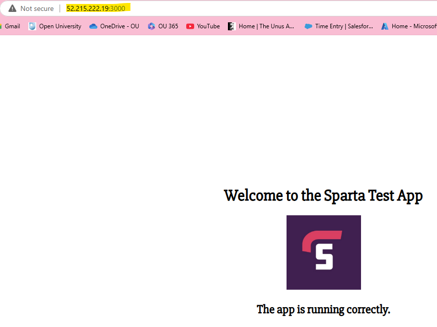

<br>

## Optional: Identifying the contents of the default file for nginx
* Go to your target node VM on Gitbash terminal. 
* `cd /etc/nginx/sites-available`
* Use 'ls': you should see default.
* `nano default`: to edit what's inside.

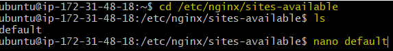

<br>

## If you need to start the VMs back up after stopping the instance
* cd etc/ansible
* sudo nano hosts
* edit IPs for app and db VM to match the new ones after re-boot. 

<br>

# Create the database VM (another Ansible node)
Create the database VM on AWS
  * **Name**: tech264-georgia-ubuntu-2204-ansible-target-node-db
  * **Size**: t2.micro as usual
  * **Security group**: Same as usual for database

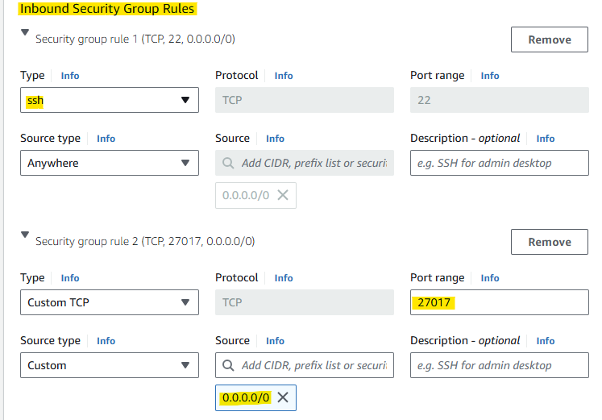

  * **Key pair**: Use the one you usually use for your AWS instances
  * **Image** - Ubuntu Server 22.04 LTS (free tier eligible) (should be in default list)
  * Leave it blank - don't run any scripts or user data on it.

* Make sure you SSH into the database VM from the controller
* Reconfigure hosts with new IPs
  * `cd /etc/ansible`
  * `sudo nano`

* In your hosts file, make a new group for database VM called db
  * Give your app and database VMs different names

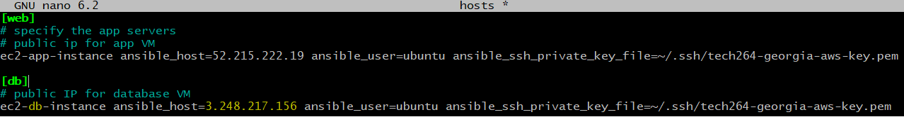

* Do a ping command to get a pong response from both agents - paste your response in the chat.
  * `ansible db -m ping`
  * give it permission with 'yes'.

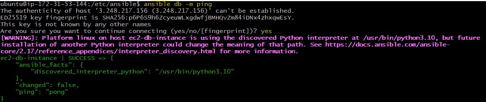

```yaml
ec2-db-instance | SUCCESS => {
    "ansible_facts": {
        "discovered_interpreter_python": "/usr/bin/python3.10"
    },
    "changed": false,
    "ping": "pong"
}
```

* ssh into database vm normally through AWS.
  * `ssh -i "tech264-georgia-aws-key.pem" ubuntu@ec2-3-248-217-156.eu-west-1.compute.amazonaws.com`
  * give it permissions: 'yes'.

<br>

## On the database VM bash window

1.  Update & upgrade:
  * `sudo apt update -y`
  * `sudo DEBIAN_FRONTEND=noninteractive apt upgrade -y`
  * Tab+Enter if you get a pink screen.

<br>

## Set up db VM from ansible controller: create a playbook
* go to controller window
* go to etc/ansible
* sudo nano install_mongodb.yml
* Write your script

```yaml
# playbook to install mongodb in database VM
---

# where to install the db
- hosts: db

  gather_facts: yes

  become: true

  tasks:

  # download the key
  - name: Import the MongoDB public key
    ansible.builtin.apt_key:
      url: https://www.mongodb.org/static/pgp/server-7.0.asc
      state: present

  # Add mongodb repo
  - name: Add the MongoDB repository
    ansible.builtin.apt_repository:
      repo: "deb [ arch=amd64,arm64 ] https://repo.mongodb.org/apt/ubuntu {{ ansible_distribution_release }}/mongodb-org/7.0 multiverse"
      state: present
      update_cache: yes

  # install mongodb
  - name: Install MongoDB 7.0.6
    ansible.builtin.apt:
      name: mongodb-org=7.0.6
      state: present
      update_cache: yes
```
* Start your script: `ansible-playbook install_mongodb.yml`

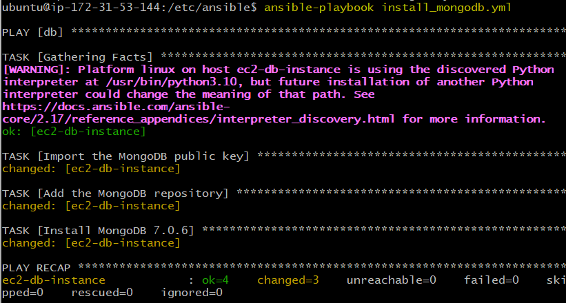

* check if its running:
  * `ansible db -a "sudo systemctl status mongod"`
  * this will look for the db. 

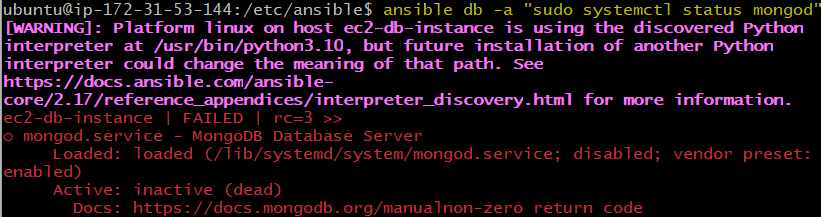

* go to the db VM bash window and run the command.
  * `sudo systemctl status mongod` to check if it's running. 
    * it's not. 

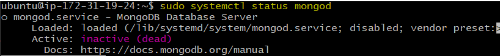

* add a code block to enable mongodb at  the end of your script
```yaml
- name: Ensure MongoDB is enabled and started 
  ansible.builtin.systemd: 
    name: mongod 
    enabled: yes 
    state: started
```

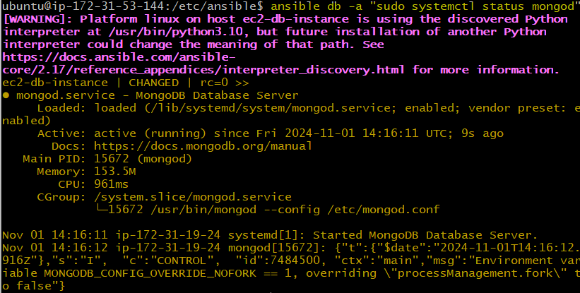

* You can double check on the database VM terminal window.
  * `sudo systemctl status mongod`

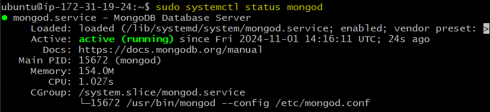

<br>

# Task: Create playbooks to provision the app and database
Create a new playbook named prov-db.yml. This playbook should to do install/configure the database on the database VM:
* Install Mongo DB v7.0.6 and troubleshoot why it is not running.
* Suggestion: service module
  * > It only checks if it's been installed, it does not enable it. 
  * > "State: present" can also mean that it's just present, installed - not necessarily running.
  * > This can depend on the default from package to package.

* Allow connections to database from 127.0.0.1 to 0.0.0.0
  * edit mongod.conf file in the database VM bash terminal. 
  * command: `sudo nano /etc/mongod.conf`

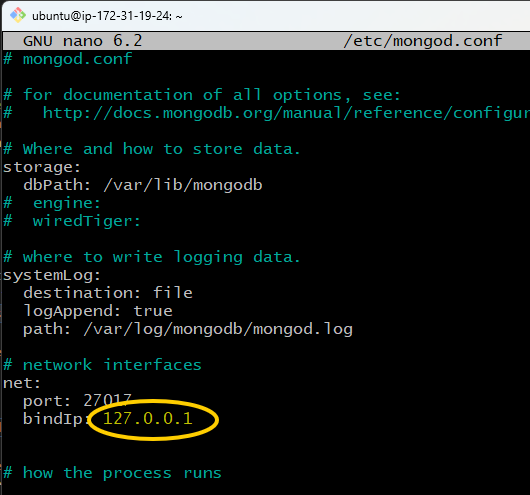

* You can change '127.0.0.1' to: 0.0.0.0
* Ctrl+S, Ctrl+X
* Go back to the controller terminal and try running the db script again.
  * `ansible-playbook prov-db.yml`

* You can also do it within your provision script/ playbook:
```yaml
    # modify MongoDB configuration to allow remote connections
    - name: Configure MongoDB to allow remote connections
      ansible.builtin.lineinfile:
        path: /etc/mongod.conf
        regexp: '^  bindIp:.*'
        line: '  bindIp: 0.0.0.0'
        state: present
```

<br>

* Restart and enable Mongo DB
* From the Ansible controller, run adhoc commands to:
  * Check the status of the database to make sure it's running
    * `ansible db -m service -a "name=mongod state=started" -b`
  * Check the bindIp has been configured
    * `ansible db -m shell -a "grep 'bindIp' /etc/mongod.conf" -b`

# Create prov-db.yml 
* On the controller bash window
* `cd /etc/ansible`
* `sudo nano prov-db.yml`
* Test the script: `ansible-playbook prov-db.yml`

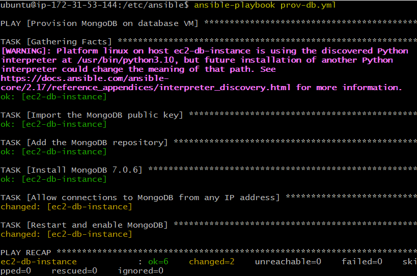

```yaml
---
# Playbook to install and configure MongoDB on the database VM
- name: Provision MongoDB on database VM
  hosts: db
  gather_facts: yes
  become: true
  tasks:
    # Import the MongoDB public key
    - name: Import the MongoDB public key
      ansible.builtin.apt_key:
        url: https://www.mongodb.org/static/pgp/server-7.0.asc
        state: present

    # Add the MongoDB repository
    - name: Add the MongoDB repository
      ansible.builtin.apt_repository:
        repo: "deb [ arch=amd64,arm64 ] https://repo.mongodb.org/apt/ubuntu {{ ansible_distribution_release }}/mongodb-org/7.0 multiverse"
        state: present
        update_cache: yes

    # Install MongoDB 7.0.6
    - name: Install MongoDB 7.0.6
      ansible.builtin.apt:
        name: mongodb-org=7.0.6
        state: present
        update_cache: yes

    # modify MongoDB configuration to allow remote connections
    - name: Configure MongoDB to allow remote connections
      ansible.builtin.lineinfile:
        path: /etc/mongod.conf
        regexp: '^  bindIp:.*'
        line: '  bindIp: 0.0.0.0'
        state: present

    # Restart and enable MongoDB
    - name: Restart and enable MongoDB
      ansible.builtin.systemd:
        name: mongod
        enabled: yes
        state: started
```
<br>

## From the Ansible controller, run adhoc commands to:
* Check the status of the database to make sure it's running.
  * `ansible db -a "sudo systemctl status mongod"`

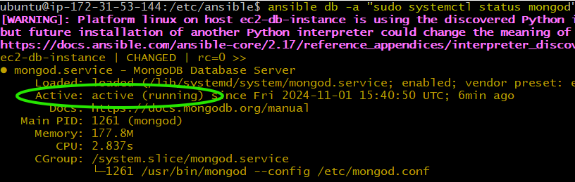

* Go to database VM bash window and check the status of mongodb.
  * `sudo systemctl status mongod`

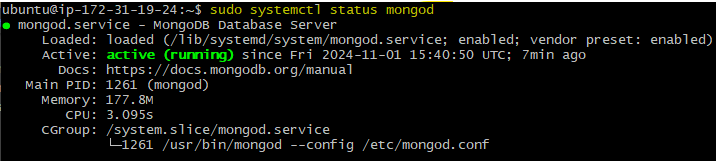

* Check the bindIp has been configured.
  * `ansible db -m ansible.builtin.command -a "grep bindIp /etc/mongod.conf"`

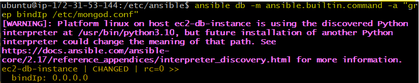

<br>

# Create env var DB_HOST
On the app VM, manually create an env var DB_HOST, check it's been created, restart the app.
* Go to the app VM bash terminal window.
* To create a env: `export DB_HOST=mongodb://172.31.19.24:27017/posts`
  * I've used the private IP address of the database VM. 
* head to your home directory with `cd`.
* cd into your app folder and `npm start`.  

> ERROR: The error message MongooseServerSelectionError: connect ECONNREFUSED 172.31.19.24:27017 indicates that your application is unable to connect to the MongoDB server at the specified IP address and port. This typically happens when the MongoDB server is not running, the IP address or port is incorrect, or there are network issues preventing the connection.
>
> Aka: we need to put it into our script, not do it manually.

## Create env var DB_HOST in your prov-db.yml script
* Navigate to your prov-db.yml script.
* Have your DB_HOST env to hand: 'DB_HOST=mongodb://172.31.19.24:27017/posts' 
* Add this code block to the end of the file.

```yaml
    # Set DB_HOST environment variable on the app VM 
    - name: Set DB_HOST environment variable 
      ansible.builtin.lineinfile: 
        path: /etc/environment 
        line: 'DB_HOST=mongodb://172.31.19.24:27017/posts' 
        state: present

    # Restart the app 
    - name: Restart the app 
      ansible.builtin.shell: 
        cmd: npm start 
        chdir: /home/ubuntu/app/app
      become: true
```

<br>

# Create prov-app.yml script
* In your app playbook, create an environment variable, then start app in the background
  * One way to access the environment variable within your playbook is to use your playboook to make it persistent
* Add the prov-db.yml to one playbook called prov-app-all.yml so you can run one playbook to configure/provision the app and database VMs (agents)
* Test the playbook runs without errors and the app and /posts page work
  * Deliverable 1: Paste link to your working /posts page in the main chat with the message "/posts working using one playbook to configure app + db"

Added this into the app script: 
```yaml
    # Set DB_HOST environment variable 
    - name: Set DB_HOST environment variable 
      ansible.builtin.lineinfile: 
        path: /etc/environment 
        line: 'DB_HOST=mongodb://172.31.19.24:27017/posts' 
        state: present

    # Source the environment variables 
    - name: Source environment variables 
      ansible.builtin.shell: source /etc/environment
```

<br>

# Rebooting VMs on AWS
* SSH into all three using seperate Git Bash terminals.
  * Organise them so you can remember which is where.

On the Controller terminal:
* Check your IP addressed are correct.
  * `cd /etc/ansible`
  * `sudo nano hosts`
  * Edit the IP for the [web] and [bd] groups to match the IPs on AWS.
* Check your DB_HOST env variable.
  * Check the IP is the same as the private IP of the db VM.
  * Navigate to your prov-db.yml script on the controller bash window. 
    * `cd /etc/ansible`
    * `sudo nano prov-db.yml`
*  Check the IP is the same within your prov-app.yaml playbook.
  * Navigate to your prov-app.yml script on the controller bash window. 
    * `cd /etc/ansible`
    * `sudo nano prov_app_with_npm_start.yml`

Check the app and db instance are listening
* `ansible all -m ping`
* You may need to type 'yes' to the fingerprint twice to give it permission. 

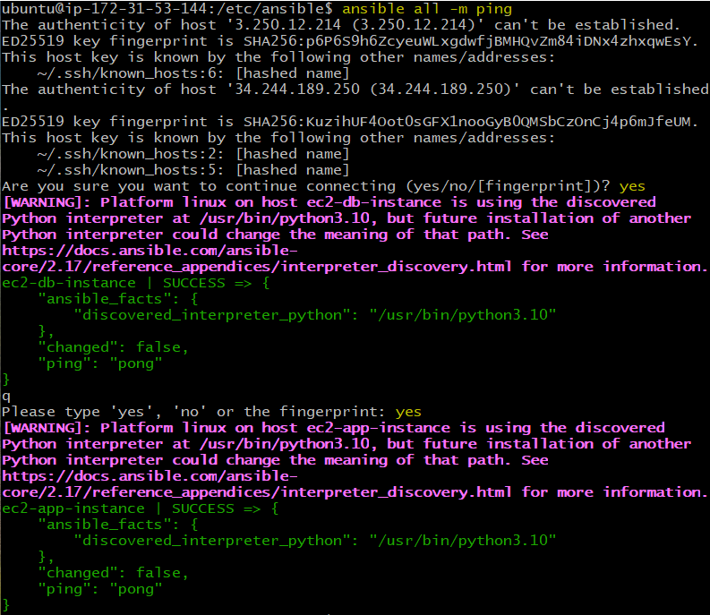

Check your DB_HOST variable
* `echo $DB_HOST` on the target-node app VM.

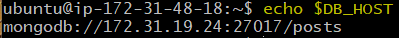

Run the master playbook
* Make sure you're in the controller terminal. 
  * `cd /etc/ansible`
* `ansible-playbook prov-app-all.yml`

/posts page is working but the database needs seeding
* We need to seed the database which will import data from a JSON file into MongoDB.
  * `cd /etc/ansible`
  * `sudo nano prov-db.yml`
  * At the end of your prov-db.yml playbook.

```yaml
    - name: Seed the MongoDB database 
      ansible.builtin.command: 
        cmd: node seeds/seed.js 
      args: 
        chdir: /home/{{ ansible_user }}/app/seeds/seed.json
```

WHEN YOU HAVE TIME:
* Removing the seeds should be within your app playbook. This is the code block you should try. Make sure to remove the code block present in the database playbook.

```yaml
   # Seed the database
    - name: Seed the MongoDB database
      ansible.builtin.command:
        cmd: node seeds/seed.js
      args:
        chdir: /home/{{ ansible_user }}/app
```

<br>

# Test on two NEW target nodes: app & db
Same naming convention:
* tech264-georgia-ubuntu-2204-ansbile-target-node-db
* tech264-georgia-ubuntu-2204-ansbile-target-node-app

Create 2 instances on AWS:
* Create the database VM on AWS
  * **Name**: tech264-georgia-ubuntu-2204-ansible-new-target-node-db
  * **Size**: t2.micro as usual
  * **Security group**: Same as usual for database
    * ssh, 27017: 0.0.0.0/0


  * **Key pair**: Use the one you usually use for your AWS instances
  * **Image** - Ubuntu Server 22.04 LTS (free tier eligible) (should be in default list)
  * Leave it blank - don't run any scripts or user data on it.

* Ansible 'target node' instance (will run the app)
  * **Name**: tech264-georgia-ubuntu-2204-ansbile-new-target-node-app
  * **Security group**: Allow SSH, HTTP, port 3000 (the usual for the app)
  * **Key pair**: Use the one you usually use for your AWS instances (and the same one as you used on the controller)
  * **Image** - Ubuntu Server 22.04 LTS (free tier eligible)
  * Leave it blank - don't run any scripts or user data on it
* Check you can SSH into both machines (preferably do it separate Git Bash).

<br>

* SSH into new app and db target nodes in seperate terminals.
* Edit the IP for the [web] and [bd] groups to match the IPs on AWS.  
  * cd /etc/ansible
  * `sudo nano hosts`
* database public ip: 108.129.172.158
* app public ip: 108.129.131.254

* Check your DB_HOST env variable.
  * Check the IP is the same as the private IP of the db VM.
  * Navigate to your prov-db.yml script on the controller bash window. 
    * `cd /etc/ansible`
    * `sudo nano prov-db.yml`
*  Check the IP is the same within your prov-app.yaml playbook. New IP: 172.31.31.214
  * Navigate to your prov-app.yml script on the controller bash window. 
    * `cd /etc/ansible`
    * `sudo nano prov_app_with_npm_start.yml`

Check the app and db instance are listening on the controller node. 
* `ansible all -m ping`
* You may need to type 'yes' to the fingerprint twice to give it permission. 

Check your DB_HOST variable
* `echo $DB_HOST` on the target-node app VM.
* `export DB_HOST=mongodb://172.31.31.214:27017/posts`
* `echo $DB_HOST` on the target-node app VM.

Install nginx
* Add this playbook to the beginning of the master playbook.
  * `sudo nano prov-app-all.yml`
  * import_playbook: install_nginx.yaml: place this at the top of the playbook. 

Run the master playbook
* Navigate to cd /etc/ansible
* `ansible-playbook prov-app-all.yml`: to run both playbooks.

<br> 