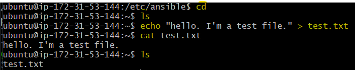

- [What is Ansible and How Does It Work?](#what-is-ansible-and-how-does-it-work)
  - [How Does Ansible Work?](#how-does-ansible-work)
  - [Key Features of Ansible](#key-features-of-ansible)
    - [Example Use Cases:](#example-use-cases)
  - [Key Features of Ansible Playbooks](#key-features-of-ansible-playbooks)
      - [Declarative Syntax](#declarative-syntax)
      - [Tasks and Plays](#tasks-and-plays)
      - [Modules](#modules)
      - [Idempotency](#idempotency)
  - [How Ansible Playbooks Work](#how-ansible-playbooks-work)
  - [Ansible Controller (Control Node)](#ansible-controller-control-node)
    - [Role of the Controller:](#role-of-the-controller)
    - [Key Functions:](#key-functions)
- [Who is Using IaC and Ansible in the Industry?](#who-is-using-iac-and-ansible-in-the-industry)
- [What is Ansible?](#what-is-ansible)
- [A Push Tool](#a-push-tool)
- [Agent-less](#agent-less)
- [Ramon's Diagram: Ansible Architecture](#ramons-diagram-ansible-architecture)
- [Ansible Architecture](#ansible-architecture)
- [Task: Create EC2 instances for Ansible controller and target node](#task-create-ec2-instances-for-ansible-controller-and-target-node)
- [SSH into Controller (144) VM Code-Along](#ssh-into-controller-144-vm-code-along)
- [Create a test.txt file](#create-a-testtxt-file)
- [How to Create a Playbook](#how-to-create-a-playbook)
- [Go to other window ?????????](#go-to-other-window-)
- [Adhock](#adhock)
- [Task Consolidate adhoc commands](#task-consolidate-adhoc-commands)
- [Task: Work out the command to use to copy test.txt to your target node](#task-work-out-the-command-to-use-to-copy-testtxt-to-your-target-node)
- [SSH into Target-node-app (18) VM Code-Along](#ssh-into-target-node-app-18-vm-code-along)
- [Task: Create playbook to provision app VM](#task-create-playbook-to-provision-app-vm)
- [Stage 1](#stage-1)
  - [Controller Bash Window (144)](#controller-bash-window-144)

<br>

# What is Ansible and How Does It Work?
* Ansible is an **open-source tool** used for **IT automation**, including **configuration management**, **application deployment**, and **task automation**. 
* It works by **connecting to your nodes** (servers, devices, etc.) and **pushing out small programs** called “Ansible modules” **to perform tasks**. 
  * These modules are executed over SSH, and the results are returned to the Ansible server.
* An Ansible playbook is a file written in YAML (Yet Another Markup Language) that defines a series of tasks to be executed on your managed nodes (servers, devices, etc.). 
  * Playbooks are used to automate and manage configurations, deployments, and other IT tasks.

<br>

## How Does Ansible Work?
1. **Connecting to Nodes**
   * Ansible connects to your nodes (which can be servers, devices, or any other infrastructure components) using SSH (Secure Shell). 
   * This means you don’t need to install any special software on the nodes themselves.
2. **Pushing Ansible Modules**
   * Ansible uses small programs called “modules” to perform tasks. 
   * These modules are pushed out to the nodes from the Ansible server (also known as the control node).
3. **Executing Modules**
   * The modules are executed on the nodes over SSH. This means Ansible can run commands and scripts on the nodes to perform the required tasks.
4. **Returning Results**
   * After executing the modules, the results are sent back to the Ansible server. 
   * This allows you to see what changes were made and if there were any issues.

<br>

## Key Features of Ansible
* **Agentless**: Unlike some other tools, Ansible doesn’t require any agents to be installed on the nodes. 
  * It uses SSH for communication, which simplifies the setup and reduces overhead.
* **Declarative Language**: Ansible uses a simple, human-readable language called YAML (Yet Another Markup Language) to define automation tasks. 
  * This makes it easy to write and understand the automation scripts.
* **Idempotent**: Ansible ensures that running the same task multiple times will produce the same result. 
  * This means you can safely re-run your automation scripts without worrying about unintended changes.

### Example Use Cases:
* **Provisioning**: Setting up new servers and configuring them with the necessary software and settings.
* **Configuration Management**: Ensuring that all servers have the same configuration and are up-to-date.
* **Application Deployment**: Automating the deployment of applications to different environments (development, testing, production).
* **Orchestration**: Coordinating complex workflows and processes across multiple systems.

<br>

## Key Features of Ansible Playbooks
#### Declarative Syntax
* Playbooks use a simple, human-readable syntax in YAML, making them easy to write and understand.

#### Tasks and Plays
* A playbook consists of one or more “plays.” Each play maps a group of hosts to a set of tasks.
* Tasks are the individual actions that Ansible performs, such as installing a package, starting a service, or copying a file.

#### Modules
* Tasks in a playbook use Ansible modules, which are small programs that perform specific actions. 
  * For example, the yum module can install packages on a Red Hat-based system.

#### Idempotency
* Playbooks are designed to be idempotent, meaning that running the same playbook multiple times will produce the same result without causing unintended changes.

## How Ansible Playbooks Work
1. **Define the Playbook**
   * You write a playbook in YAML, specifying the hosts to target and the tasks to perform.

2. **Execute the Playbook**
   * You run the playbook using the ansible-playbook command. 
   * Ansible connects to the specified hosts over SSH and executes the tasks in the order they are written.

3. **Modules Execution**
   * Each task calls an Ansible module, which performs the specified action on the target hosts. The results are then returned to the Ansible server.

<br>

## Ansible Controller (Control Node)
*  The **controller** (also known as the control node) is the **machine where Ansible is installed** and **from** which you **run your automation tasks**. 

### Role of the Controller:
* The controller is the central point from which you manage your infrastructure.
* It runs the Ansible commands and playbooks, connecting to your managed nodes (servers, devices, etc.) over SSH.

### Key Functions:
* **Executing Playbooks**
  * The controller reads and executes the playbooks you write, sending tasks to the managed nodes.

* **Managing Inventory**
  * The controller maintains an inventory of the nodes it manages. 
  * This inventory can be a simple text file listing the nodes or a more dynamic source like a cloud provider’s API.

* **Connecting to Nodes**
  * The controller uses SSH to connect to the managed nodes. 
  * This means you don’t need to install any special software on the nodes themselves.

* **Running Modules**
  * The controller sends small programs called modules to the nodes to perform specific tasks. 
  * These modules are executed on the nodes, and the results are sent back to the controller.

<br>

# Who is Using IaC and Ansible in the Industry?
* **Tech giants** like Google, Amazon, and Microsoft for managing their vast cloud infrastructures.
* **Financial institutions** for ensuring secure and consistent environments.
* **Healthcare** providers for managing sensitive data and compliance.
* **Startups** for quickly scaling their infrastructure as they grow.

<br> 

<br>

# What is Ansible?
* Ansible is a tool that helps you automate tasks on your computer systems. 
* Think of it as a way to write instructions (called "playbooks") that tell your computers what to do, like installing software or configuring settings, without having to do it manually on each machine. 
* It's especially useful for managing many computers at once, making your work faster and more consistent.

<br>

# A Push Tool
* It pushes configurations from a central control machine to the nodes (servers) you want to manage. 
* It doesn't require any agents to be installed on the nodes, making it simpler and more efficient for managing multiple systems

# Agent-less
* it doesn't require any software (agents) to be installed on the machines it manages. 
* Instead, it uses SSH (for Linux/Unix systems) or WinRM (for Windows systems) to communicate with and configure the target machines. 
* This makes it simpler to set up and maintain.

<br>

# Ramon's Diagram: Ansible Architecture


<br>

# Ansible Architecture
* We have the private key in order to SSH into the "controller" VM. 
* We have our "controller" VM which is going to access via SSH to run the commands for whatever it needs to do.
  * In order to SSH in, the "controller" is going to need the private key to allow access. 
* It's going to SSH into two: `target nodes`.
  * This is because one of them is configured to run the app, the other the database. 
* On our "controller" VM, it'll need: 
* Private key.
  * Ansible installed on it. 
  * (Important Ansible files) 
    * `Inventory` or `hosts` file: to find it, you will need to cd into your /ect/ansible directory.
      * This file lists the hosts and groups of hosts that Ansible will manage. 
      * It defines which machines Ansible will communicate with and apply configurations to.
    * `Playbooks` files: you need to specify in these, that if you want them to run more than one command (do multiple tasks on a device) to get to a desired state. 
      * It's declarative: you define the state, Ansible handles the rest. 
      * These are YAML files that define the tasks and configurations to be applied to your managed nodes. 
      * Playbooks are the heart of Ansible's automation, allowing you to describe a desired state for your systems and automate the process of achieving that state. 
      * They can include tasks like installing software, configuring services, and managing files, making it easy to manage complex deployments and configurations.
* `target nodes`
  * Target nodes are the computers or servers that Ansible manages. 
  * These are the machines where Ansible will execute the tasks defined in your playbooks. 
  * Ansible communicates with these nodes over SSH (for Linux/Unix systems) or WinRM (for Windows systems) to perform the necessary actions.

In short, Ansible is the conductor, and the target nodes are the orchestra, following the conductor's instructions to perform tasks in harmony.

a

> Are commands designed for item potency?
>
> No. 
> 
> Use Ansible's strength: it's designed to be item potent. 
> * If/where you can, use these features that Ansible offers to execute your task to the desired state. 

<br>

# Task: Create EC2 instances for Ansible controller and target node
Create 2 instances on AWS:
* Ansible 'controller' instance:
  * **Name**: tech264-georgia-ubuntu-2204-ansible-controller
  * **Security group**: Allow SSH port
  * **Key pair**: Use the one you usually use for your AWS instances
  * **Image** - Ubuntu Server 22.04 LTS (free tier eligible)
  * Leave it blank - don't run any scripts or user data on it

* Ansible 'target node' instance (will run the app)
  * **Name**: tech264-georgia-ubuntu-2204-ansbile-target-node-app
  * **Security group**: Allow SSH, HTTP, port 3000 (the usual for the app)
  * **Key pair**: Use the one you usually use for your AWS instances (and the same one as you used on the controller)
  * **Image** - Ubuntu Server 22.04 LTS (free tier eligible)
  * Leave it blank - don't run any scripts or user data on it
* Check you can SSH into both machines (preferably do it separate Git Bash).

<br>

# SSH into Controller (144) VM Code-Along

ssh -i ~/.ssh/tech264-georgia-aws-key.pem ubuntu@ec2-34-253-182-234.eu-west-1.compute.amazonaws.com

^^ CHECK THIS ‼️‼️‼️‼️


1.  Update & upgrade:
  * `sudo apt update -y`
  * `sudo DEBIAN_FRONTEND=noninteractive apt upgrade -y`
  * Tab+Enter if you get a pink screen.

2. Install Ansible:
  * Use you package manager to get the ansible repo. 
  * `sudo apt-add-repository ppa:ansible/ansible`
  * Click enter to continue if happy with the output. 
  * `sudo apt update -y`
  * Now install it: `sudo apt install ansible -y`
  * Click Tab+Enter if pink screen.
  * Check the version: `ansible --version`


   * It will also show you the destination for the configurations file which we will need to know later on. 

3. cd into ect folder:
   * `cd /etc/ansible`


<br>

4. Needs the private aws key:
  * This will match the public key that's on AWS.
  * cd to home directory: `cd` on your controller Git Bash window. 
  * cd into '.ssh' folder. This is where we'll put our private key.

5. Open new Gitbash window on Local Machine.
   * cd in .ssh folder to view your keys. 
   * Find the private key you've been using with AWS, (ends in .pem).
   * Use the command `cat "key-name"` to print the key. 
   * Go back to your "Controller" Git Bash Window and create a nano file:
     * `nano tech264-georgia-aws-key.pem`
     * and paste in the text printed out after you did the 'cat' command in the Git bash window.
     * Ctrl+S, Ctrl+X.
     * `ls` to check if your key is present. 


* check the first line if its saved: `head -1 tech264-georgia-aws-key.pem`
* check permissions: `ls -l`

<br>

6. Within your .ssh folder, run the chmod command
   * `chmod 400 "tech264-georgia-aws-key.pem"`


<br> 

7. Using the Ping Module.
   * To check if your ansible controller can commiunicate with a device specifieed in your hosts file, (within the subgroups). 
   * cd into /etc/ansible/
   * `sudo nano hosts`: so we have the correct permissions to nano the file. 

* Edit nano file:
  * insert '[web]' at the top of the page.
  * Find the public IP of the "target-node" VM: 18.203.156.215
  * 

   * `ansible all -m ping`
   * Authenticity: permission denied (publickey), we need to tell it what key to use. 
   * `sudo nano hosts`.


```bash
[web]
ec2-app-instance ansible_host=18.203.156.215 ansible_user=ubuntu ansible_ssh_private_key_file=~/.ssh/tech264-georgia-aws-key.pem
```
* `ansible all -m ping`


<br>

1. Organise your hosts file. 
   * Why having a group of machines is beneficial. 
   * `ansible web -m ping`: this will communicate with just the devices in your '[web]' group. 

e.g., if you want to have groups, inside of groups.
* sudo nano hosts
* Add a new "group" below [web]: e.g., [db]
* Add a comment: e.g., "# specify the db servers here".
* Specify the name of the parent group: [test:children]
* 'web' and 'db' are the subgroups.

Example:


<br>

* `ansible-inventory --graph`


<br>

* A single command is called an ad-hoc command.
* Within the "", you specify what you want: `ansible web -a ""`
* `ansible web -a "uname -a"`


* `ansible web -a "date"`


<br>

Adhoc Documentation: https://docs.ansible.com/ansible/latest/command_guide/intro_adhoc.html

<br>

# Create a test.txt file
* cd into home directoory `cd`.
* `echo "hello. I'm a test file." > test.txt
* cat test.txt : this is to print the file.
* `ls` to chekc the file is there.



<br>

# How to Create a Playbook
We want this playbook to install nginx an make sure it's in a desired state by the time ansible is finished iwth this playbook.

* `cd /etc/ansible/`
* `pwd` to check you're in your ansible directory. Output: /etc/ansible
* `sudo nano install_nginx.ysml`: this will be the file name.
* Be weary of your indents!

```bash
# starts with --- (three hyphens)
---

# name of the play(book)
- name: install nginx play
  # where (on which devices) do we want to run this playbook
  hosts: web

  # get comprehensive facts on the hosts ('no' to speed things up)
  gather_facts: yes

  # do we need to provide admin access - use sudo
  become: true

  # instructions "tasks" (tasks of the play)
  # task - install nginx on the target node
  tasks:
  - name: install and configure nginx
    # use package 'nginx', 'state=present' means we need it running
    apt: pkg=nginx state=present

# ends with ... (three dots) to say it's the end of the file
```


* `ansible-playbook install_nginx.yaml`: get it to start the tasks. 


<br>

# Go to other window ?????????
* sudo systemctl status nginx


<br>

# Adhock
* An ad hoc task can harness the power of Ansible and SCP to transfer many files to multiple machines in parallel. To transfer a file directly to all servers in the [web] group.

```bash
$ ansible web -m ansible.builtin.copy -a "src=/etc/hosts dest=/tmp/hosts"
```

<br>

# Task Consolidate adhoc commands
1. Use adhoc command to copy the private key (see note below) on AWS from controller to target node node
   * cd into home directory
```bash
ansible ec2-app-instance -m ansible.builtin.copy -a "src=~/.ssh/tech264-georgia-aws-key.pem dest=/home/ubuntu/.ssh/tech264-georgia-aws-key.pem mode=0400"
```


* Go to other terminal window (of the target node).
* cd into .ssh folder.
* `ls` to check if your key has transfered.


<br>

# Task: Work out the command to use to copy test.txt to your target node
* `cd /etc/ansible/`
* `pwd` to check you're in your ansible directory. Output: /etc/ansible.
* sudo nano testtxt.yaml
```bash
---
- name: copy test.txt to target node
  hosts: all
  tasks:
    - name: copy test.txt
      ansible.builtin.copy:
        src: ~/test.txt
        dest: ~/test.txt
```


<br>

# SSH into Target-node-app (18) VM Code-Along

1.  Update & upgrade:
  * `sudo apt update -y`
  * `sudo DEBIAN_FRONTEND=noninteractive apt upgrade -y`
  * Tab+Enter if you get a pink screen.

<br>

# Task: Create playbook to provision app VM
Stage 1
* Create a new playbook called prov_app_with_npm_start.yml to install nodejs on the target node

The playbook should:
* install NodeJS
* copy the 'app' folder to the target node
* navigate to the app folder and do npm install and npm start

Once it works, share your IP address in the chat (specify in message you used "npm start").

**Hint**: Try to use modules rather than commands in Playbooks. Modules ensure idempotency, so will only perform the action on the target host if it's needed.

Stage 2
* Make an updated version of prov_app_with_npm_start.yml named prov_app_with_pm2.yml (or similar)
* Go back to controller node and add the command to run npm in the background
  * The goal is to configure and launch the app using the this playbook
  * Allow port 3000

Once it works, share your IP address in the chat (specify in message you used "pm2")
Deliver link to documentation around COB

<br>

# Stage 1
* Create a new playbook called prov_app_with_npm_start.yml to install nodejs on the target node

The playbook should:
* install NodeJS
* copy the 'app' folder to the target node
* navigate to the app folder and do npm install and npm start
 
<br>

## Controller Bash Window (144)
* `cd /etc/ansible/`
* `pwd` to check you're in your ansible directory. Output: /etc/ansible.
* `sudo nano prov_app_with_npm_start.yml`


** What I have so far, not finished or tested! 

```bash
# starts with --- (three hyphens)
---

# name of the play(book)
- name: prov_app_with_npm_start.yml
  # where (on which devices) do we want to run this playbook
  hosts: web

  # get comprehensive facts on the hosts ('no' to speed things up)
  gather_facts: yes

  # do we need to provide admin access - use sudo
  become: true

  # instructions "tasks" (tasks of the play)
  # task - install nodeJS on the target node
  tasks:
  - name: install nodeJS on the target node
    # use package 'nodejs', 'state=present' means we need it running
    apt: pkg=nodejs state=present

  # task - install npm on the target node
    - name: install npm
    apt: pkg=npm state=present

  # task - copy app folder to the target node
  - name: copy app folder to target node
    copy:
      src: C:/Users/georg/apps-to-deploy/nodejs20-sparta-test-app/app
      dest: /home/ubuntu/app

```