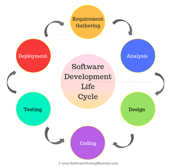

# Week 5: CI/CD Pipelines with Jenkins

# Task: Research CI/CD and Jenkins
## What is CI? Benefits?
CI stands for **Continuous Integration**. 
* It’s a practice in software development where developers frequently *merge their code changes* into a *shared repository*. 
* Each integration is *automatically tested to detect issues* early.

### Benefits
* `Early bug detection`: Since code is tested every time it’s integrated, issues are caught earlier.
* `Improved collaboration`: Frequent code merges help developers work better together.
* `Faster development`: Smaller, more frequent updates make development smoother.
* `Better code quality`: Automated testing ensures that issues are fixed as soon as they arise.

 

## What is CD? Benefits?
CD stands for Continuous Delivery or Continuous Deployment (CDE?).

  * **Continuous Delivery**: After code is integrated and tested, it’s *prepared for release* into production, but a human approval is needed before it’s deployed.
  * **Continuous Deployment**: It’s the automated process where code goes from testing to production *without manual intervention*.

### Benefits
* **Faster releases**: Changes can be *deployed to production* more frequently.
* **Reduced risks**: Frequent deployments with smaller changes *reduce* the chance of big *failures*.
* **Increased automation**: *Saves time* by automating manual steps.
* **Better user feedback**: New features or fixes *reach users faster*, leading to *quicker feedback*.

 

## Difference between CD and CDE
* **CD** (Continuous Delivery): Refers to the practice of ensuring your codebase is *always ready to deploy*. A *manual approval* step might be required before deploying to production.
  
* **CDE** (Continuous Deployment): Takes CD a step further by *automatically deploying* every change that *passes the testing phase* to production, without any manual intervention.

 

## What is Jenkins?
Jenkins is an **open-source automation server** used for *automating the building, testing, and deployment* of applications. 
* It’s widely used for CI/CD (Continuous Integration/Continuous Delivery) pipelines. 
* Jenkins lets you *set up workflows* that *automatically test and deploy* code after it’s integrated.

 

## Why use Jenkins? Benefits of using Jenkins? Disadvantages?
Jenkins *automates repetitive tasks*, like building and testing code, to make the *development process* **faster** and more **reliable**.

### Benefits of using Jenkins:
* **Automation**: Jenkins *automates* build, test, and deployment *steps*.
* **Flexibility**: It can be *customised* to fit various project needs, thanks to its plugins.
* **Open-source**: Jenkins is *free* and has a large, *supportive community*.
* **Integrations**: *Works well with other tools* like Git, Docker, etc.

### Disadvantages:
* **Complexity**: Jenkins can be *complex to set up and manage*, especially for beginners.
* **Maintenance**: Since Jenkins is self-hosted, you’ll need to *handle updates and manage infrastructure*.
* **Performance issues**: Large projects may require *tuning to avoid performance bottlenecks*.

> “bottlenecks” refer to points in the project where the **performance is significantly slowed down or hindered**. These are areas that **limit** the overall **efficiency** and **speed** of the project, **causing delays** or **reduced performance**. 
> 
> "tuning" involves optimising these areas to ensure the project runs smoothly and efficiently.

 

## Stages of Jenkins
A Jenkins pipeline (B.T.D.PDA) has the following stages:

* `Build`: *Compiles* the code.
* `Test`: *Runs automated tests* to check the code quality.
* `Deploy`: Sends the code to the *next environment* (like a testing server or production).
* `Post-deploy actions`: Extra *checks or notifications after deployment* (e.g., sending an email to the team).

 

## What alternatives are there for Jenkins
Other tools that do similar things to Jenkins include:
* GitLab CI/CD
* CircleCI
* Travis CI
* GitHub Actions
* Bamboo (by Atlassian)

  

## Why build a pipeline? Business value?
A CI/CD pipeline **automates parts of the software development process**, like testing and deployment.

### Business value:
* **Faster time to market**: Automating tasks means you can *release new features* and *bug fixes faster*.
* **Higher quality**: *Consistent testing and deployment* *reduce the risk of bugs* in production.
* **Cost savings**: Automation *reduces the need for manual work*, which *saves time and money*.

 

## Create a general diagram of CICD
** needs uploading ** Below is an example from the internet. 

Developer -> Code commit -> CI: Build & Test -> CD: Deploy -> Production

 

 

## Understand SDLC workflow: plan, design, develop, deploy
SDLC (Software Development Life Cycle) is a process followed to create high-quality software:

* `Plan`: Define what the software will do and set goals.
* `Design`: Create blueprints for how the software will look and work.
* `Develop`: Write the actual code to build the software.
* `Deploy`: Release the software to users or production.

 

 

 

 

 

