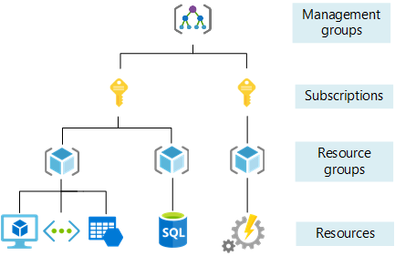

# Understanding Azure

## Introduction to Azure
Azure is Microsoft's `cloud computing platform`, offering services like: computing, storage, networking, and analytics. 
* It helps organisations build, manage, and deploy applications on a global scale. 
* Azure provides a pay-as-you-go model, meaning you only pay for the resources you use.

## Azure Regions and Availability Zones
* `Regions`: Azure has *datacenters* around the world, *grouped into regions*. A region is a specific geographical area that contains multiple data centers. Examples include East US, West Europe, and Southeast Asia.

* `Availability Zones`: These are *physically separated* data centers within a region. Each zone has independent power, cooling, and networking, ensuring higher availability and fault tolerance. If one zone fails, others can still provide service.

**Summary:**: Azure’s structure ensures services are highly available and resilient, even in the event of hardware failure or disaster.

---
## How is Azure Structured/Organised?
Azure is organised into:

* `Subscriptions`: A subscription is like an account that contains the resources (VMs, databases, etc.). Each subscription has limits, such as how many resources you can deploy.
  
* `Resource Groups`: These are logical containers that group related resources (like VMs, storage accounts, etc.) so they can be managed as a single unit.

* `Resources`: Actual services and applications, such as virtual machines (VMs), databases, and storage accounts.

**Takeaway**: Organising resources into groups and subscriptions helps simplify management and billing.

---
## Types of Services Azure Provides
Azure offers a vast array of services, categorised into:
1. `Compute`: Azure’s compute services provide the infrastructure needed to run applications and manage workloads: Virtual Machines, App Services, Containers.
   * ***Virtual Machines***: These are scalable, on-demand computing resources that can run Windows or Linux.
   * ***App Services***: A fully managed platform for building, deploying, and scaling web apps.
   * ***Containers***: Services like Azure Kubernetes Service (AKS) and Azure Container Instances (ACI) for managing containerized applications.

2. `Networking`: Azure networking services ensure secure and reliable connections: Virtual Networks, Load Balancers, DNS.
   * ***Virtual Networks***: Enable secure communication between Azure resources.
   * ***Load Balancers***: Distribute incoming network traffic across multiple servers to ensure high availability.
   * ***DNS***: Host your DNS domains in Azure and manage DNS records.

3. `Storage`: Azure provides various storage solutions to meet different needs: Blob Storage, File Storage, Disk Storage.
   * ***Blob Storage***: Object storage for unstructured data like images, videos, and backups.
   * ***File Storage***: Fully managed file shares in the cloud.
   * ***Disk Storage***: Persistent, high-performance disk storage for Azure VMs.

4. `Databases`: Azure offers a range of database services to support different data needs: SQL Database, CosmosDB, MySQL.
   * ***SQL Database***: A fully managed relational database with built-in intelligence.
   * ***CosmosDB***: A globally distributed, multi-model database service.
   * ***MySQL***: Managed MySQL database service for app development.

5. `AI and Machine Learning`: Azure’s AI and machine learning services help build intelligent applications: Cognitive Services, Machine Learning Studio.
   * ***Cognitive Services***: Pre-built APIs for vision, speech, language, and decision-making.
   * ***Machine Learning Studio***: A collaborative, drag-and-drop tool for building, training, and deploying machine learning models.

6. `Analytics`: Azure analytics services provide tools for data processing and visualisation: Synapse Analytics, Data Lake, Power BI.
   * ***Synapse Analytics***: An integrated analytics service for big data and data warehousing.
   * ***Data Lake***: A scalable data storage and analytics service.
   * ***Power BI***: A suite of business analytics tools for analysing data and sharing insights.

7. `DevOps`: Azure DevOps services support the entire software development lifecycle: Pipelines, Repos, Boards.
   * ***Pipelines***: CI/CD service for building, testing, and deploying code.
   * ***Repos***: Git repositories for source control.
   * ***Boards***: Agile planning tools for tracking work and managing projects.

---
## Ways to Access Azure
You can access Azure in multiple ways:
1. `Azure Portal`: A web-based, graphical user interface that allows you to *manage your Azure resources*.
   * It provides a comprehensive dashboard where you can create, configure, and monitor services. 
   * The portal is user-friendly and ideal for those who prefer a visual approach to managing their cloud infrastructure.
  
2. `Azure CLI`: A *command-line* interface that lets you manage Azure resources *from your terminal* (or command prompt).
    * useful for automating tasks and integrating Azure management into your existing workflows. 
    * The CLI supports various operating systems, including Windows, macOS, and Linux.

3. `Azure PowerShell`: A set of cmdlets (command-lets) designed for managing Azure resources through PowerShell scripts.
   * It is a task automation framework that allows you to perform complex configurations and automate repetitive tasks. 
   * Azure PowerShell is ideal for administrators who are already familiar with PowerShell scripting.

4. `Azure SDKs`: Provide *libraries and tools* for various programming languages (e.g., Python, .NET) to integrate Azure services in your applications.
   * These SDKs enable developers to integrate Azure services directly into their applications, making it easier to build, deploy, and manage cloud-based solutions. 
   * SDKs offer a programmatic way to interact with Azure services, providing greater flexibility and control.
   
**Conclusion**: Azure offers flexibility in managing resources, whether through GUI, command-line, or automated scripts.

---
## Table: difference between Azure and Azure Devops

## Difference Between Azure and Azure DevOps
* `Azure`: A general-purpose cloud platform that *provides infrastructure and services* to build, deploy, and manage applications globally.
  * ***General-Purpose Cloud Platform***: Azure is a comprehensive cloud computing platform provided by Microsoft. It offers a wide range of services, including computing power, storage, databases, networking, and more.
  * ***Infrastructure and Services***: Azure provides the foundational infrastructure and services needed to build, deploy, and manage applications on a global scale. This includes virtual machines, databases, AI services, and more.
  * ***Global Reach***: Azure has data centers around the world, allowing you to deploy applications close to your users for better performance and compliance with local regulations.

* `Azure DevOps`: A *set of tools* for developers to plan, build, test, and deploy applications. It includes Pipelines, Repos, and Boards for CI/CD processes, version control, and agile project management.
  * ***Set of Developer Tools***: Azure DevOps is a suite of tools designed specifically for developers to manage the entire application lifecycle.
  * ***CI/CD Processes***: It includes Azure Pipelines for continuous integration and continuous deployment (CI/CD), which automate the building, testing, and deployment of applications.
  * ***Version Control***: Azure Repos provides Git repositories for source control, enabling teams to collaborate on code.
  * ***Agile Project Management***: Azure Boards offers tools for agile project management, including work item tracking, Kanban boards, and sprint planning.

**Summary**: 
* `Azure`: Think of Azure as the broad platform that provides the infrastructure and services you need to run your applications.
* `Azure DevOps`: Azure DevOps, on the other hand, is a specialized set of tools that helps developers streamline the process of planning, building, testing, and deploying applications.

---
## Why Use the Azure Pricing Calculator?
The `Azure Pricing Calculator` helps you estimate costs for using different Azure services. You can input the services you plan to use, such as virtual machines, storage, and databases, to get an estimate of your monthly bill. This tool helps prevent unexpected costs and enables better budgeting and planning.

