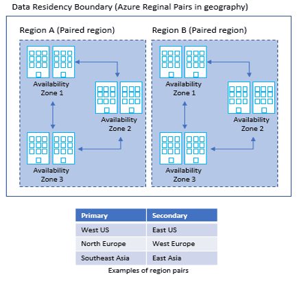
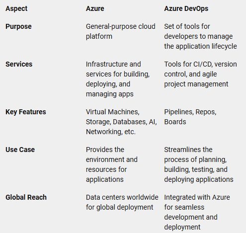

- [Understanding Azure](#understanding-azure)
  - [Introduction to Azure](#introduction-to-azure)
  - [Azure Regions and Availability Zones](#azure-regions-and-availability-zones)
  - [How is Azure Structured/Organised?](#how-is-azure-structuredorganised)
  - [Types of Services Azure Provides](#types-of-services-azure-provides)
  - [Ways to Access Azure](#ways-to-access-azure)
  - [Table: difference between Azure and Azure Devops](#table-difference-between-azure-and-azure-devops)
  - [Difference Between Azure and Azure DevOps ♾️](#difference-between-azure-and-azure-devops-️)
  - [Why Use the Azure Pricing Calculator?](#why-use-the-azure-pricing-calculator)
      - [Why are we working with Azure?](#why-are-we-working-with-azure)
  - [Creating a Virtual Machine](#creating-a-virtual-machine)
    - [Plan to Create a Virtual Machine on Azure: Considerations](#plan-to-create-a-virtual-machine-on-azure-considerations)
    - [Additional Notes](#additional-notes)
  - [Creating a Virtual Machine: Original notes](#creating-a-virtual-machine-original-notes)
  - [Creating a Virtual Machine: Organised notes](#creating-a-virtual-machine-organised-notes)
  - [Stopping VM](#stopping-vm)
  - [Logging into our VMs](#logging-into-our-vms)
    - [SSH command to use form anywhere:](#ssh-command-to-use-form-anywhere)
  - [Organised notes: Connecting Your Virtual Machine](#organised-notes-connecting-your-virtual-machine)

# Understanding Azure
Source link: https://holori.com/list-of-all-azure-regions-and/#azure-regions 

## Introduction to Azure
Azure is Microsoft's `cloud computing platform`, offering services like: computing, storage, networking, and analytics. 
* It helps organisations build, manage, and deploy applications on a global scale. 
* Azure provides a pay-as-you-go model, meaning you only pay for the resources you use.

## Azure Regions and Availability Zones
* `Regions`: Azure has *datacenters* around the world, *grouped into regions*. A region is a specific geographical area that contains multiple data centers. Examples include East US, West Europe, and Southeast Asia.

* `Availability Zones`: These are *physically separated* data centers within a region. Each zone has independent power, cooling, and networking, ensuring higher availability and fault tolerance. If one zone fails, others can still provide service.

**Summary**: Azure’s structure ensures services are highly available and resilient, even in the event of hardware failure or disaster.

---
## How is Azure Structured/Organised?
Each level provides a different scope so we can set up different levels of access and apply different policies to any one of these scopes. At each level you can set access and policies.

Azure is organised into:
* At the very top: `root management group`.
  * Azure Entra: this is where all the user/groups permissions are stored. 

* `Management groups`: help you manage access, policy, and compliance for multiple subscriptions. All subscriptions in a management group automatically inherit the conditions that are applied to the management group.
  * they're like folders for organising your structure. 
  * You can have management groups within management groups - up to 6 levels. 

* `Subscriptions`: A subscription is like a (payment) account that contains the resources (VMs, databases, etc.). 
  * Each subscription has limits, such as how many resources you can deploy. 
  * Organisations can use subscriptions to manage costs and the resources that are created by users, teams, and projects.
  * There are different types of subscriptions like student, free trial, pay as you go.
  * They have limits/quotas: there will be a limit on how many resources you'll be able to create under that particular subscription. It's a way of organising within an organisation. 
  
* `Resource Groups`: These are logical containers that group related resources (like VMs, storage accounts, etc.) so they can be managed as a single unit. You cannot have a resource group within a resource group. (in our case, the resouce group is tech264).

* `Resources`: Actual services and applications, such as virtual machines (VMs), databases, and storage accounts.

**Takeaway**: Organising resources into groups and subscriptions helps simplify management and billing.
 
⚠️ Note: To minimise the effect of regional outages, we recommend that you place resources in the same region as the resource group.

---
## Types of Services Azure Provides
Azure offers a vast array of services, categorised into:
1. `Compute`: Azure’s compute services provide the infrastructure needed to run applications and manage workloads: Virtual Machines, App Services, Containers.
   * ***Virtual Machines***: These are scalable, on-demand computing resources that can run Windows or Linux.
   * ***App Services***: A fully managed platform for building, deploying, and scaling web apps.
   * ***Containers***: Services like Azure Kubernetes Service (AKS) and Azure Container Instances (ACI) for managing containerized applications.

2. `Networking`: Azure networking services ensure secure and reliable connections: Virtual Networks, Load Balancers, DNS.
   * ***Virtual Networks***: Enable secure communication between Azure resources.
   * ***Load Balancers***: Distribute incoming network traffic across multiple servers to ensure high availability.
   * ***DNS***: Host your DNS domains in Azure and manage DNS records.

3. `Storage`: Azure provides various storage solutions to meet different needs: Blob Storage, File Storage, Disk Storage.
   * ***Blob Storage***: Object storage for unstructured data like images, videos, and backups.
   * ***File Storage***: Fully managed file shares in the cloud.
   * ***Disk Storage***: Persistent, high-performance disk storage for Azure VMs.

4. `Databases`: Azure offers a range of database services to support different data needs: SQL Database, CosmosDB, MySQL.
   * ***SQL Database***: A fully managed relational database with built-in intelligence.
   * ***CosmosDB***: A globally distributed, multi-model database service.
   * ***MySQL***: Managed MySQL database service for app development.

5. `AI and Machine Learning`: Azure’s AI and machine learning services help build intelligent applications: Cognitive Services, Machine Learning Studio.
   * ***Cognitive Services***: Pre-built APIs for vision, speech, language, and decision-making.
   * ***Machine Learning Studio***: A collaborative, drag-and-drop tool for building, training, and deploying machine learning models.

6. `Analytics`: Azure analytics services provide tools for data processing and visualisation: Synapse Analytics, Data Lake, Power BI.
   * ***Synapse Analytics***: An integrated analytics service for big data and data warehousing.
   * ***Data Lake***: A scalable data storage and analytics service.
   * ***Power BI***: A suite of business analytics tools for analysing data and sharing insights.

7. `DevOps`: Azure DevOps services support the entire software development lifecycle: Pipelines, Repos, Boards.
   * ***Pipelines***: CI/CD service for building, testing, and deploying code.
   * ***Repos***: Git repositories for source control.
   * ***Boards***: Agile planning tools for tracking work and managing projects.

---
## Ways to Access Azure
No matter how you access Azure, what you're using behind it is the ARM API (Azure Resource manager). They all talk to one API. 

You can access Azure in multiple ways:
1. `Azure Portal`: A web-based, graphical user interface that allows you to *manage your Azure resources*.
   * It provides a comprehensive dashboard where you can create, configure, and monitor services. 
   * The portal is user-friendly and ideal for those who prefer a visual approach to managing their cloud infrastructure.
  
2. `Azure CLI`: A *command-line* interface that lets you manage Azure resources *from your terminal* (or command prompt).
    * useful for automating tasks and integrating Azure management into your existing workflows. 
    * The CLI supports various operating systems, including Windows, macOS, and Linux.

3. `Azure PowerShell`: A set of cmdlets (command-lets) designed for managing Azure resources through PowerShell scripts.
   * It is a task automation framework that allows you to perform complex configurations and automate repetitive tasks. 
   * Azure PowerShell is ideal for administrators who are already familiar with PowerShell scripting.

4. `Azure SDKs`: Provide *libraries and tools* for various programming languages (e.g., Python, .NET) to integrate Azure services in your applications.
   * These SDKs enable developers to integrate Azure services directly into their applications, making it easier to build, deploy, and manage cloud-based solutions. 
   * SDKs offer a programmatic way to interact with Azure services, providing greater flexibility and control.
   
**Conclusion**: Azure offers flexibility in managing resources, whether through GUI, command-line, or automated scripts.

---
## Table: difference between Azure and Azure Devops

## Difference Between Azure and Azure DevOps ♾️
* `Azure`: A general-purpose cloud platform that *provides infrastructure and services* to build, deploy, and manage applications globally.
  * ***General-Purpose Cloud Platform***: Azure is a comprehensive cloud computing platform provided by Microsoft. It offers a wide range of services, including computing power, storage, databases, networking, and more.
  * ***Infrastructure and Services***: Azure provides the foundational infrastructure and services needed to build, deploy, and manage applications on a global scale. This includes virtual machines, databases, AI services, and more.
  * ***Global Reach***: Azure has data centers around the world, allowing you to deploy applications close to your users for better performance and compliance with local regulations.

* `Azure DevOps`: A *set of tools* for developers to plan, build, test, and deploy applications. It includes Pipelines, Repos, and Boards for CI/CD processes, version control, and agile project management.
  * ***Set of Developer Tools***: Azure DevOps is a suite of tools designed specifically for developers to manage the entire application lifecycle.
  * ***CI/CD Processes***: It includes Azure Pipelines for continuous integration and continuous deployment (CI/CD), which automate the building, testing, and deployment of applications.
  * ***Version Control***: Azure Repos provides Git repositories for source control, enabling teams to collaborate on code.
  * ***Agile Project Management***: Azure Boards offers tools for agile project management, including work item tracking, Kanban boards, and sprint planning.

**Summary**: 
* `Azure`: Think of Azure as the broad platform that provides the infrastructure and services you need to run your applications.
* `Azure DevOps`: Azure DevOps, on the other hand, is a specialized set of tools that helps developers streamline the process of planning, building, testing, and deploying applications.

---
## Why Use the Azure Pricing Calculator?
The `Azure Pricing Calculator` helps you estimate costs for using different Azure services. You can input the services you plan to use, such as virtual machines, storage, and databases, to get an estimate of your monthly bill. This tool helps prevent unexpected costs and enables better budgeting and planning.

* The default setting does not mean its the cheapest!! ⚠️ BEWARE ⚠️

Link: https://azure.microsoft.com/en-gb/pricing/calculator/?ef_id=_k_4b2e508ea7be1c97cc9e3670d72e631e_k_&OCID=AIDcmm3bvqzxp1_SEM__k_4b2e508ea7be1c97cc9e3670d72e631e_k_&msclkid=4b2e508ea7be1c97cc9e3670d72e631e

#### Why are we working with Azure?
* Your skills are transferable as things will work in a very silimar way to the other cloud providers: they just name things differently.
* Azure `CLI`: is the command line.
* `API` that's running behind everything: `Azure Resource Manager` (ARM) is the API. Thy interact with this in order to carry out their commands. 

## Creating a Virtual Machine
* make sure you have a plan before you dive in. 
* Research the default options or particular options that you want. This will affect how much the cost is. 

### Plan to Create a Virtual Machine on Azure: Considerations
`Virtual Network and Subnets`
* Define the Virtual Network (VNet) and subnets the VM will reside in.
* Ensure the network configuration aligns with your security accessibility, and resource distribution needs.

`Naming Convention`
* Establish a consistent naming convention for the VM and other associated resources (disks, NICs, public IPs).
* Example: Use prefixes or suffixes that identify the environment (e.g., prod, dev) or the purpose of the VM.

`Location and Pricing`
* Choose the Azure region that best fits your needs, keeping the following in mind:
  * Proximity to your users (to minimize latency).
  * Different regions may have different pricing for the same resources.
* Consider regions that offer specific compliance or legal requirements for your data.

`VM Size and Pricing`
* Select an appropriate VM size based on:
  * CPU cores and RAM required for the workloads.
  * Ensure the size is compatible with your performance and scalability goals.
  * Be mindful of pricing tiers—VMs come in Standard, Burstable, or Premium tiers based on compute capacity.

`Storage and Pricing`
* Determine the type of storage for your VM:
  * Standard HDD: Low cost, lower performance.
  * Standard SSD: Middle-tier cost and performance.
  * Premium SSD: Higher cost, optimized for high IOPS (Input/Output Operations Per Second).
* Factor in the costs for additional data disks and backup strategies if needed.

`Operating System and Pricing`
* Choose the Operating System (OS) based on the software you plan to run.
  * Consider whether it’s Linux (Ubuntu, Red Hat, etc.) or Windows Server.
  * Different OS options may have license fees associated with them (e.g., Windows typically incurs additional charges).
* Ensure the OS is compatible with your software and workloads.

`SSH Key Pair for Access`
* Plan how you will manage SSH keys for secure access to the VM:
  * Will the team share a common SSH key or will each user have their own key pair?
  * Consider using a secure key vault for managing SSH keys if many people need access.
* For Windows VMs, consider RDP credentials for remote access.

`Redundancy and Reliability`
* Factor in redundancy to improve the reliability of your VM:
  * Use availability sets or availability zones to ensure higher uptime and protection against failures.
  * Leverage replication options to ensure critical data is mirrored across regions or zones for disaster recovery.

`Backup and Disaster Recovery`
* Plan for backups of your VM, ensuring critical data and configurations are regularly saved.
* Consider using Azure’s backup service or recovery vault to automate backup tasks and retention policies.

### Additional Notes
* Make sure to review Azure’s pricing calculator to understand the full cost implications of your choices.
* Define clear access controls and security groups to restrict unauthorized access to the VM.
* By considering each of these aspects before creating your virtual machine, you'll ensure it is set up for your operational needs, with security, scalability, and cost-efficiency in mind.

## Creating a Virtual Machine: Original notes
1. Login to Azure. 
2. Search: Virtual Machine.
3. Create > Azure Virtual Machine
4. Enter resouce group `>` virtual machine name tech264-georgia-first-vm `>` region UK SOUTH `>` availabilty zone (no infrastructure redundancy required) (aka not fussed) `>` security type: standard `>` image: A snapshot of exact files you want to run, (what operating system do i want initially on the disk?) Everything you're going to start with on the disk, e.g., when you choose which Windows you want to install, you can choose the features you want. We've chosen: Ubuntu Pro 18.04 LTS x64 Gen2 `>` Size: Standard_B1s `>` leave on default 'SSH public key' `>` username: adminuser `>` SSH public key spurce: 'Use existing key stored in azure' `>` Stored Keys: tech264-georgia-az-key `>` Imbound port rules: SSH (22) and HTTP (80) this allows you to acces web services. 
5. Got to 'disks' tab `>` OS dist type: Standard SSD `>` 
6. Go to 'Networking' `>` VN: tech264-georgia-2-subnet-vnet `>` Subnet: public-submnet `>` Publc IP: tech264-georgia-first-vm-ip `>` Select imbound ports: leave as HTTP (80), SHH (22) (this allows all IP addresses to access your virtual machine) `>` Delete public IP and NIC when VM is deleted (you don't have to select it, but we have here) `>` 
7. Go to 'Tags' `>` Owner > Georgia > resources 13 selected (all of these will have the tag).
8. Got to 'review and create' `>` will normally get you to check your settings before you publish. 
9. Click 'create'. 

## Creating a Virtual Machine: Organised notes

1. Login to Azure.
2. Search: `Virtual Machine` on Azure portal.
3. `Create` > Azure Virtual Machine:
   - `Resource Group`: Select the appropriate resource group (**tech264**).
   - `Virtual Machine Name`: **tech264-georgia-first-vm** (ensure the name follows Azure's naming rules—typically lowercase, alphanumeric, and using hyphens).
   - `Region`: UK South (this region affects both pricing and latency, so choose a region close to your users).
   - `Availability Zone`: **No infrastructure redundancy required** (this means the VM won't be distributed across zones for redundancy, which is fine if you don’t need high availability).
   - `Security Type`: Standard.
   - `Image`: This is a snapshot of the operating system and files you want on the disk. For example, when you select an OS like Windows or Linux, you are selecting the features to be installed. We chose: **Ubuntu Pro 18.04 LTS x64 Gen2**.
   - `Size`: **Standard_B1s** (a cost-effective option for small workloads, but ensure this size meets your performance requirements). Select "see all sizes" if not seen in immediate recent.
   - `Authentication`: Leave the default option as '**SSH public key**'.
   - `Username`:  Change username to to something more secure: **adminuser**.
   - `SSH Public Key Source`: Change SSH public key source to `Use existing key stored in Azure`.  
     - `Stored Keys`: **tech264-georgia-az-key** (make sure this key is available and correctly associated with your account). Select **your** Stored key (e.g tech264..).
   - `Inbound Port Rules`: Allow **SSH (22)** and **HTTP (80)** to enable terminal access and web services.  
     - ⚠️ **Note**: Leaving SSH open to all IP addresses can pose a security risk. Consider using Network Security Groups (NSGs) to restrict access by IP range for added security.

4. Go to the '`Disks`' tab:
   - Change OS Disk type to `Standard SSD (locally redundant storage)`.
   - `OS Disk Type`: **Standard SSD** (this provides a good balance between cost and performance, but consider Premium SSD if higher IOPS is required).

5. Go to the '`Networking`' tab:
   - `Virtual Network (VNet)`: **tech264-georgia-2-subnet-vnet**.
   - `Subnet`: **public-subnet**.
   - `Public IP`: **tech264-georgia-first-vm-ip**.
   - `Inbound Ports`: Keep as **SSH (22)** and **HTTP (80)** (this allows all IP addresses to access your VM).
     - ⚠️ **Security Tip**: Be cautious about leaving SSH open to all IPs. Consider NSG rules to restrict access to trusted IP ranges.
   - Public IP and NIC: Check the box to "Delete public IP and NIC when VM is deleted" (this will save resources when the VM is removed).

6. Go to the '`Tags`' tab:
   - **Owner**: Set to **Georgia**.
   - Apply tags to the 13 selected resources (this will help organize and manage resources).

7. Go to '`Review and Create`':
   - Review your settings before publishing to ensure everything is correct.

8. Click '`Create`' to deploy the Virtual Machine.

---
## Stopping VM
* virtual machine `>` check status, if running `>` click 'stop'.

---

## Logging into our VMs

1. Click 'Start': status will change to 'Running'.
2. Click 'Connect' (the normal one).
3. It'll show you the IP address: 172.167.29.191
4. use native SSH
5. Find "Native SSH" and **select** it. A side panel should open.
6. Input `~/.ssh/` and your `private key name` into the "Copy and Execute SSH Command" line. This will output a command for us to use in our CL (We are using **GitBash**). Copy and execute SSH command, SSH Command will only work if you're in your .ssh folder: (tech264-georgia-az-key) 
7. Git Bash: cd `>` cd .shh `>` ls .ssh `>` grab the key^^ `>` ssh -i ~/.ssh/id_rsa.pem adminuser@172.167.29.191 (.pem is the private padlock/key) `>` exit.
8. Are you sure? type 'yes'
9. Home directory is: adminuser@tech264-georgia-first-vm

### SSH command to use form anywhere:
1. Copy and execute SSH command:
2. ~/.ssh/tech264-georgia-az-key (the path to it). 
3. enter cd on Git Bash to go back to home directory(~)
4. paste the path for the key here: ssh -i ~/.ssh/tech264-georgia-az-key adminuser@172.167.29.191

## Organised notes: Connecting Your Virtual Machine
1. **Start** your virtual machine.
2. Navigate to "Connect" under your VM.
3. Find "Native SSH" and **select** it. A side panel should open.
4. Input `~/.ssh/` and your `private key name` into the "Copy and Execute SSH Command" line. This will output a command for us to use in our CL (We are using **GitBash**).
5. Click the copy button for the code below what was just inputted.
6. Paste this code into your **GitBash**.
7. A **warning** will come out once entered into your **GitBash**. Respond with `yes` and then it will permanently save the IP address, meaning we will not be given the warning again.
8. You can type `exit` to **logout** of the Virtual Machine.