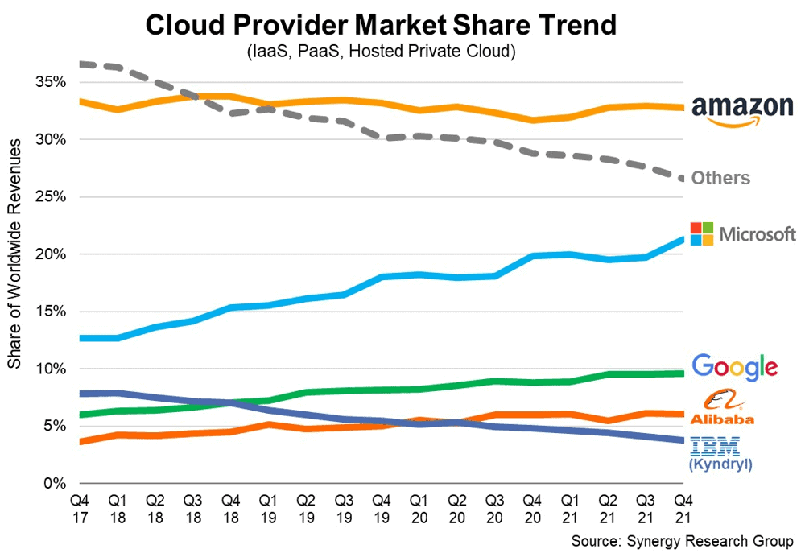

# Table of Contents
add an auto table of contents to md file: Ctrl+shift+p then search for what you want.

- [Table of Contents](#table-of-contents)
- [Scripting](#scripting)
  - [Scripting vs programming](#scripting-vs-programming)
  - [The difference between programming + scripting](#the-difference-between-programming--scripting)
- [Scripting vs Programming](#scripting-vs-programming-1)
  - [Key Differences:](#key-differences)
  - [Scripting](#scripting-1)
  - [Programming](#programming)
- [How to Run Python Scripts from the Command Line](#how-to-run-python-scripts-from-the-command-line)
  - [How to run Python scripts from the cmd line + how arguments work](#how-to-run-python-scripts-from-the-cmd-line--how-arguments-work)
- [Understanding Arguments in Python Scripts](#understanding-arguments-in-python-scripts)
- [What is VNet?](#what-is-vnet)
- [Azure VM Labelling and Networking](#azure-vm-labelling-and-networking)
  - [Creating an Azure Test VNet](#creating-an-azure-test-vnet)
  - [Deleting an Azure VNet](#deleting-an-azure-vnet)
  - [Creating Our Actual VNet](#creating-our-actual-vnet)
    - [Requirements:](#requirements)
    - [Steps to Create Subnets:](#steps-to-create-subnets)
  - [Creating an SSH Key Pair](#creating-an-ssh-key-pair)
    - [Steps to Generate an SSH Key Pair:](#steps-to-generate-an-ssh-key-pair)
    - [Step 2: Copy the Public Key](#step-2-copy-the-public-key)
    - [Step 3: Add the Public Key to Azure](#step-3-add-the-public-key-to-azure)
    - [Step 4: Test SSH Connection](#step-4-test-ssh-connection)
  - [Planning and Creating a Virtual Network (VNet) in Azure](#planning-and-creating-a-virtual-network-vnet-in-azure)
    - [Why create a VNet?](#why-create-a-vnet)
    - [Steps to Create a VNet in Azure:](#steps-to-create-a-vnet-in-azure)
    - [What Information Do You Need to Plan a VNet?](#what-information-do-you-need-to-plan-a-vnet)
- [Azure](#azure)
      - [Why are we working with Azure?](#why-are-we-working-with-azure)
  - [Creating a Virtual Machine](#creating-a-virtual-machine)
    - [Plan to Create a Virtual Machine on Azure: Considerations](#plan-to-create-a-virtual-machine-on-azure-considerations)
    - [Additional Notes](#additional-notes)
  - [Creating a Virtual Machine: Original notes](#creating-a-virtual-machine-original-notes)
  - [Creating a Virtual Machine: Organised notes](#creating-a-virtual-machine-organised-notes)
  - [Stopping VM](#stopping-vm)
  - [Logging into our VMs](#logging-into-our-vms)
    - [SSH command to use form anywhere:](#ssh-command-to-use-form-anywhere)
  - [Organised notes: Connecting Your Virtual Machine](#organised-notes-connecting-your-virtual-machine)
- [Understand what the cloud is](#understand-what-the-cloud-is)
  - [How Do We Know if Something Is in the Cloud?](#how-do-we-know-if-something-is-in-the-cloud)
  - [Differences Between On-Prem and Cloud](#differences-between-on-prem-and-cloud)
  - [4 Cloud Deployment Models:](#4-cloud-deployment-models)
  - [Types of Cloud Services:](#types-of-cloud-services)
- [Ramons diagram](#ramons-diagram)
  - [Cloud Advantages/Disadvantages (For Businesses)](#cloud-advantagesdisadvantages-for-businesses)
  - [Cloud Advantages and Disadvantages (For Businesses)](#cloud-advantages-and-disadvantages-for-businesses)
    - [Advantages:](#advantages)
    - [Disadvantages:](#disadvantages)
  - [OpEx vs CapEx (Operational vs Capital Expenses)](#opex-vs-capex-operational-vs-capital-expenses)
  - [Is Migrating to the Cloud Always Cheaper?](#is-migrating-to-the-cloud-always-cheaper)
  - [Talk about this^ more:](#talk-about-this-more)
      - [Short Answer: Not Always.](#short-answer-not-always)
    - [Upfront Cost Savings](#upfront-cost-savings)
    - [Ongoing Costs (OpEx)](#ongoing-costs-opex)
    - [When Cloud Costs Can Get High](#when-cloud-costs-can-get-high)
    - [Conclusion](#conclusion)
  - [Market Share of Cloud Providers:](#market-share-of-cloud-providers)
  - [Largest Cloud Providers' Strengths:](#largest-cloud-providers-strengths)
  - [Which Cloud Provider Is Best?](#which-cloud-provider-is-best)
  - [What Do You Pay for in the Cloud?](#what-do-you-pay-for-in-the-cloud)
- [MORE DETAIL: ADD EDITS:](#more-detail-add-edits)
  - [What Do You Pay for in the Cloud?](#what-do-you-pay-for-in-the-cloud-1)
    - [1. `Storage`](#1-storage)
    - [2. `Compute Power`](#2-compute-power)
    - [3. `Networking`](#3-networking)
    - [Conclusion](#conclusion-1)
  - [4 Pillars of DevOps in the Cloud:](#4-pillars-of-devops-in-the-cloud)
- [MORE DETAILS: ADD EDITS:](#more-details-add-edits)
  - [4 Pillars of DevOps in the Cloud](#4-pillars-of-devops-in-the-cloud-1)
    - [1. **Collaboration**](#1-collaboration)
    - [2. **Automation**](#2-automation)
    - [3. **Continuous Delivery**](#3-continuous-delivery)
    - [4. **Monitoring and Feedback**](#4-monitoring-and-feedback)
    - [Conclusion](#conclusion-2)
- [Basic Linux Commands](#basic-linux-commands)
    - [Notes to research?? Not sure what's happening here.](#notes-to-research-not-sure-whats-happening-here)
  - [Ramon's tips and tricks](#ramons-tips-and-tricks)
- [Some Linux Commands](#some-linux-commands)
  - [download a file: using the `curl` command to downloada an image.](#download-a-file-using-the-curl-command-to-downloada-an-image)
  - [Copying a file (e.g., cat image).](#copying-a-file-eg-cat-image)
  - [Make a directory - Mkdir](#make-a-directory---mkdir)
  - [How you name files and folders](#how-you-name-files-and-folders)
  - [Create a file](#create-a-file)
    - [Summary:](#summary)
    - [Summary:](#summary-1)
  - [Navigating files and folders](#navigating-files-and-folders)
  - [Logging out of Linux](#logging-out-of-linux)


# Scripting

## Scripting vs programming
^^ in terms of the diagram: Programming circle surrounds/encompasses scripting circle.

## The difference between programming + scripting

# Scripting vs Programming

In simple terms, **programming** is a broader concept, while **scripting** is a subset within programming. Think of programming as a large circle that encompasses scripting as a smaller circle within it.

## Key Differences:

| Aspect            | Scripting                                 | Programming                                |
|-------------------|-------------------------------------------|--------------------------------------------|
| **Complexity**     | Simpler, often focusing on smaller tasks  | More complex, involves larger applications |
| **Purpose**        | Automates repetitive or routine tasks     | Used to develop full applications, games, etc. |
| **Execution**      | Typically executed by an interpreter      | Can be interpreted or compiled before execution |
| **Development Cycle** | Shorter, faster iterations              | Longer and more involved (includes design, development, and testing) |
| **Learning Curve** | Easier to learn, with fewer concepts      | Requires deeper knowledge of software design patterns and system architecture |

## Scripting
- **Complexity:** Scripting languages tend to be simpler, designed for quick automation of tasks such as file manipulation or system monitoring.
- **Purpose:** The goal is typically to automate routine tasks.
- **Execution:** Scripts are usually run by an interpreter (e.g., Python, Bash).
- **Development cycle:** Scripting has a shorter development cycle, meaning faster iterations and changes.
- **Learning curve:** Scripting languages like Python, Ruby, or Bash are often easier for beginners to pick up.

## Programming
- **Complexity:** Programming typically involves more intricate logic, data structures, and algorithms.
- **Purpose:** It's used to develop full-scale applications such as games, operating systems, or large business solutions.
- **Execution:** Programming languages can be either interpreted (Python, JavaScript) or compiled (C++, Java).
- **Development cycle:** The development process is often part of a more formal Software Development Life Cycle (SDLC), which includes design, development, testing, and deployment.
- **Learning curve:** Programming requires a more in-depth understanding of concepts like data structures, algorithms, and software design patterns.

---

# How to Run Python Scripts from the Command Line

To run Python scripts from the command line, follow these steps:

1. **Open the Command Line Interface:**
   - On Windows, open the Command Prompt.

2. **Navigate to the directory where your Python script is located:**
   ```bash
   bash
   cd path/to/your/script
   # For example
   python test_for_args.py hello
   ```

3. Run the Python script using the python command
   

## How to run Python scripts from the cmd line + how arguments work
To run a python script: python .\test_for_args.py hello
test = sys.argv[0]
hello = sys.argv[1]
interpret = python
name of the python script : .\test_for_args.py
arguments from the user: hello

# Understanding Arguments in Python Scripts
In Python, command-line arguments are stored in the `sys.argv` list, which is part of the sys module.
The first element, `sys.argv[0]`, is the name of the Python script.
Any subsequent elements are the arguments passed to the script.
```python
# for example, in python:
import sys

script_name = sys.argv[0]
argument1 = sys.argv[1]

print(f"Script name: {script_name}")
print(f"First argument: {argument1}")

# Running this command:
python test_for_args.py hello

# Would output:
Script name: test_for_args.py
First argument: hello
```

# What is VNet?
A VNet (short for Virtual Network) is a cloud-based network that allows resources like virtual machines (VMs), databases, and other services to securely communicate with each other, the internet, and on-premises networks. 
It’s a fundamental building block in cloud environments (such as Microsoft Azure or AWS) for managing communication between resources.

# Azure VM Labelling and Networking

## Creating an Azure Test VNet

Create a Virtual Network (VNet) on Azure for testing purposes:
* portal.azure.com

1. Search for **"Virtual Network"** on the Azure Portal.
2. Click **Create**.
3. You only have access to the **"tech264"** resource group.
4. Name your VNet using the naming convention, for example: **tech264-georgia-vnet**.
5. Add your **owner tag** as a key to identify the creator.
6. Click **Review + Create** to proceed.
7. Once deployment is complete, your VNet will be created.
8. You will only see one resource (the VNet), but you can add more resources later.
9. Go to the resource to view its details.

---

## Deleting an Azure VNet

To delete a Virtual Network:

1. Search for **"Resource Groups"** in the Azure Portal.
2. You will see everything in the resource group.
3. Click into the resource group and select the VNet you want to delete.
4. Click the three dots at the top right and select **Delete**, but **do not delete the entire resource group**.

---

## Creating Our Actual VNet

Creating a Virtual Machine (VM) inside a Virtual Network (VNet). A VM is essentially a computer hosted in the cloud that we can access from our local machines.

### Requirements:
- The VM must reside in a **subnet** within a VNet. The VNet is a logical construct in the cloud to manage IP addressing and subnets.
- The **VNet** (tech264-georgia-2-subnet-vnet) has a CIDR block of `10.0.0.0/16`, which gives around **65,000 IP addresses**.
- `CIDR` block: used to represent a range of IP addresses.
- `CIDR` (Classless Inter-Domain Routing) blocks define the size of address ranges within a network.

### Steps to Create Subnets:
1. **Public Subnet**: Accessible by anyone. The resources (like VMs) can be directly accessed from the internet, often by associating a public IP.
   - **CIDR block**: `10.0.2.0/24`
   - This range provides **256 IP addresses**.
   
2. **Private Subnet**: Restricted, more secure subnet. Typically does not allow direct access from the internet. It is usually secured and can only be accessed through a VPN, VNet peering, or other internal methods.
   - **CIDR block**: `10.0.3.0/24`
   
3. Make sure to adjust the CIDR blocks accordingly.
   - The CIDR blocks must be chosen carefully to ensure non-overlapping IP ranges
   - Each subnet must have its own unique, non-overlapping CIDR range within the parent VNet CIDR block.
   
4. Only change the **IPv4** addresses (do not touch IPv6).

5. Add the **owner tag** to identify yourself as the creator.
   - `Tags` help manage resources by identifying ownership, environment, or purpose, especially in large cloud deployments.
   - aka, they are used to group things together. 
6. Check Security - most likey, you need to make no modifications. 

---

## Creating an SSH Key Pair

To securely access your Azure VM, you will need to create an SSH key pair. The **private key** will stay on your local machine, while the **public key** will be uploaded to Azure.
* .pem key = PRIVATE (also .ssh folder). A private key when generated yourself: doesn't have any extension. 
* KEEP NO WHERE NEAR GIT REPOs.
*  NEVER INITIALISE. 

### Steps to Generate an SSH Key Pair:

1. Open **Git Bash** (or terminal) on your local machine.
2. Make sure you are in your home directory (e.g., `C:/Users/your-username`).
3. `ls -a` (display all the hidden files - files starting with a dot). Typically, you may not have a .shh folder, here's how to create one:
4. Create an `.ssh` folder if it doesn't exist:
   ```bash
   mkdir .ssh```
5. Change directory into your .ssh folder: cd `.shh`
6. Generate the SSH key pair using this command: `ssh-keygen -t rsa -b 4096 -C "your_email@example.com"`
   * `-t rsa`: Specifies that the type of key is RSA.
   * `-b 4096`: Sets the key to be 4096 bits long (high security).
   * `-C`: Adds a comment, in this case, your email address.
7. When prompted, hit Enter to accept the default filename (or you can specify a name like tech264-georgia-az-key).
8. Press Enter again if you don't want to use a passphrase.
9. After generating, the key pair will be stored in two files:
   * Private key: tech264-georgia-az-key
   * Public key: tech264-georgia-az-key.pub
10. To view the public key, `run:cat tech264-georgia-az-key.pub`
11. Copy the entire public key (starting from ssh-rsa and ending with your email address).

### Adding the Public Key to Azure:
1. In the Azure Portal, search for SSH keys.
2. Create a new key and name it exactly as you did on your local machine, for example: tech264-georgia-az-key.
3. Paste the public key you copied from the local machine.
4. Add the owner tag.
5. Click Create to save the SSH key in Azure.

With these instructions, you can set up and manage virtual networks and secure access to your virtual machines on Azure.


# Architecture of a Virtual Machine
* `A Virtual Machine` (VM) is like a pretend computer running inside your real computer. Imagine you have a Windows computer, but you want to run a Linux operating system on it without buying a new computer. That's where a VM comes in — it lets you create a "fake" Linux computer inside your Windows computer.
* Consists of various key components that work together to emulate a physical computer. 

# Diagram
This diagram shows `how a VM is connected to a network` and `controlled via security groups`, ensuring only `specific` types of `traffic` (HTTP for web and SSH for remote terminal access) `can reach the VM`. 

It emphasises the importance of security groups (NSGs) in managing access and the key role of public IPs for external access to the VM from local machines.


## Looking at the components and interactions involved in setting up a virtual machine (VM) in a cloud environment (based on the diagrams above).

## Main Components:
`Virtual Machine` (VM):
* The VM itself is represented as a box with a disk attached (the Disk of the machine). This is the actual virtualized computer that runs the operating system and applications. The VM uses the attached disk for storage.

`Network Interface Controller` (NIC):
* The NIC is associated with the VM and serves as its link to the network. It’s the interface through which the VM communicates with the outside world.

`Public IP Address`:
* The Public IP is associated with the NIC, allowing external access to the VM. This is how you can connect to the VM from the internet or another external location, either via SSH (for command-line access) or HTTP (for web access).
  
`Network Security Group` (NSG):
* The NSG acts as a firewall that controls what kind of traffic can reach the VM. In the diagram, it has two specific rules:
NSG Rule – allow HTTP: This allows web browser access (port 80 or 443).
NSG Rule – allow SSH: This allows Secure Shell (SSH) access, typically on port 22, enabling remote terminal access to the VM.

`SSH Key`:
* The SSH Key is used for secure login into the VM. When the VM was created, this key was generated or provided, and it is required to access the VM remotely via SSH from a local machine.

## How These Components Interact:
1. `Virtual Machine Setup`:
   * The VM has a Disk for its storage and a NIC that allows network access. The VM can be accessed and used through this network interface.

2. `Public IP and Browser/SSH Access`:
   * The Public IP is what links your local machine to the VM over the internet. When you try to connect to the VM, the network traffic goes through the Public IP.
   * If you’re connecting through your browser (for web services), traffic is routed via the HTTP NSG rule.
   * If you're connecting via the command line, the traffic is routed via the SSH NSG rule using the SSH Key.

3. `Security Control with NSG`:
   * The NSG ensures that only traffic specified by its rules can reach the VM. In this case, only HTTP (web traffic) and SSH (remote access) are allowed. Any other types of traffic (e.g., FTP, or other non-specified protocols) will be blocked unless explicitly allowed by NSG rules.

4. `Regions, Resource Groups, Virtual Networks, and Subnets`:
   * The Region represents the geographic location where your resources (VM, network) are deployed.
   * The Resource Group is a container that holds the related resources for the VM and its network setup.
   * The Virtual Network (VNet) defines the network boundaries within the cloud, and the Subnet represents a segment within that network where the VM resides.

---
## Flow of Access:
`From the Local Machine`:
* When you want to access the VM from your local machine, your connection passes through the public IP.
* If you are using a web browser (HTTP), it follows the allow HTTP rule to reach the VM.
* If you are using SSH (to manage the VM), it follows the allow SSH rule. You must also provide the SSH key that was created when the VM was set up for secure access.
  
`Inside the Network`:
* The VM is linked to the NIC, which allows it to communicate over the Virtual Network (VNet), which could contain other resources and VMs within the same region, resource group, and subnet.


### Notes from class:
---
## Key Components of a VM

1. **Region**:
   - **Definition**: A geographical area where your resources are physically located.
   - **Use**: Helps in choosing the closest location to your users for better performance and compliance with local regulations.

2. **Resource Group**:
   - **Definition**: A container that holds related resources for an application.
   - **Use**: Organizes and manages resources like VMs, storage accounts, and virtual networks in a single unit.

3. **Virtual Network (VNet)**:
   - **Definition**: A network that allows VMs to communicate with each other and with the internet.
   - **Use**: Provides isolation, segmentation, and security for your resources, similar to how a house provides structure and boundaries.

4. **Subnet**:
   - **Definition**: A segment of a VNet that can contain multiple VMs.
   - **Use**: Divides the VNet into smaller, manageable sections, like rooms within a house, to improve organization and security.

5. **Virtual Machine**:
   - **Definition**: The actual virtualized instance of a computer.
   - **Use**: Runs applications and services, just like a physical computer.

6. **Disk**:
   - **Definition**: Storage for the VM's operating system, applications, and data.
   - **Use**: Stores all the files necessary for the VM to function, similar to a hard drive in a physical computer.

7. **Network Interface Controller (NIC)**:
   - **Definition**: A hardware component that connects the VM to the network.
   - **Use**: Enables communication between the VM and other devices, both within the VNet and externally.

8. **Public IP**:
   - **Definition**: An IP address that is accessible from the internet.
   - **Use**: Allows external users to access the VM, similar to how a public address lets people find your house.

9. **Network Security Group (NSG)**:
   - **Definition**: A set of rules that control inbound and outbound traffic to VMs.
   - **Use**: Acts like a firewall, protecting your VMs by allowing or denying traffic based on specified rules.

10. **NSG Rule - Allow HTTP**:
    - **Definition**: A rule that permits HTTP traffic.
    - **Use**: Allows web traffic to reach your VM, enabling web servers to function.

11. **NSG Rule - Allow SSH**:
    - **Definition**: A rule that permits SSH traffic.
    - **Use**: Allows secure remote access to your VM for management and configuration.

12. **SSH Key**:
    - **Definition**: A cryptographic key used for secure access to the VM.
    - **Use**: Acts like a padlock, ensuring that only authorized users can access the VM.


## Steps to Create a New SSH Key Pair and Add the Public Key to Azure
SSH keys are like a pair of locks and keys that let you securely log in to a server without needing a password. You create the pair on your computer and then put the public "lock" on the server so you can access it with your private key.

### Step 1: Generate an SSH Key Pair on Your Local Computer
1. Open a terminal (if you're on Linux or macOS) or Git Bash/PowerShell (if you're on Windows).
2. Type this command to create a new key pair:
```bash
ssh-keygen -t rsa -b 4096 -C "your_email@example.com"
```
   * This means you're creating a strong key (`-t rsa`), making it 4096 bits (`-b 4096`), and adding a comment with your email address (`-C`).
3. You'll be asked where to save the key. Just press Enter to use the default location (it will be saved in the `.ssh` folder in your home directory).
4. It will also ask if you want a password for the key. You can press Enter if you don't want a password, or enter one for extra security.

### Step 2: Copy the Public Key
1. To see your public key, run this command:
```bash
cat ~/.ssh/id_rsa.pub
```
2. Copy the entire output (this is your public key).

### Step 3: Add the Public Key to Azure
1. Log in to the Azure Portal.
2. Go to Virtual Machines and choose the VM you want to access.
3. In the Settings, look for Reset Password, and select SSH public key as the mode.
4. Paste your public key into the field and save. 

### Step 4: Test SSH Connection
1. To log in to your Azure VM using your private key, run this command:
```bash
ssh -i ~/.ssh/id_rsa username@vm_ip_address
```
   * (Replace username with your Azure VM username and vm_ip_address with the public IP of your VM.)

## Planning and Creating a Virtual Network (VNet) in Azure
* A `Virtual Network` (VNet) is like a private network in the cloud, where you can place and connect your virtual machines securely.

### Why create a VNet?
* `Security`: You can control which machines or services can communicate within your VNet and with the internet.
* `Private Communication`: Machines inside the VNet can talk to each other without needing to go through the internet.
* `Custom IP Addressing`: You get to decide how IP addresses are assigned inside your network.

### Steps to Create a VNet in Azure:
1. Log in to Azure Portal.
2. Click on Create a Resource and search for Virtual Network.
3. Set up the VNet by entering details like:
   * Name: A unique name for your network.
   * Region: Choose where in the world you want your network.
   * Address Space: Think of this as the "range" of IP addresses your network will use (e.g., 10.0.0.0/16).
4. `Subnets`: Break the network into smaller sections called subnets, each with its own IP range (e.g., 10.0.1.0/24 for one part, and 10.0.2.0/24 for another).
5. `Security`: You can set up Network Security Groups (NSGs), which let you control which types of traffic (e.g., web traffic, SSH) are allowed into and out of your VMs.
6. Once all the details are filled in, click Create.

### What Information Do You Need to Plan a VNet?
1. `Address Space`:
   * This is the range of IP addresses you want to use in your VNet, written in CIDR notation (like 10.1.0.0/16).
2. `Subnets`:
   * Subnets break the VNet into smaller pieces. Each piece will have its own range of IP addresses.
3. `Security`:
   * You can decide to use Network Security Groups (NSGs) to manage who can access different parts of the network.
4. `Connectivity`:
   * Do you need to connect your VNet to other networks, like your office network? You may need a VPN Gateway for that.
5. `Region`:
   * Choose where your VNet will be located. It’s best to keep it close to your other resources to reduce delays.


# Azure

#### Why are we working with Azure?
* Your skills are transferable as things will work in a very silimar way to the other cloud providers: they just name things differently.
* Azure `CLI`: is the command line.
* `API` that's running behind everything: `Azure Resource Manager` (ARM) is the API. Thy interact with this in order to carry out their commands. 

## Creating a Virtual Machine
* make sure you have a plan before you dive in. 
* Research the default options or particular options that you want. This will affect how much the cost is. 

### Plan to Create a Virtual Machine on Azure: Considerations
`Virtual Network and Subnets`
* Define the Virtual Network (VNet) and subnets the VM will reside in.
* Ensure the network configuration aligns with your security accessibility, and resource distribution needs.

`Naming Convention`
* Establish a consistent naming convention for the VM and other associated resources (disks, NICs, public IPs).
* Example: Use prefixes or suffixes that identify the environment (e.g., prod, dev) or the purpose of the VM.

`Location and Pricing`
* Choose the Azure region that best fits your needs, keeping the following in mind:
  * Proximity to your users (to minimize latency).
  * Different regions may have different pricing for the same resources.
* Consider regions that offer specific compliance or legal requirements for your data.

`VM Size and Pricing`
* Select an appropriate VM size based on:
  * CPU cores and RAM required for the workloads.
  * Ensure the size is compatible with your performance and scalability goals.
  * Be mindful of pricing tiers—VMs come in Standard, Burstable, or Premium tiers based on compute capacity.

`Storage and Pricing`
* Determine the type of storage for your VM:
  * Standard HDD: Low cost, lower performance.
  * Standard SSD: Middle-tier cost and performance.
  * Premium SSD: Higher cost, optimized for high IOPS (Input/Output Operations Per Second).
* Factor in the costs for additional data disks and backup strategies if needed.

`Operating System and Pricing`
* Choose the Operating System (OS) based on the software you plan to run.
  * Consider whether it’s Linux (Ubuntu, Red Hat, etc.) or Windows Server.
  * Different OS options may have license fees associated with them (e.g., Windows typically incurs additional charges).
* Ensure the OS is compatible with your software and workloads.

`SSH Key Pair for Access`
* Plan how you will manage SSH keys for secure access to the VM:
  * Will the team share a common SSH key or will each user have their own key pair?
  * Consider using a secure key vault for managing SSH keys if many people need access.
* For Windows VMs, consider RDP credentials for remote access.

`Redundancy and Reliability`
* Factor in redundancy to improve the reliability of your VM:
  * Use availability sets or availability zones to ensure higher uptime and protection against failures.
  * Leverage replication options to ensure critical data is mirrored across regions or zones for disaster recovery.

`Backup and Disaster Recovery`
* Plan for backups of your VM, ensuring critical data and configurations are regularly saved.
* Consider using Azure’s backup service or recovery vault to automate backup tasks and retention policies.

### Additional Notes
* Make sure to review Azure’s pricing calculator to understand the full cost implications of your choices.
* Define clear access controls and security groups to restrict unauthorized access to the VM.
* By considering each of these aspects before creating your virtual machine, you'll ensure it is set up for your operational needs, with security, scalability, and cost-efficiency in mind.

## Creating a Virtual Machine: Original notes
1. Login to Azure. 
2. Search: Virtual Machine.
3. Create > Azure Virtual Machine
4. Enter resouce group `>` virtual machine name tech264-georgia-first-vm `>` region UK SOUTH `>` availabilty zone (no infrastructure redundancy required) (aka not fussed) `>` security type: standard `>` image: A snapshot of exact files you want to run, (what operating system do i want initially on the disk?) Everything you're going to start with on the disk, e.g., when you choose which Windows you want to install, you can choose the features you want. We've chosen: Ubuntu Pro 18.04 LTS x64 Gen2 `>` Size: Standard_B1s `>` leave on default 'SSH public key' `>` username: adminuser `>` SSH public key spurce: 'Use existing key stored in azure' `>` Stored Keys: tech264-georgia-az-key `>` Imbound port rules: SSH (22) and HTTP (80) this allows you to acces web services. 
5. Got to 'disks' tab `>` OS dist type: Standard SSD `>` 
6. Go to 'Networking' `>` VN: tech264-georgia-2-subnet-vnet `>` Subnet: public-submnet `>` Publc IP: tech264-georgia-first-vm-ip `>` Select imbound ports: leave as HTTP (80), SHH (22) (this allows all IP addresses to access your virtual machine) `>` Delete public IP and NIC when VM is deleted (you don't have to select it, but we have here) `>` 
7. Go to 'Tags' `>` Owner > Georgia > resources 13 selected (all of these will have the tag).
8. Got to 'review and create' `>` will normally get you to check your settings before you publish. 
9. Click 'create'. 


## Creating a Virtual Machine: Organised notes

1. Login to Azure.
2. Search: `Virtual Machine` on Azure portal.
3. `Create` > Azure Virtual Machine:
   - `Resource Group`: Select the appropriate resource group (**tech264**).
   - `Virtual Machine Name`: **tech264-georgia-first-vm** (ensure the name follows Azure's naming rules—typically lowercase, alphanumeric, and using hyphens).
   - `Region`: UK South (this region affects both pricing and latency, so choose a region close to your users).
   - `Availability Zone`: **No infrastructure redundancy required** (this means the VM won't be distributed across zones for redundancy, which is fine if you don’t need high availability).
   - `Security Type`: Standard.
   - `Image`: This is a snapshot of the operating system and files you want on the disk. For example, when you select an OS like Windows or Linux, you are selecting the features to be installed. We chose: **Ubuntu Pro 18.04 LTS x64 Gen2**.
   - `Size`: **Standard_B1s** (a cost-effective option for small workloads, but ensure this size meets your performance requirements). Select "see all sizes" if not seen in immediate recent.
   - `Authentication`: Leave the default option as '**SSH public key**'.
   - `Username`:  Change username to to something more secure: **adminuser**.
   - `SSH Public Key Source`: Change SSH public key source to `Use existing key stored in Azure`.  
     - `Stored Keys`: **tech264-georgia-az-key** (make sure this key is available and correctly associated with your account). Select **your** Stored key (e.g tech264..).
   - `Inbound Port Rules`: Allow **SSH (22)** and **HTTP (80)** to enable terminal access and web services.  
     - ⚠️ **Note**: Leaving SSH open to all IP addresses can pose a security risk. Consider using Network Security Groups (NSGs) to restrict access by IP range for added security.

4. Go to the '`Disks`' tab:
   - Change OS Disk type to `Standard SSD (locally redundant storage)`.
   - `OS Disk Type`: **Standard SSD** (this provides a good balance between cost and performance, but consider Premium SSD if higher IOPS is required).

5. Go to the '`Networking`' tab:
   - `Virtual Network (VNet)`: **tech264-georgia-2-subnet-vnet**.
   - `Subnet`: **public-subnet**.
   - `Public IP`: **tech264-georgia-first-vm-ip**.
   - `Inbound Ports`: Keep as **SSH (22)** and **HTTP (80)** (this allows all IP addresses to access your VM).
     - ⚠️ **Security Tip**: Be cautious about leaving SSH open to all IPs. Consider NSG rules to restrict access to trusted IP ranges.
   - Public IP and NIC: Check the box to "Delete public IP and NIC when VM is deleted" (this will save resources when the VM is removed).

6. Go to the '`Tags`' tab:
   - **Owner**: Set to **Georgia**.
   - Apply tags to the 13 selected resources (this will help organize and manage resources).

7. Go to '`Review and Create`':
   - Review your settings before publishing to ensure everything is correct.

8. Click '`Create`' to deploy the Virtual Machine.

---
## Stopping VM
* virtual machine `>` check status, if running `>` click 'stop'.

---


## Logging into our VMs

1. Click 'Start': status will change to 'Running'.
2. Click 'Connect' (the normal one).
3. It'll show you the IP address: 172.167.29.191
4. use native SSH
5. Copy and execute SSH commandSSH Command will only work if youre in you .ssh folder: (tech264-georgia-az-key) 
6. Git Bash: cd ? cd .shh > ls .ssh > grab the key^^ > ssh -i ~/.ssh/id_rsa.pem adminuser@172.167.29.191 (.pem is the private padlock/key) > exit.
7. Are you sure? type 'yes'
8. Home directory is: adminuser@tech264-georgia-first-vm


### SSH command to use form anywhere:
1. Copy and execute SSH command:
2. ~/.ssh/tech264-georgia-az-key (we've provided the path to it). 
3. enter cd on Git Bash to go back to home directory(~)
4. paste the path for the key here: ssh -i ~/.ssh/tech264-georgia-az-key adminuser@172.167.29.191
5. 


## Organised notes: Connecting Your Virtual Machine
1. **Start** your virtual machine.
2. Navigate to "Connect" under your VM.
3. Find "Native SSH" and **select** it. A side panel should open.
4. Input `~/.ssh/` and your `private key name` into the "Copy and Execute SSH Command" line. This will output a command for us to use in our CL (We are using **GitBash**).
5. Click the copy button for the code below what was just inputted.
6. Paste this code into your **GitBash**.
7. A **warning** will come out once entered into your **GitBash**. Respond with `yes` and then it will permanently save the IP address, meaning we will not be given the warning again.
8. You can type `exit` to **logout** of the Virtual Machine.


# Understand what the cloud is

## How Do We Know if Something Is in the Cloud?
The cloud means storing and accessing data or programs over the internet, rather than your local hard drive. If you access a service via the web or through a remote server, it’s in the cloud.
* If it's on the cloud - it's `on demand`.
* It's `centrally managed`. This means that you can go to a particular website and you can manage / create the things you need from that one place. 
* Example: Using Google Drive for file storage vs. saving files directly on your computer.

## Differences Between On-Prem and Cloud
* `On-Premises`: Your business owns, maintains, and operates its own physical servers and infrastructure on-site. You've got it there, you physically have to take care of those machines, on a space you own.
  * *Advantages*: Full control, security, no third-party involvement.
  * *Disadvantages*: Expensive upfront costs, maintenance, scalability challenges.
* `Cloud`: Servers are hosted by a third party (like AWS or Azure) and are accessed via the internet.
  * *Advantages*: Lower upfront costs, scalable, maintenance-free for users.
  * Disadvantages: Less control, ongoing costs, dependency on the provider.
  
## 4 Cloud Deployment Models:

1. `Private Cloud`: Infrastructure is used exclusively by one organisation and not exposed to the public. 
* Dedicated to a private company. There is no way for the public to gain access.
* Usually, its possible for a private cloud to run without the internet. e.g., on a cruise ship. 
   * Example: Highly secure environments.
   * **Strengths**:
     - High security and control.
     - Customisation to meet specific needs.
   * **Weaknesses**:
     - Expensive to set up and maintain.
     - Limited scalability compared to public cloud.

2. `Public Cloud`: Services provided over the public internet and shared among users (e.g., AWS, Azure).
   * Example: General businesses looking to scale easily.
   * **Strengths**:
     - Cost-effective, as resources are shared.
     - Highly scalable, with flexible resource allocation.
   * **Weaknesses**:
     - Less control over infrastructure.
     - Potential security concerns due to multi-tenancy.

3. `Hybrid Cloud`: A combination of both private and public clouds, offering more flexibility.
* They need to keep their data on-prem: they are regulated. Front-end (i.e., the parts of the web service or serving up the API) has no problem running in the cloud, back-end may be on-prem.
* There's only so much they can put into the cloud. 
   * Example: When businesses want to keep some sensitive data on-prem while using cloud for other tasks.
   * **Strengths**:
     - Flexibility to manage sensitive data on-premise while utilising public cloud for other tasks.
     - Cost-effective for non-sensitive workloads.
   * **Weaknesses**:
     - Complexity in management and integration between public and private clouds.
     - Security concerns when transferring data between environments.

4. `Multi-Cloud`: Using multiple cloud providers for different services (e.g., AWS for storage/database, Azure for VMs/front end).
   * Example: Large businesses leveraging various strengths of cloud providers.
   * **Strengths**:
     - Flexibility in choosing best-in-class services from different providers.
     - Redundancy and backup in case one provider fails, ensuring continuous service.
   * **Weaknesses**:
     - Complex to manage and integrate multiple providers.
     - Potentially higher costs due to different billing and management systems.


## Types of Cloud Services:
* `IaaS` (Infrastructure as a Service): Provides virtualised computing resources like virtual machines, storage, and networking. Example: AWS EC2.
  
* `PaaS` (Platform as a Service): Provides a platform allowing customers to develop, run, and manage applications. Example: Microsoft Azure App Service.

* `SaaS` (Software as a Service): Software that is accessible via the internet. Example: Gmail, Dropbox, Salesforce. 


# Ramons diagram
How much control do you have? how much responsibility?

You manage: hardware (servers, storage, networking).

`On premesis`: you manage: data, applications, runtime, middleware, O/S, virtualisation, servers, storage, netwroking.

`Iaas`: you manage: data, applications, runtime, middle wear O/S. Provider manages: virtualisation, (the rest have a grey cross through them??): servers, storage, networking. 
- e.g., VM.

`Paas`: you manage: data, applications. Provider manages: runtime, middle wear, O/S, virtualisation, servers, storage, networking. 
- e.g., app service.
- Security will be taken care of for you. Provider manages: applications, runtime, middleware, O/S, virtualisation, servers, storage, netwroking.

`Saas`: you manage: data. Provider manages: applications, runtime, middleware, O/S, virtualisation, servers, storage, netwroking.


  
## Cloud Advantages/Disadvantages (For Businesses)
## Cloud Advantages and Disadvantages (For Businesses)

### Advantages:
1. `Cost-efficient` (depends on the case):
   - No need to invest in physical infrastructure, leading to significant savings on capital expenditures (CapEx). Operational expenses (OpEx) are more predictable with pay-as-you-go models.
   - Sometimes you can shift your advance: payment plans. Pay up front for discount, etc. 
   - **Example**: A startup can avoid the upfront costs of purchasing servers and maintaining hardware. Instead, they pay for cloud services as they grow, using platforms like AWS or Google Cloud.
   
  
2. `Scalable`:
   - Cloud services allow businesses to adjust resources quickly based on demand, ensuring optimal performance without over-provisioning.
   - **Example**: An e-commerce business can easily scale up its server capacity during peak times, such as Black Friday, and scale down during off-peak times.
   

3. `Flexibility to Access from Anywhere`:
   - Employees can securely access business applications and data from anywhere with internet access, improving productivity and collaboration.
   - **Example**: A remote team can collaborate and access essential applications from different geographical locations using cloud-based tools like Office 365, Slack, or Dropbox.
  

4. `Disaster Recovery is Easier`:
   - Cloud providers offer built-in disaster recovery solutions, allowing businesses to restore operations quickly without needing expensive on-premise backups.
   - **Example**: A company can back up its data using cloud services like AWS S3 or Azure Backup, ensuring data recovery in case of hardware failures or cyberattacks.

5. `Guarenteed levels of service`:
   - Guarenteed a certain percentage of up tiem. If they don't, you can ask for money back. 

### Disadvantages:
1. `Security Concerns` (debatable):
   - You don't have physical control over security. 
   - Businesses must trust that their cloud provider offers robust security protocols. Sensitive data can be vulnerable to breaches, particularly in public cloud environments where data is shared.
   - **Example**: A healthcare provider storing patient data in the cloud needs to ensure compliance with regulations like HIPAA, which require strict data protection measures.
   

2. `Downtime Risks` (go either way):
   - Cloud providers may suffer from technical issues, server failures, or even cyberattacks, leading to periods where businesses can’t access critical services.
   - You could have more uptime because some servers give a guarentee. 
   - **Example**: When major cloud providers like AWS or Microsoft Azure experience outages, businesses relying entirely on these platforms can face downtime, affecting operations.
   

3. `Ongoing Operational Costs` (debatable):
   - Although cloud solutions eliminate hardware costs, the ongoing subscription fees, storage costs, and data transfer charges can add up. Over time, operational costs might exceed the cost of maintaining on-premise infrastructure for some businesses.
   - **Example**: A company using multiple cloud services can face increasing monthly bills as they add more resources or scale up operations, potentially leading to higher-than-expected expenses.
   


## OpEx vs CapEx (Operational vs Capital Expenses)
  * `CapEx` (Capital Expenditure): Upfront investment in physical infrastructure, like buying servers. Used in on-prem environments. e.g, cloud subscription.
  * `OpEx` (Operational Expenditure): Ongoing costs like paying for cloud services month-to-month. Used in cloud environments. e.g., data centers. 

The cloud favors OpEx, making it easier to scale costs gradually rather than large upfront investments.

## Is Migrating to the Cloud Always Cheaper?
Not always. While cloud services reduce upfront costs, ongoing expenses (OpEx) may become higher over time, depending on the use case, especially for heavy, continuous workloads.

## Talk about this^ more:
#### Short Answer: Not Always.

While moving to the cloud can reduce some costs, it’s not guaranteed to always be cheaper in the long run. It depends on how your business uses the cloud. 

---

### Upfront Cost Savings
One of the big advantages of cloud services is that you **don’t need to buy expensive hardware** (like servers) or spend money maintaining them. 
- **Example**: Imagine you’re starting a small online business. Instead of buying your own servers for thousands of dollars, you can just rent space on the cloud and pay only for what you use. 

---
### Ongoing Costs (OpEx)
However, while you save money upfront, the **ongoing costs** of using cloud services might grow over time, especially if you’re using a lot of resources continuously.
- **Example**: Think of streaming services like Netflix. They have to constantly stream videos to millions of users, which requires lots of cloud resources (computing power, storage, bandwidth). For a business like this, cloud costs can add up over time.

---
### When Cloud Costs Can Get High
1. **Heavy, Continuous Workloads**: If your business is running intense tasks 24/7 (like data processing, video rendering, or complex simulations), the **pay-as-you-go model** of the cloud can become expensive.
   - **Example**: A company that processes huge amounts of data, like weather forecasting or financial trading, might find that using cloud resources all the time costs more than owning its own servers.
   
2. **Scaling Over Time**: As your business grows and uses more cloud resources, the monthly bills can increase. Over time, this could mean you’re paying more than you would for traditional on-premise infrastructure.
   - **Example**: A company that starts small but grows fast, needing more and more cloud storage or computing power, might find their monthly cloud expenses growing significantly.

### Conclusion
Migrating to the cloud **can** save money, especially in the beginning, but it’s important to plan ahead. If your business uses the cloud heavily or grows quickly, ongoing costs might become higher than expected.

---



## Market Share of Cloud Providers:
* `Amazon Web Services` (AWS): Dominates the market, known for its broad range of services, particularly IaaS and PaaS.
* `Microsoft Azure`: Second largest, integrates well with Microsoft products, popular for PaaS solutions.
* `Google Cloud`: Known for machine learning and big data analytics.

## Largest Cloud Providers' Strengths:
1. `AWS`: Wide variety of services, scalability, global reach.
   - Cheapest VM's out of these three.
2. `Azure`: Strong integration with Microsoft products (Office 365, Windows).
3. `Google Cloud Platform` (GCP): Leading in data processing, AI, and analytics.
   - If you're an expert in GCP, you're invaluable. It's a niche. 

## Which Cloud Provider Is Best?
It depends on your needs:
* `AWS`: Best for diverse services and global reach.
* `Azure`: Best for Microsoft integration.
* `Google Cloud`: Best for data-heavy applications and AI.
  
## What Do You Pay for in the Cloud?
* `Storage`: Pay per GB of data.
* `Compute Power`: Charges based on CPU/RAM usage.
* `Networking`: Data transfer costs. Traffic (Engres you pay for, its what's going out of your networks) (Ingres), 
* `Additional Services`: Load balancers, databases, etc.
* `Public IP Addresses`:

# MORE DETAIL: ADD EDITS:
## What Do You Pay for in the Cloud?

When using cloud services, costs are generally divided into three main categories: **storage**, **compute power**, and **networking**. Each has specific pricing structures depending on how much you use. 

### 1. `Storage`
   - **What it is**: This refers to the amount of data you store in the cloud, such as files, databases, or backups.
   - **How you're charged**: Cloud providers charge you based on the amount of data you store, usually measured in **gigabytes (GB)** or **terabytes (TB)**.
   - **Example**: If you store 100GB of data on AWS S3 (Amazon’s storage service), you'll pay a fee for those 100GB each month. The more data you store, the higher the cost.

   - **Why it’s important**:
     - Storage costs can vary depending on the type of storage (e.g., standard storage is cheaper, while high-performance storage for critical data is more expensive).

### 2. `Compute Power`
   - **What it is**: Compute power refers to the CPU and RAM resources needed to run your applications, virtual machines, or containers in the cloud.
   - **How you're charged**: You pay based on the **amount of computing resources** you use, usually measured in **vCPU hours** (virtual CPU hours) and **RAM usage** (in GB).
   - **Example**: If you run a virtual machine with 2 CPUs and 8GB of RAM for 10 hours, you'll pay for that compute time. Cloud providers like AWS, Azure, and Google Cloud offer different tiers depending on how much computing power you need.

   - **Why it’s important**:
     - Heavy, continuous workloads or resource-hungry applications will increase your compute costs.
     - You can scale up or down based on demand, which helps control costs.

### 3. `Networking`
   - **What it is**: Networking costs relate to **data transfer** in and out of the cloud, also known as **ingress** (data coming into the cloud) and **egress** (data leaving the cloud).
   - **How you're charged**: Most cloud providers don’t charge for **ingress** (incoming traffic), but they do charge for **egress** (outgoing traffic). Charges are based on the amount of data transferred, often measured in **GB per month**.
   - **Example**: If you're hosting a website on AWS and people download content or videos, the outgoing data is considered egress traffic, and you'll be charged for that transfer.

   - **Why it’s important**:
     - High-traffic websites or applications that send large amounts of data to users (like video streaming services) may face significant networking costs due to egress traffic.
     - Data transfers between different cloud regions or between cloud services can also incur additional costs.

### Conclusion
In the cloud, you're typically charged for three main resources:
1. **Storage**: Based on how much data you store.
2. **Compute Power**: Based on the processing power and memory your applications use.
3. **Networking**: Based on data transferred out of the cloud (egress).

These costs can vary widely depending on how much data you use, the size of your applications, and the amount of traffic your services handle. Understanding how you're billed for each can help you optimize your cloud usage and manage your budget.


## 4 Pillars of DevOps in the Cloud:
* `Collaboration`: Cross-team collaboration is key in both cloud and DevOps.
* `Automation`: Cloud services enable automation for faster deployment.
* `Continuous Delivery`: The cloud allows continuous deployment of code.
* `Monitoring and Feedback`: Cloud services provide real-time feedback and monitoring tools.


# MORE DETAILS: ADD EDITS:
## 4 Pillars of DevOps in the Cloud

DevOps and cloud computing work together to streamline software development and IT operations. To understand how they complement each other, let’s dive deeper into the **four key pillars of DevOps in the cloud**:

### 1. **Collaboration**
   - **What it Means**: Collaboration is the foundation of DevOps. It breaks down silos between development and operations teams to foster better communication and shared responsibility.
   - **In the Cloud**: Cloud platforms support collaboration by providing centralized tools and resources. Everyone can access the same development environments, infrastructure, and data from anywhere, which makes remote teams more efficient.
   - **Example**: Teams using **AWS CodeStar** or **Azure DevOps** can collaborate on projects, from code writing to deployment, all within the same cloud platform.

   - **Why It’s Important**:
     - Encourages faster problem-solving and decision-making.
     - Promotes shared responsibility, leading to improved service delivery and performance.
   
### 2. **Automation**
   - **What it Means**: Automation in DevOps refers to using tools to automate repetitive tasks, like testing, deployment, and infrastructure management.
   - **In the Cloud**: Cloud services make automation easier by providing tools that can automatically provision resources, deploy applications, and monitor infrastructure. This minimizes human error and speeds up processes.
   - **Example**: With **AWS CloudFormation** or **Azure Resource Manager**, you can define infrastructure as code, which allows you to automate the setup of entire environments with the click of a button or a script.

   - **Why It’s Important**:
     - Speeds up deployments and makes processes more efficient.
     - Reduces the likelihood of manual errors, ensuring consistent results.
   
### 3. **Continuous Delivery**
   - **What it Means**: Continuous delivery is the practice of automatically deploying every code change to a production-like environment, ensuring that applications are always ready to be released.
   - **In the Cloud**: Cloud platforms offer the flexibility and scalability needed for continuous integration (CI) and continuous delivery (CD) pipelines. The cloud makes it easy to quickly spin up new environments, run tests, and deploy changes, ensuring that updates are released frequently and with fewer issues.
   - **Example**: Using **AWS CodePipeline** or **Azure Pipelines**, developers can automate the entire CI/CD process—from pushing code to testing, building, and deploying it in production.

   - **Why It’s Important**:
     - Ensures that new features, bug fixes, and updates are delivered quickly to users.
     - Reduces downtime and improves software quality through constant iteration and feedback.
   
### 4. **Monitoring and Feedback**
   - **What it Means**: Continuous monitoring and feedback are critical in DevOps to track system performance, detect issues, and make improvements based on real-time data.
   - **In the Cloud**: Cloud services offer powerful monitoring and feedback tools that provide visibility into infrastructure and applications. These tools gather metrics, logs, and alerts, helping teams quickly identify and fix problems.
   - **Example**: Services like **AWS CloudWatch**, **Azure Monitor**, or **Google Cloud Operations** offer real-time monitoring and alerting. Teams can receive notifications when something goes wrong and immediately begin troubleshooting.

   - **Why It’s Important**:
     - Provides real-time insights into system health and performance.
     - Allows teams to proactively resolve issues before they impact users.

### Conclusion
The **four pillars of DevOps in the cloud**—collaboration, automation, continuous delivery, and monitoring—work together to create a smooth, efficient, and reliable pipeline for software development and operations. Cloud platforms enhance these practices by offering tools and services that make them easier to implement, ultimately speeding up innovation, improving product quality, and reducing costs.


# Basic Linux Commands 
* `ls`: lists the contents of the current directory.
* `cd`: changes the current directory.
* `pwd`: prints the working directory (shows where you are).
* `touch`: creates an empty file.
* `cat`: displays the contents of a file.
* `mv`: moves or renames files or directories.
* `cp`: copies files or directories.
* `rm`: removes files or directories.
* `ls --help`: used with command-line utilities to display usage information or a help guide for that command.
* `ls -a`: The -a option with the ls command lists all files, including hidden files and directories (those starting with a dot .).
* `touch --`: The -- in a command is often used to signify the end of command options, meaning that anything after -- is treated as a file name, even if it starts with a -.
* `cd ..`: changes the directory to the parent directory (moves up one level in the directory structure).
* `cd ../..`: changes the directory up two levels in the directory structure.

### Notes to research?? Not sure what's happening here. 
Linux: 
* What is linux? a clone of the unix operating system that was used on large mainframes. 
* Scales.
* Lots of different distributions out there.
  
`uname --help`
`uname -a`
`whoami`: to find out who I'm logged in as. 
Bash shell: a process/software that interprets the commands. 
`cat /etc/shells`: 
`ps --p $$`: 

## Ramon's tips and tricks
`tab`: auto complete.
`history`: gives you a history of every command youve used since youve logged into the machine. 
* there is a clear history command to cover yourself with credentials.
`!(no. of command in history)` and hit enter - it runs the command after looking at the list of: history. Needs to be after using the command 'history'.
`history -w`: clear history file permanently. 
`history -c`: clears the history. 
`ls -a`: see the hidden files and folders. In blue = folders, files = in white.
`ls --help`: for command prompt options.
`-l`: use a long listing format. Long version with lost of detail.
`ls -al`: a lot of information about your hidden files and folders. When you do this command, you might see along the left side of the column: 'dr' = directory (folder), 'rw' = a file.
`.`: current directory.
`..`: parent folder.

# Some Linux Commands
- `uname` : Displays system information.
- `whoami` : Tells you who is logged in.
- `ps` : Displays current processes.
- `history` : Gives youl log of commands used.
  - `history -c` : Clears the history in memory for the current session.
  - `history -w` : Writes the cleared history to the .bash_history file, which effectively empties the history file.
- `ls -al` : Shows all files, as well the long format listing for more detailed information on each file / directory. A directory will appear blue.
- `curl` : Used to transfer data from or to a server using various network protocols, such as HTTP, HTTPS, FTP, and others. Very powerful tool.
- `wget` : Used to download files from the web.
- `file` : Used to see what the file type of specified file.
- `cp` : Copies a file.
- `rm` : Removes a file.
- `sudo` : Super user command input.
  - `sudo apt update -y` : Makes sure the package information is up to date, but doesn't install anything.
  - `sudo apt upgrade -y` : **Dangerous.** Installs packages which could break any work that requires particular versions.
- `cd /` : Changes the current working directory to the root directory.
- `sudo su` : Switches you to the superuser (root) account.
  - `exit` can be used to leave super user.


## download a file: using the `curl` command to downloada an image.
* `curl`: (short for "Client URL") a command line tool that enables data transfer over various network protocols.
* `curl https://cdn.britannica.com/39/7139-050-A88818BB/Himalayan-chocolate-point.jpg -- output cat.jpg`
* save to specific folder: `curl https://cdn.britannica.com/39/7139-050-A88818BB/Himalayan-chocolate-point.jpg --output /path/to/folder/himalayan-cat.jpg`
* `pwd`: to see the download and wherever it is: /home/adminuser
* `ls`: to see the downloads. 
* `mv himalayan-cat.jpg ~/images/`: to move the image, make sure you know the path!.

## Copying a file (e.g., cat image).
* 'cp': copy
* `cp cat.txt cat jpg`: copies a file.
* `ls`
* 'rm cat.txt`: to remove a file.
* `ls`: to check 

## Make a directory - Mkdir
* `mkdir funny-stuff`
* `ls`: to check

## How you name files and folders
* DO NOT PUT SPACES IN, THIS WILL CREATE MANY DIRECTORIES.
* `mkdir my_pictures`: 
* `ls`: 
* `rmdir <directory name>`: remove a directory.
* `rm -r <name of directory>`: also removes directory.
* `mkdir "my pictures"`: creates a directory folder. 
* `ls`: check.
* `cd my\ pictures`: cd to my pictures folder. 
* `cd ..`: back to home directory.

## Create a file
`touch chicken-joke.txt`
* `ls`
* `nano in to the chicken-joke file: `nano chicken-joke.txt'
* `Ctrl+s` = save
* `Ctrl+x` = exit
* `cat chicken-joke.txt`: shows the text on the screen.

* `head -2 chicken-joke.txt`: gives first 2 lines.
* `tail -2 chicken-joke.txt`: last two lines.

* `nl chicken-joke.txt`: numbers the lines.

* `cat chicken-joke.txt | grep chicken`: 
*  `cat chicken-joke.txt | grep the`:

The command `cat chicken-joke.txt | grep chicken` in Git Bash does the following:

1. **`cat chicken-joke.txt`**: This part of the command prints the contents of the file `chicken-joke.txt` to the standard output (your terminal). `cat` is short for "concatenate" and is used to display the contents of files.

2. **`|` (pipe)**: The pipe `|` takes the output of the `cat` command (i.e., the contents of the file `chicken-joke.txt`) and passes it as input to the next command, which is `grep`.

3. **`grep chicken`**: `grep` is a command-line tool used for searching text using patterns (regular expressions). In this case, `grep chicken` searches for lines in the input that contain the word "chicken."

### Summary:
The command reads the contents of `chicken-joke.txt` and then filters and displays only the lines that contain the word "chicken."


The command `cat chicken-joke.txt | grep chicken` in Git Bash does the following:

1. **`cat chicken-joke.txt`**: This part of the command prints the contents of the file `chicken-joke.txt` to the standard output (your terminal). `cat` is short for "concatenate" and is used to display the contents of files.

2. **`|` (pipe)**: The pipe `|` takes the output of the `cat` command (i.e., the contents of the file `chicken-joke.txt`) and passes it as input to the next command, which is `grep`.

3. **`grep chicken`**: `grep` is a command-line tool used for searching text using patterns (regular expressions). In this case, `grep chicken` searches for lines in the input that contain the word "chicken."

### Summary:
The command reads the contents of `chicken-joke.txt` and then filters and displays only the lines that contain the word "chicken."


## Navigating files and folders
* Sometimes it'll say that the package does not exist. This is how we delt with it:
* Install package
* `apt install tree`: only works if you've got root user permissions.
* Root user: the administrater, the 'super user' (sudo = superuser do).
* `sudo apt install tree`: output: no apt package "tree". Because it has no knowledge of it, its not on its list and it doesnt know where to get it from. 
* Update package list: `sudo apt update -y` (the '-y' stops it from prompting you). This is a safe command. It's jst updated the packages list. It hasnt installed anything.
* Output: 24 packages can be upgraded. Run 'apt list --upgradable' to see them.
* `sudo apt install tree`: its working!
* `tree`: shows you current folder down to directory. Creates the hierarchy between files in a Git repository. 

* upgrade command: upgrade all the packages we have installed: this could break the linux system. Your system may depend on a particular package's version. To upgrade this, is to break it. 
* When you first create a vm and log in to it: `sudo apt update -y` (safe) and upgrade ALL packages straight away `sudo apt upgrade -y` THIS COULD BREAK YOUR SOFTWARE.

* `pwd`:
* home directory and root directory are differetn! 

`cd /`:  in Linux switches to the root directory. > pwd (/) > ls (program folders and files) The TOP of the directory tree. 

log in to root temporarily: log in as super user temporarily: `sudo su`: name has changed `root@tech264-georgia-first-vm` > ls > `exit` to become admin user (like normal). 


## Logging out of Linux
adminuser@tech264-georgia-first-vm:/$ `exit`
logout
Connection to 172.167.29.191 closed.
back to: georg@Aceroma MINGW64 ~


