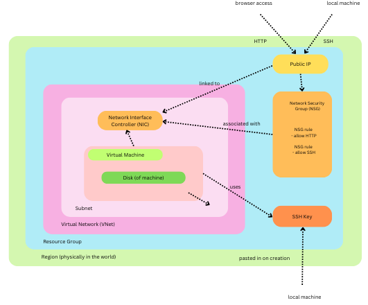
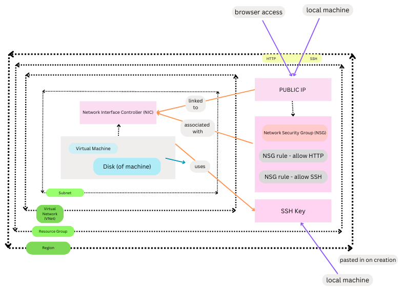

# My notes:
** more details underneath daily notes.

- [My notes:](#my-notes)
- [What is VNet?](#what-is-vnet)
- [Azure VM Labelling and Networking](#azure-vm-labelling-and-networking)
  - [Creating an Azure Test VNet](#creating-an-azure-test-vnet)
  - [Deleting an Azure VNet](#deleting-an-azure-vnet)
  - [Creating Our Actual VNet](#creating-our-actual-vnet)
    - [Requirements:](#requirements)
    - [Steps to Create Subnets:](#steps-to-create-subnets)
  - [Creating an SSH Key Pair](#creating-an-ssh-key-pair)
    - [Steps to Generate an SSH Key Pair:](#steps-to-generate-an-ssh-key-pair)
    - [Step 2: Copy the Public Key](#step-2-copy-the-public-key)
    - [Step 3: Add the Public Key to Azure](#step-3-add-the-public-key-to-azure)
    - [Step 4: Test SSH Connection](#step-4-test-ssh-connection)
  - [Planning and Creating a Virtual Network (VNet) in Azure](#planning-and-creating-a-virtual-network-vnet-in-azure)
    - [Why create a VNet?](#why-create-a-vnet)
    - [Steps to Create a VNet in Azure:](#steps-to-create-a-vnet-in-azure)
    - [What Information Do You Need to Plan a VNet?](#what-information-do-you-need-to-plan-a-vnet)

# What is VNet?
A VNet (short for Virtual Network) is a cloud-based network that allows resources like virtual machines (VMs), databases, and other services to securely communicate with each other, the internet, and on-premises networks. 
It’s a fundamental building block in cloud environments (such as Microsoft Azure or AWS) for managing communication between resources.

# Azure VM Labelling and Networking

## Creating an Azure Test VNet

Create a Virtual Network (VNet) on Azure for testing purposes:
* portal.azure.com

1. Search for **"Virtual Network"** on the Azure Portal.
2. Click **Create**.
3. You only have access to the **"tech264"** resource group.
4. Name your VNet using the naming convention, for example: **tech264-georgia-vnet**.
5. Add your **owner tag** as a key to identify the creator.
6. Click **Review + Create** to proceed.
7. Once deployment is complete, your VNet will be created.
8. You will only see one resource (the VNet), but you can add more resources later.
9. Go to the resource to view its details.

---

## Deleting an Azure VNet

To delete a Virtual Network:

1. Search for **"Resource Groups"** in the Azure Portal.
2. You will see everything in the resource group.
3. Click into the resource group and select the VNet you want to delete.
4. Click the three dots at the top right and select **Delete**, but **do not delete the entire resource group**.

---

## Creating Our Actual VNet

Creating a Virtual Machine (VM) inside a Virtual Network (VNet). A VM is essentially a computer hosted in the cloud that we can access from our local machines.

### Requirements:
- The VM must reside in a **subnet** within a VNet. The VNet is a logical construct in the cloud to manage IP addressing and subnets.
- The **VNet** (tech264-georgia-2-subnet-vnet) has a CIDR block of `10.0.0.0/16`, which gives around **65,000 IP addresses**.
- `CIDR` block: used to represent a range of IP addresses.
- `CIDR` (Classless Inter-Domain Routing) blocks define the size of address ranges within a network.

### Steps to Create Subnets:
1. **Public Subnet**: Accessible by anyone. The resources (like VMs) can be directly accessed from the internet, often by associating a public IP.
   - **CIDR block**: `10.0.2.0/24`
   - This range provides **256 IP addresses**.
   
2. **Private Subnet**: Restricted, more secure subnet. Typically does not allow direct access from the internet. It is usually secured and can only be accessed through a VPN, VNet peering, or other internal methods.
   - **CIDR block**: `10.0.3.0/24`
   
3. Make sure to adjust the CIDR blocks accordingly.
   - The CIDR blocks must be chosen carefully to ensure non-overlapping IP ranges
   - Each subnet must have its own unique, non-overlapping CIDR range within the parent VNet CIDR block.
   
4. Only change the **IPv4** addresses (do not touch IPv6).

5. Add the **owner tag** to identify yourself as the creator.
   - `Tags` help manage resources by identifying ownership, environment, or purpose, especially in large cloud deployments.
   - aka, they are used to group things together. 
6. Check Security - most likey, you need to make no modifications. 

---

## Creating an SSH Key Pair

To securely access your Azure VM, you will need to create an SSH key pair. The **private key** will stay on your local machine, while the **public key** will be uploaded to Azure.
* .pem key = PRIVATE (also .ssh folder). A private key when generated yourself: doesn't have any extension. 
* KEEP NO WHERE NEAR GIT REPOs.
*  NEVER INITIALISE. 

### Steps to Generate an SSH Key Pair:

1. Open **Git Bash** (or terminal) on your local machine.
2. Make sure you are in your home directory (e.g., `C:/Users/your-username`).
3. `ls -a` (display all the hidden files - files starting with a dot). Typically, you may not have a .shh folder, here's how to create one:
4. Create an `.ssh` folder if it doesn't exist:
   ```bash
   mkdir .ssh```
5. Change directory into your .ssh folder: cd `.shh`
6. Generate the SSH key pair using this command: `ssh-keygen -t rsa -b 4096 -C "your_email@example.com"`
   * `-t rsa`: Specifies that the type of key is RSA.
   * `-b 4096`: Sets the key to be 4096 bits long (high security).
   * `-C`: Adds a comment, in this case, your email address.
7. When prompted, hit Enter to accept the default filename (or you can specify a name like tech264-georgia-az-key).
8. Press Enter again if you don't want to use a passphrase.
9. After generating, the key pair will be stored in two files:
   * Private key: tech264-georgia-az-key
   * Public key: tech264-georgia-az-key.pub
10. To view the public key, `run:cat tech264-georgia-az-key.pub`
11. Copy the entire public key (starting from ssh-rsa and ending with your email address).

### Adding the Public Key to Azure:
1. In the Azure Portal, search for SSH keys.
2. Create a new key and name it exactly as you did on your local machine, for example: tech264-georgia-az-key.
3. Paste the public key you copied from the local machine.
4. Add the owner tag.
5. Click Create to save the SSH key in Azure.

With these instructions, you can set up and manage virtual networks and secure access to your virtual machines on Azure.


# Architecture of a Virtual Machine
* `A Virtual Machine` (VM) is like a pretend computer running inside your real computer. Imagine you have a Windows computer, but you want to run a Linux operating system on it without buying a new computer. That's where a VM comes in — it lets you create a "fake" Linux computer inside your Windows computer.
* Consists of various key components that work together to emulate a physical computer. 

# Diagram
This diagram shows `how a VM is connected to a network` and `controlled via security groups`, ensuring only `specific` types of `traffic` (HTTP for web and SSH for remote terminal access) `can reach the VM`. 

It emphasises the importance of security groups (NSGs) in managing access and the key role of public IPs for external access to the VM from local machines.





## Looking at the components and interactions involved in setting up a virtual machine (VM) in a cloud environment (based on the diagrams above).
* NIC is linked to the public IP adress. You can detachit from the vard and link it to something else.
* * How does the traffic move through to gain access to that VM?
* Traffic has to be filtered through the NSG?
* NSG can be used by multiple VMs at once. 


### Components and Interactions
#### Network Interface Card (NIC)
* The NIC is a critical component that connects the VM to the network.
* It can be linked to a public IP address, allowing the VM to communicate with external networks (e.g., the internet).
* The NIC can be detached from one VM and attached to another if needed.
#### Public IP Address
* A public IP address is assigned to the NIC, making the VM accessible from the internet.
* This IP address is used by external clients to send traffic to the VM.

### Traffic Flow to the VM
#### Traffic Initiation
* When a client wants to communicate with the VM, it sends a request to the public IP address associated with the NIC.

#### Traffic Filtering
* The traffic first reaches the NIC. The NIC acts as a gateway for all incoming and outgoing traffic.
* The NIC can have security rules (Network Security Groups) that filter traffic based on IP addresses, ports, and protocols.

#### Traffic Routing
* After passing through the NIC, the traffic is routed to the VM.
* The VM processes the incoming traffic and sends responses back through the NIC.

### Key Points
*` NIC and Public IP`: The NIC is linked to a public IP address, making the VM accessible from the internet. You can detach the NIC and link it to another VM if needed.
* `Traffic Filtering`: All traffic to and from the VM is filtered through the NIC. Security rules on the NIC can control which traffic is allowed or denied.
* `Traffic Flow`: Traffic from external clients reaches the public IP, passes through the NIC, and is then routed to the VM.

### Example Scenario
* **Client Request**: A user on the internet sends a request to the public IP address of your VM.
* **NIC Filtering**: The NIC checks the request against its security rules. If the request is allowed, it proceeds.
* **VM Processing**: The request reaches the VM, which processes it and generates a response.
* **Response**: The response is sent back through the NIC to the client.

--- 
## Looking at the components and interactions involved in setting up a virtual machine (VM) in a cloud environment (based on the diagrams above)

## Main Components:
`Virtual Machine` (VM):
* The VM itself is represented as a box with a disk attached (the Disk of the machine). This is the actual virtualized computer that runs the operating system and applications. The VM uses the attached disk for storage.

`Network Interface Controller` (NIC):
* The NIC is associated with the VM and serves as its link to the network. It’s the interface through which the VM communicates with the outside world.

`Public IP Address`:
* The Public IP is associated with the NIC, allowing external access to the VM. This is how you can connect to the VM from the internet or another external location, either via SSH (for command-line access) or HTTP (for web access).
  
`Network Security Group` (NSG):
* The NSG acts as a firewall that controls what kind of traffic can reach the VM. In the diagram, it has two specific rules:
NSG Rule – allow HTTP: This allows web browser access (port 80 or 443).
NSG Rule – allow SSH: This allows Secure Shell (SSH) access, typically on port 22, enabling remote terminal access to the VM.

`SSH Key`:
* The SSH Key is used for secure login into the VM. When the VM was created, this key was generated or provided, and it is required to access the VM remotely via SSH from a local machine.

## How These Components Interact:
1. `Virtual Machine Setup`:
   * The VM has a Disk for its storage and a NIC that allows network access. The VM can be accessed and used through this network interface.

2. `Public IP and Browser/SSH Access`:
   * The Public IP is what links your local machine to the VM over the internet. When you try to connect to the VM, the network traffic goes through the Public IP.
   * If you’re connecting through your browser (for web services), traffic is routed via the HTTP NSG rule.
   * If you're connecting via the command line, the traffic is routed via the SSH NSG rule using the SSH Key.

3. `Security Control with NSG`:
   * The NSG ensures that only traffic specified by its rules can reach the VM. In this case, only HTTP (web traffic) and SSH (remote access) are allowed. Any other types of traffic (e.g., FTP, or other non-specified protocols) will be blocked unless explicitly allowed by NSG rules.

4. `Regions, Resource Groups, Virtual Networks, and Subnets`:
   * The Region represents the geographic location where your resources (VM, network) are deployed.
   * The Resource Group is a container that holds the related resources for the VM and its network setup.
   * The Virtual Network (VNet) defines the network boundaries within the cloud, and the Subnet represents a segment within that network where the VM resides.

---
## Flow of Access:
`From the Local Machine`:
* When you want to access the VM from your local machine, your connection passes through the public IP.
* If you are using a web browser (HTTP), it follows the allow HTTP rule to reach the VM.
* If you are using SSH (to manage the VM), it follows the allow SSH rule. You must also provide the SSH key that was created when the VM was set up for secure access.
  
`Inside the Network`:
* The VM is linked to the NIC, which allows it to communicate over the Virtual Network (VNet), which could contain other resources and VMs within the same region, resource group, and subnet.


### Notes from class:
---
## Key Components of a VM

1. **Region**:
   - **Definition**: A geographical area where your resources are physically located.
   - **Use**: Helps in choosing the closest location to your users for better performance and compliance with local regulations.

2. **Resource Group**:
   - **Definition**: A container that holds related resources for an application.
   - **Use**: Organizes and manages resources like VMs, storage accounts, and virtual networks in a single unit.

3. **Virtual Network (VNet)**:
   - **Definition**: A network that allows VMs to communicate with each other and with the internet.
   - **Use**: Provides isolation, segmentation, and security for your resources, similar to how a house provides structure and boundaries.

4. **Subnet**:
   - **Definition**: A segment of a VNet that can contain multiple VMs.
   - **Use**: Divides the VNet into smaller, manageable sections, like rooms within a house, to improve organization and security.

5. **Virtual Machine**:
   - **Definition**: The actual virtualized instance of a computer.
   - **Use**: Runs applications and services, just like a physical computer.

6. **Disk**:
   - **Definition**: Storage for the VM's operating system, applications, and data.
   - **Use**: Stores all the files necessary for the VM to function, similar to a hard drive in a physical computer.

7. **Network Interface Controller (NIC)**:
   - **Definition**: A hardware component that connects the VM to the network.
   - **Use**: Enables communication between the VM and other devices, both within the VNet and externally.

8. **Public IP**:
   - **Definition**: An IP address that is accessible from the internet.
   - **Use**: Allows external users to access the VM, similar to how a public address lets people find your house.

9. **Network Security Group (NSG)**:
   - **Definition**: A set of rules that control inbound and outbound traffic to VMs.
   - **Use**: Acts like a firewall, protecting your VMs by allowing or denying traffic based on specified rules.

10. **NSG Rule - Allow HTTP**:
    - **Definition**: A rule that permits HTTP traffic.
    - **Use**: Allows web traffic to reach your VM, enabling web servers to function.

11. **NSG Rule - Allow SSH**:
    - **Definition**: A rule that permits SSH traffic.
    - **Use**: Allows secure remote access to your VM for management and configuration.

12. **SSH Key**:
    - **Definition**: A cryptographic key used for secure access to the VM.
    - **Use**: Acts like a padlock, ensuring that only authorized users can access the VM.


## Steps to Create a New SSH Key Pair and Add the Public Key to Azure
SSH keys are like a pair of locks and keys that let you securely log in to a server without needing a password. You create the pair on your computer and then put the public "lock" on the server so you can access it with your private key.

### Step 1: Generate an SSH Key Pair on Your Local Computer
1. Open a terminal (if you're on Linux or macOS) or Git Bash/PowerShell (if you're on Windows).
2. Type this command to create a new key pair:
```bash
ssh-keygen -t rsa -b 4096 -C "your_email@example.com"
```
   * This means you're creating a strong key (`-t rsa`), making it 4096 bits (`-b 4096`), and adding a comment with your email address (`-C`).
3. You'll be asked where to save the key. Just press Enter to use the default location (it will be saved in the `.ssh` folder in your home directory).
4. It will also ask if you want a password for the key. You can press Enter if you don't want a password, or enter one for extra security.

### Step 2: Copy the Public Key
1. To see your public key, run this command:
```bash
cat ~/.ssh/id_rsa.pub
```
2. Copy the entire output (this is your public key).

### Step 3: Add the Public Key to Azure
1. Log in to the Azure Portal.
2. Go to Virtual Machines and choose the VM you want to access.
3. In the Settings, look for Reset Password, and select SSH public key as the mode.
4. Paste your public key into the field and save. 

### Step 4: Test SSH Connection
1. To log in to your Azure VM using your private key, run this command:
```bash
ssh -i ~/.ssh/id_rsa username@vm_ip_address
```
   * (Replace username with your Azure VM username and vm_ip_address with the public IP of your VM.)

## Planning and Creating a Virtual Network (VNet) in Azure
* A `Virtual Network` (VNet) is like a private network in the cloud, where you can place and connect your virtual machines securely.

### Why create a VNet?
* `Security`: You can control which machines or services can communicate within your VNet and with the internet.
* `Private Communication`: Machines inside the VNet can talk to each other without needing to go through the internet.
* `Custom IP Addressing`: You get to decide how IP addresses are assigned inside your network.

### Steps to Create a VNet in Azure:
1. Log in to Azure Portal.
2. Click on Create a Resource and search for Virtual Network.
3. Set up the VNet by entering details like:
   * Name: A unique name for your network.
   * Region: Choose where in the world you want your network.
   * Address Space: Think of this as the "range" of IP addresses your network will use (e.g., 10.0.0.0/16).
4. `Subnets`: Break the network into smaller sections called subnets, each with its own IP range (e.g., 10.0.1.0/24 for one part, and 10.0.2.0/24 for another).
5. `Security`: You can set up Network Security Groups (NSGs), which let you control which types of traffic (e.g., web traffic, SSH) are allowed into and out of your VMs.
6. Once all the details are filled in, click Create.

### What Information Do You Need to Plan a VNet?
1. `Address Space`:
   * This is the range of IP addresses you want to use in your VNet, written in CIDR notation (like 10.1.0.0/16).
2. `Subnets`:
   * Subnets break the VNet into smaller pieces. Each piece will have its own range of IP addresses.
3. `Security`:
   * You can decide to use Network Security Groups (NSGs) to manage who can access different parts of the network.
4. `Connectivity`:
   * Do you need to connect your VNet to other networks, like your office network? You may need a VPN Gateway for that.
5. `Region`:
   * Choose where your VNet will be located. It’s best to keep it close to your other resources to reduce delays.


