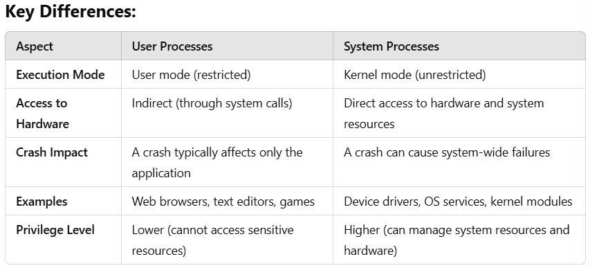

# Documentation of Linux code along (02/10/2024)

- [Documentation of Linux code along (02/10/2024)](#documentation-of-linux-code-along-02102024)
- [Raw Notes:](#raw-notes)
  - [Linux:](#linux)
  - [Basic Linux Commands](#basic-linux-commands)
  - [Bash Shell Explanation](#bash-shell-explanation)
  - [Ramon's tips and tricks](#ramons-tips-and-tricks)
- [Some Linux Commands](#some-linux-commands)
  - [download a file: using the `curl` command to downloada an image.](#download-a-file-using-the-curl-command-to-downloada-an-image)
  - [Copying a file (e.g., cat image).](#copying-a-file-eg-cat-image)
  - [Make a directory - Mkdir](#make-a-directory---mkdir)
  - [How you name files and folders](#how-you-name-files-and-folders)
  - [Create a file](#create-a-file)
    - [Summary:](#summary)
  - [Pipe (|)](#pipe-)
  - [grep](#grep)
  - [Navigating files and folders](#navigating-files-and-folders)
  - [Logging out of Linux](#logging-out-of-linux)
- [CHAT GPT 3.5 notes adaptation: do we want this?](#chat-gpt-35-notes-adaptation-do-we-want-this)
- [Basic Linux Commands](#basic-linux-commands-1)
    - [Navigation \& File Management](#navigation--file-management)
    - [Useful `ls` Variants](#useful-ls-variants)
    - [Directory Traversal](#directory-traversal)
  - [Additional Linux Concepts](#additional-linux-concepts)
    - [System \& User Information Commands](#system--user-information-commands)
    - [Shell \& Process Management](#shell--process-management)
  - [Ramon's Tips and Tricks](#ramons-tips-and-tricks-1)
    - [Command Shortcuts](#command-shortcuts)
    - [Viewing Hidden Files and Directories](#viewing-hidden-files-and-directories)
  - [Useful Commands](#useful-commands)
    - [System Maintenance](#system-maintenance)
  - [Downloading Files with `curl`](#downloading-files-with-curl)
    - [Basic File Download](#basic-file-download)
  - [download a file: using the `curl` command to downloada an image.](#download-a-file-using-the-curl-command-to-downloada-an-image-1)
- [Making our first bash script: Original notes.](#making-our-first-bash-script-original-notes)
- [Navigating the Remote Server](#navigating-the-remote-server)
- [Basic File Management](#basic-file-management)
  - [Create a Directory:](#create-a-directory)
  - [Delete Files or Directories:](#delete-files-or-directories)
- [Editing Files with Nano](#editing-files-with-nano)
  - [Saving and Exiting in Nano:](#saving-and-exiting-in-nano)
- [Guide to Connecting, Managing Files, and Creating a Script to Set Up Nginx](#guide-to-connecting-managing-files-and-creating-a-script-to-set-up-nginx)
  - [1. Always Test Commands Manually First](#1-always-test-commands-manually-first)
- [Writing a Bash Script](#writing-a-bash-script)
  - [Step 2: Create and Edit the Script:](#step-2-create-and-edit-the-script)
  - [Step 3: Write the Script:](#step-3-write-the-script)
  - [Test and Control Nginx](#test-and-control-nginx)
  - [Step 4: Save and Exit:](#step-4-save-and-exit)
- [Making the Script Executable and Running It](#making-the-script-executable-and-running-it)
- [Managing Nginx](#managing-nginx)
  - [Check Nginx Status:](#check-nginx-status)
  - [Restart Nginx:](#restart-nginx)
  - [Enable Nginx to Start on Boot:](#enable-nginx-to-start-on-boot)
- [Environment Variables](#environment-variables)
- [Environment Variables in the Context of Azure and Linux/Git Bash](#environment-variables-in-the-context-of-azure-and-linuxgit-bash)
  - [What Are Environment Variables?](#what-are-environment-variables)
    - [Notes from class:](#notes-from-class)
  - [Why Do We Use Environment Variables?](#why-do-we-use-environment-variables)
  - [Common environment variables in Linux](#common-environment-variables-in-linux)
  - [Environment variables in Azure](#environment-variables-in-azure)
    - [Azure CLI authentication:](#azure-cli-authentication)
    - [Storing sensitive information:](#storing-sensitive-information)
  - [Managing Environment Variables in Git Bash](#managing-environment-variables-in-git-bash)
    - [View Environment Variables:](#view-environment-variables)
    - [Set a Temporary Environment Variable:](#set-a-temporary-environment-variable)
    - [Set a Permanent Environment Variable:](#set-a-permanent-environment-variable)
- [Using Environment Variables in Azure and Scripts](#using-environment-variables-in-azure-and-scripts)
  - [In Azure:](#in-azure)
  - [In Scripts:](#in-scripts)
  - [**Explanation**: This script would echo the value of the AZURE\_REGION environment variable, which could be set to different values depending on where you’re deploying your app.](#explanation-this-script-would-echo-the-value-of-the-azure_region-environment-variable-which-could-be-set-to-different-values-depending-on-where-youre-deploying-your-app)
  - [making MYNAME env var persistent: post-assessment review.](#making-myname-env-var-persistent-post-assessment-review)
- [Two Types of Processors: User Processors vs. System Processors](#two-types-of-processors-user-processors-vs-system-processors)
    - [Characteristics:](#characteristics)
    - [Example of User Process:](#example-of-user-process)
    - [Characteristics:](#characteristics-1)
  - [Example of System Process:](#example-of-system-process)
  - [Conclusion](#conclusion)
- [Codealong Notes:](#codealong-notes)
  - [What is an environment variable and how do we make one?](#what-is-an-environment-variable-and-how-do-we-make-one)
- [Code-along: Creating and Managing Environment Variables](#code-along-creating-and-managing-environment-variables)
  - [Step 1: Create a basic variable](#step-1-create-a-basic-variable)
  - [This will print "georgia" on the screen.](#this-will-print-georgia-on-the-screen)
  - [Step 2: Turn the Variable into an Environment Variable](#step-2-turn-the-variable-into-an-environment-variable)
  - [Now, the MYNAME variable is available to any process or script you run.](#now-the-myname-variable-is-available-to-any-process-or-script-you-run)
  - [Step 3: Make the Variable Persistent](#step-3-make-the-variable-persistent)
- [Managing Processes](#managing-processes)
  - [System processor commands](#system-processor-commands)
- [Killing Processes](#killing-processes)
    - [Running a Process in the Foreground:](#running-a-process-in-the-foreground)
    - [Running a Process in the Background:](#running-a-process-in-the-background)
    - [Viewing Background Jobs:](#viewing-background-jobs)
- [Killing a Process:](#killing-a-process)
    - [Gentle Termination (Signal 1 - Hangup):](#gentle-termination-signal-1---hangup)
    - [Standard Termination:](#standard-termination)
    - [Brute Force Termination (Signal 9 - Kill):](#brute-force-termination-signal-9---kill)
- [FRIDAY CODEALONG](#friday-codealong)
- [Deleting Your Virtual Machine](#deleting-your-virtual-machine)
  - [in case you deleted your first bash script (above).](#in-case-you-deleted-your-first-bash-script-above)
  - [The first two commands that we ru on a new virtual machine:](#the-first-two-commands-that-we-ru-on-a-new-virtual-machine)
- [How to add a port:](#how-to-add-a-port)
- [What is scp?](#what-is-scp)
  - [How does scp work?](#how-does-scp-work)
  - [Why use scp?](#why-use-scp)
- [GnuPG (GNU Privacy Guard)](#gnupg-gnu-privacy-guard)
- [cURL (Client URL)](#curl-client-url)
- [Why Use These Tools?](#why-use-these-tools)
- [Making a Database in Azure - MongoDB](#making-a-database-in-azure---mongodb)
  - [What's the export DB\_HOST for?](#whats-the-export-db_host-for)


# Raw Notes:

## Linux: 
* What is linux? a clone of the unix operating system that was used on large mainframes. 
  * Linux is a free, open source operating system, released under the GNU General Public License (GPL). Anyone can run, study, modify, and redistribute the source code, or even sell copies of their modified code, as long as they do so under the same license.
* Scales.
* Lots of different distributions out there.


## Basic Linux Commands 
* `ls`: lists the contents of the current directory.
* `cd`: changes the current directory.
* `pwd`: prints the working directory (shows where you are).
* `touch`: creates an empty file.
* `cat`: displays the contents of a file.
* `mv`: moves or renames files or directories.
* `cp`: copies files or directories.
* `rm`: removes files or directories.
* `ls --help`: used with command-line utilities to display usage information or a help guide for that command.
* `ls -a`: The -a option with the ls command lists all files, including hidden files and directories (those starting with a dot .).
* `touch --`: The -- in a command is often used to signify the end of command options, meaning that anything after -- is treated as a file name, even if it starts with a -.
* `cd ..`: changes the directory to the parent directory (moves up one level in the directory structure).
* `cd ../..`: changes the directory up two levels in the directory structure.
* `uname --help`:Provides a summary of the available options for the uname command.
* `uname -a`: Displays comprehensive system information.
* `whoami`: Displays the username of the current user logged into the system. 
* `cat /etc/shells`: Lists all the available shells installed on the system.
* `ps --p $$`: Displays information about the current shell process.

---

## Bash Shell Explanation
* `Bash Shell`: The Bash shell is a *command-line interpreter* that processes and *executes the commands* you type in the terminal. When you enter a command, the shell interprets it and communicates with the operating system to carry out the task.

* `Bash Process`: In technical terms, when you open a terminal, it starts a process for the shell (like Bash) that listens to your commands and runs them.
---

## Ramon's tips and tricks
`tab`: auto complete.
`history`: gives you a history of every command youve used since youve logged into the machine. 
* there is a clear history command to cover yourself with credentials.
`!(no. of command in history)` and hit enter - it runs the command after looking at the list of: history. Needs to be after using the command 'history'.
`history -w`: clear history file permanently. 
`history -c`: clears the history. 
`ls -a`: see the hidden files and folders. In blue = folders, files = in white.
`ls --help`: for command prompt options.
`-l`: use a long listing format. Long version with lost of detail.
`ls -al`: a lot of information about your hidden files and folders. When you do this command, you might see along the left side of the column: 'dr' = directory (folder), 'rw' = a file.
`.`: current directory.
`..`: parent folder.

# Some Linux Commands
- `uname` : Displays system information.
- `whoami` : Tells you who is logged in.
- `ps` : Displays current processes.
- `history` : Gives youl log of commands used.
  - `history -c` : Clears the history in memory for the current session.
  - `history -w` : Writes the cleared history to the .bash_history file, which effectively empties the history file.
- `ls -al` : Shows all files, as well the long format listing for more detailed information on each file / directory. A directory will appear blue.
- `curl` : Used to transfer data from or to a server using various network protocols, such as HTTP, HTTPS, FTP, and others. Very powerful tool.
- `wget` : Used to download files from the web.
- `file` : Used to see what the file type of specified file.
- `cp` : Copies a file.
- `rm` : Removes a file.
- `sudo` : Super user command input.
  - `sudo apt update -y` : Makes sure the package information is up to date, but doesn't install anything.
  - `sudo apt upgrade -y` : **Dangerous.** Installs packages which could break any work that requires particular versions.
- `cd /` : Changes the current working directory to the root directory.
- `sudo su` : Switches you to the superuser (root) account.
  - `exit` can be used to leave super user.


## download a file: using the `curl` command to downloada an image.
* `curl`: (short for "Client URL") a command line tool that enables data transfer over various network protocols.
* `curl https://cdn.britannica.com/39/7139-050-A88818BB/Himalayan-chocolate-point.jpg -- output cat.jpg`
* save to specific folder: `curl https://cdn.britannica.com/39/7139-050-A88818BB/Himalayan-chocolate-point.jpg --output /path/to/folder/himalayan-cat.jpg`
* `pwd`: to see the download and wherever it is: /home/adminuser
* `ls`: to see the downloads. 
* `mv himalayan-cat.jpg ~/images/`: to move the image, make sure you know the path!.
`mv chicken-joke.txt funny-stuff`

## Copying a file (e.g., cat image).
* 'cp': copy
* `cp cat.txt cat jpg`: copies a file.
* `ls`
* 'rm cat.txt`: to remove a file.
* `ls`: to check 

## Make a directory - Mkdir
* `mkdir funny-stuff`
* `ls`: to check

## How you name files and folders
* DO NOT PUT SPACES IN, THIS WILL CREATE MANY DIRECTORIES.
* `mkdir my_pictures`: 
* `ls`: 
* `rmdir <directory name>`: remove a directory.
* `rm -r <name of directory>`: also removes directory.
* `mkdir "my pictures"`: creates a directory folder. 
* `ls`: check.
* `cd my\ pictures`: cd to my pictures folder. 
* `cd ..`: back to home directory.

## Create a file
* `touch chicken-joke.txt`: Creates a new, empty file named chicken-joke.txt if it doesn’t already exist.
* `ls`
* `nano chicken-joke.txt`: nano in to the chicken-joke file.
* `Ctrl+s` = save
* `Ctrl+x` = exit
* `cat chicken-joke.txt`: shows the text on the screen.

* `head -2 chicken-joke.txt`: gives first 2 lines.
* `tail -2 chicken-joke.txt`: last two lines.

* `nl chicken-joke.txt`: numbers the lines.

* `cat chicken-joke.txt | grep chicken`: 
* `cat chicken-joke.txt | grep the`:
  *  `|` (pipe): The pipe symbol *takes the output from the command* on its left (cat chicken-joke.txt) and *passes it as input to the command on its right* (grep chicken).
  `grep` chicken: This command *searches for the string* “chicken” *within the input it receives *(which is the content of chicken-joke.txt in this case). It then outputs only the lines that contain the string “chicken”.


The command `cat chicken-joke.txt | grep chicken` in Git Bash does the following:

1. **`cat chicken-joke.txt`**: This part of the command prints the contents of the file `chicken-joke.txt` to the standard output (your terminal). `cat` is short for "concatenate" and is used to display the contents of files.

2. **`|` (pipe)**: The pipe `|` takes the output of the `cat` command (i.e., the contents of the file `chicken-joke.txt`) and passes it as input to the next command, which is `grep`.

3. **`grep chicken`**: `grep` is a command-line tool used for searching text using patterns (regular expressions). In this case, `grep chicken` searches for lines in the input that contain the word "chicken."

### Summary:
The command reads the contents of `chicken-joke.txt` and then filters and displays only the lines that contain the word "chicken."


## Pipe (|)
The pipe symbol (|) is used in Unix-like operating systems to pass the output of one command as input to another command. It’s a way to chain commands together, allowing you to perform complex tasks in a single line.

## grep
The grep command is used to search for specific patterns or strings within text. It stands for “global regular expression print.” When you use grep, it looks through the input it receives and prints out lines that match the pattern you specify.


---

## Navigating files and folders
* Sometimes it'll say that the package does not exist. This is how we delt with it:
* Install package
* `apt install tree`: only works if you've got root user permissions.
* Root user: the administrater, the 'super user' (sudo = superuser do).
* `sudo apt install tree`: output: no apt package "tree". Because it has no knowledge of it, its not on its list and it doesnt know where to get it from. 
* Update package list: `sudo apt update -y` (the '-y' stops it from prompting you). This is a safe command. It's jst updated the packages list. It hasnt installed anything.
* Output: 24 packages can be upgraded. Run 'apt list --upgradable' to see them.
* `sudo apt install tree`: its working!
* `tree`: shows you current folder down to directory. Creates the hierarchy between files in a Git repository. 

* upgrade command: upgrade all the packages we have installed: this could break the linux system. Your system may depend on a particular package's version. To upgrade this, is to break it. 
* When you first create a vm and log in to it: `sudo apt update -y` (safe) and upgrade ALL packages straight away `sudo apt upgrade -y` THIS COULD BREAK YOUR SOFTWARE.

* `pwd`:
* home directory and root directory are differetn! 

`cd /`:  in Linux switches to the root directory. > pwd (/) > ls (program folders and files) The TOP of the directory tree. 

log in to root temporarily: log in as super user temporarily: `sudo su`: name has changed `root@tech264-georgia-first-vm` > ls > `exit` to become admin user (like normal). 


## Logging out of Linux
adminuser@tech264-georgia-first-vm:/$ `exit`
logout
Connection to 172.167.29.191 closed.
back to: georg@Aceroma MINGW64 ~


# CHAT GPT 3.5 notes adaptation: do we want this?
# Basic Linux Commands 

### Navigation & File Management
- **`ls`**: Lists the contents of the current directory.
- **`cd`**: Changes the current directory.
- **`pwd`**: Prints the working directory (shows where you are).
- **`touch`**: Creates an empty file.
- **`cat`**: Displays the contents of a file.
- **`mv`**: Moves or renames files or directories.
- **`cp`**: Copies files or directories.
- **`rm`**: Removes files or directories.

### Useful `ls` Variants
- **`ls --help`**: Displays usage information or a help guide for `ls` or other command-line utilities.
- **`ls -a`**: Lists all files, including hidden files and directories (those starting with a dot `.`).
- **`ls -al`**: Shows detailed information (long format) about all files, including hidden ones.

### Directory Traversal
- **`cd ..`**: Changes to the parent directory (moves up one level).
- **`cd ../..`**: Moves up two levels in the directory structure.

---

## Additional Linux Concepts

- **Linux**: A clone of the Unix operating system, used on various devices from large servers to personal computers.
  - **Distributions**: Many different versions (distributions) of Linux, like Ubuntu, Fedora, etc.
  - **Scalability**: Linux can scale to run on anything from small devices to large mainframes.

---

### System & User Information Commands
- **`uname --help`**: Displays usage options for the `uname` command.
- **`uname -a`**: Displays detailed system information.
- **`whoami`**: Prints the username of the current user.

### Shell & Process Management
- **Bash Shell**: A command-line interpreter that runs commands.
- **`cat /etc/shells`**: Displays a list of available shells.
- **`ps --p $$`**: Shows the current process related to the shell.

---

## Ramon's Tips and Tricks

### Command Shortcuts
- **`tab`**: Auto-completes file names and commands.
- **`history`**: Lists all commands used in the current session.
  - **`history -c`**: Clears the command history for the current session.
  - **`history -w`**: Clears the history file permanently.
- **`!(command number)`**: Runs a previous command from history by its number.

### Viewing Hidden Files and Directories
- **`ls -a`**: Shows hidden files and folders.
  - Directories appear in blue, files appear in white.
- **`ls -al`**: Displays detailed information about both hidden and visible files.
  - `dr`: Represents directories.
  - `rw`: Represents read/write permissions on files.

---

## Useful Commands

- **`uname`**: Displays system information.
- **`whoami`**: Displays the current logged-in user.
- **`ps`**: Shows currently running processes.
- **`curl`**: Transfers data from or to a server using various network protocols (e.g., HTTP, HTTPS).
- **`wget`**: Downloads files from the web.
- **`file`**: Identifies the type of a file.

### System Maintenance
- **`sudo`**: Runs a command as the superuser (administrator).
  - **`sudo apt update -y`**: Updates package lists.
  - **`sudo apt upgrade -y`**: Installs updates, but can break dependencies on certain versions of software.
- **`cd /`**: Changes the working directory to the root directory.
- **`sudo su`**: Switches to the superuser account.
  - **`exit`**: Returns to the previous user account.

---

## Downloading Files with `curl`

### Basic File Download
- **`curl`**: A tool for transferring data over various protocols (HTTP, HTTPS, FTP, etc.).
- Example: Download an image:
  ```bash
  curl https://cdn.britannica.com/39/7139-050-A88818BB/Himalayan-chocolate-point.jpg --output cat.jpg
  ```


## download a file: using the `curl` command to downloada an image.
* `curl`: (short for "Client URL") a command line tool that enables data transfer over various network protocols.
* `curl "link here" --output cat.jpg`
* `curl https://cdn.britannica.com/39/7139-050-A88818BB/Himalayan-chocolate-point.jpg --output cat.jpg`
* save to specific folder: `curl https://cdn.britannica.com/39/7139-050-A88818BB/Himalayan-chocolate-point.jpg --output /path/to/folder/himalayan-cat.jpg`
* `pwd`: to see the download and wherever it is: /home/adminuser
* `ls`: to see the downloads. 
* `mv himalayan-cat.jpg ~/images/`: to move the image, make sure you know the path!.


# Making our first bash script: Original notes.
ALWAYS DO IT MANUALLY FIRST - to make sure you KNOW the commands work before you use them. 
* planning out our script file.
* make a new file called 'provision'.
* `nano provision.sh`
* Specifiy the shell you want it to run underneath the commands.
* shbang: `#!`: NEED EVERYTIME YOU WRITE A BASH SCRIPT. need on the top of every bash script. its telling it the location of the bash shell.
* after (no spaces) path to the bashshell: `#!/bin/bash`
* nginx: 

`sudo apt install -y`

make sure nginx is running: `sudo systemctl` (control system processes) OR `sudo systemctl status nginx`

`Ctrl+z`: to get out of it. (less harsh)
`Ctrl+c`:

how to restear nginx: `sudo systemctl restart nginx`

how to enable nginx: `sudo systemctl enable nginx`

to run the script: in linux you have to tell them where the script is: `./provision.sh`

`chmod +x provision.sh`


# Navigating the Remote Server
Once you're connected to the server, you'll want to move around the file system and see what's there.

`ls`: This command lists all the files and directories in your current location.

`tree`: View Directory Structure: This shows the folder structure in a tree-like format, displaying directories and subdirectories.

`cd <directory-name>`: Change Directory: You use this command to move into a specific folder. e.g., cd 'funny-stuff/'. Explanation: You are moving into the funny-stuff folder.


# Basic File Management
Now, you can manage files by moving, creating, and deleting them.

Move Files: `mv <file> <destination-directory>` The mv command moves a file from one location to another. It can also be used to rename files.
```bash
mv chicken-joke.txt funny-stuff/
# This command moves the file chicken-joke.txt into the funny-stuff folder.
```

## Create a Directory:

`mkdir <directory-name>`: mkdir stands for "make directory." It creates a new folder.
```bash
mkdir funny-jokes
# You are creating a new directory called funny-jokes.
```

## Delete Files or Directories:
* Delete a file:

```bash
rm <file-name>
# rm stands for "remove" and is used to delete a file.
```

* Delete a directory (and all its contents):
```bash
rm -r <directory-name>
# The -r option means "recursive," which tells the command to delete the folder and everything inside it.
```
Example:

```bash
rm -r funny-stuff/
# You are deleting the entire funny-stuff directory and its contents.
```

# Editing Files with Nano
To edit files on the server, you can use the nano text editor. It's a simple, command-line text editor.

```bash
nano <file-name>
```

Example:
```bash
nano chicken-joke.txt
# This command opens the file chicken-joke.txt for editing.
```

## Saving and Exiting in Nano:
* After editing, press `CTRL+s` to save.
* Then press `CTRL+x` to exit the editor.


# Guide to Connecting, Managing Files, and Creating a Script to Set Up Nginx
## 1. Always Test Commands Manually First
   * Before writing a script, it's important to manually run the commands. 
   * This ensures that the commands work as expected. Once you're sure, you can script them.


# Writing a Bash Script
You can automate tasks by writing a script in Bash. This script will contain a series of commands that the system will execute in sequence.

## Step 2: Create and Edit the Script:
```bash
nano provision.sh
# This command creates a new file named provision.sh and opens it in the Nano editor for you to add commands.
```

## Step 3: Write the Script: 
* Specify the Shell with a Shebang #!

At the very top of every Bash script, you need a "shebang" (#!). This tells the system the location of the shell that should execute the script. `#!/bin/bash` ensures that the script runs under the Bash shell.

Here’s an example of a simple script to update, upgrade, and install the Nginx web server:
```bash
#!/bin/bash

# update
sudo apt update -y

# upgrade
sudo apt upgrade -y

# install nginx
sudo apt install nginx -y

# restart nginx
sudo systemctl restart nginx

# enable nginx - to start on boot
sudo systemctl enable nginx
```

Explanation:

`sudo apt update -y`: Updates the package list.
`sudo apt upgrade -y`: Installs available updates.
`sudo apt install nginx -y`: Installs the Nginx web server.
`sudo systemctl restart nginx`: Restarts Nginx to apply any changes.
`sudo systemctl enable nginx`: Enables Nginx to start automatically when the system boots.

## Test and Control Nginx
To ensure Nginx is running, you can manually check its status using the following command:
`sudo systemctl status nginx`.
* This command shows whether Nginx is running or stopped. You can also control Nginx processes using `systemctl`.


## Step 4: Save and Exit: 
Once you've written the script, press `ctrl+s` to save, and `ctrl+x` to exit Nano.

---

# Making the Script Executable and Running It
To run a script, you first need to make it executable:
```bash
chmod +x provision.sh
# The chmod +x command gives execute permissions to the file provision.sh, allowing it to be run as a program.
```

Now you can run the script:

```bash
./provision.sh
# The ./ tells the system to execute the file in the current directory.
```

# Managing Nginx
After installing Nginx, you can manage its status and control it using the systemctl command.

## Check Nginx Status:

```bash
sudo systemctl status nginx
```
* This shows the current status of the Nginx service, including whether it is running or stopped.

## Restart Nginx:
```bash
sudo systemctl restart nginx
```
* This restarts Nginx, useful after making configuration changes.


## Enable Nginx to Start on Boot:
```bash
sudo systemctl enable nginx
```
* This command enables Nginx to start automatically whenever the server boots up.
---

# Environment Variables

# Environment Variables in the Context of Azure and Linux/Git Bash
## What Are Environment Variables?
Environment variables are *key-value pairs* used by the operating system and applications to *store configuration settings or information*. They influence the way processes run on your system and are used to pass dynamic values such as file paths, user information, or service endpoints.

In Azure, environment variables are commonly used to *configure cloud services, credentials, and other app settings*. In a Linux or Git Bash environment, environment variables *help manage settings for shell sessions, development environments, or deployment processes*.

### Notes from class:
* Environment variables are *containers that store data values in memory*.
* These values are associated with specific names (usually written in uppercase) and can be accessed by any tool or command that needs them.
* They're commonly used to store system settings, configuration data, or paths.

## Why Do We Use Environment Variables?
* **Global Access**: Once a value is stored as an environment variable, it can be *accessed by any process or command* that runs on the system.
* **Configuration**: They’re often used to *store configuration details *like database connection strings, API keys, or paths to important directories.
  * For example, you might store the path to a database, so any application can find and connect to it easily.

## Common environment variables in Linux
* `echo $PATH`: This variable contains a *list of directories the shell searches for executable files*. This shows all the directories the system looks into when you run a command.
* `echo $HOME`: The path to the user’s home directory, which is where you typically start when you open a terminal. This *returns the location* of your home directory, such as */home/your-username.*
* `echo $USER`: Stores the username of the current user.

## Environment variables in Azure
In the context of Azure, environment variables are used for *configuring cloud applications and virtual machines* (VMs). For example, you might need to set environment variables for:

### Azure CLI authentication:
To authenticate and interact with Azure services using the Azure CLI, you may set environment variables such as AZURE_SUBSCRIPTION_ID, AZURE_CLIENT_ID, AZURE_TENANT_ID, etc.
```bash
export AZURE_SUBSCRIPTION_ID="your-subscription-id"
export AZURE_CLIENT_ID="your-client-id"
export AZURE_TENANT_ID="your-tenant-id"
```

### Storing sensitive information:
Environment variables can *securely store sensitive information*, like connection strings, access keys, or credentials, without hardcoding them into your scripts. 
  * For example, when deploying an application to an Azure App Service, you might set the database connection string as an environment variable so your application can read it.
---

## Managing Environment Variables in Git Bash
In Git Bash or any Linux-based terminal, environment variables can be managed using the following commands:

### View Environment Variables:
* `printenv`: This lists all active environment variables and their values.
* `printenv <VARIABLE_NAME>`: To look up the value of a specific environment variable. Replace <VARIABLE_NAME> with the name of the variable (in all capital letters). E.g., 'printenv HOME'.

### Set a Temporary Environment Variable:
* `export VARIABLENAME="value"`: To set an environment variable for the current session.
  * 📝 Note: This will only persist for the duration of the session. When you close the terminal, it’s gone.

### Set a Permanent Environment Variable:
To make environment variables persistent across sessions, you can add them to your `.bashrc` or .bash_profile file in your home directory.

For example:
```bash
nano ~/.bashrc

# Add the following line (edit to match your own needs):
export AZURE_REGION="eastus"

# Then run:
source ~/.bashrc

# This makes the environment variable permanent for future terminal sessions.
```
---

# Using Environment Variables in Azure and Scripts
## In Azure: 
* When deploying applications or automating tasks, environment variables can be *set within Azure resources* (e.g., Azure App Service or Azure VM). These variables can be accessed by applications to read configuration values.
  * For instance, in a web application hosted on Azure App Service, you can configure environment variables in the Application Settings section.

## In Scripts: 
* When writing Bash scripts to automate tasks, *environment variables* can dynamically *adjust script behavior*. 
  * For example, a deployment script may read environment variables to get credentials or configuration data.

Example:
```bash
#!/bin/bash
echo "Deploying to region: $AZURE_REGION"

# Edit to match your needs^^
```
**Explanation**: This script would echo the value of the AZURE_REGION environment variable, which could be set to different values depending on where you’re deploying your app.
---


## making MYNAME env var persistent: post-assessment review.
* Solution: put the export command in the .bashrc file to avoid having to SSH out and then SSH in inorder to reload the .bashrc file. 
  * To avoid having to SSH out, then SSH in, by using command to reload .bashrc file:
    * `source .bashrc`: to set the env in the current session. 


# Two Types of Processors: User Processors vs. System Processors
In the context of operating systems, user processes and system processes refer to *different types of processes based on the privilege levels and the scope of tasks they perform*. These are not necessarily two types of physical processors (hardware), but rather *two types of software processes* (running programs) that utilise the CPU.

1. User Processes (User Mode)
User processes run in user mode, which is a restricted environment where applications and non-critical programs execute. User mode has limited access to system resources and hardware, ensuring the system remains stable and secure.

### Characteristics:
* **Limited Access**: User processes cannot directly access critical system resources like hardware, memory management, or kernel-level operations. They must *request these resources through system calls.*
* **Examples**: Applications like web browsers, word processors, games, and other programs that you run on your operating system.
* **Isolated**: Each user process is *isolated from others*, preventing one user program from crashing or interfering with another.
* **Crash Impact**: If a user process crashes, it typically doesn't bring down the entire system. Only the affected application or program stops.

### Example of User Process:
Running a program like a web browser (e.g., chrome.exe or firefox) on your machine would be a user process. It operates in a safe space with limited permissions to prevent damaging the core system.

---

2. System Processes (Kernel Mode)
System processes run in kernel mode, which provides *unrestricted access to the system's hardware and critical resources*. Kernel mode is where the *core parts of the operating system function*, allowing the system to control hardware, memory, and CPU allocation.

### Characteristics:
* **Full Access**: System processes can access hardware directly, manage memory, and execute low-level instructions that user processes are not allowed to perform.
* **Examples**: Device drivers, operating system services, and background tasks essential for running the OS (e.g., process schedulers, file system managers).
* **Kernel Privileges**: System processes have elevated privileges and can directly interact with the kernel and hardware.
* **Crash Impact**: If a system process crashes, it can cause the entire operating system to fail, leading to a system crash or "kernel panic."

## Example of System Process:
When your system manages file I/O operations or interacts with hardware devices (e.g., a network card driver or disk management process), these are system processes running in kernel mode.





## Conclusion
* **User processes**: Handle everyday applications and run in a restricted environment to ensure security and stability. These processes interact with the system through system calls.

* **System processes**: Manage the core operations of the operating system and hardware, running with higher privileges. They are crucial for the system's functionality but can have severe consequences if they fail.

--- 


# Codealong Notes:
## What is an environment variable and how do we make one?
 
An **environment variable** is a dynamic **variable** stored in a process environment. It is used to **pass** configuration information and settings to processes running in the system. These **variables** can influence the behavior of software and system components by providing information such as paths, user preferences, and system settings.

- To view these, we can use the command `printenv`.
- We can view a certain environment variable by using `printenv VARIABLENAME`.
- To set a **variable**, we can use `VARIABLENAME=data`. This is a **shell variable**. To ensure this worked, we could use `echo $VARIABLENAME`, which would then output the `data` value.

**Note** that this is **NOT** the same as an **enviornment variable**.

- To set an **environment variable**, we can use `export VARIABLENAME=data`, Which would then display it if we used `printenv MYNAME`. If we were to log out, the created **environment variable** would disappear as it is not **persistent**.
- If we were to set our **environment variable** inside of the hidden `.bashrc`, it would be visible to the user (admin) across sessions, making it **persistent**. **Note** that `.bashrc` is unique to the user. We can do this by using `nano .bashrc` and writing `export VARIABLENAME=data` in the file.

#########################################################################

# Code-along: Creating and Managing Environment Variables
## Step 1: Create a basic variable
* You can create a simple variable in your terminal like this:
```bash
MYNAME=georgia
```
This stores the string "georgia" in the variable MYNAME.

* View the Variable: To check the value stored in MYNAME, use:
```bash
echo $MYNAME
```
This will print "georgia" on the screen.
---

## Step 2: Turn the Variable into an Environment Variable
Environment variables are global and accessible by all processes, not just your current session. To turn a variable into an environment variable, use the export command:
```bash
export MYNAME
```
Now, the MYNAME variable is available to any process or script you run.
---

## Step 3: Make the Variable Persistent
To ensure that your environment variable persists even after logging out or restarting, you need to make it *persistent* by adding it to the `.bashrc` file (a script that runs every time you start a new terminal session).

1. List Hidden Files: Use the following command to confirm you're in the home directory and to view hidden files like `.bashrc`:
```bash
la -a
```
2. Edit the .bashrc File: Open the .bashrc file for editing using nano:
```bash
nano .bashrc
```
3. Add the Export Statement: At the end of the file, add the following line to make the MYNAME variable persistent:
```bash
export MYNAME=georgia_is_persistent
```
4. View Last 4 Lines of .bashrc: To confirm the variable was added, you can view the last 4 lines of the file:
```bash
tail -4 .bashrc
```
5. Appending to .bashrc Using >>: You can also append a line to the .bashrc file without manually opening it:
```bash
echo "export MYNAME=georgia_is_persistent" >> ~/.bashrc
```
* The `>>` operator appends the line to the end of the specified file (.bashrc in this case).
6. Apply Changes: After editing .bashrc, apply the changes by running:
```bash
source ~/.bashrc
```

# Managing Processes
A process is any *running instance of a program*. It could be actively running on the CPU or sitting idle in memory. If your system has a multicore CPU, multiple processes can run at the same time, while a single-core CPU can only process one at a time.

Types of Processes:
* **User Processes**: Processes started by the user, such as applications or scripts.
* **System Processes**: Processes started by the operating system, like background services or device drivers.
  

## System processor commands
* `ps`: shows processors: will only show the user processors.
* `TTY`: refering to the id of the terminal session. 
* `ps --help simple`: to get simple help to see processors.
* `ps -A` or `ps -e`: to see the whole list of processors. 
* `ps aux`: all comprehensive information about processors.
* `PPID`: parent process ID: the partent process thst started another process.
* Top command : orders the processors by default: the ones using the most CPU.
* `Shift+M`: can see its ordered by the ones using the most memory.
* `Shift+N`: order by newest processes. newest - oldest.
* `Shift+P`: see which is using the most procesing power. 
* `q`: for quit (to get out of this). 

---

# Killing Processes
Sometimes, you may need to *terminate a process*. There are several ways to do this, depending on how aggressive you need to be.

### Running a Process in the Foreground:
Run a Command and Delay It: The sleep command puts a delay on the system. For example:
```bash
sleep 3
```
* This will make the system wait for 3 seconds. 

### Running a Process in the Background:
Run a Process in the Background: To allow other tasks to continue while the process runs, add & to the command:
```bash 
sleep 5000 &
```
* This starts the sleep command in the background and gives you the process ID (PID). Example output: [1] 2171 (where 2171 is the PID).

### Viewing Background Jobs:
Check Running Jobs: Use the jobs command to see processes running in the background:
```bash
jobs
```
View Job Details: Use jobs -l to see details, including the PID:
```bash
jobs -l
```

# Killing a Process:
There are different levels of force for terminating processes:

### Gentle Termination (Signal 1 - Hangup):
Use kill -1 <PID> to gently ask a process to terminate:
```bash 
kill -1 2171
```
Then check with jobs -l to confirm:
```bash
jobs -l
```

### Standard Termination:
Use the basic kill command to stop a process:
```bash
kill <PID>
```
Example output: [2]+ 2181 Terminated.

### Brute Force Termination (Signal 9 - Kill):
If the process is unresponsive, use kill -9 to forcibly terminate it:
```bash
kill -9 <PID>
```
Example output: [2]+ 2244 Killed.

---

# FRIDAY CODEALONG

# Deleting Your Virtual Machine
1. Navigate to overview.
2. Find your resource group.
3. Filter your name. You will see multiple items appear.
4. Tick `resourcegroupname-name-vmname`
5. Tick `resourcegroupname-vmname-ip`
6. Tick `resourcegroupname-vmname-nsg`
7. Tick `resourcegroupname-name-networkinterface`
8. Tick `resourcegroupname-name-Disk`
9. Locate **delete**. Avoid
10. Tick "Apply force delete" just to be safe.
11. Enter "delete" in the input box and click **delete**.
12. Select **delete** once more to confirm **deletion**.
 
We leave the Virtual Network and SSH Key as they can be reused.

---
## in case you deleted your first bash script (above).
- Always test your commands manually first.
- `nano provision.sh` - to create a new file called provision.sh
  - `#!/bin/bash` - shows location of bash script required to run commands (called "shabang").
- updates packages
  - `sudo apt update -y`
- upgrades packages
  - `sudo apt upgrade -y`
- install nginx - webserver
  - `sudo apt install nginx -y`
  - `sudo systemctl status nginx` - checks if nginx is running.
  - copy your IP address from your VM, check that it works when accessing through HTTP
- restart nginx
  - `sudo systemctl restart nginx`
- enable nginx - going to automatically start when VM starts
  - `sudo systemctl enable nginx`
- `chmod +x provision.sh` - add execute permissions to your file
- `./provision.sh` - to execute your script


* if you change ubuntu versions, don't assume it has the same commands as before. 

## The first two commands that we ru on a new virtual machine: 
ALWAYS DO THIS:
After logging in for the first time:
  1. `sudo apt-get update -y`
  2. `sudo apt-get upgrade -y`
1. ⚠️ERROR: this is to fix it: `sudo DEBIAN_FRONTEND=noninteractive apt-get upgrade -y`
2. install nginx: `sudo DEBIAN_FRONTEND=noninteractive apt-get install nginx -y`: Installs the Nginx web server.
3. To check if it's running: `sudo systemctl status nginx` > press '`q`' to exit.
4. 
5. curl command to download content from the website: using it to download a script file: it's going to use this to install node: curl -fsSL https://deb.nodesource.com/setup_20.x | sudo -E bash - &&\
sudo apt-get install -y nodejs

> Another error here: pink screen, ctrl+c clear to exit if frozen. if not: tab and then enter.

8. ⚠️ERROR: curl -fsSL https://deb.nodesource.com/setup_20.x | sudo -E bash - &&\
sudo DEBIAN_FRONTEND=noninteractive apt-get install -y nodejs

9. how to check if it's installed: `node -v`

> here, my version was different to the teams so I closed the git bash window, re-logged in via SSH key, checked the version installed using 'node -v' which was the lower one and re-pasted the code above (curl -fsSL https://deb.nodesource.com/setup_20.x | sudo -E bash - &&\
sudo DEBIAN_FRONTEND=noninteractive apt-get install -y nodejs). This ran fine so I checked the version and it was the correct one: v20.17.0

* You can type `history` to check previous commands used. 

10. Start a new script file: `nano prov-app.sh`
```bash
#!/bin/bash
 
echo update sources list...
sudo apt-get update -y
echo Done!
 
echo upgrade any packages available...
sudo DEBIAN_FRONTEND=noninteractive apt-get upgrade -y
echo Done!
 
echo install nginx...
sudo DEBIAN_FRONTEND=noninteractive apt-get install nginx -y
echo Done!
 
echo install nodejs v20...
curl -fsSL https://deb.nodesource.com/setup_20.x | sudo -E bash - &&\
sudo DEBIAN_FRONTEND=noninteractive apt-get install -y nodejs
echo Done!
 
echo check nodejs version...
node -v
echo Done!
```

11. change file permissions: `chmod +x prov-app.sh`
12. check: `ls`
13. to run the script: `./prov-app.sh`

14. How to get the code onto our VMs / how to get the app running.

> Ramon gave us a folder to download, we had to unzip that folder first. 

* red: PAY ATTENTIONS.
* warn (warning): are okay.


I think you need the location before these commands:
* `npm install`
* `nmp start` OR `node app.js`
* `:3000`


# How to add a port:
* default port: PORT (80). Your app is not running on this. you need to go to PORT 3000 (.3000) (on the end of your IP address in the window: IP.3000). 
  * "can't reach page": need to allow the traffic through the Azure web page.
  * virtual machine > Network settings > click on key name (NSG) > imbound security rules > click Add > change Destination port ranges to 3000 > protocol > change to TCP > 

Once done: post your link to the app running on the web.

1. Go into home directory of normal git bash:
2. type: `scp -i ~/.ssh/tech264-georgia-az-key -r "C:\Users\georg\apps-to-deploy\app" adminuser@172.167.155.248:~/` THIS WILL TAKE A WHILE!


Set Up Git on Your Virtual Machine: 
1. SSH into your VM: 
2. Create a bare repo:
   * Navigate to where you want to store the code:
   * ~/apps-to-deploy/nodejs20-sparta-test-app
   * $ cd app
adminuser@tech264-georgia-run-app-vm:~/apps-to-deploy/nodejs20-sparta-test-app/app$ ls


log in > naigate to where the folder is kept 
* cd
* ls
* cd nodejs20-sparta-test-app
  
npm install

npm audit fix

where the 'app' folder is kept: C:\Users\georg\apps-to-deploy\nodejs20-sparta-test-app


# What is scp?
* scp stands for Secure Copy Protocol.
* It’s a command-line tool in Linux used to securely transfer files between computers over a network.
* Think of it like copying files from one folder to another, but instead of folders, you’re copying between different computers.

## How does scp work?
* scp uses SSH (Secure Shell) to transfer files.
* SSH is a protocol that allows secure communication between computers.
* This means that when you use scp, your files are encrypted during the transfer, keeping them safe from prying eyes.

## Why use scp?
* `Security`: Since scp uses SSH, your files are encrypted during transfer.
* `Simplicity`: It’s straightforward to use, especially if you’re familiar with the cp (copy) command in Linux.
* `Availability`: scp is usually pre-installed on most Linux systems.


# GnuPG (GNU Privacy Guard)
* GnuPG, also known as GPG, is a tool used to encrypt and sign your data and communications. Think of it as a way to lock your files with a digital padlock so that only the intended recipient can unlock and read them. Here’s a bit more detail:

* `Encryption`: This means converting your data into a secret code to prevent unauthorized access. Only someone with the correct key can decrypt and read the data.
* `Signing`: This ensures that the data comes from you and hasn’t been tampered with. It’s like putting a digital signature on a document.
* GnuPG is widely used for securing emails, files, and other forms of communication. It’s free and open-source, meaning anyone can use and modify it12.

# cURL (Client URL)
* cURL is a command-line tool used to transfer data to and from a server. Imagine you want to download a file from the internet or send data to a web service; cURL is the tool you’d use. Here’s how it works:

* `URL`: You specify the location of the data using a URL (like a web address).
* `Protocols`: cURL supports many protocols, including HTTP, HTTPS, FTP, and more. This makes it very versatile.


# Why Use These Tools?
* `GnuPG`: Use it to keep your data private and secure. It’s essential for anyone who needs to protect sensitive information.
* `cURL`: Use it to interact with web services, download files, or test APIs. It’s a handy tool for developers and anyone who needs to transfer data over the internet.


# Making a Database in Azure - MongoDB
`sudo apt-get install gnupg curl` :
- `gnupg` : This is the GNU Privacy Guard, a tool for encrypting files and managing keys. It's often used for securely managing software repositories, verifying signatures, and other cryptographic functions.


1. Download PGP:

`curl -fsSL https://www.mongodb.org/static/pgp/server-7.0.asc | \ sudo gpg -o /usr/share/keyrings/mongodb-server-7.0.gpg \ --dearmor`

This command downloads the PGP (Pretty Good Privacy) public key for MongoDB version 7.0 and converts it to a .gpg file format using gpg. The resulting key is then stored in /usr/share/keyrings/ for use in authenticating MongoDB packages during installation. It ensures the packages are coming from a trusted source.

2. Register MongoDB to the system:

creating a sources list file: echo `"deb [ arch=amd64,arm64 signed-by=/usr/share/keyrings/mongodb-server-7.0.gpg ] https://repo.mongodb.org/apt/ubuntu jammy/mongodb-org/7.0 multiverse" | sudo tee /etc/apt/sources.list.d/mongodb-org-7.0.list`

This command registers the MongoDB 7.0 repository to your system, ensuring that MongoDB packages will be fetched from the official source and verified with the correct GPG key during installation.


3. Run update:

run update command again: `sudo DEBIAN_FRONTEND=noninteractive apt update -y`
Running sudo apt update is necessary to update the package lists from all configured repositories.


4. Install MongoDB components:

install specific version of mongodb: `sudo DEBIAN_FRONTEND=noninteractive apt-get install -y mongodb-org=7.0.6 mongodb-org-database=7.0.6 mongodb-org-server=7.0.6 mongodb-mongosh=2.1.5 mongodb-org-mongos=7.0.6 mongodb-org-tools=7.0.6`

5. Status check:

`sudo systemctl status mongod`
Check the status of mongod. It will not be active.

'`q`'

6. Start up:

`sudo systemctl start mongod`
Starts mongod. If you then re-run status, it will read as active.

`sudo systemctl status mongod`

'q'

*now running but not configured properly* : it will only accept connections from itself. Not configured to accept external connections.

We need it to accept connections from externals.

7. Change bindIp:

`sudo nano /etc/mongod.conf`
- change bindIp to: 0.0.0.0
- Nanos into the mongo configuration file and locate `bindIp`. Replace whatever is there with `0.0.0.0`. Allows connections from any IP.


8. Restart:

`sudo systemctl restart mongod`
check status: sudo systemctl status mongod

'`q`'
This applies the changes we made in the config file.


9. Check if it's enabled:

make sure mongod is enabled: 

`sudo systemctl is-enabled mongod`
output: disabled. It should read as disabled, so we will enable it.


10. Enable it:

`sudo systemctl enable mongod`
This will enable MongoDB, which then should be enabled on our VMs whenever we boot it up.

############


opened anoyher git bash terminal for the VM.


* cd into the 'app'
* private ip address: `export DB_HOST=mongodb://10.0.2.5:27017/posts`
(mine is different becuase its stored differently to the rest of the class). 

## What's the export DB_HOST for?
* What part of the app we want to work.
* So that the posts page would work. 
* 

`printenv DB_HOST`
`nmp install` 

`npm start`

using vm ip aaddress:
http://172.167.155.248:3000
http://172.167.155.248:3000/posts

if you get a blank posts page: you need to run this command `node seeds/seed.js` before your printenv DB_Host ????????


To connect our DB to our app...
 
1. Open a new GitBash window and CD into app directory.
```bash
export DB_HOST=mongodb://10.0.3.4:27017/posts
```
This will connect via our VMs private IP.
 
2. Set the environment variable.
```bash
printenv DB_HOST
```
 
3. Install
```bash
npm install
```
 
4. Start
 
```bash
npm start
```
 
We can then access the app page via the IP in the **Connect** tab of Azure.