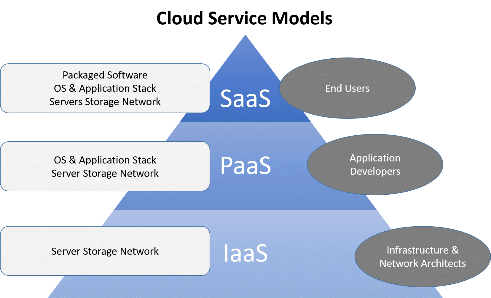
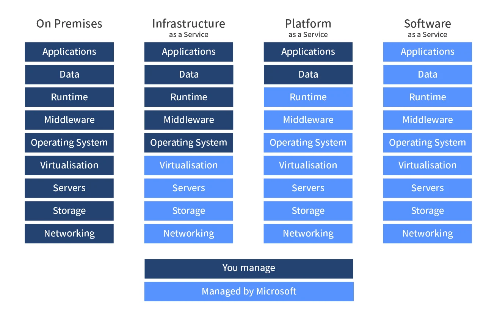
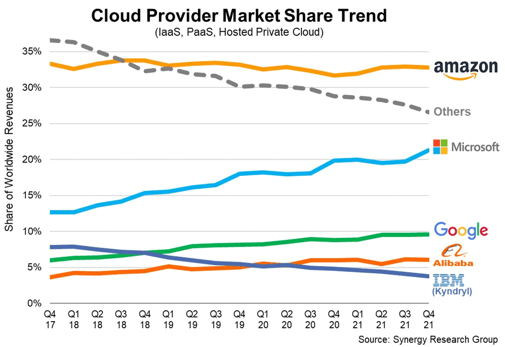

# Understand what the cloud is

## How Do We Know if Something Is in the Cloud?
The cloud means storing and accessing data or programs over the internet, rather than your local hard drive. If you access a service via the web or through a remote server, it’s in the cloud.
* If it's on the cloud - it's `on demand`.
* It's `centrally managed`. This means that you can go to a particular website and you can manage / create the things you need from that one place. 
* Example: Using Google Drive for file storage vs. saving files directly on your computer.

## Differences Between On-Prem and Cloud
* `On-Premises`: Your business owns, maintains, and operates its own physical servers and infrastructure on-site. You've got it there, you physically have to take care of those machines, on a space you own.
  * *Advantages*: Full control, security, no third-party involvement.
  * *Disadvantages*: Expensive upfront costs, maintenance, scalability challenges.
* `Cloud`: Servers are hosted by a third party (like AWS or Azure) and are accessed via the internet.
  * *Advantages*: Lower upfront costs, scalable, maintenance-free for users.
  * Disadvantages: Less control, ongoing costs, dependency on the provider.
  
## 4 Cloud Deployment Models:

1. `Private Cloud`: Infrastructure is used exclusively by one organisation and not exposed to the public. 
* Dedicated to a private company. There is no way for the public to gain access.
* Usually, its possible for a private cloud to run without the internet. e.g., on a cruise ship. 
   * Example: Highly secure environments.
   * **Strengths**:
     - High security and control.
     - Customisation to meet specific needs.
   * **Weaknesses**:
     - Expensive to set up and maintain.
     - Limited scalability compared to public cloud.

2. `Public Cloud`: Services provided over the public internet and shared among users (e.g., AWS, Azure).
   * Example: General businesses looking to scale easily.
   * **Strengths**:
     - Cost-effective, as resources are shared.
     - Highly scalable, with flexible resource allocation.
   * **Weaknesses**:
     - Less control over infrastructure.
     - Potential security concerns due to multi-tenancy.

3. `Hybrid Cloud`: A combination of both private and public clouds, offering more flexibility.
* They need to keep their data on-prem: they are regulated. Front-end (i.e., the parts of the web service or serving up the API) has no problem running in the cloud, back-end may be on-prem.
* There's only so much they can put into the cloud. 
   * Example: When businesses want to keep some sensitive data on-prem while using cloud for other tasks.
   * **Strengths**:
     - Flexibility to manage sensitive data on-premise while utilising public cloud for other tasks.
     - Cost-effective for non-sensitive workloads.
   * **Weaknesses**:
     - Complexity in management and integration between public and private clouds.
     - Security concerns when transferring data between environments.

4. `Multi-Cloud`: Using multiple cloud providers for different services (e.g., AWS for storage/database, Azure for VMs/front end).
   * Example: Large businesses leveraging various strengths of cloud providers.
   * **Strengths**:
     - Flexibility in choosing best-in-class services from different providers.
     - Redundancy and backup in case one provider fails, ensuring continuous service.
   * **Weaknesses**:
     - Complex to manage and integrate multiple providers.
     - Potentially higher costs due to different billing and management systems.

## Types of Cloud Services:
* `IaaS` (Infrastructure as a Service): Provides virtualised computing resources like virtual machines, storage, and networking. Example: AWS EC2.
  
* `PaaS` (Platform as a Service): Provides a platform allowing customers to develop, run, and manage applications. Example: Microsoft Azure App Service.

* `SaaS` (Software as a Service): Software that is accessible via the internet. Example: Gmail, Dropbox, Salesforce. 

# Ramons diagram
How much control do you have? how much responsibility?

You manage: hardware (servers, storage, networking).

`On premesis`: you manage: data, applications, runtime, middleware, O/S, virtualisation, servers, storage, netwroking.

`Iaas`: you manage: data, applications, runtime, middle wear O/S. Provider manages: virtualisation, (the rest have a grey cross through them??): servers, storage, networking. 
- e.g., VM.

`Paas`: you manage: data, applications. Provider manages: runtime, middle wear, O/S, virtualisation, servers, storage, networking. 
- e.g., app service.
- Security will be taken care of for you. Provider manages: applications, runtime, middleware, O/S, virtualisation, servers, storage, netwroking.

`Saas`: you manage: data. Provider manages: applications, runtime, middleware, O/S, virtualisation, servers, storage, netwroking.

  
## Cloud Advantages/Disadvantages (For Businesses)
## Cloud Advantages and Disadvantages (For Businesses)

### Advantages:
1. `Cost-efficient` (depends on the case):
   - No need to invest in physical infrastructure, leading to significant savings on capital expenditures (CapEx). Operational expenses (OpEx) are more predictable with pay-as-you-go models.
   - Sometimes you can shift your advance: payment plans. Pay up front for discount, etc. 
   - **Example**: A startup can avoid the upfront costs of purchasing servers and maintaining hardware. Instead, they pay for cloud services as they grow, using platforms like AWS or Google Cloud.
   
  
2. `Scalable`:
   - Cloud services allow businesses to adjust resources quickly based on demand, ensuring optimal performance without over-provisioning.
   - **Example**: An e-commerce business can easily scale up its server capacity during peak times, such as Black Friday, and scale down during off-peak times.
   

3. `Flexibility to Access from Anywhere`:
   - Employees can securely access business applications and data from anywhere with internet access, improving productivity and collaboration.
   - **Example**: A remote team can collaborate and access essential applications from different geographical locations using cloud-based tools like Office 365, Slack, or Dropbox.
  

4. `Disaster Recovery is Easier`:
   - Cloud providers offer built-in disaster recovery solutions, allowing businesses to restore operations quickly without needing expensive on-premise backups.
   - **Example**: A company can back up its data using cloud services like AWS S3 or Azure Backup, ensuring data recovery in case of hardware failures or cyberattacks.

5. `Guarenteed levels of service`:
   - Guarenteed a certain percentage of up tiem. If they don't, you can ask for money back. 

### Disadvantages:
1. `Security Concerns` (debatable):
   - You don't have physical control over security. 
   - Businesses must trust that their cloud provider offers robust security protocols. Sensitive data can be vulnerable to breaches, particularly in public cloud environments where data is shared.
   - **Example**: A healthcare provider storing patient data in the cloud needs to ensure compliance with regulations like HIPAA, which require strict data protection measures.
   

2. `Downtime Risks` (go either way):
   - Cloud providers may suffer from technical issues, server failures, or even cyberattacks, leading to periods where businesses can’t access critical services.
   - You could have more uptime because some servers give a guarentee. 
   - **Example**: When major cloud providers like AWS or Microsoft Azure experience outages, businesses relying entirely on these platforms can face downtime, affecting operations.
   

3. `Ongoing Operational Costs` (debatable):
   - Although cloud solutions eliminate hardware costs, the ongoing subscription fees, storage costs, and data transfer charges can add up. Over time, operational costs might exceed the cost of maintaining on-premise infrastructure for some businesses.
   - **Example**: A company using multiple cloud services can face increasing monthly bills as they add more resources or scale up operations, potentially leading to higher-than-expected expenses.
   

## OpEx vs CapEx (Operational vs Capital Expenses)
  * `CapEx` (Capital Expenditure): Upfront investment in physical infrastructure, like buying servers. Used in on-prem environments. e.g, cloud subscription.
  * `OpEx` (Operational Expenditure): Ongoing costs like paying for cloud services month-to-month. Used in cloud environments. e.g., data centers. 

The cloud favors OpEx, making it easier to scale costs gradually rather than large upfront investments.

## Is Migrating to the Cloud Always Cheaper?
Not always. While cloud services reduce upfront costs, ongoing expenses (OpEx) may become higher over time, depending on the use case, especially for heavy, continuous workloads.

## Talk about this^ more:
#### Short Answer: Not Always.

While moving to the cloud can reduce some costs, it’s not guaranteed to always be cheaper in the long run. It depends on how your business uses the cloud. 

---

### Upfront Cost Savings
One of the big advantages of cloud services is that you **don’t need to buy expensive hardware** (like servers) or spend money maintaining them. 
- **Example**: Imagine you’re starting a small online business. Instead of buying your own servers for thousands of dollars, you can just rent space on the cloud and pay only for what you use. 

---
### Ongoing Costs (OpEx)
However, while you save money upfront, the **ongoing costs** of using cloud services might grow over time, especially if you’re using a lot of resources continuously.
- **Example**: Think of streaming services like Netflix. They have to constantly stream videos to millions of users, which requires lots of cloud resources (computing power, storage, bandwidth). For a business like this, cloud costs can add up over time.

---
### When Cloud Costs Can Get High
1. **Heavy, Continuous Workloads**: If your business is running intense tasks 24/7 (like data processing, video rendering, or complex simulations), the **pay-as-you-go model** of the cloud can become expensive.
   - **Example**: A company that processes huge amounts of data, like weather forecasting or financial trading, might find that using cloud resources all the time costs more than owning its own servers.
   
2. **Scaling Over Time**: As your business grows and uses more cloud resources, the monthly bills can increase. Over time, this could mean you’re paying more than you would for traditional on-premise infrastructure.
   - **Example**: A company that starts small but grows fast, needing more and more cloud storage or computing power, might find their monthly cloud expenses growing significantly.

### Conclusion
Migrating to the cloud **can** save money, especially in the beginning, but it’s important to plan ahead. If your business uses the cloud heavily or grows quickly, ongoing costs might become higher than expected.

---

## Market Share of Cloud Providers:
* `Amazon Web Services` (AWS): Dominates the market, known for its broad range of services, particularly IaaS and PaaS.
* `Microsoft Azure`: Second largest, integrates well with Microsoft products, popular for PaaS solutions.
* `Google Cloud`: Known for machine learning and big data analytics.

## Largest Cloud Providers' Strengths:
1. `AWS`: Wide variety of services, scalability, global reach.
   - Cheapest VM's out of these three.
2. `Azure`: Strong integration with Microsoft products (Office 365, Windows).
3. `Google Cloud Platform` (GCP): Leading in data processing, AI, and analytics.
   - If you're an expert in GCP, you're invaluable. It's a niche. 

## Which Cloud Provider Is Best?
It depends on your needs:
* `AWS`: Best for diverse services and global reach.
* `Azure`: Best for Microsoft integration.
* `Google Cloud`: Best for data-heavy applications and AI.
  
## What Do You Pay for in the Cloud?
* `Storage`: Pay per GB of data.
* `Compute Power`: Charges based on CPU/RAM usage.
* `Networking`: Data transfer costs. Traffic (Engres you pay for, its what's going out of your networks) (Ingres), 
* `Additional Services`: Load balancers, databases, etc.
* `Public IP Addresses`:

# MORE DETAIL: ADD EDITS:
## What Do You Pay for in the Cloud?

When using cloud services, costs are generally divided into three main categories: **storage**, **compute power**, and **networking**. Each has specific pricing structures depending on how much you use. 

### 1. `Storage`
   - **What it is**: This refers to the amount of data you store in the cloud, such as files, databases, or backups.
   - **How you're charged**: Cloud providers charge you based on the amount of data you store, usually measured in **gigabytes (GB)** or **terabytes (TB)**.
   - **Example**: If you store 100GB of data on AWS S3 (Amazon’s storage service), you'll pay a fee for those 100GB each month. The more data you store, the higher the cost.

   - **Why it’s important**:
     - Storage costs can vary depending on the type of storage (e.g., standard storage is cheaper, while high-performance storage for critical data is more expensive).

### 2. `Compute Power`
   - **What it is**: Compute power refers to the CPU and RAM resources needed to run your applications, virtual machines, or containers in the cloud.
   - **How you're charged**: You pay based on the **amount of computing resources** you use, usually measured in **vCPU hours** (virtual CPU hours) and **RAM usage** (in GB).
   - **Example**: If you run a virtual machine with 2 CPUs and 8GB of RAM for 10 hours, you'll pay for that compute time. Cloud providers like AWS, Azure, and Google Cloud offer different tiers depending on how much computing power you need.

   - **Why it’s important**:
     - Heavy, continuous workloads or resource-hungry applications will increase your compute costs.
     - You can scale up or down based on demand, which helps control costs.

### 3. `Networking`
   - **What it is**: Networking costs relate to **data transfer** in and out of the cloud, also known as **ingress** (data coming into the cloud) and **egress** (data leaving the cloud).
   - **How you're charged**: Most cloud providers don’t charge for **ingress** (incoming traffic), but they do charge for **egress** (outgoing traffic). Charges are based on the amount of data transferred, often measured in **GB per month**.
   - **Example**: If you're hosting a website on AWS and people download content or videos, the outgoing data is considered egress traffic, and you'll be charged for that transfer.

   - **Why it’s important**:
     - High-traffic websites or applications that send large amounts of data to users (like video streaming services) may face significant networking costs due to egress traffic.
     - Data transfers between different cloud regions or between cloud services can also incur additional costs.

### Conclusion
In the cloud, you're typically charged for three main resources:
1. **Storage**: Based on how much data you store.
2. **Compute Power**: Based on the processing power and memory your applications use.
3. **Networking**: Based on data transferred out of the cloud (egress).

These costs can vary widely depending on how much data you use, the size of your applications, and the amount of traffic your services handle. Understanding how you're billed for each can help you optimize your cloud usage and manage your budget.

## 4 Pillars of DevOps in the Cloud:
* `Collaboration`: Cross-team collaboration is key in both cloud and DevOps.
* `Automation`: Cloud services enable automation for faster deployment.
* `Continuous Delivery`: The cloud allows continuous deployment of code.
* `Monitoring and Feedback`: Cloud services provide real-time feedback and monitoring tools.

# MORE DETAILS: ADD EDITS:
## 4 Pillars of DevOps in the Cloud

DevOps and cloud computing work together to streamline software development and IT operations. To understand how they complement each other, let’s dive deeper into the **four key pillars of DevOps in the cloud**:

### 1. **Collaboration**
   - **What it Means**: Collaboration is the foundation of DevOps. It breaks down silos between development and operations teams to foster better communication and shared responsibility.
   - **In the Cloud**: Cloud platforms support collaboration by providing centralized tools and resources. Everyone can access the same development environments, infrastructure, and data from anywhere, which makes remote teams more efficient.
   - **Example**: Teams using **AWS CodeStar** or **Azure DevOps** can collaborate on projects, from code writing to deployment, all within the same cloud platform.

   - **Why It’s Important**:
     - Encourages faster problem-solving and decision-making.
     - Promotes shared responsibility, leading to improved service delivery and performance.
   
### 2. **Automation**
   - **What it Means**: Automation in DevOps refers to using tools to automate repetitive tasks, like testing, deployment, and infrastructure management.
   - **In the Cloud**: Cloud services make automation easier by providing tools that can automatically provision resources, deploy applications, and monitor infrastructure. This minimizes human error and speeds up processes.
   - **Example**: With **AWS CloudFormation** or **Azure Resource Manager**, you can define infrastructure as code, which allows you to automate the setup of entire environments with the click of a button or a script.

   - **Why It’s Important**:
     - Speeds up deployments and makes processes more efficient.
     - Reduces the likelihood of manual errors, ensuring consistent results.
   
### 3. **Continuous Delivery**
   - **What it Means**: Continuous delivery is the practice of automatically deploying every code change to a production-like environment, ensuring that applications are always ready to be released.
   - **In the Cloud**: Cloud platforms offer the flexibility and scalability needed for continuous integration (CI) and continuous delivery (CD) pipelines. The cloud makes it easy to quickly spin up new environments, run tests, and deploy changes, ensuring that updates are released frequently and with fewer issues.
   - **Example**: Using **AWS CodePipeline** or **Azure Pipelines**, developers can automate the entire CI/CD process—from pushing code to testing, building, and deploying it in production.

   - **Why It’s Important**:
     - Ensures that new features, bug fixes, and updates are delivered quickly to users.
     - Reduces downtime and improves software quality through constant iteration and feedback.
   
### 4. **Monitoring and Feedback**
   - **What it Means**: Continuous monitoring and feedback are critical in DevOps to track system performance, detect issues, and make improvements based on real-time data.
   - **In the Cloud**: Cloud services offer powerful monitoring and feedback tools that provide visibility into infrastructure and applications. These tools gather metrics, logs, and alerts, helping teams quickly identify and fix problems.
   - **Example**: Services like **AWS CloudWatch**, **Azure Monitor**, or **Google Cloud Operations** offer real-time monitoring and alerting. Teams can receive notifications when something goes wrong and immediately begin troubleshooting.

   - **Why It’s Important**:
     - Provides real-time insights into system health and performance.
     - Allows teams to proactively resolve issues before they impact users.

### Conclusion
The **four pillars of DevOps in the cloud**—collaboration, automation, continuous delivery, and monitoring—work together to create a smooth, efficient, and reliable pipeline for software development and operations. Cloud platforms enhance these practices by offering tools and services that make them easier to implement, ultimately speeding up innovation, improving product quality, and reducing costs.

