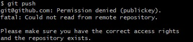

# Wed, 16/10, Code-Along: Use SSH to push changes to your GitHub Repo
 

# A Guide to Setting Up SSH Keys for Use with GitHub

 

## Background Information
* From your local machine, we have been able to push changes to GitHub.
* We've used HTTPS to authenticate and transfer the data to our GitHub Repos on GitHub because it's secure.

Now we're going to use SSH instead. 
* SSH key pair (public and private).
* Type: RSA (key pair). 
  * Two files are generated: 
    * Private Key: like a key.
      * This is kept on your local machine (.ssh folder). 
    * Public Key: like a padlock. 
      * This has to go on anything you want to secure. 

We need to put it somewhere else. 

 

## Step 1: Create/Generate an SSH Key pair. 
* We're going to do this on our local machine. 
* Git Bash window > cd .ssh > pwd (to check where you are) > enter this command: `ssh-keygen -t rsa -b 4096 -C "georgiastanley98@gmail.com"`
* File name: `tech264-georgia-github-key`
* Enter passphrase: click "Enter" twice. 
* `ls` to check it's there:
  * tech264-georgia-github-key
  * tech264-georgia-github-key.pub

 

## Step 2: Register the Padlock on GitHub.
* register the public key (the padlock).
* Go to GitHub Account.
* Go to Setings: SSH and GPG Keys > New SSH Key > 
* Title: tech264-georgia-github-key
  * Authentication key
* In git bash window:  `cat tech264-georgia-github-key.pub`
    * 'cat' to print the key.
* Copy entire output and paste it into the Key description.
* This allows access to all of your GitHub Repo Accounts because it's in your settings. 

 

  

 

## Step 3: Add the Private Key onto Local Machine.
* Add the private key to SSH register.
* Go to the Git Bash window.
* We want to start the SSH Agent: eval `ssh-agent -s`
  * Output: Agent pid 920. 
  * Once this is running, 
* Use the SSH add command to register: `ssh-add tech264-georgia-github-key`
  * Put in your own private key name after the command.
  * Output: Identity added: tech264-georgia-github-key (georgiastanley98@gmail.com)
* Test the SSH connection to github: `ssh -T git@github.com`.
  * You may have to type 'yes' if it's your first time.
* See if we can authenticate using this private key we've just regoistered.
  * Output: Hi GP-Stanley! You've successfully authenticated, but GitHub does not provide shell access.
* Once you've registered the key, you can be anywhere in your root directory tree. 

 

## Step 4: Create Test Repo / Push changes to Test repo.
### First Option
* Create Repo on GitHub.
* After creation, change the HTTPS link to `SSH`.
  * e.g., git@github.com:GP-Stanley/tech264-georgia-test-ssh.git
* Create and initialise a new repo.
* Go to 'GitHub Repos' folder on local machine.
  * Make directory: `mkdir tech264-georgia-test-ssh`
  * Cd into folder: cd `tech264-georgia-test-ssh`
  * `echo "This is included in my first push" >> README.md`
  * `cat README.md`
  * `git init` 
  * `git add .`
  * `git commit -m "Added readme."`
  * `git branch -M main`
  * `git remote add origin git@github.com:GP-Stanley/tech264-georgia-test-ssh.git`
  * `git push -u origin main`
* refresh GitHub Repo: README.md should be there!

 

> * cd into parent folder: `cd ..`
> * remove the repo: `rm -rf tech264-georgia-test-ssh`

### Second Option
* Go to repo
* click "Code"
* SSH link: `git@github.com:GP-Stanley/tech264-georgia-test-ssh.git`

* git clone to a different folder with the SSH link: 
  * `git clone git@github.com:GP-Stanley/tech264-georgia-test-ssh.git`

 

## Step 5: Push changes to Test repo.
* We do this on our local machine. 

## Re-create SSH setup to authenticate to GitHub
To consolidate what we did in our code-along:

* Delete your test repo (if you made one)
* Delete the SSH keys we made
* Do the steps again, excpert this time use a pre-existing repo, and switch it over to use SSH keys
* Document the steps as you go, you should produce a guide to setting up SSH keys for use with GitHub.

 

### Location of GitHub Links

 
## Update the Remote URL in Your Local Repo
### Step 1: Check your current remote URL
* cd into `tech264-test-git`
* Check your current remote URL: `git remote -v`
  * Output: 
    * origin  https://github.com/GP-Stanley/tech264-test-git.git (fetch)
    * origin  https://github.com/GP-Stanley/tech264-test-git.git (push)

 

 

### Step 2: Change the remote URL to use SSH
* Replace the HTTPS URL with the SSH one.
* `git remote set-url origin git@github.com:GP-Stanley/tech264-test-git.git`
* To confirm the change: `git remote -v`

 

 

### Step 3: Test the SSH Connection
* cd into .ssh folder
* eval `ssh-agent -s`
Agent pid 1224
* `shh-add tech264-georgia-github-key`
* `ssh -T git@github.com`

 

 

### Making a push via SSH
* cd into github repos > tech264-test-git
* `ssh -T git@github.com`
* Now make a change to your file on the visual studio code.
  * `git status`
  * `git add .`
  * `git commit -m`
  * `git push -u origin main`
  * `git status`

 

